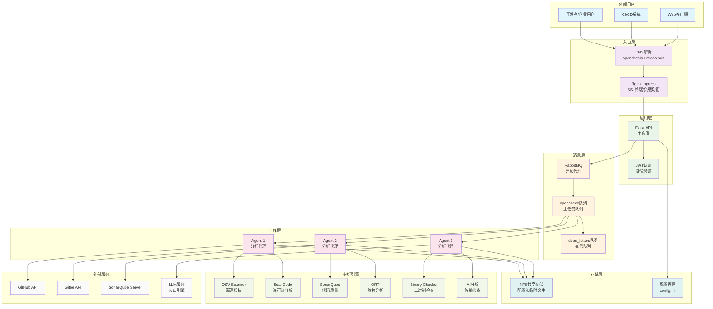

# OpenChecker - 智能化软件合规检测平台

[](https://opensource.org/licenses/MIT)
[](https://www.python.org/downloads/)
[](https://kubernetes.io/)

**OpenChecker** 是一个全面的软件分析与合规检测平台，通过自动化的安全、许可证和质量评估，为软件开发团队提供端到端的代码仓库合规解决方案。

## 🚀 核心特性

### 📊 全方位代码分析
- **安全漏洞检测** - 基于OSV数据库的深度安全扫描
- **许可证合规** - 智能识别和分析开源许可证兼容性
- **代码质量评估** - 集成SonarQube进行代码质量分析
- **依赖关系分析** - 全面的软件依赖树和风险评估
- **二进制文件检测** - 识别和标记潜在的二进制安全风险

### 🏗️ 分布式微服务架构
- **云原生设计** - 基于Kubernetes的可扩展容器化部署
- **异步消息处理** - RabbitMQ驱动的高并发任务处理
- **智能负载均衡** - 多Agent并发执行，提升检测效率
- **容错机制** - 死信队列保障任务可靠性

### 🤖 AI增强分析
- **项目智能分类** - 基于机器学习的项目类型自动识别
- **聚类分析** - 相似项目模式识别和风险预测
- **智能报告生成** - 自动化合规报告和建议生成

## 🎯 适用场景

### 🏢 企业级软件开发
- **开源治理** - 帮助企业建立完善的开源软件使用规范
- **合规审计** - 满足行业监管要求和内部合规标准
- **供应链安全** - 识别第三方组件的安全风险和许可证冲突

### 🔧 DevOps集成
- **CI/CD流水线** - 无缝集成到现有的持续集成/部署流程
- **自动化检测** - 代码提交时自动触发合规检测
- **质量门禁** - 基于检测结果的自动化发布控制

### 🌐 开源项目管理
- **社区项目审查** - 为开源社区提供项目质量评估
- **贡献者指导** - 帮助开发者理解和遵守开源最佳实践
- **项目健康度监控** - 持续跟踪项目的合规状态变化

## 💡 核心价值

### ⚡ 效率提升
- **自动化检测** - 将人工数天的工作压缩到分钟级完成
- **并行处理** - 多维度同时分析，大幅提升检测速度
- **智能优先级** - 基于风险评估的问题优先级排序

### 🛡️ 风险降低
- **早期发现** - 在开发阶段识别潜在的安全和合规风险
- **全面覆盖** - 涵盖安全、许可证、质量等多个维度
- **持续监控** - 项目生命周期内的持续合规状态跟踪

### 💰 成本优化
- **减少人工成本** - 自动化替代大量重复性合规检查工作
- **避免合规风险** - 预防潜在的法律和商业风险
- **提升代码质量** - 降低后期维护和修复成本

## 🏗️ 系统架构

OpenChecker采用现代化的微服务架构，确保高可用性、可扩展性和容错能力：

<p align="center">

</p>



## 🔧 支持的检测工具

| 工具 | 功能 | 输出格式 |
|------|------|----------|
| **osv-scanner** | 漏洞扫描和安全风险评估 | JSON |
| **scancode** | 许可证和代码信息分析 | JSON |
| **binary-checker** | 二进制文件和归档检测 | JSON |
| **sonar-scanner** | 代码质量和技术债务分析 | JSON |
| **dependency-checker** | 依赖关系和供应链分析 | JSON |
| **release-checker** | 发布内容和签名验证 | JSON |
| **readme-checker** | 文档完整性检查 | JSON |
| **maintainers-checker** | 维护者信息验证 | JSON |
| **languages-detector** | 编程语言识别和统计 | JSON |

## 📚 详细文档

- [📖 系统概述](./docs/Overview.md)
- [🏗️ 核心架构](./docs/Core-Architecture.md)
- [🤖 Agent系统](./docs/Agent-System.md)
- [📨 消息队列集成](./docs/Message-Queue-Integration.md)
- [🔐 API与认证](./docs/API-and-Authentication.md)
- [🛠️ REST API端点](./docs/REST-API-Endpoints.md)
- [👥 用户管理与认证](./docs/User-Management-and-Authentication.md)
- [🔍 分析工具与检查器](./docs/Analysis-Tools-and-Checkers.md)
- [🐳 容器环境与工具安装](./docs/Container-Environment-and-Tool-Installation.md)
- [🛡️ 安全与合规检查器](./docs/Security-and-Compliance-Checkers.md)
- [🤖 AI与机器学习组件](./docs/AI-and-Machine-Learning-Components.md)
- [📊 项目分类系统](./docs/Project-Classification-System.md)
- [🔗 聚类与嵌入](./docs/Clustering-and-Embeddings.md)
- [☁️ 部署与基础设施](./docs/Deployment-and-Infrastructure.md)
- [⚓ Kubernetes部署](./docs/Kubernetes-Deployments.md)
- [⚙️ 支持服务](./docs/Supporting-Services.md)
- [💾 存储与配置管理](./docs/Storage-and-Configuration-Management.md)
- [🌐 外部服务集成](./docs/External-Service-Integration.md)
- [📦 安装与设置指南](./docs/Installation-and-Setup-Guide.md)
- [🧪 开发与测试](./docs/Development-and-Testing.md)

> 📖 文档由DeepWiki生成，并托管在 https://deepwiki.com/Laniakea2012/openchecker 以获得更好的阅读体验。

## 🚀 快速开始

### 前置要求
- Python 3.8+
- Docker & Kubernetes
- RabbitMQ
- 足够的存储空间用于代码分析

### 安装步骤

1. **克隆仓库**
   ```bash
   git clone https://github.com/your-org/openchecker.git
   cd openchecker
   ```

2. **安装依赖**
   ```bash
   pip install -r requirements.txt
   ```

3. **配置系统**
   ```bash
   cp config/config.ini.example config/config.ini
   # 编辑配置文件，设置SonarQube、Gitee等必要参数
   ```

4. **启动服务**
   ```bash
   # 使用Docker Compose快速启动
   docker-compose up -d
   
   # 或者使用Kubernetes部署
   kubectl apply -f k8s/
   ```

## 🔌 API使用示例

### 认证
所有API端点都需要JWT认证。首先获取访问令牌：

```bash
curl -X POST http://your-domain/auth/login \
  -H "Content-Type: application/json" \
  -d '{"username":"your-username","password":"your-password"}'
```

### 启动检测任务
```bash
curl -X POST http://your-domain/opencheck \
  -H "Authorization: Bearer YOUR_JWT_TOKEN" \
  -H "Content-Type: application/json" \
  -d '{
    "commands": ["osv-scanner", "scancode", "sonar-scanner"],
    "project_url": "https://github.com/example/project.git",
    "callback_url": "https://your-domain/callback",
    "task_metadata": {
      "project_name": "示例项目",
      "team": "开发团队A"
    }
  }'
```

## 🤝 贡献指南

我们欢迎并感谢所有形式的贡献！

### 如何贡献
1. Fork本仓库
2. 创建功能分支 (`git checkout -b feature/AmazingFeature`)
3. 提交更改 (`git commit -m '添加某个很棒的功能'`)
4. 推送到分支 (`git push origin feature/AmazingFeature`)
5. 创建Pull Request

### 开发环境设置
```bash
# 安装开发依赖
pip install -r requirements-dev.txt

# 运行测试
pytest tests/

# 代码格式化
black .
isort .
```

## 📄 许可证

本项目采用 [MIT许可证](LICENSE) 开源。

## 📞 联系我们

- **项目维护者**: [Guoqiang QI](mailto:guoqiang.qi1@gmail.com)
- **问题反馈**: [GitHub Issues](https://github.com/Laniakea2012/openchecker/issues)
- **功能请求**: [GitHub Discussions](https://github.com/Laniakea2012/openchecker/discussions)

## 🌟 支持项目

如果OpenChecker对您有帮助，请考虑：
- ⭐ 给项目点个Star
- 🐛 报告Bug和问题
- 💡 提出新功能建议
- 📖 改进文档
- 💻 贡献代码

---

**OpenChecker** - 让软件合规检测变得简单、高效、智能 🚀
