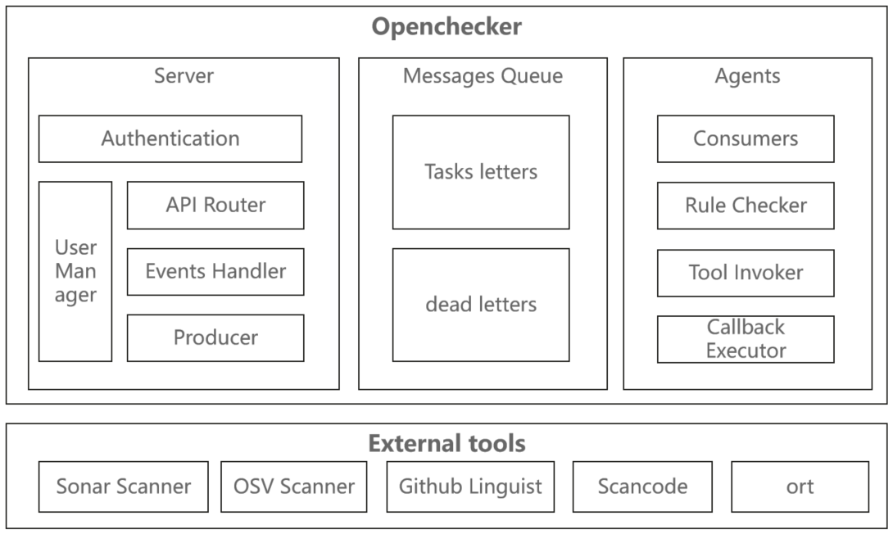
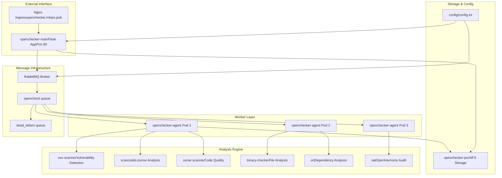

## OpenChecker
OpenChecker is a comprehensive software analysis and compliance checking platform that performs automated security, license, and quality assessments on source code repositories. The system operates as a distributed, message-driven architecture that can execute multiple analysis tools concurrently on software projects and return detailed compliance reports.

## Documents

- [Overview](./docs/Overview.md)
- [Core-Architecture](./docs/Core-Architecture.md)
- [Agent-System](./docs/Agent-System.md)
- [Message-Queue-Integration](./docs/Message-Queue-Integration.md)
- [API-and-Authentication](./docs/API-and-Authentication.md)
- [REST-API-Endpoints](./docs/REST-API-Endpoints.md)
- [User-Management-and-Authentication](./docs/User-Management-and-Authentication.md)
- [Analysis-Tools-and-Checkers](./docs/Analysis-Tools-and-Checkers.md)
- [Container-Environment-and-Tool-Installation](./docs/Container-Environment-and-Tool-Installation.md)
- [Security-and-Compliance-Checkers](./docs/Security-and-Compliance-Checkers.md)
- [AI-and-Machine-Learning-Components](./docs/AI-and-Machine-Learning-Components.md)
- [Project-Classification-System](./docs/Project-Classification-System.md)
- [Clustering-and-Embeddings](./docs/Clustering-and-Embeddings.md)
- [Deployment-and-Infrastructure](./docs/Deployment-and-Infrastructure.md)
- [Kubernetes-Deployments](./docs/Kubernetes-Deployments.md)
- [Supporting-Services](./docs/Supporting-Services.md)
- [Storage-and-Configuration-Management](./docs/Storage-and-Configuration-Management.md)
- [External-Service-Integration](./docs/External-Service-Integration.md)
- [Installation-and-Setup-Guide](./docs/Installation-and-Setup-Guide.md)
- [Development-and-Testing](./docs/Development-and-Testing.md)

The documents generated with DeepWiki and also hosted on https://deepwiki.com/Laniakea2012/openchecker for better readability. 

## System Architecture Overview
OpenChecker implements a microservices architecture with asynchronous message processing, designed for scalability and reliability in analyzing software repositories. The project consists of multiple modules that interact with various tools and APIs to analyze different aspects of a software project. It can perform tasks such as checking for open source compliance, scanning for licenses, detecting binary files, checking release content, and more.The architecture of the openchecker are below:

## Installation
1. Clone the repository.
2. Install the required Python packages with ***requirements.txt***
3. Configure the config.ini file with the necessary settings for tools like SonarQube and Gitee.

## Usage
The main entry point of the project is the callback_func function. This function is called when a message is received from a message queue. The message contains a list of commands to be executed on a given project URL.
The supported commands are:
-  osv-scanner: Performs a vulnerability scan and outputs the results as a JSON object.
- scancode: Scans the project for licenses and other code-related information.
- binary-checker: Checks for binary files and archives in the project.
- release-checker: Checks the release content of the project, including signature files and release notes.
- url-checker: Checks the validity of the project URL.
- sonar-scanner: Performs code analysis using SonarQube.
- dependency-checker: Analyzes the project's dependencies.
- readme-checker: Checks for README files in the project.
- maintainers-checker: Checks for maintainer-related files in the project.
- readme-opensource-checker: Checks if the project has a properly formatted README.OpenSource file.
- build-doc-checker: Checks if the project has comprehensive build documentation.
- api-doc-checker: Checks if the project has comprehensive API documentation.
- languages-detector: Detects the programming languages used in the project.

## API Endpoints
- ***/test***: Requires JWT authentication. GET request returns the current authenticated user. POST request takes a JSON payload with a message field and returns a response indicating the received message.
- ***/opencheck***: Requires JWT authentication. POST request takes a JSON payload with commands, project_url, callback_url, and task_metadata fields. Publishes a message to the RabbitMQ queue opencheck and returns a response indicating that the message has been received and the check will start.

## RabbitMQ Integration
The application includes functions for testing the RabbitMQ connection, creating queues, and publishing messages. The test_rabbitmq_connection function is used to verify the connection to RabbitMQ. The create_queue function is used to create queues with specific names and optional arguments. The publish_message function is used to publish messages to a specified queue.
The application creates two queues: dead_letters and opencheck. The opencheck queue has an argument that sets up a dead letter exchange and routing key to route messages to the dead_letters queue in case of failure.

## SSL Support
The application can be run with SSL enabled. Set the use_ssl variable to True and provide the paths to the SSL certificate and key in the configuration file. The application will then run with SSL context specified.

## Contributing
Contributions are welcome! Please feel free to submit pull requests or open issues if you find any bugs or have suggestions for improvements.

## License
This project is licensed under an MIT license.

## Contact
For any questions or inquiries, please contact the project maintainers [Guoqiang QI](guoqiang.qi1@gmail.com).

This README provides an overview of the project's functionality and usage. For more detailed information, please refer to the source code.
