# OpenChecker - 智能化软件合规检测平台

[](https://opensource.org/licenses/MIT)
[](https://www.python.org/downloads/)
[](https://kubernetes.io/)

**OpenChecker** 是一个全面的软件分析与合规检测平台，通过自动化的安全、许可证和质量评估，为软件开发团队提供端到端的代码仓库合规解决方案。

## 🚀 核心特性

### 📊 全方位代码分析
- **安全漏洞检测** - 基于OSV数据库的深度安全扫描
- **许可证合规** - 智能识别和分析开源许可证兼容性
- **代码质量评估** - 集成SonarQube进行代码质量分析
- **依赖关系分析** - 全面的软件依赖树和风险评估
- **二进制文件检测** - 识别和标记潜在的二进制安全风险

### 🏗️ 分布式微服务架构
- **云原生设计** - 基于Kubernetes的可扩展容器化部署
- **异步消息处理** - RabbitMQ驱动的高并发任务处理
- **智能负载均衡** - 多Agent并发执行，提升检测效率
- **容错机制** - 死信队列保障任务可靠性

### 🤖 AI增强分析
- **项目智能分类** - 基于机器学习的项目类型自动识别
- **聚类分析** - 相似项目模式识别和风险预测
- **智能报告生成** - 自动化合规报告和建议生成

## 🎯 适用场景

- **企业级软件开发** - 开源治理、合规审计、供应链安全
- **DevOps集成** - CI/CD流水线集成、自动化检测、质量门禁
- **开源项目管理** - 社区项目审查、贡献者指导、健康度监控

## 🏗️ 系统架构

OpenChecker采用现代化的微服务架构，确保高可用性、可扩展性和容错能力：

```mermaid
flowchart TD
    subgraph "外部用户"
        User["开发者/企业用户"]
        CICD["CI/CD系统"]
        WebClient["Web客户端"]
    end
    
    subgraph "入口层"
        DNS["DNS解析<br/>openchecker.mlops.pub"]
        Ingress["Nginx Ingress<br/>SSL终端/负载均衡"]
    end
    
    subgraph "应用层"
        API["Flask API<br/>主应用"]
        Auth["JWT认证<br/>身份验证"]
    end
    
    subgraph "消息层"
        RMQ["RabbitMQ<br/>消息代理"]
        MainQueue["opencheck队列<br/>主任务队列"]
        DLQ["dead_letters队列<br/>死信队列"]
    end
    
    subgraph "工作层"
        Agent1["Agent 1<br/>分析代理"]
        Agent2["Agent 2<br/>分析代理"]
        Agent3["Agent 3<br/>分析代理"]
    end
    
    subgraph "分析引擎"
        OSV["OSV-Scanner<br/>漏洞扫描"]
        ScanCode["ScanCode<br/>许可证分析"]
        Sonar["SonarQube<br/>代码质量"]
        ORT["ORT<br/>依赖分析"]
        Binary["Binary-Checker<br/>二进制检查"]
        AI["AI分析<br/>智能检查"]
    end
    
    subgraph "存储层"
        NFS["NFS共享存储<br/>配置和临时文件"]
        Config["配置管理<br/>config.ini"]
    end
    
    subgraph "外部服务"
        GitHub["GitHub API"]
        Gitee["Gitee API"]
        SonarServer["SonarQube Server"]
        LLM["LLM服务<br/>火山引擎"]
    end
    
    %% 用户交互流程
    User --> DNS
    CICD --> DNS
    WebClient --> DNS
    DNS --> Ingress
    Ingress --> API
    
    %% 认证和任务提交
    API --> Auth
    API --> RMQ
    RMQ --> MainQueue
    MainQueue --> DLQ
    
    %% 任务分发和执行
    MainQueue --> Agent1
    MainQueue --> Agent2
    MainQueue --> Agent3
    
    %% 分析工具调用
    Agent1 --> OSV
    Agent1 --> ScanCode
    Agent2 --> Sonar
    Agent2 --> ORT
    Agent3 --> Binary
    Agent3 --> AI
    
    %% 存储访问
    Agent1 --> NFS
    Agent2 --> NFS
    Agent3 --> NFS
    API --> Config
    
    %% 外部服务集成
    Agent1 --> GitHub
    Agent2 --> Gitee
    Agent2 --> SonarServer
    Agent3 --> LLM
    
    classDef userLayer fill:#e1f5fe
    classDef entryLayer fill:#f3e5f5
    classDef appLayer fill:#e8f5e8
    classDef messageLayer fill:#fff3e0
    classDef workerLayer fill:#fce4ec
    classDef analysisLayer fill:#f1f8e9
    classDef storageLayer fill:#e0f2f1
    classDef externalLayer fill:#fafafa
    
    class User,CICD,WebClient userLayer
    class DNS,Ingress entryLayer
    class API,Auth appLayer
    class RMQ,MainQueue,DLQ messageLayer
    class Agent1,Agent2,Agent3 workerLayer
    class OSV,ScanCode,Sonar,ORT,Binary,AI analysisLayer
    class NFS,Config storageLayer
    class GitHub,Gitee,SonarServer,LLM externalLayer
```

<p align="center">

</p>



## 🔧 支持的检测工具

| 工具 | 功能 | 输出格式 |
|------|------|----------|
| **osv-scanner** | 漏洞扫描和安全风险评估 | JSON |
| **scancode** | 许可证和代码信息分析 | JSON |
| **binary-checker** | 二进制文件和归档检测 | JSON |
| **sonar-scanner** | 代码质量和技术债务分析 | JSON |
| **dependency-checker** | 依赖关系和供应链分析 | JSON |
| **release-checker** | 发布内容和签名验证 | JSON |
| **readme-checker** | 文档完整性检查 | JSON |
| **maintainers-checker** | 维护者信息验证 | JSON |
| **languages-detector** | 编程语言识别和统计 | JSON |

## 📚 核心文档

- [📋 系统架构设计](./docs/design/openchecker_architecture_design.md) - 完整的系统架构设计规范
- [📖 系统概述](./docs/wiki/Overview.md) - 系统整体介绍与功能概览
- [🏗️ 核心架构](./docs/wiki/Core-Architecture.md) - 系统核心架构设计
- [🔐 API与认证](./docs/wiki/API-and-Authentication.md) - 用户系统与API认证鉴权
- [🤖 Agent系统与消息处理](./docs/wiki/Agent-System-and-Message-Processing.md) - 分布式Agent架构设计
- [🔍 分析工具与检查器](./docs/wiki/Analysis-Tools-and-Checkers.md) - 各类分析工具集成
- [⚓ Kubernetes部署](./docs/wiki/Kubernetes-Deployment.md) - 容器化部署方案
- [🧪 开发与测试](./docs/wiki/Development-and-Testing.md) - 开发环境与测试策略

> 📖 访问 [DeepWiki 在线文档](https://deepwiki.com/Laniakea2012/openchecker) 以获得更好的阅读体验。

## 🚀 快速开始

### 前置要求
- Python 3.8+
- Docker & Kubernetes
- RabbitMQ
- 足够的存储空间用于代码分析

### 安装步骤

1. **克隆仓库**
   ```bash
   git clone https://github.com/your-org/openchecker.git
   cd openchecker
   ```

2. **安装依赖**
   ```bash
   pip install -r requirements.txt
   ```

3. **配置系统**
   ```bash
   cp config/config.ini.example config/config.ini
   # 编辑配置文件，设置SonarQube、Gitee等必要参数
   ```

4. **启动服务**
   ```bash
   # 使用Docker Compose快速启动
   docker-compose up -d
   
   # 或者使用Kubernetes部署
   kubectl apply -f k8s/
   ```

## 🔌 API使用示例

### 认证
所有API端点都需要JWT认证。首先获取访问令牌：

```bash
curl -X POST http://your-domain/auth/login \
  -H "Content-Type: application/json" \
  -d '{"username":"your-username","password":"your-password"}'
```

### 启动检测任务
```bash
curl -X POST http://your-domain/opencheck \
  -H "Authorization: Bearer YOUR_JWT_TOKEN" \
  -H "Content-Type: application/json" \
  -d '{
    "commands": ["osv-scanner", "scancode", "sonar-scanner"],
    "project_url": "https://github.com/example/project.git",
    "callback_url": "https://your-domain/callback",
    "task_metadata": {
      "project_name": "示例项目",
      "team": "开发团队A"
    }
  }'
```

## 🤝 贡献

1. Fork本仓库
2. 创建功能分支 (`git checkout -b feature/AmazingFeature`)
3. 提交更改 (`git commit -m '添加某个很棒的功能'`)
4. 推送到分支 (`git push origin feature/AmazingFeature`)
5. 创建Pull Request

## 📞 联系

- **项目维护者**: [Guoqiang QI](mailto:guoqiang.qi1@gmail.com)
- **问题反馈**: [GitHub Issues](https://github.com/Laniakea2012/openchecker/issues)

---
**OpenChecker** - 让软件合规检测变得简单、高效、智能 🚀
