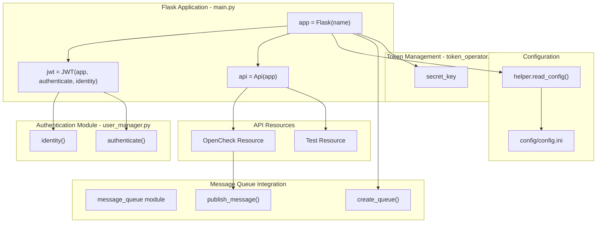
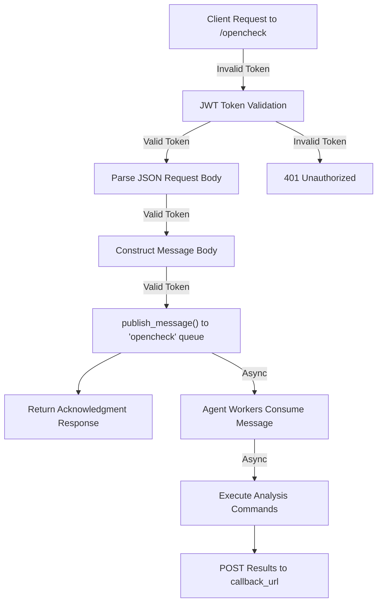

# API and Authentication

> **Relevant source files**
> * [openchecker/main.py](https://github.com/Laniakea2012/openchecker/blob/00a9732e/openchecker/main.py)
> * [requirements.txt](https://github.com/Laniakea2012/openchecker/blob/00a9732e/requirements.txt)

This document covers the OpenChecker system's REST API implementation and JWT-based authentication mechanism. It details the Flask web framework setup, user authentication flows, API endpoint specifications, and security configurations. For information about message queue integration used by the API, see [Message Queue Integration](/Laniakea2012/openchecker/2.2-message-queue-integration). For details about user creation and management, see [User Management and Authentication](/Laniakea2012/openchecker/3.2-user-management-and-authentication).

## Flask Application Architecture

The OpenChecker API is built using Flask with Flask-RESTful for resource management and Flask-JWT for authentication. The main application structure follows a modular design pattern with separate components for authentication, message queuing, and configuration management.

### Application Structure



**Sources:** [openchecker/main.py L1-L22](https://github.com/Laniakea2012/openchecker/blob/00a9732e/openchecker/main.py#L1-L22)

 [requirements.txt L1-L4](https://github.com/Laniakea2012/openchecker/blob/00a9732e/requirements.txt#L1-L4)

## JWT Authentication System

The authentication system uses Flask-JWT to provide token-based authentication with a 30-day expiration period. All API endpoints require valid JWT tokens for access.

### Authentication Configuration

| Configuration Key | Value | Purpose |
| --- | --- | --- |
| `SECRET_KEY` | From `token_operator.secret_key` | JWT token signing |
| `JWT_EXPIRATION_DELTA` | `timedelta(days=30)` | Token validity period |

The JWT system integrates with custom authentication functions:

[ERROR_PROCESSING_ELEMENT: PRE]

**Sources:** [openchecker/main.py L3-L4](https://github.com/Laniakea2012/openchecker/blob/00a9732e/openchecker/main.py#L3-L4)

 [openchecker/main.py L13-L19](https://github.com/Laniakea2012/openchecker/blob/00a9732e/openchecker/main.py#L13-L19)

## API Endpoints

The system exposes two main REST API endpoints, both requiring JWT authentication via the `@jwt_required()` decorator.

### Endpoint Specifications

| Endpoint | Methods | Authentication | Purpose |
| --- | --- | --- | --- |
| `/test` | GET, POST | JWT Required | Authentication testing and validation |
| `/opencheck` | POST | JWT Required | Submit analysis requests to message queue |

### Test Endpoint (/test)

The Test resource provides basic authentication validation functionality:

**GET `/test`**

* **Authentication:** JWT required
* **Response:** Returns `current_identity` object
* **Purpose:** Validate JWT token and retrieve user identity

**POST `/test`**

* **Authentication:** JWT required
* **Request Body:** `{"message": "string"}`
* **Response:** `"Message received: {message}, test pass!"`
* **Purpose:** Echo test for authenticated requests

### OpenCheck Endpoint (/opencheck)

The primary API endpoint for submitting software analysis requests:

**POST `/opencheck`**

* **Authentication:** JWT required
* **Request Body:**

```
{
  "commands": ["list of analysis commands"],
  "project_url": "git repository URL",
  "commit_hash": "optional commit hash",
  "callback_url": "URL for results delivery",
  "task_metadata": "additional task information"
}
```

* **Processing:** Creates message body and publishes to `opencheck` queue
* **Response:** Confirmation message with task details
* **Integration:** Connects to RabbitMQ message queue system

The endpoint transforms the request into a standardized message format:

```
{
  "command_list": "from request commands",
  "project_url": "from request", 
  "commit_hash": "from request (optional)",
  "callback_url": "from request",
  "task_metadata": "from request"
}
```

**Sources:** [openchecker/main.py L23-L53](https://github.com/Laniakea2012/openchecker/blob/00a9732e/openchecker/main.py#L23-L53)

 [openchecker/main.py L55-L56](https://github.com/Laniakea2012/openchecker/blob/00a9732e/openchecker/main.py#L55-L56)

## Request Processing Flow

The API follows an asynchronous processing pattern where requests are immediately queued for background processing:



**Sources:** [openchecker/main.py L36-L52](https://github.com/Laniakea2012/openchecker/blob/00a9732e/openchecker/main.py#L36-L52)

## Application Initialization and Configuration

The Flask application initializes with several key components:

### Initialization Sequence

1. **RabbitMQ Connection Testing:** `test_rabbitmq_connection(config)`
2. **Dead Letter Queue Creation:** `create_queue(config, "dead_letters")`
3. **Main Queue Creation:** `create_queue(config, "opencheck", arguments={'x-dead-letter-exchange': '', 'x-dead-letter-routing-key': 'dead_letters'})`

### Server Configuration

The application reads server configuration from `config/config.ini` under the `"OpenCheck"` section:

| Configuration Parameter | Purpose |
| --- | --- |
| `host` | Server bind address |
| `port` | Server port number |
| `ssl_crt_path` | SSL certificate path (if SSL enabled) |
| `ssl_key_path` | SSL private key path (if SSL enabled) |

SSL support is available but disabled by default (`use_ssl = False`).

**Sources:** [openchecker/main.py L59-L74](https://github.com/Laniakea2012/openchecker/blob/00a9732e/openchecker/main.py#L59-L74)

 [openchecker/main.py

21](https://github.com/Laniakea2012/openchecker/blob/00a9732e/openchecker/main.py#L21-L21)

## Dependencies and Requirements

The API system relies on specific versions of key Python packages:

| Package | Version | Purpose |
| --- | --- | --- |
| `flask` | 2.2.3 | Web framework |
| `flask_restful` | 0.3.9 | REST API resource management |
| `flask_jwt` | 0.3.2 | JWT authentication |
| `Werkzeug` | 2.2.2 | WSGI utilities |
| `pika` | 1.3.2 | RabbitMQ integration |

**Sources:** [requirements.txt L1-L5](https://github.com/Laniakea2012/openchecker/blob/00a9732e/requirements.txt#L1-L5)