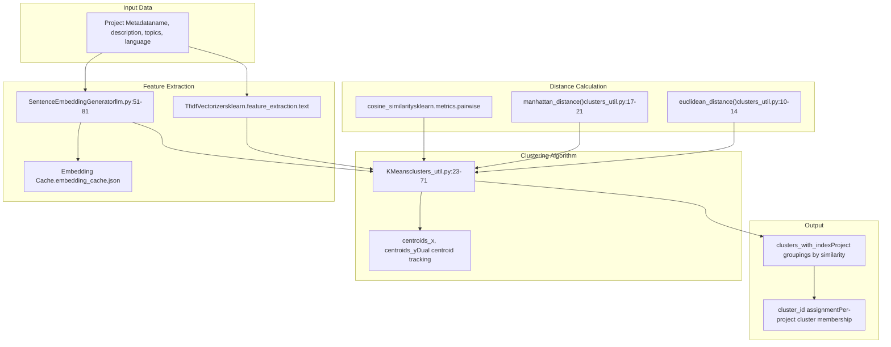
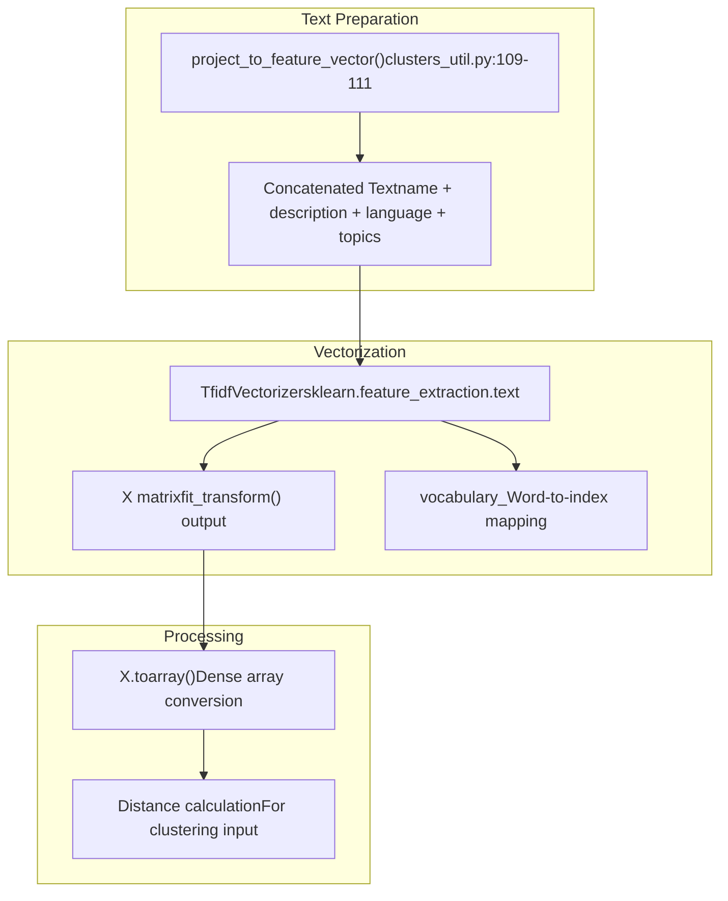
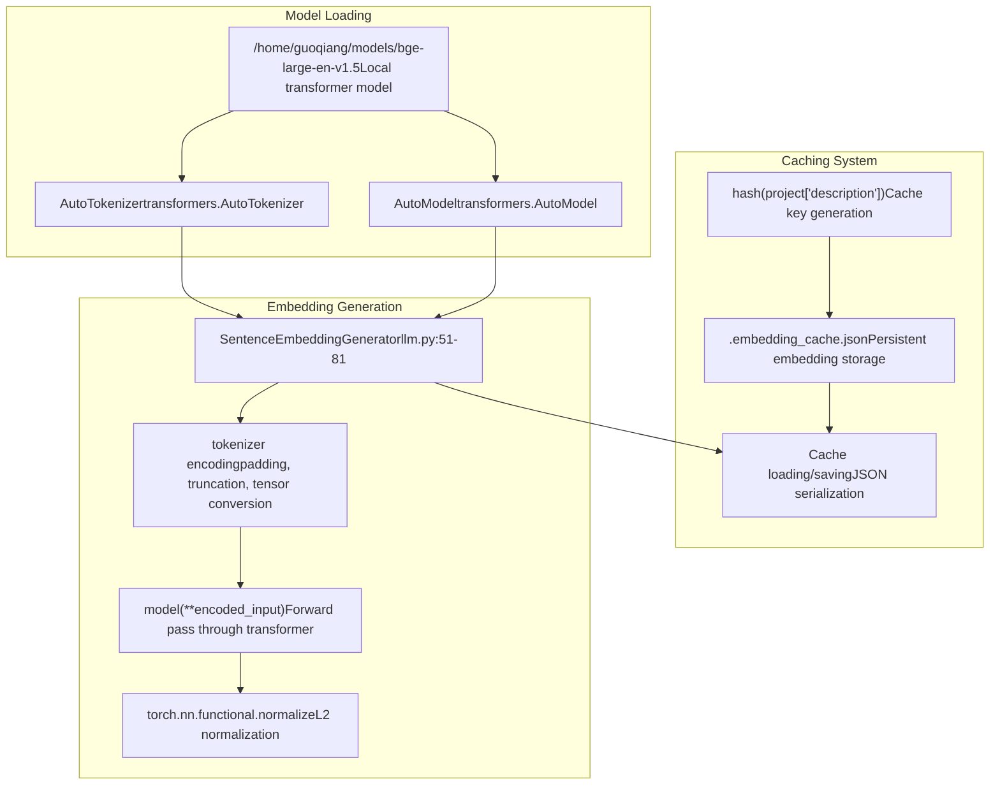
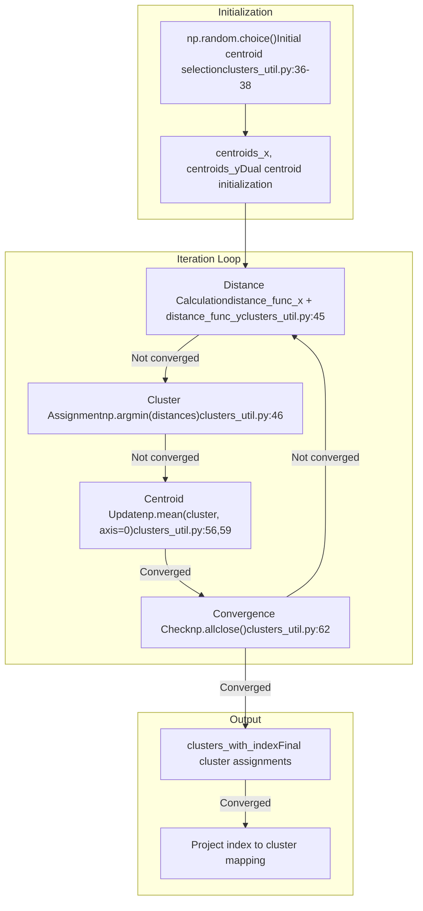
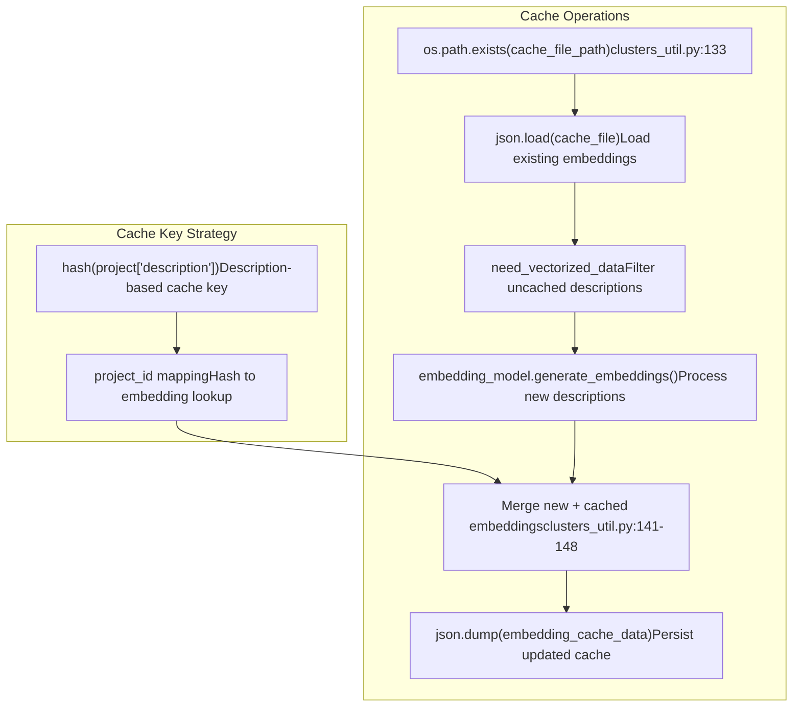
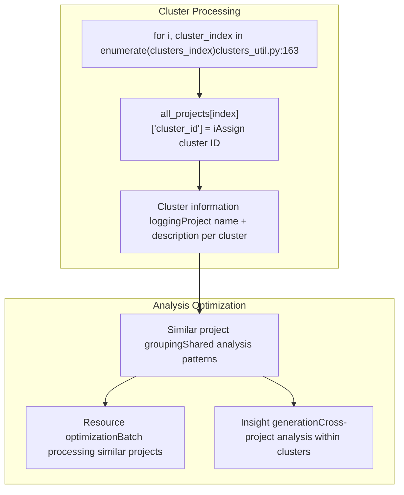

# Clustering and Embeddings

> **Relevant source files**
> * [openchecker/clusters_util.py](https://github.com/Laniakea2012/openchecker/blob/00a9732e/openchecker/clusters_util.py)
> * [openchecker/llm.py](https://github.com/Laniakea2012/openchecker/blob/00a9732e/openchecker/llm.py)

This document covers the project clustering and embedding generation capabilities within OpenChecker. The system uses a combination of traditional NLP techniques (TF-IDF) and modern transformer-based embeddings to group similar projects together for analysis optimization and insight generation. For information about project classification into predefined categories, see [Project Classification System](/Laniakea2012/openchecker/5.1-project-classification-system).

## Clustering Pipeline Overview

The clustering system operates on project metadata to identify groups of similar projects using a dual-feature approach combining TF-IDF vectors and sentence embeddings.

**Sources:** [openchecker/clusters_util.py L1-L187](https://github.com/Laniakea2012/openchecker/blob/00a9732e/openchecker/clusters_util.py#L1-L187)

 [openchecker/llm.py L51-L81](https://github.com/Laniakea2012/openchecker/blob/00a9732e/openchecker/llm.py#L51-L81)

## Feature Extraction Methods

The system employs two complementary feature extraction approaches to capture different aspects of project similarity.

### TF-IDF Vectorization

Traditional term frequency-inverse document frequency vectorization creates sparse feature vectors from project text data.

The `project_to_feature_vector()` function [openchecker/clusters_util.py L109-L111](https://github.com/Laniakea2012/openchecker/blob/00a9732e/openchecker/clusters_util.py#L109-L111)

 combines all textual project metadata into a single string for vectorization.

**Sources:** [openchecker/clusters_util.py L108-L124](https://github.com/Laniakea2012/openchecker/blob/00a9732e/openchecker/clusters_util.py#L108-L124)

### LLM Embeddings Generation

Modern transformer-based embeddings provide dense semantic representations using the BGE (BAAI General Embedding) model.

The `SentenceEmbeddingGenerator` class [openchecker/llm.py L51-L81](https://github.com/Laniakea2012/openchecker/blob/00a9732e/openchecker/llm.py#L51-L81)

 handles the complete embedding pipeline from tokenization to normalized vector output.

**Sources:** [openchecker/llm.py L51-L81](https://github.com/Laniakea2012/openchecker/blob/00a9732e/openchecker/llm.py#L51-L81)

 [openchecker/clusters_util.py L126-L152](https://github.com/Laniakea2012/openchecker/blob/00a9732e/openchecker/clusters_util.py#L126-L152)

## Custom KMeans Implementation

The system implements a custom KMeans algorithm that operates on dual feature spaces simultaneously.

### KMeans Class Architecture

| Component | Type | Purpose |
| --- | --- | --- |
| `n_clusters` | int | Number of clusters to generate |
| `max_iter` | int | Maximum iterations for convergence |
| `distance_func_x` | function | Distance function for TF-IDF features |
| `distance_func_y` | function | Distance function for embeddings |
| `centroids_x` | numpy.ndarray | TF-IDF centroids |
| `centroids_y` | numpy.ndarray | Embedding centroids |
| `clusters_with_index` | list | Index mapping of points to clusters |

### Clustering Algorithm Flow

The `fit()` method [openchecker/clusters_util.py L35-L63](https://github.com/Laniakea2012/openchecker/blob/00a9732e/openchecker/clusters_util.py#L35-L63)

 implements the core clustering algorithm with dual-space centroid tracking.

**Sources:** [openchecker/clusters_util.py L23-L71](https://github.com/Laniakea2012/openchecker/blob/00a9732e/openchecker/clusters_util.py#L23-L71)

## Distance Functions

The clustering system supports multiple distance metrics for different feature types:

| Function | Use Case | Implementation |
| --- | --- | --- |
| `euclidean_distance()` | TF-IDF vectors | [openchecker/clusters_util.py L10-L14](https://github.com/Laniakea2012/openchecker/blob/00a9732e/openchecker/clusters_util.py#L10-L14) |
| `manhattan_distance()` | TF-IDF vectors | [openchecker/clusters_util.py L17-L21](https://github.com/Laniakea2012/openchecker/blob/00a9732e/openchecker/clusters_util.py#L17-L21) |
| `cosine_similarity` | Embedding vectors | sklearn.metrics.pairwise |

## Embedding Caching System

To optimize performance, the system implements a persistent caching mechanism for expensive embedding calculations.

The caching system uses description hashes as keys [openchecker/clusters_util.py L137-L142](https://github.com/Laniakea2012/openchecker/blob/00a9732e/openchecker/clusters_util.py#L137-L142)

 to avoid regenerating embeddings for projects with identical descriptions.

**Sources:** [openchecker/clusters_util.py L130-L152](https://github.com/Laniakea2012/openchecker/blob/00a9732e/openchecker/clusters_util.py#L130-L152)

## Integration with Analysis Workflow

The clustering results integrate with the broader OpenChecker analysis pipeline to optimize processing and provide insights.

### Cluster Assignment Output

The final cluster assignments [openchecker/clusters_util.py L163-L169](https://github.com/Laniakea2012/openchecker/blob/00a9732e/openchecker/clusters_util.py#L163-L169)

 are stored as `cluster_id` attributes on project objects for downstream processing optimization.

**Sources:** [openchecker/clusters_util.py L155-L170](https://github.com/Laniakea2012/openchecker/blob/00a9732e/openchecker/clusters_util.py#L155-L170)