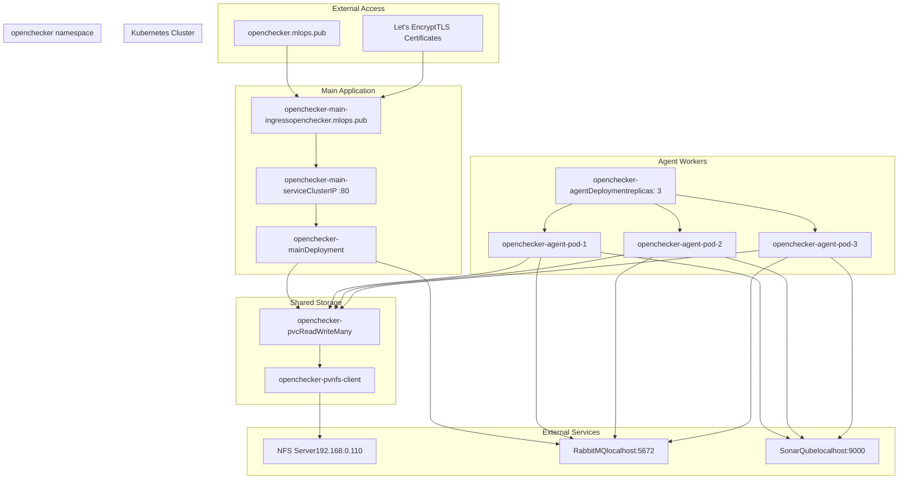
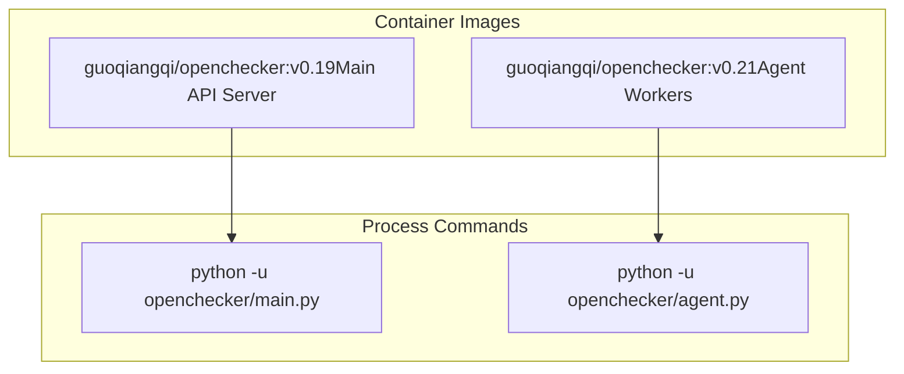
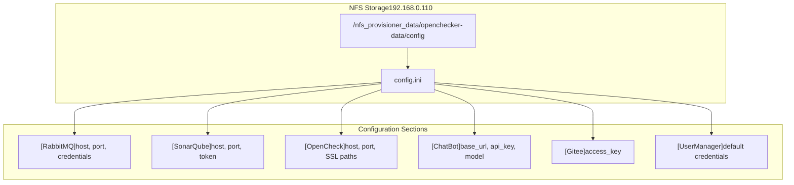
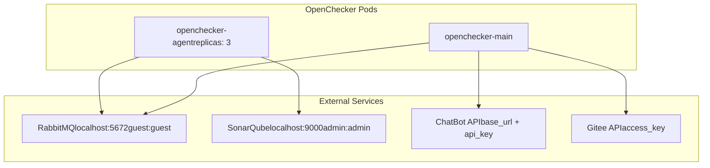

# Deployment and Infrastructure

> **Relevant source files**
> * [config/config.ini](https://github.com/Laniakea2012/openchecker/blob/00a9732e/config/config.ini)
> * [kubernetes/openchecker-agent/deployment.yaml](https://github.com/Laniakea2012/openchecker/blob/00a9732e/kubernetes/openchecker-agent/deployment.yaml)
> * [kubernetes/openchecker-main/deployment.yaml](https://github.com/Laniakea2012/openchecker/blob/00a9732e/kubernetes/openchecker-main/deployment.yaml)
> * [kubernetes/openchecker-main/service.yaml](https://github.com/Laniakea2012/openchecker/blob/00a9732e/kubernetes/openchecker-main/service.yaml)
> * [kubernetes/openchecker-main/volumes.yaml](https://github.com/Laniakea2012/openchecker/blob/00a9732e/kubernetes/openchecker-main/volumes.yaml)

This document covers the deployment architecture, infrastructure components, and operational configuration of the OpenChecker system. It explains how the containerized application is deployed on Kubernetes, managed through persistent storage, and integrated with supporting services like RabbitMQ and SonarQube.

For information about the API endpoints and authentication mechanisms, see [REST API Endpoints](/Laniakea2012/openchecker/3.1-rest-api-endpoints). For details about individual analysis tools and their container setup, see [Container Environment and Tool Installation](/Laniakea2012/openchecker/4.1-container-environment-and-tool-installation).

## Deployment Architecture Overview

The OpenChecker system follows a distributed microservices architecture deployed on Kubernetes. The main application (`openchecker-main`) serves the REST API while multiple worker agents (`openchecker-agent`) process analysis tasks asynchronously.

### Kubernetes Deployment Structure

Sources: [kubernetes/openchecker-main/deployment.yaml L1-L32](https://github.com/Laniakea2012/openchecker/blob/00a9732e/kubernetes/openchecker-main/deployment.yaml#L1-L32)

 [kubernetes/openchecker-agent/deployment.yaml L1-L30](https://github.com/Laniakea2012/openchecker/blob/00a9732e/kubernetes/openchecker-agent/deployment.yaml#L1-L30)

 [kubernetes/openchecker-main/service.yaml L1-L40](https://github.com/Laniakea2012/openchecker/blob/00a9732e/kubernetes/openchecker-main/service.yaml#L1-L40)

 [kubernetes/openchecker-main/volumes.yaml L1-L31](https://github.com/Laniakea2012/openchecker/blob/00a9732e/kubernetes/openchecker-main/volumes.yaml#L1-L31)

## Kubernetes Resource Configuration

### Main Application Deployment

The main application deployment runs a single replica of the Flask API server that handles incoming HTTP requests and publishes messages to RabbitMQ.

| Resource | Configuration |
| --- | --- |
| **Deployment Name** | `openchecker-main` |
| **Namespace** | `openchecker` |
| **Replicas** | 1 |
| **Container Image** | `guoqiangqi/openchecker:v0.19` |
| **Command** | `["python", "-u", "openchecker/main.py"]` |
| **Container Port** | 80 |

The deployment mounts shared configuration from the persistent volume at `/app/config` to access the centralized `config.ini` file.

Sources: [kubernetes/openchecker-main/deployment.yaml L1-L32](https://github.com/Laniakea2012/openchecker/blob/00a9732e/kubernetes/openchecker-main/deployment.yaml#L1-L32)

### Agent Worker Deployment

The agent deployment runs multiple worker replicas that consume messages from RabbitMQ and execute analysis tools on cloned repositories.

| Resource | Configuration |
| --- | --- |
| **Deployment Name** | `openchecker-agent` |
| **Namespace** | `openchecker` |
| **Replicas** | 3 |
| **Container Image** | `guoqiangqi/openchecker:v0.21` |
| **Command** | `["python", "-u", "openchecker/agent.py"]` |

Each agent pod mounts the same shared configuration volume to access the same `config.ini` settings for RabbitMQ connection and analysis tool configuration.

Sources: [kubernetes/openchecker-agent/deployment.yaml L1-L30](https://github.com/Laniakea2012/openchecker/blob/00a9732e/kubernetes/openchecker-agent/deployment.yaml#L1-L30)

### Container Image Versions

Sources: [kubernetes/openchecker-main/deployment.yaml L20-L22](https://github.com/Laniakea2012/openchecker/blob/00a9732e/kubernetes/openchecker-main/deployment.yaml#L20-L22)

 [kubernetes/openchecker-agent/deployment.yaml L20-L22](https://github.com/Laniakea2012/openchecker/blob/00a9732e/kubernetes/openchecker-agent/deployment.yaml#L20-L22)

## Storage and Configuration Management

### NFS-Based Persistent Storage

The system uses NFS-backed persistent volumes to share configuration files between all pods. This ensures consistent configuration across the main application and all agent workers.

| Storage Resource | Configuration |
| --- | --- |
| **PersistentVolume** | `openchecker-pv` |
| **PersistentVolumeClaim** | `openchecker-pvc` |
| **Storage Class** | `nfs-client` |
| **Access Mode** | `ReadWriteMany` |
| **Capacity** | 10Mi |
| **NFS Server** | `192.168.0.110` |
| **NFS Path** | `/nfs_provisioner_data/openchecker-data/config` |

The NFS server hosts the shared configuration directory that contains the `config.ini` file and other configuration data needed by both the main application and agent workers.

Sources: [kubernetes/openchecker-main/volumes.yaml L1-L31](https://github.com/Laniakea2012/openchecker/blob/00a9732e/kubernetes/openchecker-main/volumes.yaml#L1-L31)

### Centralized Configuration Structure

The `config.ini` file provides centralized configuration for all system components:

Sources: [config/config.ini L1-L33](https://github.com/Laniakea2012/openchecker/blob/00a9732e/config/config.ini#L1-L33)

 [kubernetes/openchecker-main/volumes.yaml L14-L16](https://github.com/Laniakea2012/openchecker/blob/00a9732e/kubernetes/openchecker-main/volumes.yaml#L14-L16)

## Network and Ingress Configuration

### Service and Ingress Setup

External access to the OpenChecker API is provided through Kubernetes Ingress with TLS termination.

| Network Resource | Configuration |
| --- | --- |
| **Service Name** | `openchecker-main-service` |
| **Service Type** | `ClusterIP` |
| **Service Port** | 80 |
| **Ingress Name** | `openchecker-main-ingress` |
| **Hostname** | `openchecker.mlops.pub` |
| **TLS Certificate** | `openchecker-mlops-pub-tls` |
| **Certificate Issuer** | `letsencrypt-dns01` |

The ingress controller is configured with nginx and automatically redirects HTTP traffic to HTTPS using Let's Encrypt certificates.

Sources: [kubernetes/openchecker-main/service.yaml L1-L40](https://github.com/Laniakea2012/openchecker/blob/00a9732e/kubernetes/openchecker-main/service.yaml#L1-L40)

### External Service Integration

Sources: [config/config.ini L1-L33](https://github.com/Laniakea2012/openchecker/blob/00a9732e/config/config.ini#L1-L33)

## Infrastructure Service Dependencies

### Message Queue Configuration

The system depends on RabbitMQ for asynchronous message processing between the API and worker agents.

| RabbitMQ Setting | Value |
| --- | --- |
| **Host** | `localhost` |
| **Port** | `5672` |
| **Username** | `guest` |
| **Password** | `guest` |
| **Heartbeat Interval** | `60` seconds |
| **Blocked Connection Timeout** | `300000` ms |

Sources: [config/config.ini L1-L8](https://github.com/Laniakea2012/openchecker/blob/00a9732e/config/config.ini#L1-L8)

### Code Analysis Platform

SonarQube integration provides static code analysis capabilities through the agent workers.

| SonarQube Setting | Value |
| --- | --- |
| **Host** | `localhost` |
| **Port** | `9000` |
| **Username** | `admin` |
| **Password** | `admin` |
| **Token** | *(configurable)* |

Sources: [config/config.ini L9-L15](https://github.com/Laniakea2012/openchecker/blob/00a9732e/config/config.ini#L9-L15)

### SSL/TLS Configuration

The main application supports SSL termination with configurable certificate paths:

| SSL Setting | Default Value |
| --- | --- |
| **Certificate Path** | `/path/to/certificate.crt` |
| **Private Key Path** | `/path/to/private.key` |
| **Listen Address** | `0.0.0.0` |
| **Listen Port** | `8082` |

Sources: [config/config.ini L16-L21](https://github.com/Laniakea2012/openchecker/blob/00a9732e/config/config.ini#L16-L21)