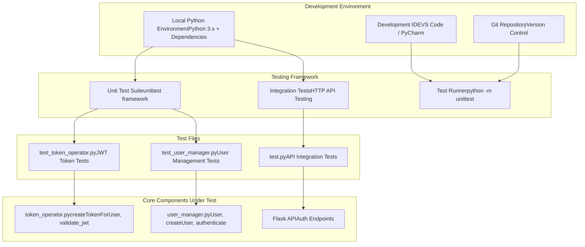
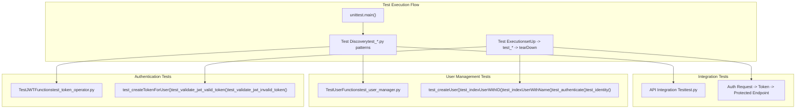
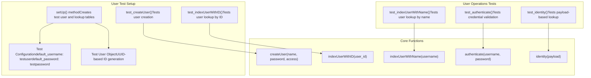
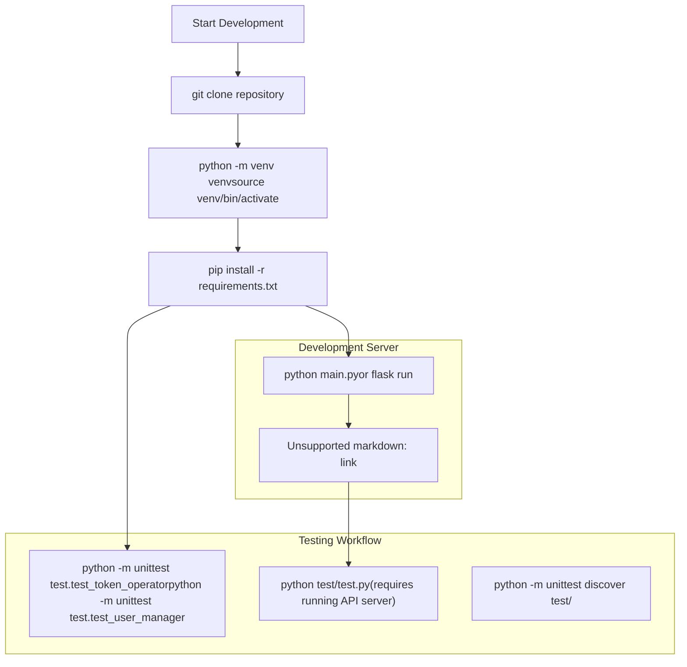

# Development and Testing

> **Relevant source files**
> * [test/test.py](https://github.com/Laniakea2012/openchecker/blob/00a9732e/test/test.py)
> * [test/test_token_operator.py](https://github.com/Laniakea2012/openchecker/blob/00a9732e/test/test_token_operator.py)
> * [test/test_user_manager.py](https://github.com/Laniakea2012/openchecker/blob/00a9732e/test/test_user_manager.py)

This document provides guidance for developers working on the OpenChecker system, covering development environment setup, testing frameworks, and development workflows. It focuses on the technical aspects of contributing to the codebase and ensuring code quality through comprehensive testing.

For information about deploying OpenChecker in production environments, see [Deployment and Infrastructure](/Laniakea2012/openchecker/6-deployment-and-infrastructure). For details about the overall system architecture, see [Core Architecture](/Laniakea2012/openchecker/2-core-architecture).

## Development Environment Overview

OpenChecker uses a comprehensive testing strategy built around Python's `unittest` framework, with both unit tests for individual components and integration tests for end-to-end API workflows. The development environment supports local testing of core functionality while maintaining compatibility with the containerized production deployment.



Sources: [test/test_token_operator.py L1-L47](https://github.com/Laniakea2012/openchecker/blob/00a9732e/test/test_token_operator.py#L1-L47)

 [test/test_user_manager.py L1-L42](https://github.com/Laniakea2012/openchecker/blob/00a9732e/test/test_user_manager.py#L1-L42)

 [test/test.py L1-L43](https://github.com/Laniakea2012/openchecker/blob/00a9732e/test/test.py#L1-L43)

## Testing Framework Architecture

The testing system is organized into distinct layers, each targeting specific functionality within the OpenChecker system. The framework uses Python's built-in `unittest` module and follows standard testing patterns.



Sources: [test/test_token_operator.py L6-L47](https://github.com/Laniakea2012/openchecker/blob/00a9732e/test/test_token_operator.py#L6-L47)

 [test/test_user_manager.py L6-L42](https://github.com/Laniakea2012/openchecker/blob/00a9732e/test/test_user_manager.py#L6-L42)

 [test/test.py L9-L43](https://github.com/Laniakea2012/openchecker/blob/00a9732e/test/test.py#L9-L43)

## Unit Testing Components

### JWT Token Testing

The JWT token functionality is tested through the `TestJWTFunctions` class, which validates token creation and validation mechanisms used for API authentication.

| Test Method | Purpose | Key Assertions |
| --- | --- | --- |
| `test_createTokenForUser` | Validates token creation for user authentication | Token contains correct `user_id`, `user_name`, and `expir` fields |
| `test_validate_jwt_valid_token` | Ensures valid tokens pass validation | Returns `True` for properly formatted tokens |
| `test_validate_jwt_invalid_token` | Ensures invalid tokens are rejected | Returns `False` for malformed tokens |

The tests use a mock user class and test secret key for isolation from production configuration. Critical functions tested include:

* `createTokenForUser(user_id)` - Token generation function
* `validate_jwt(token)` - Token validation function

Sources: [test/test_token_operator.py L4-L47](https://github.com/Laniakea2012/openchecker/blob/00a9732e/test/test_token_operator.py#L4-L47)

### User Management Testing

The `TestUserFunctions` class provides comprehensive testing for user operations, including user creation, lookup, and authentication workflows.



Sources: [test/test_user_manager.py L4-L42](https://github.com/Laniakea2012/openchecker/blob/00a9732e/test/test_user_manager.py#L4-L42)

## Integration Testing

### API Integration Test Workflow

The integration test in `test.py` validates the complete authentication and API access workflow, demonstrating the end-to-end functionality of the OpenChecker API.

| Test Phase | HTTP Method | Endpoint | Purpose |
| --- | --- | --- | --- |
| Authentication | POST | `/auth` | Obtain JWT access token |
| Protected Request | POST | `/test` | Validate token-protected endpoint access |

The test workflow follows this sequence:

1. **Authentication Request**: Posts credentials to `/auth` endpoint
2. **Token Extraction**: Extracts `access_token` from response JSON
3. **Protected Request**: Uses token in `Authorization: JWT <token>` header
4. **Response Validation**: Verifies successful access to protected endpoint

```
# Key request patterns from test.py
authPayload = {
    'username': 'temporary_user',
    'password': 'default_password'
}

headers['Authorization'] = 'JWT' + ' ' + access_token
```

Sources: [test/test.py L10-L43](https://github.com/Laniakea2012/openchecker/blob/00a9732e/test/test.py#L10-L43)

## Development Workflow

### Local Development Setup

For local development, developers need to set up the Python environment and dependencies required for testing and development.



Sources: [test/test.py

3](https://github.com/Laniakea2012/openchecker/blob/00a9732e/test/test.py#L3-L3)

### Test Execution Commands

| Test Type | Command | Description |
| --- | --- | --- |
| All Unit Tests | `python -m unittest discover test/` | Runs all test files matching `test_*.py` pattern |
| Token Tests | `python -m unittest test.test_token_operator` | Tests JWT token functionality only |
| User Tests | `python -m unittest test.test_user_manager` | Tests user management functionality only |
| Integration Test | `python test/test.py` | Requires running API server on localhost:8080 |

### Test Configuration Requirements

The tests require specific configuration setup for proper execution:

* **Secret Keys**: Test files use hardcoded test secrets (noted as requiring optimization)
* **Default Credentials**: Integration tests use `temporary_user` / `default_password`
* **Local Server**: Integration tests expect API server running on `localhost:8080`
* **Dependencies**: Tests require `jwt`, `requests`, `uuid`, and `secrets` modules

Sources: [test/test_token_operator.py L9-L11](https://github.com/Laniakea2012/openchecker/blob/00a9732e/test/test_token_operator.py#L9-L11)

 [test/test_user_manager.py L8-L15](https://github.com/Laniakea2012/openchecker/blob/00a9732e/test/test_user_manager.py#L8-L15)

 [test/test.py L3-L14](https://github.com/Laniakea2012/openchecker/blob/00a9732e/test/test.py#L3-L14)

## Testing Best Practices

### Mock Objects and Test Isolation

The test suite demonstrates proper use of mock objects to isolate functionality under test:

```
# Example from test_token_operator.py
class MockUser:
    def __init__(self, id, name):
        self.id = id
        self.name = name
```

### Test Data Management

Tests use controlled test data to ensure predictable results:

* UUID-based user ID generation for uniqueness
* Predefined username/password combinations
* Isolated test configurations separate from production

### Error Handling Testing

The test suite includes both positive and negative test cases:

* Valid token validation tests
* Invalid token rejection tests
* Successful authentication tests
* Failed authentication scenarios

Sources: [test/test_token_operator.py L14-L44](https://github.com/Laniakea2012/openchecker/blob/00a9732e/test/test_token_operator.py#L14-L44)

 [test/test_user_manager.py L8-L39](https://github.com/Laniakea2012/openchecker/blob/00a9732e/test/test_user_manager.py#L8-L39)