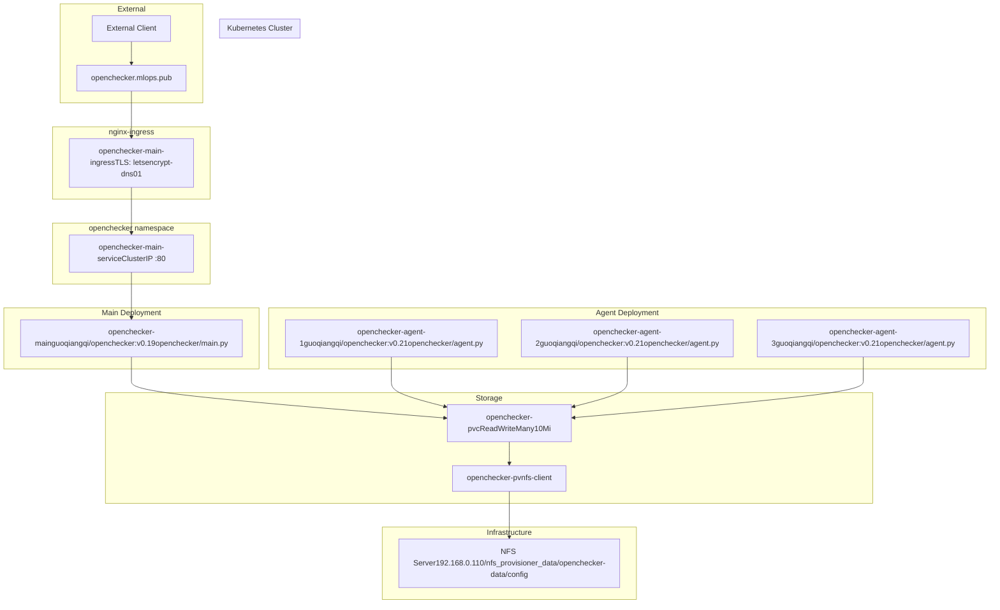
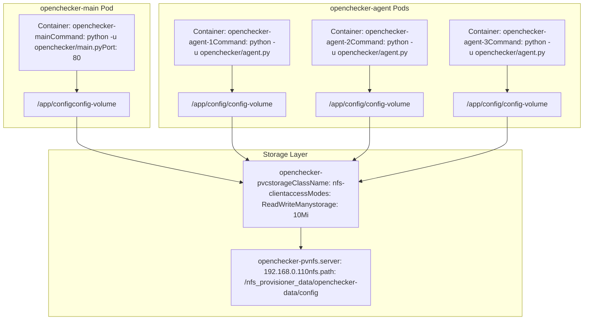

# Kubernetes Deployments

> **Relevant source files**
> * [kubernetes/openchecker-agent/deployment.yaml](https://github.com/Laniakea2012/openchecker/blob/00a9732e/kubernetes/openchecker-agent/deployment.yaml)
> * [kubernetes/openchecker-main/deployment.yaml](https://github.com/Laniakea2012/openchecker/blob/00a9732e/kubernetes/openchecker-main/deployment.yaml)
> * [kubernetes/openchecker-main/service.yaml](https://github.com/Laniakea2012/openchecker/blob/00a9732e/kubernetes/openchecker-main/service.yaml)
> * [kubernetes/openchecker-main/volumes.yaml](https://github.com/Laniakea2012/openchecker/blob/00a9732e/kubernetes/openchecker-main/volumes.yaml)

## Purpose and Scope

This document covers the Kubernetes deployment configuration for the OpenChecker system, including the main application deployment, agent worker deployments, and supporting infrastructure. It details the YAML manifests, resource specifications, and deployment architecture within the `openchecker` namespace.

For information about supporting services like PostgreSQL, RabbitMQ, and SonarQube deployments, see [Supporting Services](/Laniakea2012/openchecker/6.2-supporting-services). For storage provisioning and configuration management details, see [Storage and Configuration Management](/Laniakea2012/openchecker/6.3-storage-and-configuration-management).

## Kubernetes Resource Overview

The OpenChecker system deploys in Kubernetes using a microservices architecture with two primary deployments: a main API service and multiple agent workers. The system uses shared NFS storage for configuration data and external ingress for public access.

| Resource Type | Resource Name | Purpose |
| --- | --- | --- |
| Deployment | `openchecker-main` | Flask API server |
| Deployment | `openchecker-agent` | Worker agents (3 replicas) |
| Service | `openchecker-main-service` | ClusterIP service for main app |
| Ingress | `openchecker-main-ingress` | External access via nginx |
| PersistentVolume | `openchecker-pv` | NFS-backed shared storage |
| PersistentVolumeClaim | `openchecker-pvc` | Storage claim for config data |

Sources: [kubernetes/openchecker-main/deployment.yaml L1-L32](https://github.com/Laniakea2012/openchecker/blob/00a9732e/kubernetes/openchecker-main/deployment.yaml#L1-L32)

 [kubernetes/openchecker-agent/deployment.yaml L1-L30](https://github.com/Laniakea2012/openchecker/blob/00a9732e/kubernetes/openchecker-agent/deployment.yaml#L1-L30)

 [kubernetes/openchecker-main/service.yaml L1-L40](https://github.com/Laniakea2012/openchecker/blob/00a9732e/kubernetes/openchecker-main/service.yaml#L1-L40)

 [kubernetes/openchecker-main/volumes.yaml L1-L31](https://github.com/Laniakea2012/openchecker/blob/00a9732e/kubernetes/openchecker-main/volumes.yaml#L1-L31)

## Main Application Deployment

The main application deployment runs a single replica of the Flask API server that handles external requests and publishes messages to RabbitMQ.

### Deployment Specification

The `openchecker-main` deployment uses the following configuration:

* **Image**: `guoqiangqi/openchecker:v0.19`
* **Command**: `["python", "-u", "openchecker/main.py"]`
* **Replicas**: 1
* **Container Port**: 80
* **Volume Mount**: `/app/config` mounted from `openchecker-pvc`

```
# Key configuration from deployment.yaml
name: openchecker-main
namespace: openchecker
replicas: 1
image: guoqiangqi/openchecker:v0.19
command: ["python", "-u", "openchecker/main.py"]
```

The deployment includes an `imagePullPolicy: Always` to ensure the latest image version is pulled on each deployment. The config volume is mounted at `/app/config` to provide access to the shared configuration files including `config.ini`.

Sources: [kubernetes/openchecker-main/deployment.yaml L1-L32](https://github.com/Laniakea2012/openchecker/blob/00a9732e/kubernetes/openchecker-main/deployment.yaml#L1-L32)

## Agent Worker Deployment

The agent deployment runs multiple worker replicas that consume messages from RabbitMQ and execute analysis tools on projects.

### Agent Specification

The `openchecker-agent` deployment configuration:

* **Image**: `guoqiangqi/openchecker:v0.21`
* **Command**: `["python", "-u", "openchecker/agent.py"]`
* **Replicas**: 3
* **Volume Mount**: `/app/config/` mounted from `openchecker-pvc`

The agent workers use a newer image version (`v0.21`) compared to the main application (`v0.19`), indicating active development on the worker functionality. Each agent replica can independently process analysis requests from the message queue.

### Scaling Configuration

The 3-replica configuration provides horizontal scaling for analysis workloads. Additional replicas can be added by modifying the `replicas` field in [kubernetes/openchecker-agent/deployment.yaml

9](https://github.com/Laniakea2012/openchecker/blob/00a9732e/kubernetes/openchecker-agent/deployment.yaml#L9-L9)

Sources: [kubernetes/openchecker-agent/deployment.yaml L1-L30](https://github.com/Laniakea2012/openchecker/blob/00a9732e/kubernetes/openchecker-agent/deployment.yaml#L1-L30)

## Storage Configuration

The system uses NFS-backed persistent storage for sharing configuration data between the main application and agent workers.

### Persistent Volume Configuration

| Parameter | Value |
| --- | --- |
| Name | `openchecker-pv` |
| Capacity | 10Mi |
| Access Mode | ReadWriteMany |
| Storage Class | `nfs-client` |
| NFS Server | 192.168.0.110 |
| NFS Path | `/nfs_provisioner_data/openchecker-data/config` |

The `ReadWriteMany` access mode allows multiple pods to mount the same volume simultaneously, enabling shared access to configuration files across all deployments.

### Persistent Volume Claim

The `openchecker-pvc` claim requests 10Mi of storage with `ReadWriteMany` access, bound to the `openchecker-pv` volume. Both the main application and agent workers mount this claim to access shared configuration.

Sources: [kubernetes/openchecker-main/volumes.yaml L1-L31](https://github.com/Laniakea2012/openchecker/blob/00a9732e/kubernetes/openchecker-main/volumes.yaml#L1-L31)

## Service and Ingress Configuration

### ClusterIP Service

The `openchecker-main-service` exposes the main application within the cluster:

* **Type**: ClusterIP
* **Port**: 80
* **Target Port**: 80
* **Selector**: `app: openchecker-main`

### Ingress Configuration

The `openchecker-main-ingress` provides external access with the following features:

* **Host**: `openchecker.mlops.pub`
* **Ingress Class**: nginx
* **TLS**: Enabled with Let's Encrypt certificates
* **SSL Redirect**: Enforced via annotation
* **Certificate Issuer**: `letsencrypt-dns01`

The ingress configuration includes TLS termination using a certificate managed by cert-manager, with the certificate stored in the `openchecker-mlops-pub-tls` secret.

Sources: [kubernetes/openchecker-main/service.yaml L1-L40](https://github.com/Laniakea2012/openchecker/blob/00a9732e/kubernetes/openchecker-main/service.yaml#L1-L40)

## Deployment Architecture



Sources: [kubernetes/openchecker-main/deployment.yaml L1-L32](https://github.com/Laniakea2012/openchecker/blob/00a9732e/kubernetes/openchecker-main/deployment.yaml#L1-L32)

 [kubernetes/openchecker-agent/deployment.yaml L1-L30](https://github.com/Laniakea2012/openchecker/blob/00a9732e/kubernetes/openchecker-agent/deployment.yaml#L1-L30)

 [kubernetes/openchecker-main/service.yaml L1-L40](https://github.com/Laniakea2012/openchecker/blob/00a9732e/kubernetes/openchecker-main/service.yaml#L1-L40)

 [kubernetes/openchecker-main/volumes.yaml L1-L31](https://github.com/Laniakea2012/openchecker/blob/00a9732e/kubernetes/openchecker-main/volumes.yaml#L1-L31)

## Resource Dependencies and Mount Points



Sources: [kubernetes/openchecker-main/deployment.yaml L24-L32](https://github.com/Laniakea2012/openchecker/blob/00a9732e/kubernetes/openchecker-main/deployment.yaml#L24-L32)

 [kubernetes/openchecker-agent/deployment.yaml L24-L30](https://github.com/Laniakea2012/openchecker/blob/00a9732e/kubernetes/openchecker-agent/deployment.yaml#L24-L30)

 [kubernetes/openchecker-main/volumes.yaml L14-L31](https://github.com/Laniakea2012/openchecker/blob/00a9732e/kubernetes/openchecker-main/volumes.yaml#L14-L31)

## Container Image Versions

The deployments use different image versions indicating separate release cycles:

| Deployment | Image Version | Entry Point |
| --- | --- | --- |
| `openchecker-main` | `guoqiangqi/openchecker:v0.19` | `openchecker/main.py` |
| `openchecker-agent` | `guoqiangqi/openchecker:v0.21` | `openchecker/agent.py` |

Both deployments use `imagePullPolicy: Always` to ensure the latest image is pulled on each deployment, facilitating rapid iteration during development.

Sources: [kubernetes/openchecker-main/deployment.yaml L20-L22](https://github.com/Laniakea2012/openchecker/blob/00a9732e/kubernetes/openchecker-main/deployment.yaml#L20-L22)

 [kubernetes/openchecker-agent/deployment.yaml L20-L22](https://github.com/Laniakea2012/openchecker/blob/00a9732e/kubernetes/openchecker-agent/deployment.yaml#L20-L22)