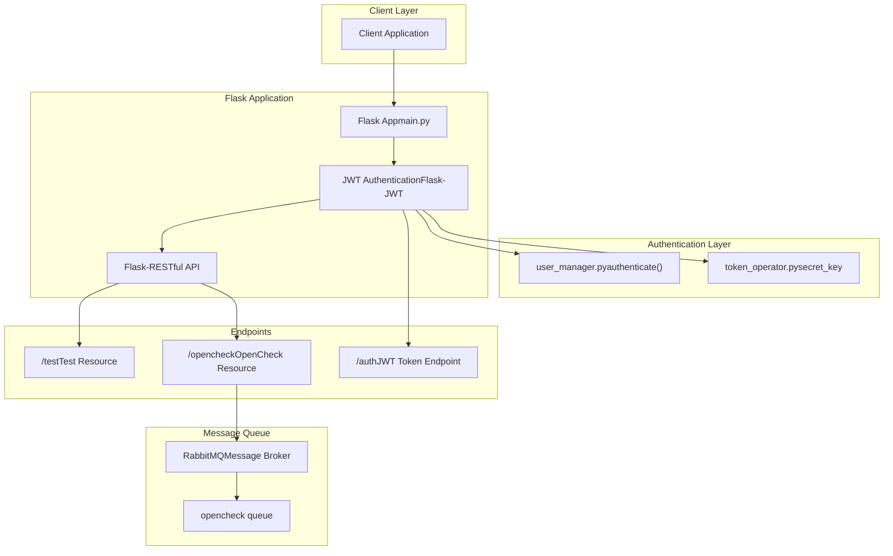
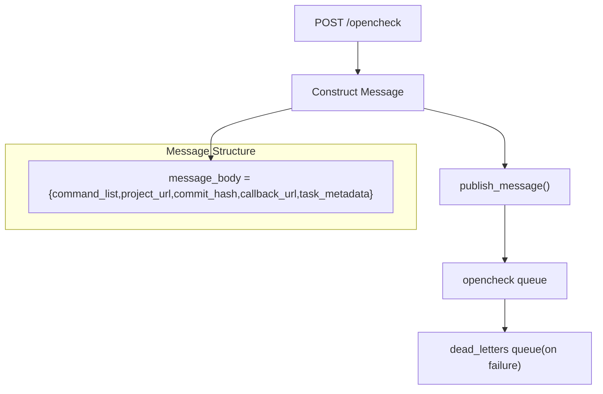
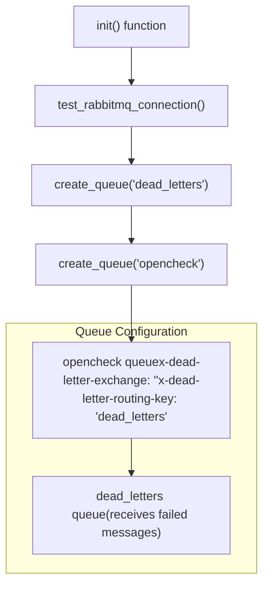

# REST API Endpoints

> **Relevant source files**
> * [README.md](https://github.com/Laniakea2012/openchecker/blob/00a9732e/README.md)
> * [docs/architecture.png](https://github.com/Laniakea2012/openchecker/blob/00a9732e/docs/architecture.png)
> * [openchecker/main.py](https://github.com/Laniakea2012/openchecker/blob/00a9732e/openchecker/main.py)

This document provides comprehensive documentation of all REST API endpoints exposed by the OpenChecker main service, including authentication requirements, request/response formats, and integration patterns. For user management and JWT authentication details, see [User Management and Authentication](/Laniakea2012/openchecker/3.2-user-management-and-authentication).

## Purpose and Scope

The OpenChecker REST API serves as the primary interface for submitting analysis requests to the system. The API is built using Flask-RESTful and implements JWT-based authentication for all endpoints. All requests are processed asynchronously through RabbitMQ message queues, with results delivered via callback URLs.

## API Architecture Overview



Sources: [openchecker/main.py L1-L75](https://github.com/Laniakea2012/openchecker/blob/00a9732e/openchecker/main.py#L1-L75)

## Authentication

### JWT Configuration

The API uses Flask-JWT for token-based authentication with the following configuration:

| Setting | Value | Description |
| --- | --- | --- |
| Token Expiration | 30 days | Configured via `JWT_EXPIRATION_DELTA` |
| Secret Key | From `token_operator` | Used for token signing/verification |
| Authentication URL | `/auth` | Default Flask-JWT endpoint |

### Authentication Flow

[ERROR_PROCESSING_ELEMENT: PRE]

Sources: [openchecker/main.py L13-L19](https://github.com/Laniakea2012/openchecker/blob/00a9732e/openchecker/main.py#L13-L19)

 [openchecker/main.py

4](https://github.com/Laniakea2012/openchecker/blob/00a9732e/openchecker/main.py#L4-L4)

## API Endpoints

### Test Endpoint: /test

The test endpoint provides basic connectivity and authentication verification.

#### GET /test

**Purpose**: Returns the current authenticated user information

**Authentication**: Required (JWT)

**Request**: No request body required

**Response**:

```
{
  "id": "user_id",
  "username": "user_name"
}
```

#### POST /test

**Purpose**: Echo test for message validation

**Authentication**: Required (JWT)

**Request**:

```
{
  "message": "test message content"
}
```

**Response**:

```
"Message received: test message content, test pass!"
```

Sources: [openchecker/main.py L23-L33](https://github.com/Laniakea2012/openchecker/blob/00a9732e/openchecker/main.py#L23-L33)

### OpenCheck Endpoint: /opencheck

The primary endpoint for submitting analysis requests to the OpenChecker system.

#### POST /opencheck

**Purpose**: Submit a project for comprehensive analysis

**Authentication**: Required (JWT)

**Request Format**:

```
{
  "commands": ["osv-scanner", "scancode", "binary-checker"],
  "project_url": "https://github.com/user/project.git",
  "commit_hash": "abc123def456",
  "callback_url": "https://client.example.com/results",
  "task_metadata": {
    "task_id": "unique_task_identifier",
    "priority": "high",
    "requester": "user@example.com"
  }
}
```

**Request Fields**:

| Field | Type | Required | Description |
| --- | --- | --- | --- |
| `commands` | Array | Yes | List of analysis tools to execute |
| `project_url` | String | Yes | Git repository URL to analyze |
| `commit_hash` | String | No | Specific commit hash to analyze |
| `callback_url` | String | Yes | URL to receive analysis results |
| `task_metadata` | Object | Yes | Metadata for task tracking |

**Response**:

```
"Message received: {message_body}, start check, the results would sent to callback_url you passed later."
```

**Message Queue Integration**:

When a request is received, the endpoint constructs a message and publishes it to the RabbitMQ `opencheck` queue:



Sources: [openchecker/main.py L35-L52](https://github.com/Laniakea2012/openchecker/blob/00a9732e/openchecker/main.py#L35-L52)

 [openchecker/main.py L42-L48](https://github.com/Laniakea2012/openchecker/blob/00a9732e/openchecker/main.py#L42-L48)

## Supported Analysis Commands

The `commands` field accepts the following analysis tools:

| Command | Description |
| --- | --- |
| `osv-scanner` | Vulnerability scanning using Google's OSV database |
| `scancode` | License and copyright detection |
| `binary-checker` | Binary file and archive detection |
| `release-checker` | Release content and signature validation |
| `url-checker` | Project URL validation |
| `sonar-scanner` | Static code analysis via SonarQube |
| `dependency-checker` | Dependency analysis and security scanning |
| `readme-checker` | README file presence and quality checks |
| `maintainers-checker` | Maintainer information validation |
| `readme-opensource-checker` | Open source README compliance |
| `build-doc-checker` | Build documentation completeness |
| `api-doc-checker` | API documentation validation |
| `languages-detector` | Programming language detection |

Sources: [README.md L15-L28](https://github.com/Laniakea2012/openchecker/blob/00a9732e/README.md#L15-L28)

## Queue Configuration

The API initializes RabbitMQ queues during startup:



Sources: [openchecker/main.py L59-L62](https://github.com/Laniakea2012/openchecker/blob/00a9732e/openchecker/main.py#L59-L62)

## Server Configuration

The API server supports both HTTP and HTTPS modes:

### Configuration Sources

The server reads configuration from `config/config.ini`:

| Section | Setting | Purpose |
| --- | --- | --- |
| `RabbitMQ` | Connection details | Message queue configuration |
| `OpenCheck` | Server settings | Host, port, SSL certificate paths |

### SSL Support

HTTPS can be enabled by setting `use_ssl = True` and providing certificate paths:

```
# SSL context configuration
ssl_context = (server_config["ssl_crt_path"], server_config["ssl_key_path"])
```

Sources: [openchecker/main.py L64-L74](https://github.com/Laniakea2012/openchecker/blob/00a9732e/openchecker/main.py#L64-L74)

 [openchecker/main.py

21](https://github.com/Laniakea2012/openchecker/blob/00a9732e/openchecker/main.py#L21-L21)

 [openchecker/main.py

67](https://github.com/Laniakea2012/openchecker/blob/00a9732e/openchecker/main.py#L67-L67)

## Error Handling

The current implementation includes:

* JWT authentication validation (automatic via Flask-JWT decorators)
* RabbitMQ connection testing during initialization
* Basic request validation (TODO comment indicates incomplete implementation)

**Note**: Request body validation is currently incomplete as indicated by the TODO comment at [openchecker/main.py

40](https://github.com/Laniakea2012/openchecker/blob/00a9732e/openchecker/main.py#L40-L40)

## Integration Points

The REST API integrates with several system components:

1. **Authentication**: `user_manager.py` for user validation
2. **Message Queue**: `message_queue.py` for RabbitMQ operations
3. **Configuration**: `helper.py` for configuration management
4. **Security**: `token_operator.py` for JWT secret management

Sources: [openchecker/main.py

4](https://github.com/Laniakea2012/openchecker/blob/00a9732e/openchecker/main.py#L4-L4)

 [openchecker/main.py

8](https://github.com/Laniakea2012/openchecker/blob/00a9732e/openchecker/main.py#L8-L8)

 [openchecker/main.py

9](https://github.com/Laniakea2012/openchecker/blob/00a9732e/openchecker/main.py#L9-L9)

 [openchecker/main.py

5](https://github.com/Laniakea2012/openchecker/blob/00a9732e/openchecker/main.py#L5-L5)