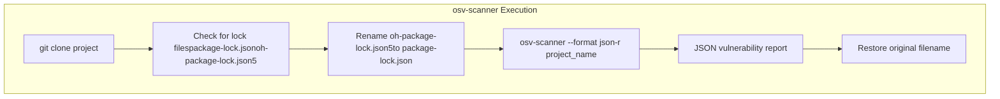
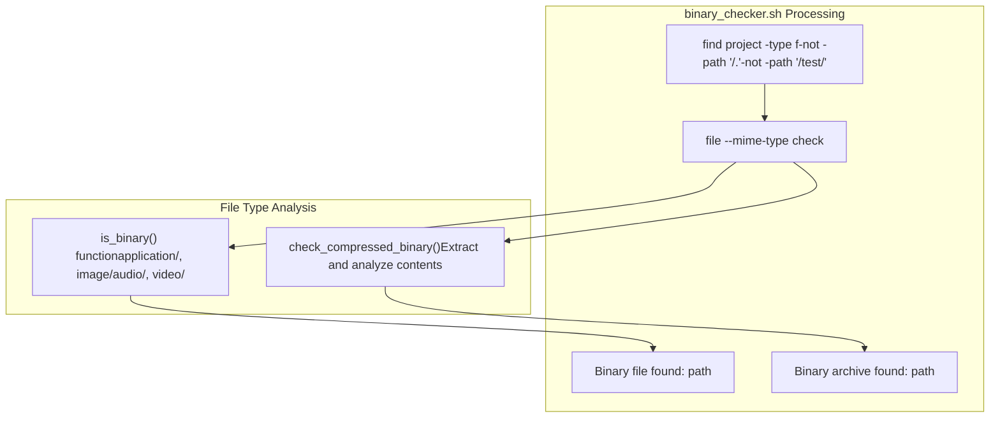
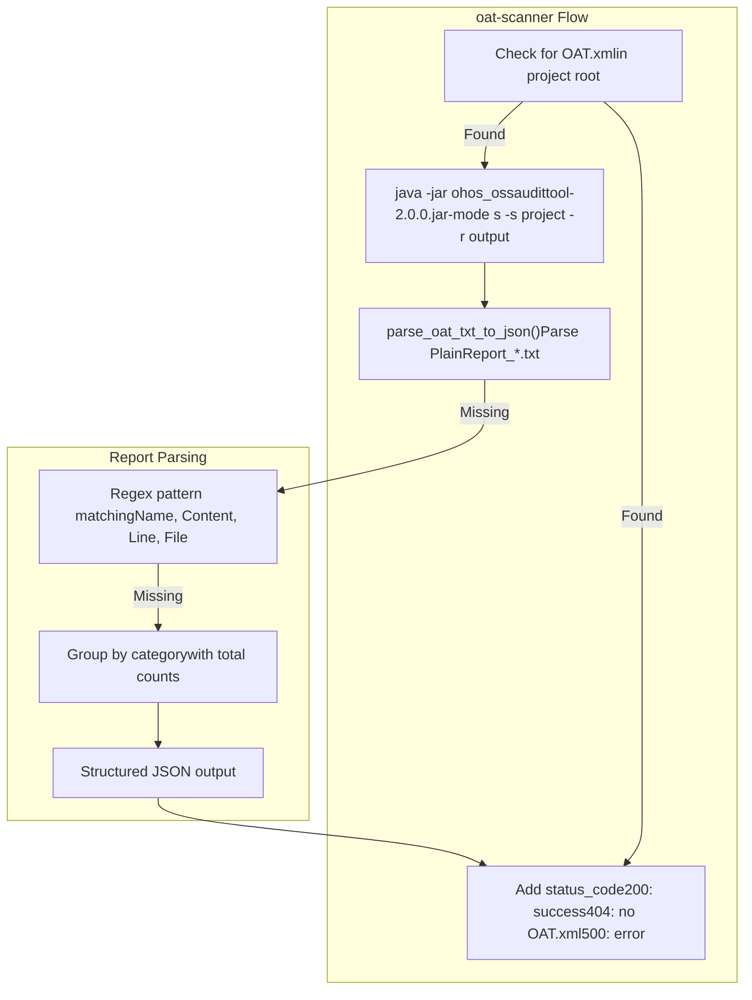
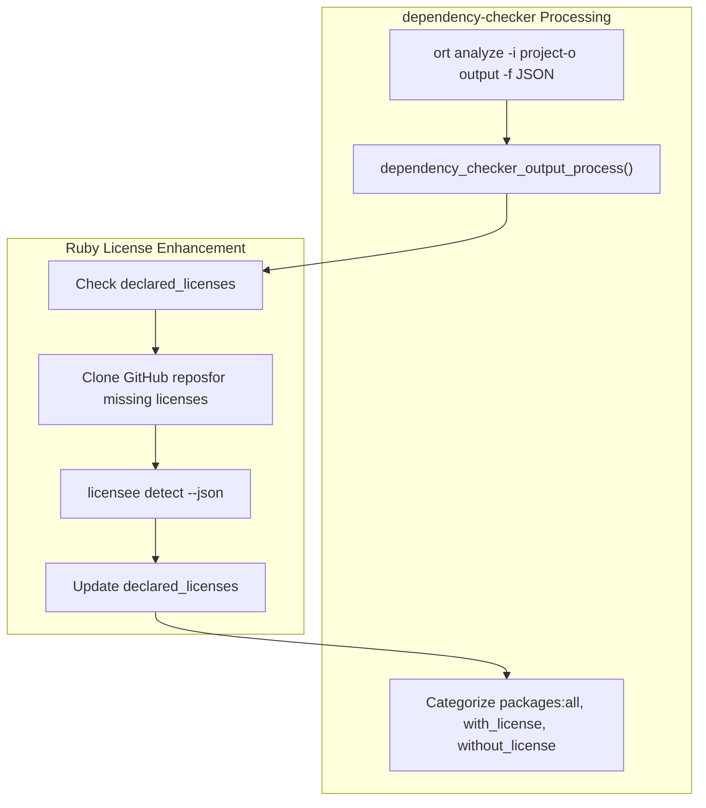
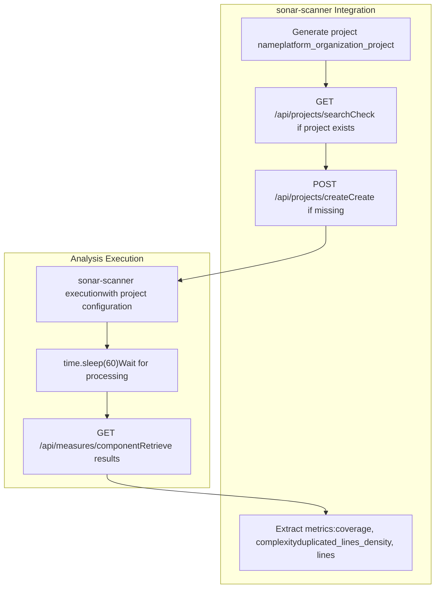
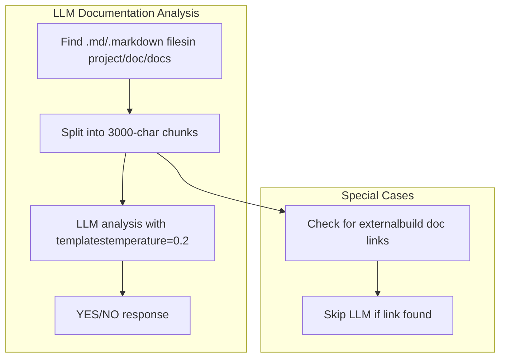
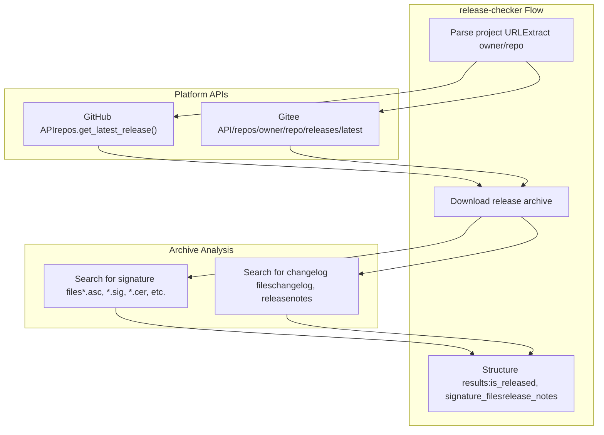
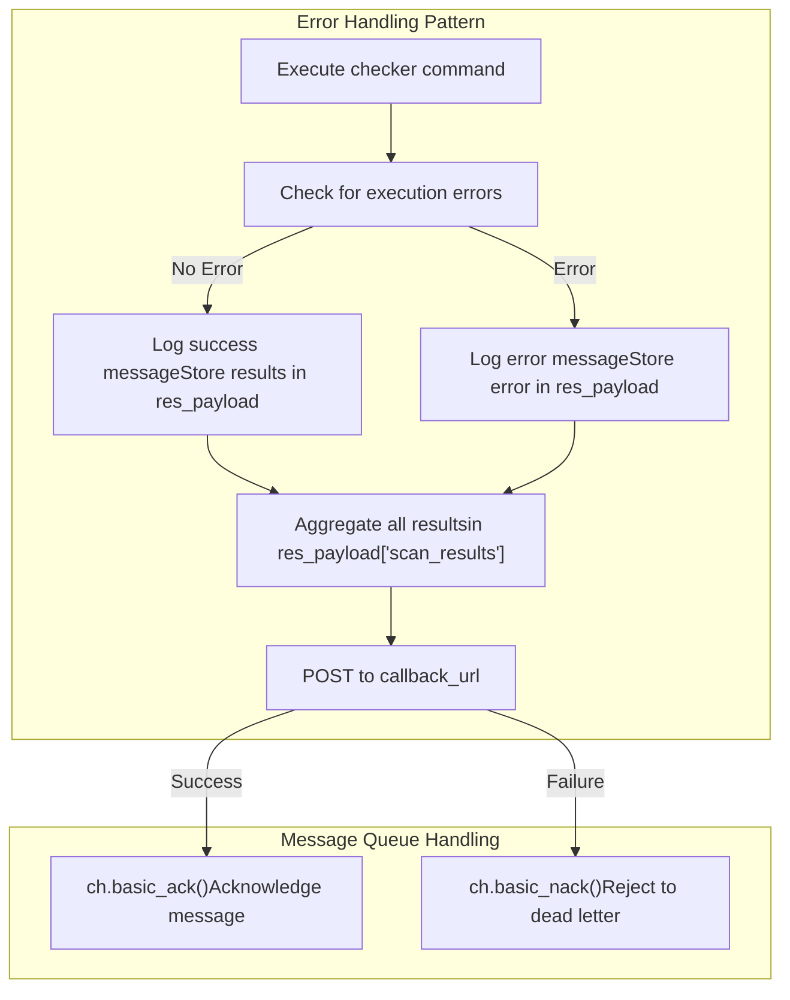

# Security and Compliance Checkers

> **Relevant source files**
> * [README.md](https://github.com/Laniakea2012/openchecker/blob/00a9732e/README.md)
> * [docs/architecture.png](https://github.com/Laniakea2012/openchecker/blob/00a9732e/docs/architecture.png)
> * [openchecker/agent.py](https://github.com/Laniakea2012/openchecker/blob/00a9732e/openchecker/agent.py)
> * [scripts/binary_checker.sh](https://github.com/Laniakea2012/openchecker/blob/00a9732e/scripts/binary_checker.sh)

This document covers the security and compliance checking tools integrated into the OpenChecker agent system. These checkers analyze source code repositories for vulnerabilities, license compliance issues, binary files, documentation quality, and other security/compliance concerns.

For information about the container environment and tool installation, see [Container Environment and Tool Installation](/Laniakea2012/openchecker/4.1-container-environment-and-tool-installation). For details about the agent system architecture, see [Agent System](/Laniakea2012/openchecker/2.1-agent-system).

## Overview

The security and compliance checkers are implemented as individual commands processed by the agent worker in the `callback_func` function. Each checker performs a specific type of analysis and returns structured results that are aggregated into a final scan report.

### Checker Integration Architecture

```mermaid
flowchart TD

ReleaseChecker["release-checkerGitHub/Gitee API"]
MessageQueue["RabbitMQ Messagecommand_list"]
ProjectClone["Git Cloneshell_exec()"]
LockFileGen["Lock File Generationnpm install, ohpm install"]
OSVScanner["osv-scannerVulnerability Detection"]
ScanCode["scancodeLicense Analysis"]
BinaryChecker["binary-checkerBinary File Detection"]
SonarScanner["sonar-scannerStatic Analysis"]
DependencyChecker["dependency-checkerORT Analysis"]
ReadmeChecker["readme-checkerREADME Detection"]
MaintainersChecker["maintainers-checkerMaintainer Files"]
ReadmeOpenSource["readme-opensource-checkerREADME.OpenSource Validation"]
BuildDocChecker["build-doc-checkerLLM Analysis"]
APIDocChecker["api-doc-checkerLLM Analysis"]
LanguagesDetector["languages-detectorgithub-linguist"]
URLChecker["url-checkerURL Validation"]
OATScanner["oat-scannerOpenHarmony Audit"]
ResultAggregation["res_payload aggregation"]
CallbackURL["POST to callback_url"]

    LockFileGen --> OSVScanner
    LockFileGen --> ScanCode
    LockFileGen --> BinaryChecker
    LockFileGen --> SonarScanner
    LockFileGen --> DependencyChecker
    LockFileGen --> ReadmeChecker
    LockFileGen --> MaintainersChecker
    LockFileGen --> ReadmeOpenSource
    LockFileGen --> BuildDocChecker
    LockFileGen --> APIDocChecker
    LockFileGen --> LanguagesDetector
    LockFileGen --> ReleaseChecker
    LockFileGen --> URLChecker
    LockFileGen --> OATScanner
    OSVScanner --> ResultAggregation
    ScanCode --> ResultAggregation
    BinaryChecker --> ResultAggregation
    SonarScanner --> ResultAggregation
    DependencyChecker --> ResultAggregation
    ReadmeChecker --> ResultAggregation
    MaintainersChecker --> ResultAggregation
    ReadmeOpenSource --> ResultAggregation
    BuildDocChecker --> ResultAggregation
    APIDocChecker --> ResultAggregation
    LanguagesDetector --> ResultAggregation
    ReleaseChecker --> ResultAggregation
    URLChecker --> ResultAggregation
    OATScanner --> ResultAggregation
subgraph callback_func_Processing_Flow ["callback_func Processing Flow"]
    MessageQueue
    ProjectClone
    LockFileGen
    ResultAggregation
    CallbackURL
    MessageQueue --> ProjectClone
    ProjectClone --> LockFileGen
    ResultAggregation --> CallbackURL
end

subgraph Release_Validation ["Release Validation"]
    ReleaseChecker
    URLChecker
end

subgraph Documentation ["Documentation"]
    ReadmeChecker
    MaintainersChecker
    BuildDocChecker
    APIDocChecker
end

subgraph Code_Quality ["Code Quality"]
    SonarScanner
    LanguagesDetector
end

subgraph License__Compliance ["License & Compliance"]
    ScanCode
    DependencyChecker
    ReadmeOpenSource
end

subgraph Security_Checkers ["Security Checkers"]
    OSVScanner
    BinaryChecker
    OATScanner
end
```



Sources: [openchecker/agent.py L272-L796](https://github.com/Laniakea2012/openchecker/blob/00a9732e/openchecker/agent.py#L272-L796)

## Security Checkers

### OSV-Scanner - Vulnerability Detection

The `osv-scanner` command performs vulnerability scanning using Google's OSV database. It analyzes lock files and source code to detect known security vulnerabilities.

**Implementation Details:**

* Generates lock files if missing (npm, ohpm)
* Handles OpenHarmony package files by renaming `oh-package-lock.json5` to `package-lock.json`
* Outputs results in JSON format to stdout
* Scans recursively through the project directory



**Output Structure:**

* Structured JSON containing vulnerability details
* Stored in `res_payload["scan_results"]["osv-scanner"]`

Sources: [openchecker/agent.py L347-L380](https://github.com/Laniakea2012/openchecker/blob/00a9732e/openchecker/agent.py#L347-L380)

### Binary-Checker - Binary File Detection

The `binary-checker` command identifies binary files and archives within the project, which is important for license compliance and security analysis.

**Implementation Details:**

* Uses external shell script `binary_checker.sh`
* Detects binary files and binary archives separately
* Excludes test directories and .git folders
* Supports compressed file analysis (zip, tar, gzip, bzip2)



**Output Structure:**

```
{
  "binary_file_list": ["path/to/binary1", "path/to/binary2"],
  "binary_archive_list": ["path/to/archive1.zip", "path/to/archive2.tar"]
}
```

Sources: [openchecker/agent.py L405-L426](https://github.com/Laniakea2012/openchecker/blob/00a9732e/openchecker/agent.py#L405-L426)

 [scripts/binary_checker.sh L1-L93](https://github.com/Laniakea2012/openchecker/blob/00a9732e/scripts/binary_checker.sh#L1-L93)

### OAT-Scanner - OpenHarmony Audit Tool

The `oat-scanner` command performs OpenHarmony-specific compliance auditing using the OAT (OpenHarmony Audit Tool).

**Implementation Details:**

* Requires `OAT.xml` configuration file in project root
* Uses Java-based audit tool `ohos_ossaudittool-2.0.0.jar`
* Parses text output into structured JSON format
* Handles missing OAT.xml files gracefully



**Output Structure:**

* Categories with total counts and detailed entries
* Status codes for different scenarios
* Detailed information per violation including file paths and line numbers

Sources: [openchecker/agent.py L686-L765](https://github.com/Laniakea2012/openchecker/blob/00a9732e/openchecker/agent.py#L686-L765)

## License and Compliance Checkers

### ScanCode - License Analysis

The `scancode` command performs comprehensive license detection and code analysis using the ScanCode toolkit.

**Implementation Details:**

* Scans for licenses and copyrights with 90% confidence threshold
* Uses 4 parallel processes for performance
* Outputs detailed JSON report with file-level analysis

**Command Execution:**

```
scancode -lc --json-pp scan_result.json project_name --license-score 90 -n 4
```

**Output Structure:**

* Complete ScanCode JSON report with license and copyright information
* Stored in `res_payload["scan_results"]["scancode"]`

Sources: [openchecker/agent.py L382-L403](https://github.com/Laniakea2012/openchecker/blob/00a9732e/openchecker/agent.py#L382-L403)

### Dependency-Checker - ORT Analysis

The `dependency-checker` command uses the OSS Review Toolkit (ORT) to analyze project dependencies and their licenses.

**Implementation Details:**

* Uses ORT analyzer with dynamic version support
* Enhances results with Ruby licensee tool for missing licenses
* Processes GitHub repositories for license detection
* Categorizes packages by license detection status



**Helper Functions:**

* `ruby_licenses()`: Enhances missing license information using GitHub repository analysis
* `get_licenses_name()`: Extracts license names from licensee output
* `dependency_checker_output_process()`: Processes and categorizes ORT results

Sources: [openchecker/agent.py L535-L553](https://github.com/Laniakea2012/openchecker/blob/00a9732e/openchecker/agent.py#L535-L553)

 [openchecker/agent.py L21-L89](https://github.com/Laniakea2012/openchecker/blob/00a9732e/openchecker/agent.py#L21-L89)

### README.OpenSource Checker

The `readme-opensource-checker` validates the presence and format of `README.OpenSource` files required for OpenHarmony compliance.

**Implementation Details:**

* Validates JSON structure of README.OpenSource files
* Checks for required fields: Name, License, License File, Version Number, Owner, Upstream URL, Description
* Handles both single entries and arrays of entries

**Validation Logic:**

```
required_keys = [
    "Name", "License", "License File",
    "Version Number", "Owner", "Upstream URL", "Description"
]
```

Sources: [openchecker/agent.py L113-L146](https://github.com/Laniakea2012/openchecker/blob/00a9732e/openchecker/agent.py#L113-L146)

 [openchecker/agent.py L593-L600](https://github.com/Laniakea2012/openchecker/blob/00a9732e/openchecker/agent.py#L593-L600)

## Code Quality Checkers

### SonarScanner - Static Code Analysis

The `sonar-scanner` command integrates with SonarQube for comprehensive static code analysis including code quality, security hotspots, and technical debt.

**Implementation Details:**

* Creates SonarQube projects dynamically via REST API
* Excludes Java files from analysis (`-Dsonar.exclusions=**/*.java`)
* Retrieves analysis results including coverage, complexity, and duplicated lines
* Implements 60-second wait for SonarQube processing



Sources: [openchecker/agent.py L454-L533](https://github.com/Laniakea2012/openchecker/blob/00a9732e/openchecker/agent.py#L454-L533)

### Languages-Detector

The `languages-detector` command identifies programming languages used in the project using GitHub's linguist tool.

**Implementation Details:**

* Uses `github-linguist` with breakdown and JSON output
* Provides detailed language statistics and percentages

**Command Execution:**

```
github-linguist project_name --breakdown --json
```

Sources: [openchecker/agent.py L620-L637](https://github.com/Laniakea2012/openchecker/blob/00a9732e/openchecker/agent.py#L620-L637)

## Documentation Checkers

### README and Maintainers Detection

Both `readme-checker` and `maintainers-checker` use file system searches to identify important project documentation.

**README Checker:**

* Searches for README files in project root, .github, and docs directories
* Supports multiple formats (.md, .markdown)

**Maintainers Checker:**

* Searches for maintainer-related files: MAINTAINERS, COMMITTERS, OWNERS, CODEOWNERS
* Case-insensitive pattern matching

```
# README search pattern
find "project" -type f \( -name "README*" -o -name ".github/README*" -o -name "docs/README*" \) -print

# Maintainers search pattern  
find "project" -type f \( -iname "MAINTAINERS*" -o -iname "COMMITTERS*" -o -iname "OWNERS*" -o -iname "CODEOWNERS*" \) -print
```

Sources: [openchecker/agent.py L555-L572](https://github.com/Laniakea2012/openchecker/blob/00a9732e/openchecker/agent.py#L555-L572)

 [openchecker/agent.py L574-L591](https://github.com/Laniakea2012/openchecker/blob/00a9732e/openchecker/agent.py#L574-L591)

### LLM-Powered Documentation Analysis

Both `build-doc-checker` and `api-doc-checker` use LLM analysis to validate documentation quality.

**Implementation Details:**

* Searches for Markdown files in project, doc, and docs directories
* Chunks large documents (3000 character limit)
* Uses temperature 0.2 for consistent analysis
* Returns YES/NO responses for documentation completeness



**Template Examples:**

* Build documentation: Assesses software compilation and packaging processes
* API documentation: Evaluates comprehensive API usage introduction

Sources: [openchecker/agent.py L148-L221](https://github.com/Laniakea2012/openchecker/blob/00a9732e/openchecker/agent.py#L148-L221)

 [openchecker/agent.py L602-L618](https://github.com/Laniakea2012/openchecker/blob/00a9732e/openchecker/agent.py#L602-L618)

## Release Validation Checkers

### Release-Checker - GitHub/Gitee Integration

The `release-checker` analyzes project releases for signature files and release notes using platform APIs.

**Implementation Details:**

* Supports GitHub (GitHub API) and Gitee (Gitee API) platforms
* Downloads latest release archives for analysis
* Searches for signature files (.asc, .sig, .cer, .crt, .pem, .sha256, .sha512)
* Identifies changelog and release notes files



Sources: [openchecker/agent.py L223-L270](https://github.com/Laniakea2012/openchecker/blob/00a9732e/openchecker/agent.py#L223-L270)

 [openchecker/agent.py L428-L437](https://github.com/Laniakea2012/openchecker/blob/00a9732e/openchecker/agent.py#L428-L437)

### URL-Checker

The `url-checker` performs basic URL validation by attempting to access the project URL.

**Implementation Details:**

* Uses `urllib.request.urlopen()` to test URL accessibility
* Returns status (pass/fail) and error information

Sources: [openchecker/agent.py L439-L452](https://github.com/Laniakea2012/openchecker/blob/00a9732e/openchecker/agent.py#L439-L452)

## Development Tools

### Changed-Files-Since-Commit Detector

The `changed-files-since-commit-detector` analyzes Git history to identify file changes since a specific commit.

**Implementation Details:**

* Uses Git diff commands to categorize changes
* Supports multiple change types: Added (A), Copied (C), Deleted (D), Modified (M), Renamed (R)
* Changes working directory to repository path for Git operations
* Restores original working directory after analysis

**Git Commands Used:**

```
git diff --name-only --diff-filter=ACDMRTUXB commit_hash..HEAD  # All changes
git diff --name-only --diff-filter=A commit_hash..HEAD          # Added files
git diff --name-only --diff-filter=R commit_hash..HEAD          # Renamed files
git diff --name-only --diff-filter=D commit_hash..HEAD          # Deleted files
git diff --name-only --diff-filter=M commit_hash..HEAD          # Modified files
```

Sources: [openchecker/agent.py L639-L684](https://github.com/Laniakea2012/openchecker/blob/00a9732e/openchecker/agent.py#L639-L684)

## Error Handling and Result Processing

All checkers implement consistent error handling and result aggregation:



**Common Error Handling:**

* Execution errors stored with JSON-encoded error messages
* Network failures trigger message rejection to dead letter queue
* Successful results logged with project URL context
* All results aggregated in `res_payload["scan_results"]` dictionary

Sources: [openchecker/agent.py L784-L795](https://github.com/Laniakea2012/openchecker/blob/00a9732e/openchecker/agent.py#L784-L795)

## Checker Summary Table

| Checker | Purpose | External Tool | Output Format |
| --- | --- | --- | --- |
| osv-scanner | Vulnerability detection | OSV Scanner | JSON vulnerability report |
| scancode | License analysis | ScanCode | JSON license/copyright data |
| binary-checker | Binary file detection | Custom shell script | Categorized file lists |
| release-checker | Release validation | GitHub/Gitee APIs | Release metadata |
| sonar-scanner | Static code analysis | SonarQube | Code quality metrics |
| dependency-checker | Dependency analysis | ORT + Ruby licensee | Categorized package lists |
| oat-scanner | OpenHarmony audit | OAT Java tool | Structured violation report |
| readme-checker | README detection | File system search | File path list |
| maintainers-checker | Maintainer files | File system search | File path list |
| readme-opensource-checker | OpenSource compliance | JSON validation | Boolean validation result |
| build-doc-checker | Build documentation | LLM analysis | File path list |
| api-doc-checker | API documentation | LLM analysis | File path list |
| languages-detector | Language detection | GitHub linguist | Language statistics |
| url-checker | URL validation | urllib | Status/error information |
| changed-files-since-commit-detector | Git diff analysis | Git commands | Categorized change lists |

Sources: [openchecker/agent.py L346-L767](https://github.com/Laniakea2012/openchecker/blob/00a9732e/openchecker/agent.py#L346-L767)