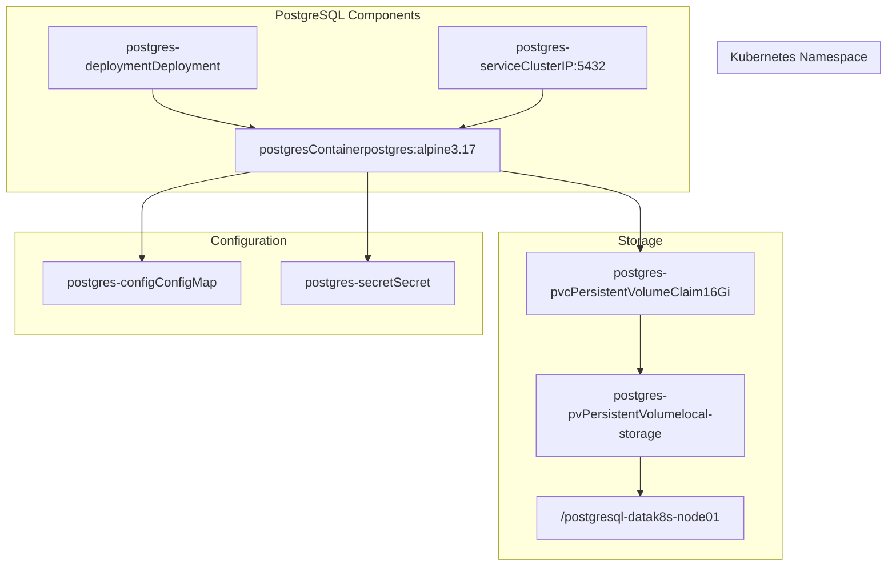
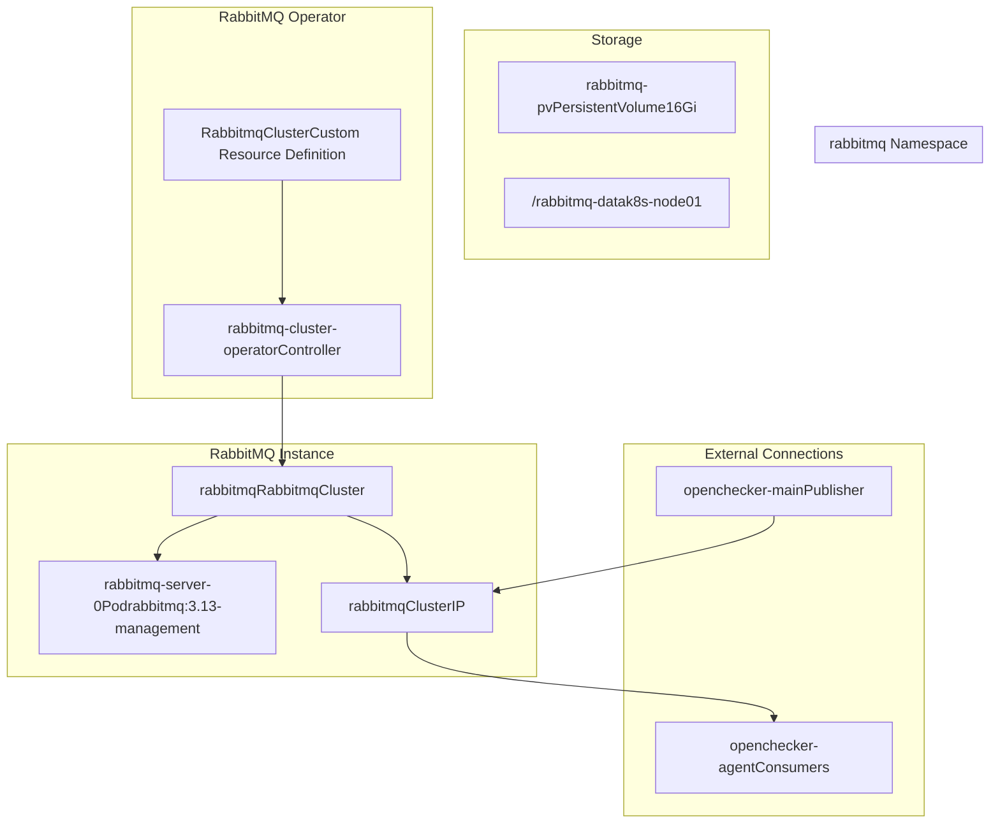
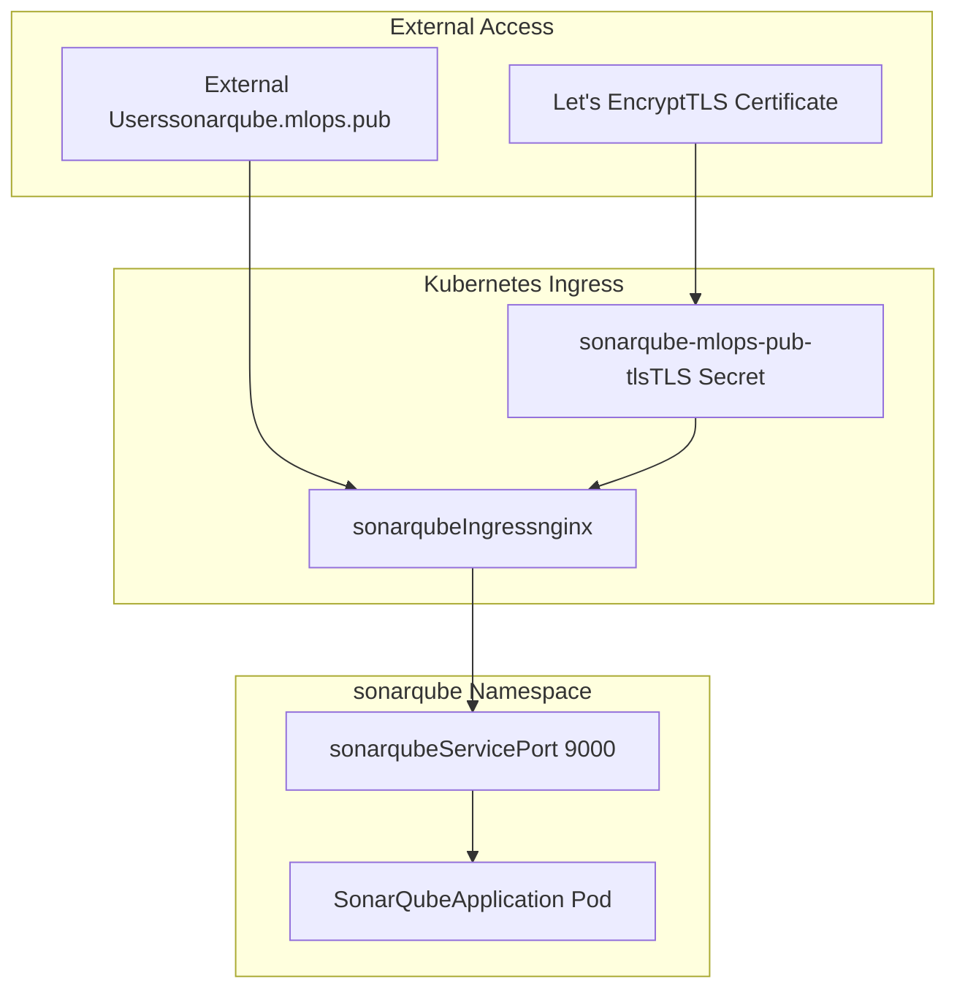
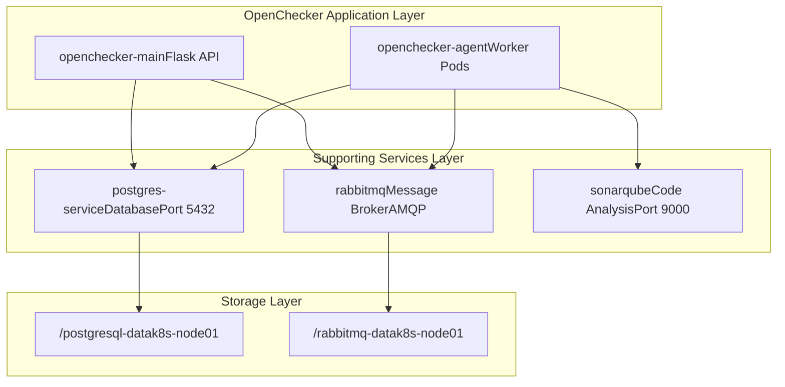

# Supporting Services

> **Relevant source files**
> * [kubernetes/postgresql/configmap.yaml](https://github.com/Laniakea2012/openchecker/blob/00a9732e/kubernetes/postgresql/configmap.yaml)
> * [kubernetes/postgresql/deployment.yaml](https://github.com/Laniakea2012/openchecker/blob/00a9732e/kubernetes/postgresql/deployment.yaml)
> * [kubernetes/postgresql/service.yaml](https://github.com/Laniakea2012/openchecker/blob/00a9732e/kubernetes/postgresql/service.yaml)
> * [kubernetes/postgresql/volumes.yaml](https://github.com/Laniakea2012/openchecker/blob/00a9732e/kubernetes/postgresql/volumes.yaml)
> * [kubernetes/rabbitmq/cluster-operator.yml](https://github.com/Laniakea2012/openchecker/blob/00a9732e/kubernetes/rabbitmq/cluster-operator.yml)
> * [kubernetes/rabbitmq/deployment.yaml](https://github.com/Laniakea2012/openchecker/blob/00a9732e/kubernetes/rabbitmq/deployment.yaml)
> * [kubernetes/sonarqube/ingress.yaml](https://github.com/Laniakea2012/openchecker/blob/00a9732e/kubernetes/sonarqube/ingress.yaml)

This document covers the deployment and configuration of the critical infrastructure services that support the OpenChecker system: PostgreSQL database, RabbitMQ message broker, and SonarQube code analysis platform. These services provide data persistence, message queuing, and code quality analysis capabilities respectively.

For information about the main OpenChecker application and agent deployments, see [Kubernetes Deployments](/Laniakea2012/openchecker/6.1-kubernetes-deployments). For storage and configuration management details, see [Storage and Configuration Management](/Laniakea2012/openchecker/6.3-storage-and-configuration-management).

## PostgreSQL Database Service

PostgreSQL serves as the primary data store for the OpenChecker system, providing persistent storage for application data, user information, and analysis results.

### Database Deployment Architecture

**Sources:** [kubernetes/postgresql/deployment.yaml L1-L46](https://github.com/Laniakea2012/openchecker/blob/00a9732e/kubernetes/postgresql/deployment.yaml#L1-L46)

 [kubernetes/postgresql/service.yaml L1-L14](https://github.com/Laniakea2012/openchecker/blob/00a9732e/kubernetes/postgresql/service.yaml#L1-L14)

 [kubernetes/postgresql/volumes.yaml L1-L46](https://github.com/Laniakea2012/openchecker/blob/00a9732e/kubernetes/postgresql/volumes.yaml#L1-L46)

### PostgreSQL Configuration

The PostgreSQL service is configured through Kubernetes ConfigMaps and Secrets for secure credential management:

| Configuration Item | Value | Source |
| --- | --- | --- |
| Database Name | `postgresdb` | ConfigMap |
| Username | `admin` | Secret |
| Password | `admin` | Secret |
| Port | `5432` | Service |
| Storage | `16Gi` | PVC |
| Storage Class | `local-storage` | PV |

The deployment uses the `postgres:alpine3.17` image and mounts persistent storage at `/var/lib/postgresql/data` to ensure data persistence across pod restarts.

**Sources:** [kubernetes/postgresql/configmap.yaml L1-L18](https://github.com/Laniakea2012/openchecker/blob/00a9732e/kubernetes/postgresql/configmap.yaml#L1-L18)

 [kubernetes/postgresql/deployment.yaml L18-L31](https://github.com/Laniakea2012/openchecker/blob/00a9732e/kubernetes/postgresql/deployment.yaml#L18-L31)

## RabbitMQ Message Broker Service

RabbitMQ provides the asynchronous message queuing infrastructure that enables the distributed processing architecture of OpenChecker, allowing the main API to decouple from the agent workers.

### RabbitMQ Cluster Architecture

**Sources:** [kubernetes/rabbitmq/deployment.yaml L1-L53](https://github.com/Laniakea2012/openchecker/blob/00a9732e/kubernetes/rabbitmq/deployment.yaml#L1-L53)

 [kubernetes/rabbitmq/cluster-operator.yml L1-L50](https://github.com/Laniakea2012/openchecker/blob/00a9732e/kubernetes/rabbitmq/cluster-operator.yml#L1-L50)

### RabbitMQ Cluster Configuration

The RabbitMQ deployment uses the RabbitMQ Cluster Operator to manage the message broker instance:

| Configuration Item | Value | Description |
| --- | --- | --- |
| Image | `rabbitmq:3.13-management` | Includes management UI |
| Replicas | `1` | Single instance deployment |
| CPU Request/Limit | `1000m` | 1 CPU core allocation |
| Memory Request/Limit | `4Gi` | 4GB RAM allocation |
| Storage | `16Gi` | Persistent message storage |
| Service Type | `ClusterIP` | Internal cluster access |

The operator manages the lifecycle of the RabbitMQ cluster, including configuration, scaling, and updates through the `RabbitmqCluster` custom resource.

**Sources:** [kubernetes/rabbitmq/deployment.yaml L29-L53](https://github.com/Laniakea2012/openchecker/blob/00a9732e/kubernetes/rabbitmq/deployment.yaml#L29-L53)

## SonarQube Code Analysis Platform

SonarQube provides static code analysis capabilities for the OpenChecker system, offering detailed code quality metrics, security vulnerability detection, and technical debt analysis.

### SonarQube Service Exposure

**Sources:** [kubernetes/sonarqube/ingress.yaml L1-L25](https://github.com/Laniakea2012/openchecker/blob/00a9732e/kubernetes/sonarqube/ingress.yaml#L1-L25)

### SonarQube Integration Configuration

The SonarQube service is exposed through an NGINX ingress controller with TLS termination:

| Configuration Item | Value | Purpose |
| --- | --- | --- |
| Hostname | `sonarqube.mlops.pub` | External domain access |
| Port | `9000` | SonarQube default port |
| TLS Provider | `letsencrypt-dns01` | Automated certificate management |
| Ingress Class | `nginx` | NGINX ingress controller |
| SSL Redirect | `true` | Force HTTPS connections |

The ingress configuration enables secure external access to the SonarQube web interface and API endpoints used by the OpenChecker analysis tools.

**Sources:** [kubernetes/sonarqube/ingress.yaml L6-L24](https://github.com/Laniakea2012/openchecker/blob/00a9732e/kubernetes/sonarqube/ingress.yaml#L6-L24)

## Service Dependencies and Integration

### Inter-Service Communication Flow

**Sources:** [kubernetes/postgresql/service.yaml L9-L12](https://github.com/Laniakea2012/openchecker/blob/00a9732e/kubernetes/postgresql/service.yaml#L9-L12)

 [kubernetes/rabbitmq/deployment.yaml L40-L41](https://github.com/Laniakea2012/openchecker/blob/00a9732e/kubernetes/rabbitmq/deployment.yaml#L40-L41)

 [kubernetes/sonarqube/ingress.yaml L22-L23](https://github.com/Laniakea2012/openchecker/blob/00a9732e/kubernetes/sonarqube/ingress.yaml#L22-L23)

### Service Dependencies

The supporting services have the following dependency relationships:

* **PostgreSQL**: No external dependencies, provides foundation data storage
* **RabbitMQ**: Requires persistent storage, provides messaging infrastructure
* **SonarQube**: Depends on external ingress for web access, integrates with agent analysis workflows

Each service uses local persistent storage on `k8s-node01` with node affinity constraints to ensure data locality and performance.

**Sources:** [kubernetes/postgresql/volumes.yaml L26-L33](https://github.com/Laniakea2012/openchecker/blob/00a9732e/kubernetes/postgresql/volumes.yaml#L26-L33)

 [kubernetes/rabbitmq/deployment.yaml L19-L26](https://github.com/Laniakea2012/openchecker/blob/00a9732e/kubernetes/rabbitmq/deployment.yaml#L19-L26)