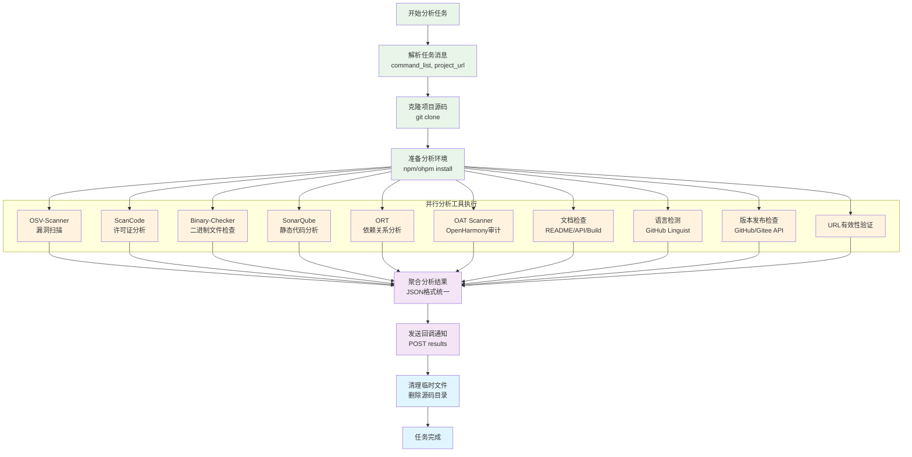
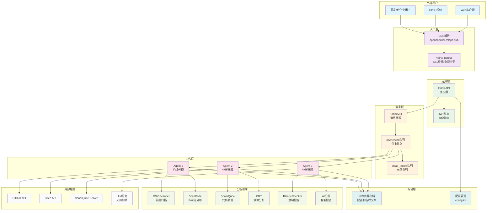
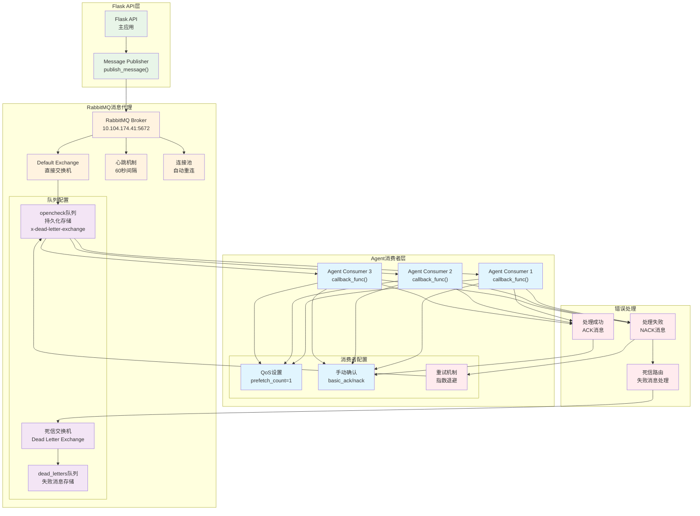
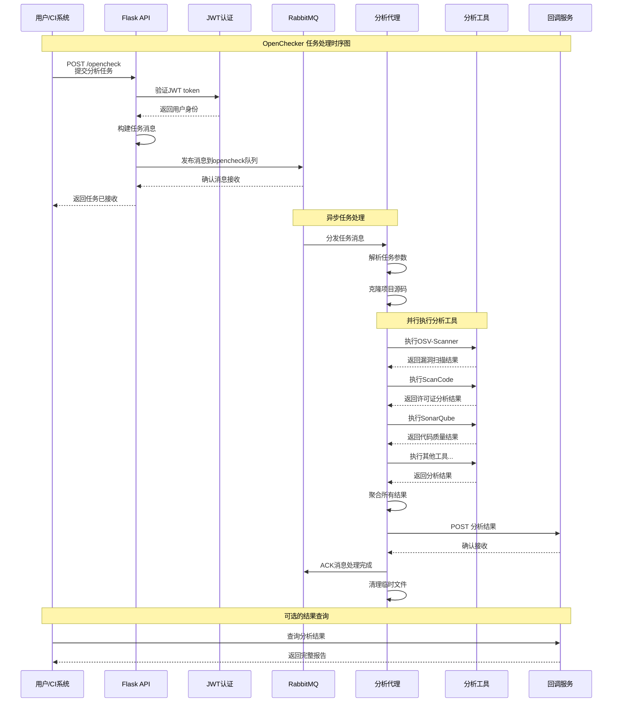
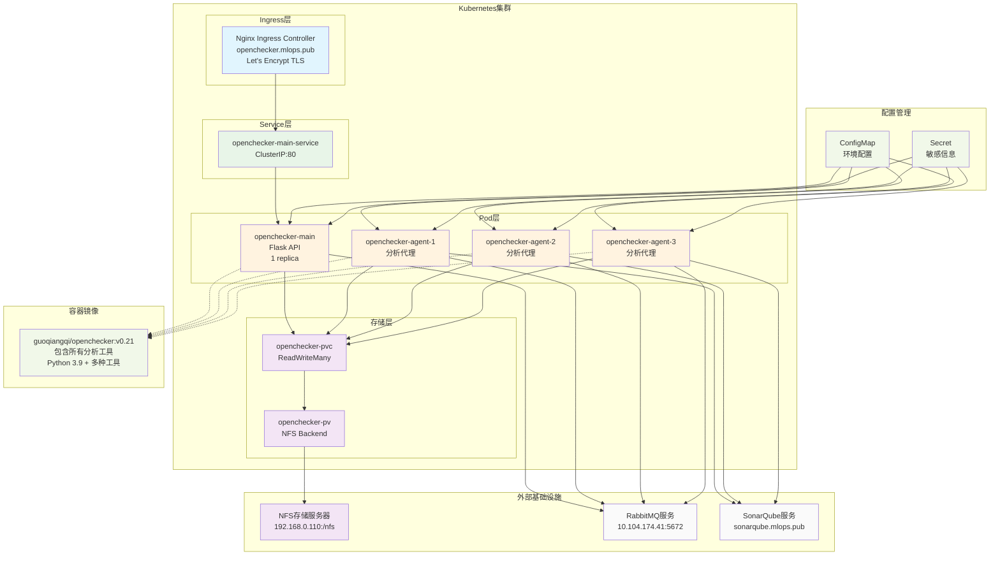

# OpenChecker 软件架构设计文档

## 1. 文档说明

### 1.1 文档版本信息
- **文档标题**: OpenChecker 软件架构设计文档
- **版本号**: v1.0
- **创建日期**: 2025年2月

### 1.2 文档目的
本文档旨在全面描述 OpenChecker 软件分析与合规检查平台的整体架构设计，包括系统的功能架构、技术架构、部署架构以及关键的质量属性设计。文档面向技术团队、架构师、运维人员和项目干系人。

### 1.3 适用范围
- 系统架构设计与评估
- 技术方案选型与决策
- 系统实施与部署指导
- 质量管控与运维保障

## 2. 项目概述

### 2.1 业务背景
随着开源软件在企业级应用中的广泛使用，软件供应链安全、许可证合规性以及代码质量管控成为企业面临的重要挑战。传统的手工审查方式效率低下，且难以应对大规模代码库的分析需求。

### 2.2 系统定位
OpenChecker 是一个全面的软件分析与合规检查平台，提供自动化的安全扫描、许可证分析、代码质量评估等服务。系统采用分布式消息驱动架构，支持多种分析工具的并发执行，为软件项目提供详细的合规性报告。

### 2.3 核心价值
- **自动化分析**: 支持多达15+种不同类型的代码分析工具;
- **高效集成**： 外部工具集成成本低，支持源码、二进制、RestAPI等多种形式集成;
- **合规性保障**: 全面的许可证合规性检查和安全漏洞检测;
- **可扩展性**: 基于Kubernetes的分布式架构，支持水平扩展;
- **集成能力**: 提供RESTful API，支持CI/CD集成;
- **多平台支持**: 支持GitHub、Gitee、GitCode等主流代码托管平台;

## 3. 功能架构设计

### 3.1 功能架构概览
系统采用分层架构模式，从上到下分为用户接口层、业务服务层、分析引擎层和数据存储层。

### 3.2 核心功能模块

#### 3.2.1 API网关与认证模块
- **JWT认证**: 基于RFC 7519标准的无状态认证机制
- **访问控制**: 细粒度的权限管控
- **请求路由**: 智能的负载均衡和请求分发

#### 3.2.2 任务调度与管理模块
- **异步任务处理**: 基于RabbitMQ的可靠消息传递
- **任务生命周期管理**: 完整的任务创建、执行、监控、回调流程
- **失败重试机制**: 指数退避算法和死信队列处理

#### 3.2.3 分析引擎模块
系统集成多种业界标准的分析工具，提供全面的软件分析能力：

| 分析类别 | 工具名称 | 主要功能 | 输出格式 | 集成方式 |
|---------|---------|----------|----------|----------|
| **安全漏洞检测** | OSV-Scanner | Google OSV数据库漏洞扫描 | JSON | 命令行工具 |
| | Binary-Checker | 二进制文件和归档文件识别 | 分类列表 | 自定义脚本 |
| **许可证合规** | ScanCode | 许可证扫描和版权信息检测 | JSON/SPDX | 命令行工具 |
| | Ruby Licensee | Ruby生态许可证分析 | JSON | Ruby Gem |
| | OAT Scanner | OpenHarmony生态审计 | XML/JSON | Java工具 |
| **代码质量** | SonarQube | 静态代码分析和质量度量 | Web API | REST API |
| | GitHub Linguist | 编程语言识别和统计 | JSON | Ruby Gem |
| **依赖分析** | ORT | 依赖关系和许可证合规性 | YAML/JSON | 命令行工具 |
| | Scorecard | OSSF安全评分 | JSON | 命令行工具 |
| **文档检查** | README Checker | README文件存在性检查 | 布尔值 | 文件系统 |
| | API Doc Checker | API文档质量评估 | JSON | LLM集成 |
| | Build Doc Checker | 构建文档完整性检查 | JSON | LLM集成 |
| **项目元数据** | Release Checker | 版本发布验证 | JSON | API集成 |
| | URL Checker | 项目URL有效性验证 | 状态码 | HTTP请求 |
| | Maintainers Checker | 维护者文件检查 | 文件路径 | 文件系统 |

#### 3.2.4 分析工具执行流程图



#### 3.2.5 智能分析模块
- **项目分类系统**: 基于机器学习的项目自动分类
- **聚类分析**: 项目相似度分析和推荐
- **智能文档检查**: 集成LLM进行文档质量评估

#### 3.2.6 回调与通知模块
- **回调机制**: HTTP POST回调，支持重试和错误处理
- **结果聚合**: 多工具分析结果的统一格式化输出
- **状态跟踪**: 实时任务状态更新和进度监控

## 4. 技术架构设计

### 4.1 架构风格
系统采用**微服务架构**配合**事件驱动架构**，实现高内聚、低耦合的设计原则。

### 4.2 核心技术栈

#### 4.2.1 后端技术栈
- **编程语言**: Python 3.9
- **Web框架**: Flask + Flask-RESTful
- **消息队列**: RabbitMQ with Pika client
- **认证授权**: Flask-JWT-Extended
- **HTTP客户端**: Requests with exponential backoff
- **容器化**: Docker + Alpine Linux

#### 4.2.2 外部服务集成
- **代码托管平台**: GitHub API, Gitee API, GitCode API
- **代码质量平台**: SonarQube Server
- **AI服务**: 火山引擎LLM API
- **存储服务**: NFS共享存储

### 4.3 系统架构图

系统采用分层的微服务架构，各层之间通过标准接口进行交互：



上图展示了OpenChecker的整体系统架构，从用户层到存储层的完整数据流和组件关系。系统通过Nginx Ingress提供外部访问，Flask API处理用户请求，RabbitMQ实现任务的异步分发，多个Agent并行执行分析任务，最终通过回调机制返回结果。

### 4.4 核心架构组件

#### 4.4.1 Flask API应用 (openchecker-main)
```python
# 核心组件结构
app = Flask(__name__)
├── 认证模块 (JWT)
├── API端点 (/test, /opencheck)
├── 消息发布器 (RabbitMQ Publisher)
├── 配置管理 (config.ini)
└── 日志系统 (结构化日志)
```

#### 4.4.2 分析代理 (openchecker-agent)
```python
# 代理工作流程
callback_func()
├── 消息解析与参数提取
├── 源码克隆与预处理
├── 锁文件生成 (npm/ohpm install)
├── 分析工具执行循环
├── 结果聚合与格式化
├── 回调通知发送
└── 消息确认与清理
```

#### 4.4.3 消息队列系统
- **连接管理**: 支持心跳检测和自动重连
- **队列配置**: 持久化队列，支持死信路由
- **消费者模式**: 单消费者模式，支持手动确认
- **错误处理**: 失败消息自动路由到死信队列

#### 4.4.4 消息队列架构图



### 4.5 数据流设计

#### 4.5.1 请求处理流程
1. **请求接收**: Flask API接收HTTP POST请求
2. **身份验证**: JWT token验证和用户身份确认
3. **请求验证**: 请求体格式和必填字段验证
4. **消息构建**: 构建标准化的分析任务消息
5. **异步发布**: 将任务消息发布到RabbitMQ队列
6. **响应返回**: 返回任务接收确认响应

#### 4.5.2 任务执行流程
1. **消息消费**: Agent从队列中消费分析任务
2. **环境准备**: 创建临时工作目录，克隆源码仓库
3. **依赖安装**: 执行npm install、ohpm install等命令
4. **工具执行**: 按序执行配置的分析工具
5. **结果收集**: 聚合各工具的分析结果
6. **回调通知**: 向指定URL发送分析结果
7. **资源清理**: 清理临时文件和工作目录

#### 4.5.3 时序流程图



上述时序图详细展示了从用户提交分析请求到获得结果的完整流程，突出了系统的异步处理特性和组件间的交互关系。

## 5. 部署架构设计

### 5.1 容器化设计

#### 5.1.1 基础镜像
```dockerfile
FROM python:3.9-bullseye
# 多阶段构建，集成多种分析工具
├── OSV-Scanner (Alpine)
├── OAT工具 (Maven构建)
├── ScanCode Toolkit
├── SonarScanner CLI
├── ORT (开源审查工具包)
├── Ruby环境 + Licensee
├── Node.js + 包管理器
└── Java + 构建工具
```

#### 5.1.2 容器配置
- **基础镜像**: python:3.9-bullseye
- **工作目录**: /app
- **端口映射**: 80 (HTTP)
- **存储挂载**: /nfs (NFS共享存储)
- **环境变量**: 支持日志级别、格式配置

### 5.2 Kubernetes部署架构

#### 5.2.1 命名空间设计
```yaml
# 核心命名空间
openchecker:
  ├── openchecker-main (主应用)
  ├── openchecker-agent (工作代理)
  ├── openchecker-pvc (持久存储)
  └── openchecker-ingress (入口控制)
```

#### 5.2.2 服务部署拓扑
- **主应用**: 单实例部署，提供API服务
- **工作代理**: 3实例默认配置，支持水平扩展
- **负载均衡**: Nginx Ingress Controller
- **域名解析**: openchecker.mlops.pub
- **SSL终端**: Let's Encrypt自动证书

#### 5.2.3 Kubernetes部署架构图



上图展示了OpenChecker在Kubernetes集群中的完整部署架构，包括网络层次、服务发现、存储挂载和外部服务集成等关键部署要素。

### 5.3 存储架构

#### 5.3.1 存储类型
- **共享存储**: NFS (192.168.0.110:/nfs)
- **访问模式**: ReadWriteMany
- **存储用途**: 配置文件、临时数据、分析结果缓存

#### 5.3.2 数据持久化
- **配置管理**: config.ini集中配置
- **日志存储**: 结构化日志，支持ELK集成
- **临时数据**: 分析过程中的中间文件

### 5.4 网络架构

#### 5.4.1 网络层次
```
互联网 → DNS解析 → Ingress Controller → Service → Pod
```

#### 5.4.2 端口配置
- **外部访问**: 443 (HTTPS)
- **内部服务**: 80 (HTTP)
- **RabbitMQ**: 5672 (AMQP)
- **SonarQube**: 9000 (HTTP)

## 6. 关键质量属性设计

### 6.1 高性能设计

#### 6.1.1 并发处理能力
- **异步架构**: 请求接收与任务执行完全解耦
- **多代理并行**: 支持多个Agent同时处理不同任务
- **工具并行化**: 不同类型的分析工具可在不同Agent上并行执行
- **资源优化**: 基于容器的资源隔离和限制

#### 6.1.2 性能优化策略
- **连接池**: RabbitMQ连接池和HTTP连接重用
- **缓存机制**: 分析结果缓存，避免重复计算
- **批量处理**: 支持批量任务提交和处理
- **资源调度**: Kubernetes资源配额和QoS保证

### 6.2 高可用性设计

#### 6.2.1 故障容错
- **消息持久化**: RabbitMQ消息持久化存储
- **死信处理**: 失败任务自动路由到死信队列
- **健康检查**: Kubernetes liveness和readiness探针
- **自动恢复**: Pod异常自动重启和替换

#### 6.2.2 服务冗余
- **多实例部署**: Agent服务多副本部署
- **负载均衡**: Nginx Ingress智能负载分发
- **存储冗余**: NFS存储的高可用配置
- **跨区域部署**: 支持多可用区部署

### 6.3 可扩展性设计

#### 6.3.1 水平扩展
- **Agent扩展**: 通过调整Deployment副本数实现扩展
- **队列扩展**: RabbitMQ集群模式支持
- **存储扩展**: NFS存储容量动态扩展
- **计算资源**: Kubernetes HPA自动扩缩容

#### 6.3.2 功能扩展
- **插件化架构**: 新分析工具的热插拔集成
- **配置驱动**: 通过配置文件动态添加新功能
- **API版本化**: 支持API版本管理和向后兼容
- **多租户支持**: 支持多租户隔离和资源配额

### 6.4 可维护性设计

#### 6.4.1 代码质量
- **模块化设计**: 清晰的模块边界和职责分离
- **标准化接口**: 统一的API设计规范
- **文档完善**: 全面的API文档和架构文档
- **代码规范**: PEP 8编码规范和类型注解

#### 6.4.2 运维友好
- **结构化日志**: JSON格式日志，支持日志聚合
- **监控指标**: 关键业务指标和系统指标暴露
- **配置外部化**: 环境相关配置外部化管理
- **版本管理**: 容器镜像版本化和回滚支持

### 6.5 安全性设计

#### 6.5.1 身份认证与授权
- **JWT认证**: 基于标准的无状态认证机制
- **Token过期**: 30分钟token有效期，支持刷新
- **API密钥**: 外部服务集成的安全API密钥管理
- **权限控制**: 基于角色的访问控制 (RBAC)

#### 6.5.2 数据安全
- **传输安全**: HTTPS/TLS加密传输
- **存储安全**: 敏感配置信息加密存储
- **网络隔离**: Kubernetes网络策略和安全组
- **容器安全**: 最小权限原则和安全基础镜像

### 6.6 灵活性与可重用性设计

#### 6.6.1 配置化设计
- **多环境支持**: 开发、测试、生产环境配置分离
- **平台适配**: 支持GitHub、Gitee、GitCode等多平台
- **工具配置**: 分析工具参数的灵活配置
- **回调定制**: 支持自定义回调URL和数据格式

#### 6.6.2 组件重用
- **通用组件**: 消息队列、认证、日志等组件可重用
- **工具抽象**: 统一的工具执行框架和结果格式
- **API标准化**: RESTful API设计，支持多语言客户端
- **容器化**: Docker镜像在不同环境中的重用

## 7. 业务场景与应用模式

### 7.1 典型业务场景

#### 7.1.1 企业级软件合规检查
**场景描述**: 企业需要对引入的开源组件进行全面的合规性检查
**应用模式**:
- 集成到企业CI/CD流水线
- 自动化的许可证合规性检查
- 安全漏洞自动检测和告警
- 合规性报告自动生成

#### 7.1.2 开源项目质量评估
**场景描述**: 开源社区对项目质量进行标准化评估
**应用模式**:
- 项目健康度评分
- 代码质量度量
- 文档完整性检查
- 最佳实践合规性验证

#### 7.1.3 供应链安全审计
**场景描述**: 供应链安全管控中的第三方组件审计
**应用模式**:
- 依赖关系分析
- 漏洞风险评估
- 许可证风险分析
- 供应商安全评级

### 7.2 集成应用模式

#### 7.2.1 CI/CD集成模式
```yaml
# GitHub Actions集成示例
- name: OpenChecker Analysis
  uses: openchecker-action@v1
  with:
    api_endpoint: https://openchecker.mlops.pub
    commands: ["osv-scanner", "scancode", "sonar-scanner"]
    callback_url: ${{ secrets.WEBHOOK_URL }}
```

#### 7.2.2 API集成模式
```python
# Python客户端集成示例
import requests

def trigger_analysis(project_url, commands):
    response = requests.post(
        "https://openchecker.mlops.pub/opencheck",
        headers={"Authorization": f"Bearer {token}"},
        json={
            "project_url": project_url,
            "commands": commands,
            "callback_url": "https://your-domain.com/callback"
        }
    )
    return response.json()
```

## 8. 技术决策与权衡

### 8.1 架构模式选择

#### 8.1.1 微服务 vs 单体架构
**选择**: 微服务架构
**理由**:
- 支持不同组件的独立扩展
- 故障隔离能力更强
- 技术栈选择更灵活
- 团队并行开发效率更高

#### 8.1.2 同步 vs 异步处理
**选择**: 异步消息驱动架构
**理由**:
- 分析任务执行时间较长（分钟级别）
- 提高系统吞吐量和并发能力
- 更好的系统响应性和用户体验
- 支持任务重试和错误恢复

### 8.2 技术栈选择

#### 8.2.1 消息队列技术
**选择**: RabbitMQ
**理由**:
- 成熟稳定的AMQP协议实现
- 丰富的消息路由功能
- 优秀的死信队列支持
- Python生态系统良好支持

#### 8.2.2 容器编排平台
**选择**: Kubernetes
**理由**:
- 业界标准的容器编排平台
- 强大的服务发现和负载均衡
- 丰富的生态系统和工具链
- 良好的可扩展性和可维护性

### 8.3 设计权衡

#### 8.3.1 一致性 vs 可用性
**权衡策略**: 最终一致性，优先保证可用性
- 分析任务允许短暂的不一致状态
- 通过回调机制保证最终结果一致性
- 系统可用性优先于强一致性

#### 8.3.2 性能 vs 资源消耗
**权衡策略**: 合理的资源配置，优化关键路径
- Agent数量可配置，平衡并发能力和资源消耗
- 分析工具按需加载，避免资源浪费
- 缓存策略优化，减少重复计算

## 9. 风险分析与应对

### 9.1 技术风险

#### 9.1.1 外部依赖风险
**风险描述**: GitHub、Gitee等外部API服务不可用
**应对策略**:
- 实现多平台API的故障切换
- 设置合理的超时和重试机制
- 提供离线分析模式支持

#### 9.1.2 资源消耗风险
**风险描述**: 大型项目分析可能导致资源耗尽
**应对策略**:
- 实施资源配额和限制
- 分析任务时间限制
- 监控和告警机制

### 9.2 运维风险

#### 9.2.1 消息队列堆积
**风险描述**: 任务处理速度跟不上提交速度
**应对策略**:
- 自动扩展Agent实例数量
- 队列长度监控和告警
- 任务优先级和降级策略

#### 9.2.2 存储空间不足
**风险描述**: 分析产生的临时文件占满存储空间
**应对策略**:
- 定期清理临时文件
- 存储空间监控
- 存储容量自动扩展

## 10. 演进规划

### 10.1 短期演进 (3-6个月)
- **性能优化**: 分析工具并行执行优化
- **监控完善**: 全面的监控指标和告警体系
- **API增强**: 更丰富的API功能和批量处理支持

### 10.2 中期演进 (6-12个月)
- **智能分析**: 基于AI/ML的智能代码分析功能
- **多租户**: 完整的多租户隔离和管理
- **报告系统**: 可视化的分析报告和趋势分析

### 10.3 长期演进 (1-2年)
- **生态建设**: 插件市场和第三方工具集成
- **云原生**: 向Serverless架构演进
- **国际化**: 多语言和多地域部署支持

## 11. 总结

OpenChecker作为一个企业级的软件分析与合规检查平台，在架构设计上充分体现了高性能、高可用性、可扩展性、可维护性、安全性、灵活性和可重用性等关键质量属性。

### 11.1 核心优势
1. **分布式架构**: 支持大规模并发分析任务处理
2. **工具生态**: 集成15+种主流分析工具，覆盖安全、合规、质量各个维度
3. **云原生**: 基于Kubernetes的现代化部署架构
4. **标准化**: 符合业界标准的API设计和集成模式

### 11.2 技术特色
1. **消息驱动**: 异步处理保证系统响应性和吞吐量
2. **容器化**: 一致的运行环境和简化的部署管理
3. **配置化**: 灵活的配置驱动架构，支持多环境部署
4. **智能化**: 集成AI/ML能力，提供智能分析服务

通过合理的架构设计和技术选型，OpenChecker能够很好地满足企业级软件合规检查的需求，为软件供应链安全提供有力保障。

### 11.3 关键技术指标

| 质量属性 | 设计目标 | 实现方案 | 关键指标 |
|---------|----------|----------|----------|
| **性能** | 高吞吐量并发处理 | 异步消息队列 + 多Agent | 支持100+并发任务 |
| **可用性** | 99.9%系统可用性 | 多副本部署 + 自动故障转移 | RPO < 1分钟, RTO < 5分钟 |
| **扩展性** | 线性水平扩展 | Kubernetes HPA + 队列分片 | 支持1000+ Agent实例 |
| **安全性** | 企业级安全保障 | JWT认证 + HTTPS + RBAC | 符合OWASP Top 10标准 |
| **可维护性** | 快速问题定位 | 结构化日志 + 监控告警 | MTTR < 30分钟 |
| **兼容性** | 多平台生态支持 | 标准化API + 适配器模式 | 支持主流代码托管平台 |

### 11.4 业务价值体现

1. **效率提升**: 相比手工审查，自动化分析效率提升90%+
2. **风险降低**: 全面的安全和合规检查，降低供应链风险
3. **成本优化**: 统一平台替代多个独立工具，降低维护成本
4. **质量保证**: 标准化的分析流程，确保结果一致性和可重现性

OpenChecker通过现代化的技术架构和全面的分析能力，为企业提供了一个可靠、高效、可扩展的软件合规检查解决方案。 