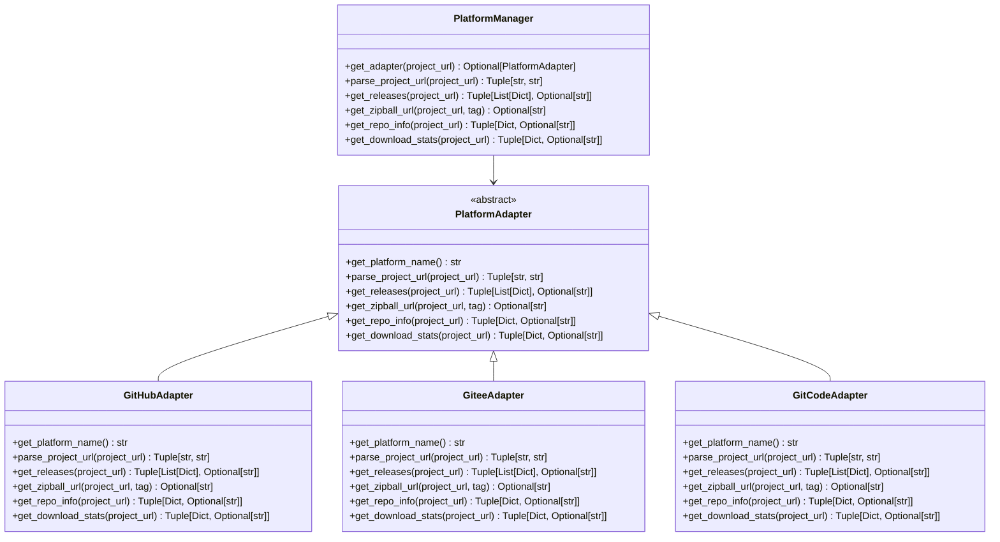

# 平台适配器模块

## 概述

平台适配器模块 (`openchecker/platform_adapter.py`) 提供了对GitHub、Gitee、GitCode等代码托管平台的统一接口。该模块通过适配器模式实现了对不同平台API的封装，使得上层应用可以以统一的方式访问不同平台的功能。

## 架构设计

### 核心组件

1. **PlatformAdapter** - 平台适配器基类
2. **GitHubAdapter** - GitHub平台适配器
3. **GiteeAdapter** - Gitee平台适配器
4. **GitCodeAdapter** - GitCode平台适配器
5. **PlatformManager** - 平台管理器

### 类图



## 功能特性

### 支持的平台

- **GitHub** - 全球最大的代码托管平台
- **Gitee** - 中国本土的代码托管平台
- **GitCode** - 华为云代码托管平台

### 核心功能

1. **项目URL解析** - 从项目URL中提取owner和repo名称
2. **Releases获取** - 获取项目的所有发布版本
3. **Zipball下载** - 获取指定tag的源码压缩包下载链接
4. **仓库信息** - 获取仓库的基本信息（描述、主页等）
5. **下载统计** - 获取项目的下载统计信息（部分平台支持）

## 使用方法

### 基本用法

```python
from openchecker.platform_adapter import platform_manager

# 获取项目releases
project_url = "https://github.com/owner/repo.git"
releases, error = platform_manager.get_releases(project_url)

# 获取仓库信息
repo_info, error = platform_manager.get_repo_info(project_url)

# 获取下载统计
download_stats, error = platform_manager.get_download_stats(project_url)

# 解析项目URL
owner, repo = platform_manager.parse_project_url(project_url)
```

### 直接使用适配器

```python
from openchecker.platform_adapter import GitHubAdapter, GiteeAdapter, GitCodeAdapter

# GitHub适配器
github_adapter = GitHubAdapter(config)
releases, error = github_adapter.get_releases("https://github.com/owner/repo.git")

# Gitee适配器
gitee_adapter = GiteeAdapter(config)
repo_info, error = gitee_adapter.get_repo_info("https://gitee.com/owner/repo.git")
```

## API参考

### PlatformAdapter

所有平台适配器的基类，定义了统一的接口。

#### 方法

- `get_platform_name() -> str` - 获取平台名称
- `parse_project_url(project_url: str) -> Tuple[str, str]` - 解析项目URL
- `get_releases(project_url: str) -> Tuple[List[Dict], Optional[str]]` - 获取releases
- `get_zipball_url(project_url: str, tag: str) -> Optional[str]` - 获取zipball URL
- `get_repo_info(project_url: str) -> Tuple[Dict, Optional[str]]` - 获取仓库信息
- `get_download_stats(project_url: str) -> Tuple[Dict, Optional[str]]` - 获取下载统计

### PlatformManager

平台管理器，提供统一的平台操作接口。

#### 方法

- `get_adapter(project_url: str) -> Optional[PlatformAdapter]` - 获取适配器
- `parse_project_url(project_url: str) -> Tuple[str, str]` - 解析项目URL
- `get_releases(project_url: str) -> Tuple[List[Dict], Optional[str]]` - 获取releases
- `get_zipball_url(project_url: str, tag: str) -> Optional[str]` - 获取zipball URL
- `get_repo_info(project_url: str) -> Tuple[Dict, Optional[str]]` - 获取仓库信息
- `get_download_stats(project_url: str) -> Tuple[Dict, Optional[str]]` - 获取下载统计

## 配置要求

平台适配器需要以下配置项：

```ini
[Github]
access_key = your_github_token

[Gitee]
access_key = your_gitee_token

[GitCode]
access_key = your_gitcode_token
```

## 错误处理

所有方法都返回 `(result, error)` 的元组格式：

- 成功时：`(result, None)`
- 失败时：`(None, error_message)`

常见错误类型：

- `"Unsupported platform"` - 不支持的平台
- `"Invalid URL format"` - URL格式错误
- `"Repository not found"` - 仓库不存在
- `"Token limit exceeded"` - API调用限制
- `"Network error"` - 网络错误

## 测试

运行平台适配器测试：

```bash
cd test
python test_platform_adapter.py
```

## 扩展新平台

要添加新的平台支持，需要：

1. 继承 `PlatformAdapter` 类
2. 实现所有抽象方法
3. 在 `PlatformManager` 中注册新适配器

示例：

```python
class NewPlatformAdapter(PlatformAdapter):
    def get_platform_name(self) -> str:
        return "new_platform"
    
    def parse_project_url(self, project_url: str) -> Tuple[str, str]:
        # 实现URL解析逻辑
        pass
    
    # 实现其他方法...
```

## 迁移说明

### 从旧代码迁移

原来的平台相关代码分散在 `agent.py` 中，现在已统一到平台适配器模块：

**旧代码：**
```python
if "github.com" in project_url:
    # GitHub特定逻辑
elif "gitee.com" in project_url:
    # Gitee特定逻辑
```

**新代码：**
```python
from openchecker.platform_adapter import platform_manager
result, error = platform_manager.get_releases(project_url)
```

### 优势

1. **代码复用** - 避免重复的平台判断逻辑
2. **易于维护** - 平台相关代码集中管理
3. **易于扩展** - 添加新平台只需实现适配器接口
4. **统一接口** - 所有平台操作使用相同的API
5. **错误处理** - 统一的错误处理机制

## 注意事项

1. 确保配置文件中包含正确的API访问令牌
2. 注意各平台的API调用频率限制
3. 网络请求可能失败，需要适当的重试机制
4. 不同平台的API返回格式可能不同，适配器会统一处理 