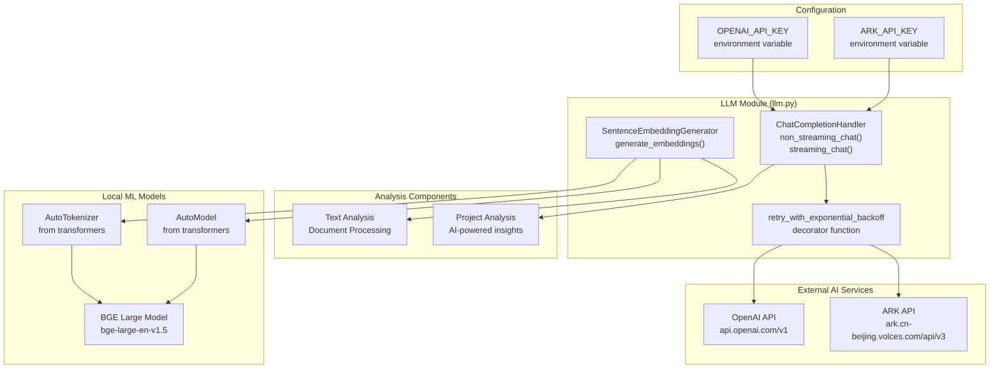
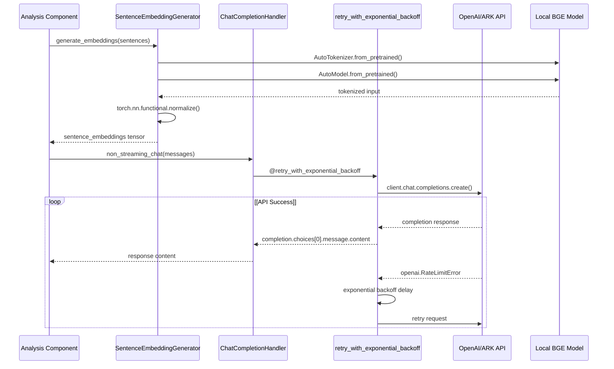
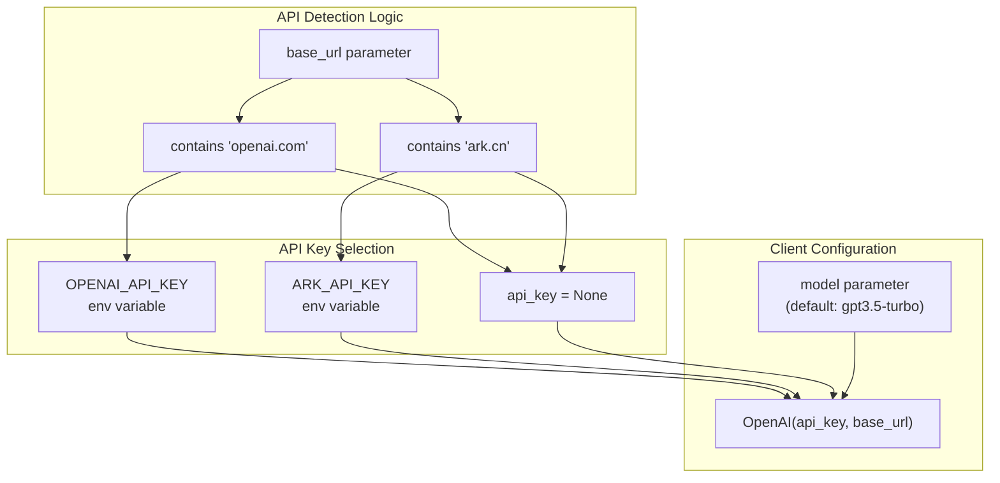
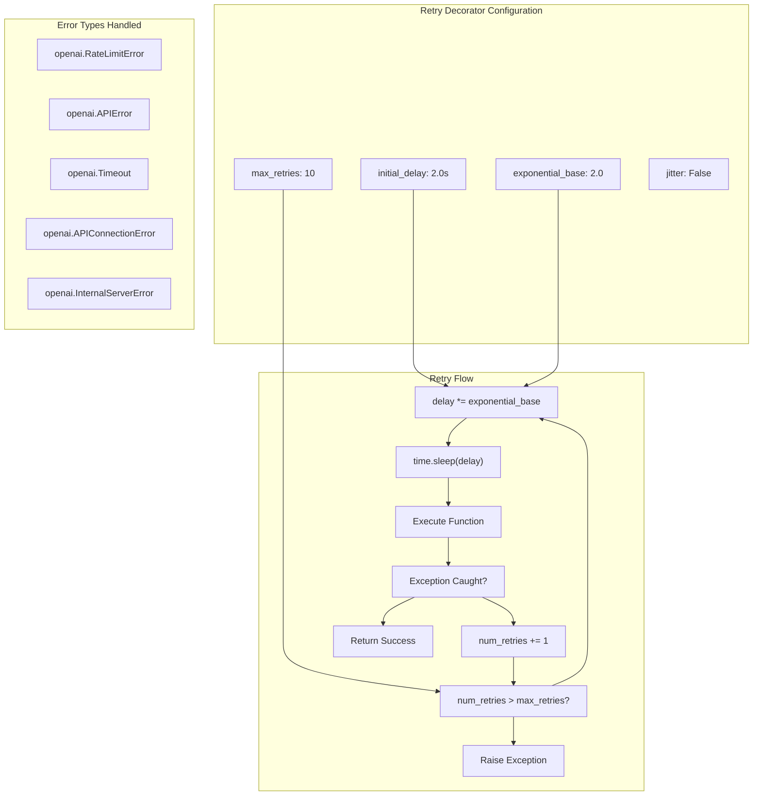

# AI and Machine Learning Components

> **Relevant source files**
> * [openchecker/llm.py](https://github.com/Laniakea2012/openchecker/blob/1dbd85d0/openchecker/llm.py)

## Purpose and Scope

This document covers the AI and machine learning components within the OpenChecker system, specifically focusing on Large Language Model (LLM) integration and text processing capabilities. The AI components provide text embedding generation for document analysis and chat completion functionality for AI-powered project analysis.

The system integrates with external AI services like OpenAI and supports both streaming and non-streaming chat completions. For external service configuration details, see [External Service Configuration](/Laniakea2012/openchecker/5.2-external-service-configuration). For analysis tools that utilize these AI components, see [Analysis Tools and Checkers](/Laniakea2012/openchecker/4-analysis-tools-and-checkers).

## LLM Integration Architecture

The AI components in OpenChecker are implemented through two primary classes that handle different aspects of machine learning functionality: sentence embedding generation and chat completion processing.

### LLM Integration Flow



Sources: [openchecker/llm.py L1-L149](https://github.com/Laniakea2012/openchecker/blob/1dbd85d0/openchecker/llm.py#L1-L149)

### Component Interaction



Sources: [openchecker/llm.py L51-L149](https://github.com/Laniakea2012/openchecker/blob/1dbd85d0/openchecker/llm.py#L51-L149)

## Text Embedding Generation

The `SentenceEmbeddingGenerator` class provides text embedding functionality using pre-trained transformer models, specifically designed for generating sentence-level embeddings for document analysis.

### SentenceEmbeddingGenerator Implementation

| Component | Description | Implementation Details |
| --- | --- | --- |
| **Model Loading** | Loads pre-trained BGE model | `AutoTokenizer.from_pretrained()`, `AutoModel.from_pretrained()` |
| **Text Processing** | Tokenizes and processes sentences | `padding=True`, `truncation=True`, `return_tensors='pt'` |
| **Embedding Generation** | Generates normalized embeddings | `model_output[0][:, 0]` with L2 normalization |
| **Output Format** | Returns PyTorch tensor | Shape: `[batch_size, embedding_dimension]` |

The embedding generator supports batch processing of sentences and applies L2 normalization to ensure consistent embedding magnitudes for similarity calculations.

```python
# Usage pattern from llm.py:121-129
embedding_generator = SentenceEmbeddingGenerator(model_path)
embeddings = embedding_generator.generate_embeddings(sentences)
```

**Key Methods:**

* `__init__(model_path)`: Initializes tokenizer and model from path [openchecker/llm.py L52-L61](https://github.com/Laniakea2012/openchecker/blob/1dbd85d0/openchecker/llm.py#L52-L61)
* `generate_embeddings(sentences)`: Processes sentence list and returns embeddings [openchecker/llm.py L63-L81](https://github.com/Laniakea2012/openchecker/blob/1dbd85d0/openchecker/llm.py#L63-L81)

Sources: [openchecker/llm.py L51-L81](https://github.com/Laniakea2012/openchecker/blob/1dbd85d0/openchecker/llm.py#L51-L81)

 [openchecker/llm.py L121-L129](https://github.com/Laniakea2012/openchecker/blob/1dbd85d0/openchecker/llm.py#L121-L129)

## Chat Completion Handling

The `ChatCompletionHandler` class manages interactions with LLM APIs, supporting both OpenAI and ARK (Volcano Engine) services with configurable models and endpoints.

### ChatCompletionHandler Configuration



**Supported Operations:**

* `non_streaming_chat(messages)`: Synchronous completion with retry logic [openchecker/llm.py L98-L104](https://github.com/Laniakea2012/openchecker/blob/1dbd85d0/openchecker/llm.py#L98-L104)
* `streaming_chat(messages)`: Streaming completion for real-time responses [openchecker/llm.py L106-L119](https://github.com/Laniakea2012/openchecker/blob/1dbd85d0/openchecker/llm.py#L106-L119)

**API Endpoint Detection:**

* OpenAI: Detects `openai.com` in base URL, uses `OPENAI_API_KEY` [openchecker/llm.py L85-L86](https://github.com/Laniakea2012/openchecker/blob/1dbd85d0/openchecker/llm.py#L85-L86)
* ARK: Detects `ark.cn` in base URL, uses `ARK_API_KEY` [openchecker/llm.py L87-L88](https://github.com/Laniakea2012/openchecker/blob/1dbd85d0/openchecker/llm.py#L87-L88)

Sources: [openchecker/llm.py L83-L119](https://github.com/Laniakea2012/openchecker/blob/1dbd85d0/openchecker/llm.py#L83-L119)

 [openchecker/llm.py L131-L149](https://github.com/Laniakea2012/openchecker/blob/1dbd85d0/openchecker/llm.py#L131-L149)

## Error Handling and Retry Mechanisms

The AI components implement robust error handling through an exponential backoff retry decorator that manages API rate limits, timeouts, and connection errors.

### Retry Logic Implementation



**Retry Parameters:**

* **Initial Delay**: 2 seconds [openchecker/llm.py L9](https://github.com/Laniakea2012/openchecker/blob/1dbd85d0/openchecker/llm.py#L9-L9)
* **Exponential Base**: 2.0 (doubles delay each retry) [openchecker/llm.py L10](https://github.com/Laniakea2012/openchecker/blob/1dbd85d0/openchecker/llm.py#L10-L10)
* **Maximum Retries**: 10 attempts [openchecker/llm.py L12](https://github.com/Laniakea2012/openchecker/blob/1dbd85d0/openchecker/llm.py#L12-L12)
* **Handled Errors**: OpenAI API-specific exceptions [openchecker/llm.py L13](https://github.com/Laniakea2012/openchecker/blob/1dbd85d0/openchecker/llm.py#L13-L13)

The decorator is applied to the `non_streaming_chat` method to ensure reliable completion generation despite transient API issues.

Sources: [openchecker/llm.py L7-L49](https://github.com/Laniakea2012/openchecker/blob/1dbd85d0/openchecker/llm.py#L7-L49)

 [openchecker/llm.py L98](https://github.com/Laniakea2012/openchecker/blob/1dbd85d0/openchecker/llm.py#L98-L98)

## Integration Points and Usage

The AI components integrate with the broader OpenChecker system through several key interfaces and usage patterns.

### Model and API Configuration

| Configuration Type | Source | Default/Example Value |
| --- | --- | --- |
| **BGE Model Path** | Local filesystem | `/home/guoqiang/models/bge-large-en-v1.5` |
| **OpenAI Model** | Constructor parameter | `gpt3.5-turbo` |
| **ARK Model** | Constructor parameter | `ep-20241129094859-p47sh` |
| **OpenAI Base URL** | Constructor parameter | `https://api.openai.com/v1` |
| **ARK Base URL** | Constructor parameter | `https://ark.cn-beijing.volces.com/api/v3/` |

### Message Format for Chat Completion

The chat completion handler expects OpenAI-compatible message format:

```
messages = [
    {"role": "system", "content": "You are a helpful assistant."},
    {"role": "user", "content": "What's your name?"}
]
```

This format supports system prompts for contextualizing AI responses within OpenChecker's analysis workflows.

**Environment Variables Required:**

* `OPENAI_API_KEY`: For OpenAI API access [openchecker/llm.py L86](https://github.com/Laniakea2012/openchecker/blob/1dbd85d0/openchecker/llm.py#L86-L86)
* `ARK_API_KEY`: For ARK/Volcano Engine API access [openchecker/llm.py L88](https://github.com/Laniakea2012/openchecker/blob/1dbd85d0/openchecker/llm.py#L88-L88)

Sources: [openchecker/llm.py L122-L149](https://github.com/Laniakea2012/openchecker/blob/1dbd85d0/openchecker/llm.py#L122-L149)

 [openchecker/llm.py L84-L96](https://github.com/Laniakea2012/openchecker/blob/1dbd85d0/openchecker/llm.py#L84-L96)