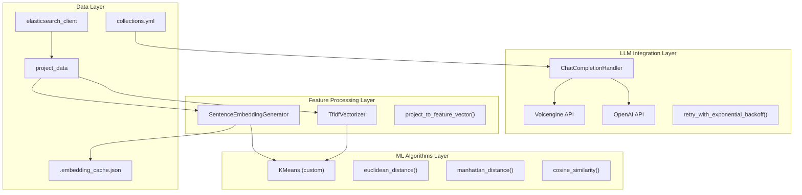
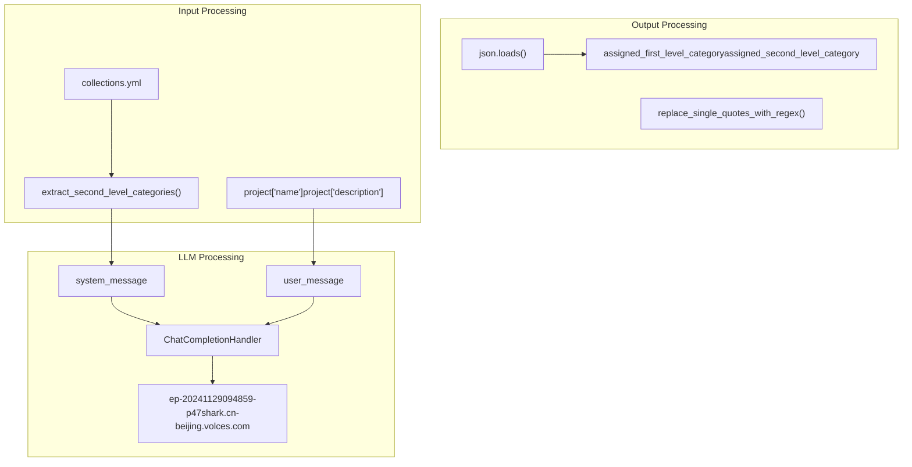
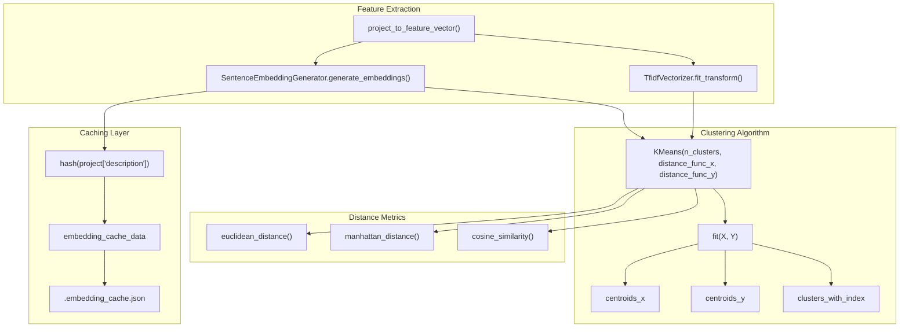
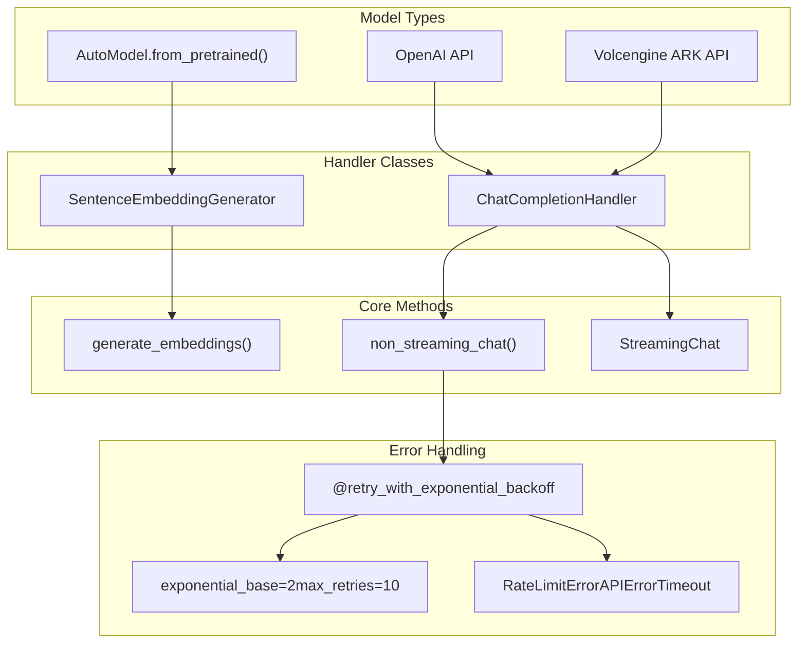

# AI and Machine Learning Components

> **Relevant source files**
> * [openchecker/classify.py](https://github.com/Laniakea2012/openchecker/blob/00a9732e/openchecker/classify.py)
> * [openchecker/clusters_util.py](https://github.com/Laniakea2012/openchecker/blob/00a9732e/openchecker/clusters_util.py)
> * [openchecker/llm.py](https://github.com/Laniakea2012/openchecker/blob/00a9732e/openchecker/llm.py)
> * [openchecker/repo.py](https://github.com/Laniakea2012/openchecker/blob/00a9732e/openchecker/repo.py)

## Purpose and Scope

The AI and Machine Learning Components provide intelligent project analysis capabilities for the OpenChecker system. These components enable automatic project classification, similarity clustering, and semantic analysis of software repositories. The system combines traditional machine learning techniques like TF-IDF vectorization and K-means clustering with modern large language model (LLM) integrations for enhanced project understanding.

For information about the analysis tools that generate the data processed by these AI components, see [Analysis Tools and Checkers](/Laniakea2012/openchecker/4-analysis-tools-and-checkers). For details about the API endpoints that expose ML functionality, see [REST API Endpoints](/Laniakea2012/openchecker/3.1-rest-api-endpoints).

## Architecture Overview

The AI/ML system consists of four main layers that work together to provide intelligent project analysis:

Sources: [openchecker/clusters_util.py L1-L187](https://github.com/Laniakea2012/openchecker/blob/00a9732e/openchecker/clusters_util.py#L1-L187)

 [openchecker/classify.py L1-L112](https://github.com/Laniakea2012/openchecker/blob/00a9732e/openchecker/classify.py#L1-L112)

 [openchecker/llm.py L1-L150](https://github.com/Laniakea2012/openchecker/blob/00a9732e/openchecker/llm.py#L1-L150)

 [openchecker/repo.py L1-L207](https://github.com/Laniakea2012/openchecker/blob/00a9732e/openchecker/repo.py#L1-L207)

## Project Classification System

The project classification system uses LLMs to automatically categorize software projects into hierarchical categories. The system supports both first-level and second-level category assignments based on project metadata.

### Classification Architecture

### Classification Configuration

The classification system uses predefined categories and few-shot examples to guide the LLM:

| Component | Purpose | Location |
| --- | --- | --- |
| `collections.yml` | Hierarchical category definitions | [openchecker/classify.py   33](https://github.com/Laniakea2012/openchecker/blob/00a9732e/openchecker/classify.py#L33-L33) |
| `few_shot_examples` | Sample classification examples | [openchecker/classify.py L40-L51](https://github.com/Laniakea2012/openchecker/blob/00a9732e/openchecker/classify.py#L40-L51) |
| `project_schema` | Output format specification | [openchecker/classify.py L53-L57](https://github.com/Laniakea2012/openchecker/blob/00a9732e/openchecker/classify.py#L53-L57) |
| `system_message` | LLM system prompt | [openchecker/classify.py L59-L67](https://github.com/Laniakea2012/openchecker/blob/00a9732e/openchecker/classify.py#L59-L67) |

The system processes projects in batches and implements error handling for failed classifications using the `ChatCompletionHandler` class from the LLM integration layer.

Sources: [openchecker/classify.py L11-L21](https://github.com/Laniakea2012/openchecker/blob/00a9732e/openchecker/classify.py#L11-L21)

 [openchecker/classify.py L59-L112](https://github.com/Laniakea2012/openchecker/blob/00a9732e/openchecker/classify.py#L59-L112)

## Clustering and Embeddings System

The clustering system combines traditional TF-IDF vectorization with modern sentence embeddings to group similar projects together. It implements a custom K-means algorithm that can handle multiple distance metrics.

### Dual-Vector Clustering Architecture

### Custom K-Means Implementation

The system implements a custom K-means algorithm that supports dual vector spaces and multiple distance functions:

| Parameter | Purpose | Default Value |
| --- | --- | --- |
| `n_clusters` | Number of clusters to create | 3 |
| `max_iter` | Maximum iterations | 500 |
| `distance_func_x` | Distance function for X space | `euclidean_distance` |
| `distance_func_y` | Distance function for Y space | `cosine_similarity` |
| `rtol`, `atol` | Convergence tolerance | 1e-5, 1e-8 |

The algorithm maintains separate centroids for TF-IDF vectors (`centroids_x`) and embedding vectors (`centroids_y`), allowing for sophisticated similarity analysis.

Sources: [openchecker/clusters_util.py L23-L72](https://github.com/Laniakea2012/openchecker/blob/00a9732e/openchecker/clusters_util.py#L23-L72)

 [openchecker/clusters_util.py L108-L170](https://github.com/Laniakea2012/openchecker/blob/00a9732e/openchecker/clusters_util.py#L108-L170)

## LLM Integration Layer

The LLM integration layer provides standardized interfaces for working with different language model APIs and local transformer models. It includes robust error handling and retry mechanisms.

### LLM Service Architecture

### API Key Management

The system automatically detects the appropriate API key based on the base URL:

| Base URL Pattern | Environment Variable | Usage |
| --- | --- | --- |
| `openai.com` | `OPENAI_API_KEY` | OpenAI GPT models |
| `ark.cn` | `ARK_API_KEY` | Volcengine models |
| Other | `None` | Local or custom APIs |

### Embedding Generation

The `SentenceEmbeddingGenerator` class provides efficient batch processing of text embeddings:

* **Model Loading**: Uses HuggingFace transformers with `AutoTokenizer` and `AutoModel`
* **Batch Processing**: Handles multiple sentences simultaneously with padding and truncation
* **Normalization**: Applies L2 normalization to embeddings for consistent similarity calculations
* **GPU Support**: Automatically detects and uses available CUDA devices

Sources: [openchecker/llm.py L51-L82](https://github.com/Laniakea2012/openchecker/blob/00a9732e/openchecker/llm.py#L51-L82)

 [openchecker/llm.py L83-L120](https://github.com/Laniakea2012/openchecker/blob/00a9732e/openchecker/llm.py#L83-L120)

 [openchecker/llm.py L7-L49](https://github.com/Laniakea2012/openchecker/blob/00a9732e/openchecker/llm.py#L7-L49)

## Data Pipeline Flow

The complete AI/ML data processing pipeline combines repository data extraction, feature processing, and intelligent analysis:

[ERROR_PROCESSING_ELEMENT: PRE]

### Batch Processing Strategy

The system implements efficient batch processing for large-scale analysis:

| Component | Batch Size | Storage Strategy |
| --- | --- | --- |
| Repository extraction | 10,000 projects | JSON files by batch |
| LLM classification | 100 projects | Incremental JSON writes |
| Embedding generation | Variable | JSON cache by hash |
| Clustering | Full dataset | In-memory processing |

Sources: [openchecker/repo.py L74-L114](https://github.com/Laniakea2012/openchecker/blob/00a9732e/openchecker/repo.py#L74-L114)

 [openchecker/classify.py L106-L112](https://github.com/Laniakea2012/openchecker/blob/00a9732e/openchecker/classify.py#L106-L112)

 [openchecker/clusters_util.py L133-L151](https://github.com/Laniakea2012/openchecker/blob/00a9732e/openchecker/clusters_util.py#L133-L151)