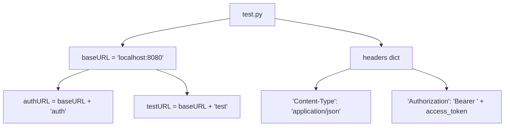
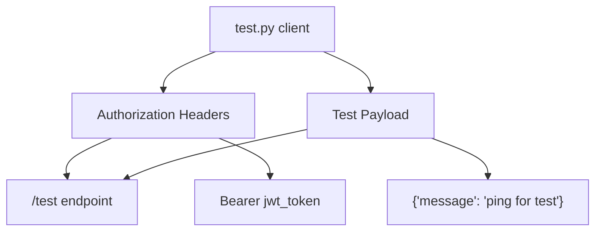
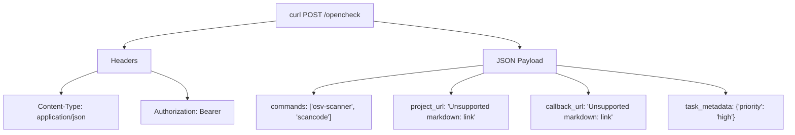
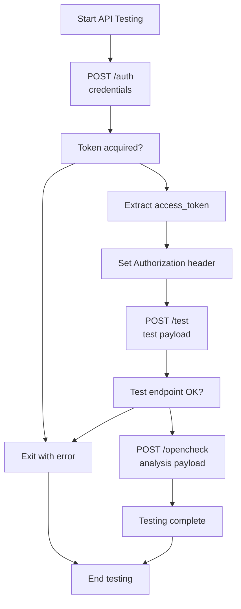
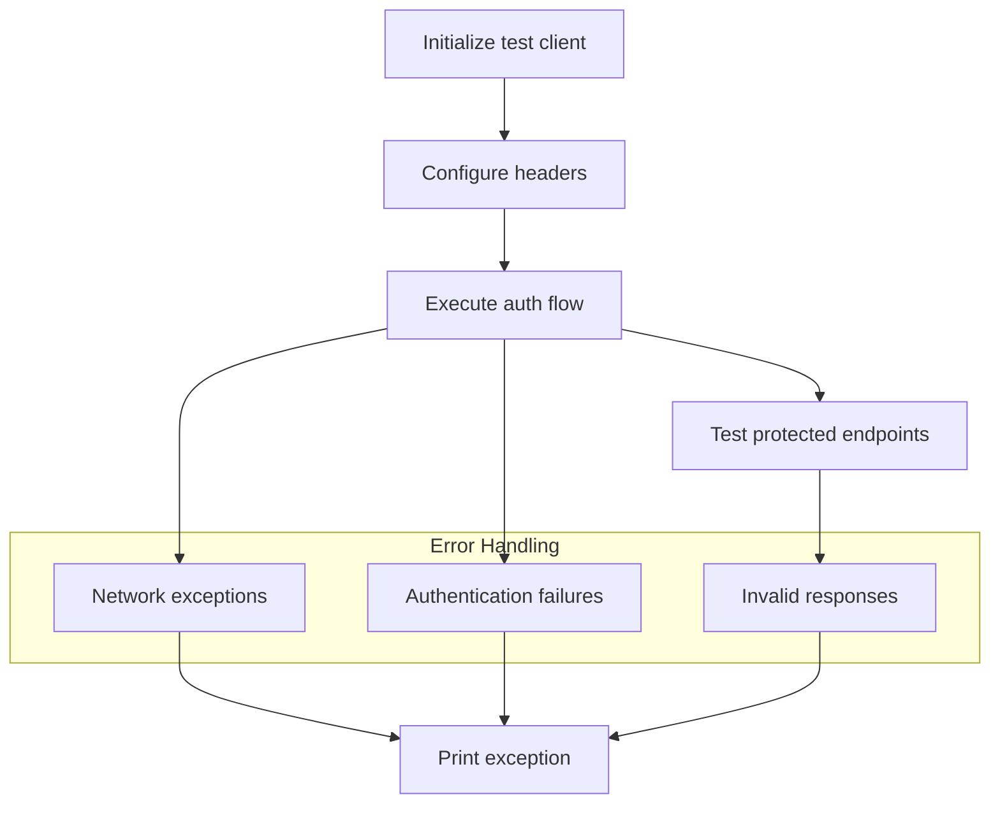

# API Client Testing

> **Relevant source files**
> * [test/test.py](https://github.com/Laniakea2012/openchecker/blob/1dbd85d0/test/test.py)

This document covers the API client testing procedures for OpenChecker, including authentication testing, protected endpoint verification, and analysis task submission testing. The testing framework validates the JWT-based authentication system and core API functionality through both command-line tools and Python client implementations.

For information about the underlying REST API server implementation, see [REST API Server](/Laniakea2012/openchecker/3.1-rest-api-server). For details on the authentication mechanisms being tested, see [Authentication and User Management](/Laniakea2012/openchecker/3.2-authentication-and-user-management).

## Test Client Overview

OpenChecker provides a comprehensive test client that validates API functionality through multiple interaction patterns. The primary test implementation is located in [test/test.py L1-L71](https://github.com/Laniakea2012/openchecker/blob/1dbd85d0/test/test.py#L1-L71)

 and includes both programmatic Python examples and equivalent curl command demonstrations.

The test client validates three core API interaction patterns:

* **Authentication Flow**: Token acquisition using `username`/`password` credentials via `/auth` endpoint
* **Protected Endpoint Access**: Bearer token validation for the `/test` endpoint
* **Analysis Task Submission**: Documentation and examples for the `/opencheck` endpoint

### Test Client Architecture



| Component | Purpose | Configuration | Authentication |
| --- | --- | --- | --- |
| `test.py` main script | Python client implementation | `baseURL = 'http://localhost:8080/'` | JWT Bearer tokens |
| curl examples (comments) | Command-line reference | `http://localhost:8083/` | JWT Bearer tokens |
| `authPayload` dict | Authentication credentials | `temporary_user`/`default_password` | Required |

Note: The test file contains a port discrepancy where the Python `baseURL` variable uses port 8080 [test/test.py L31](https://github.com/Laniakea2012/openchecker/blob/1dbd85d0/test/test.py#L31-L31)

 while the curl examples in comments use port 8083 [test/test.py L14](https://github.com/Laniakea2012/openchecker/blob/1dbd85d0/test/test.py#L14-L14)

Sources: [test/test.py L1-L71](https://github.com/Laniakea2012/openchecker/blob/1dbd85d0/test/test.py#L1-L71)

## Authentication Testing Workflow

The authentication testing process validates the JWT token acquisition and usage patterns through a two-stage workflow. The test client first obtains access tokens from the `/auth` endpoint, then uses these tokens to access protected resources.

```mermaid
sequenceDiagram
  participant test.py
  participant /auth endpoint
  participant /test endpoint

  test.py->>/auth endpoint: "POST /auth"
  note over test.py,/auth endpoint: "{'username': 'temporary_user',
  /auth endpoint->>test.py: "{'access_token': 'jwt_token'}"
  test.py->>test.py: "Extract access_token"
  test.py->>test.py: "Set Authorization header"
  test.py->>/test endpoint: "POST /test"
  note over test.py,/test endpoint: "Bearer jwt_token
  /test endpoint->>test.py: "JSON response"
```

The authentication test implementation uses the `authPayload` structure with default credentials [test/test.py L40-L43](https://github.com/Laniakea2012/openchecker/blob/1dbd85d0/test/test.py#L40-L43)

 and processes the response to extract the `access_token` field [test/test.py L52-L54](https://github.com/Laniakea2012/openchecker/blob/1dbd85d0/test/test.py#L52-L54)

 Error handling includes both network exceptions and missing token scenarios [test/test.py L45-L57](https://github.com/Laniakea2012/openchecker/blob/1dbd85d0/test/test.py#L45-L57)

Sources: [test/test.py L37-L57](https://github.com/Laniakea2012/openchecker/blob/1dbd85d0/test/test.py#L37-L57)

## Protected Endpoint Testing

Protected endpoint testing validates Bearer token authentication by accessing the `/test` endpoint with acquired JWT tokens. The test client constructs proper Authorization headers and submits test payloads to verify token validation.

### Test Payload Structure

The test endpoint validation uses a simple message-based payload structure:



The protected endpoint test implementation constructs the Authorization header using the format `Bearer <access_token>` [test/test.py L60](https://github.com/Laniakea2012/openchecker/blob/1dbd85d0/test/test.py#L60-L60)

 and submits a test payload containing a simple message field [test/test.py L61-L63](https://github.com/Laniakea2012/openchecker/blob/1dbd85d0/test/test.py#L61-L63)

Sources: [test/test.py L59-L71](https://github.com/Laniakea2012/openchecker/blob/1dbd85d0/test/test.py#L59-L71)

## Analysis Task Testing Examples

The test file includes comprehensive examples for testing the main analysis functionality through the `/opencheck` endpoint. These examples demonstrate how to submit analysis tasks with various checker combinations and callback configurations.

### Command-Line Testing Examples

The curl examples in the comment section provide reference implementations for testing analysis task submission:

| Parameter | Example Value | Purpose |
| --- | --- | --- |
| `commands` | `["osv-scanner", "scancode"]` | Specifies analysis tools to execute |
| `project_url` | `"https://github.com/example/project"` | Target repository for analysis |
| `callback_url` | `"https://example.com/callback"` | Results delivery endpoint |
| `task_metadata` | `{"priority": "high"}` | Task configuration options |

### /opencheck Endpoint Test Structure



The curl example demonstrates the complete request structure for analysis task submission [test/test.py L19-L27](https://github.com/Laniakea2012/openchecker/blob/1dbd85d0/test/test.py#L19-L27)

 including proper Content-Type headers and Bearer token authentication [test/test.py L20-L21](https://github.com/Laniakea2012/openchecker/blob/1dbd85d0/test/test.py#L20-L21)

### API Testing Flow



Sources: [test/test.py L12-L27](https://github.com/Laniakea2012/openchecker/blob/1dbd85d0/test/test.py#L12-L27)

 [test/test.py L37-L71](https://github.com/Laniakea2012/openchecker/blob/1dbd85d0/test/test.py#L37-L71)

## Test Configuration and Environment

The test client supports multiple configuration scenarios through configurable base URLs and credential sets. The default configuration targets local development environments with standard authentication credentials.

### Configuration Parameters

| Setting | Value | Location | Purpose |
| --- | --- | --- | --- |
| `baseURL` | `'http://localhost:8080/'` | [test/test.py L31](https://github.com/Laniakea2012/openchecker/blob/1dbd85d0/test/test.py#L31-L31) | API server endpoint |
| `username` | `'temporary_user'` | [test/test.py L41](https://github.com/Laniakea2012/openchecker/blob/1dbd85d0/test/test.py#L41-L41) | Default test credentials |
| `password` | `'default_password'` | [test/test.py L42](https://github.com/Laniakea2012/openchecker/blob/1dbd85d0/test/test.py#L42-L42) | Default test credentials |
| `Content-Type` | `'application/json'` | [test/test.py L34](https://github.com/Laniakea2012/openchecker/blob/1dbd85d0/test/test.py#L34-L34) | Request header format |

The test implementation includes proper headers configuration [test/test.py L33-L35](https://github.com/Laniakea2012/openchecker/blob/1dbd85d0/test/test.py#L33-L35)

 and handles both successful responses and exception scenarios through try-catch blocks [test/test.py L45-L48](https://github.com/Laniakea2012/openchecker/blob/1dbd85d0/test/test.py#L45-L48)

 [test/test.py L65-L68](https://github.com/Laniakea2012/openchecker/blob/1dbd85d0/test/test.py#L65-L68)

### Test Execution Workflow



Sources: [test/test.py L31-L71](https://github.com/Laniakea2012/openchecker/blob/1dbd85d0/test/test.py#L31-L71)