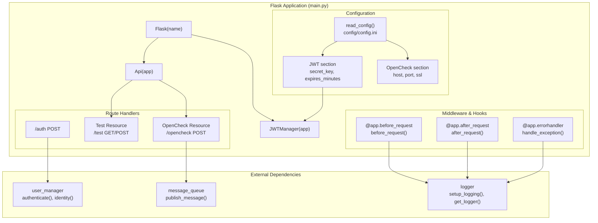
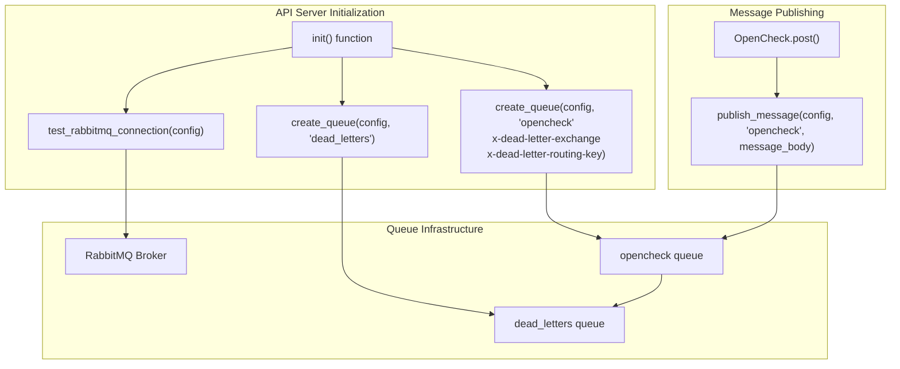

# API and Web Interface

> **Relevant source files**
> * [openchecker/main.py](https://github.com/Laniakea2012/openchecker/blob/1dbd85d0/openchecker/main.py)

This document covers the Flask-based REST API server and external interfaces that provide programmatic access to the OpenChecker system. The API layer serves as the primary entry point for external users and systems to initiate project analysis tasks and manage authentication.

For information about the underlying message processing and agent system that handles the actual analysis work, see [Core Architecture](/Laniakea2012/openchecker/2-core-architecture). For details about the analysis tools and checkers that are invoked through this API, see [Analysis Tools and Checkers](/Laniakea2012/openchecker/4-analysis-tools-and-checkers).

## Flask Application Architecture

The OpenChecker API is built on a Flask-based REST API server that handles HTTP requests, manages JWT authentication, and publishes analysis tasks to a message queue system. The main application is implemented in `main.py` and provides a clean interface for external systems to interact with the OpenChecker platform.

### Flask Application Structure



**Sources:** [openchecker/main.py L1-L193](https://github.com/Laniakea2012/openchecker/blob/1dbd85d0/openchecker/main.py#L1-L193)

### Request Processing Flow

```mermaid
sequenceDiagram
  participant External Client
  participant Flask App (main.py)
  participant user_manager
  participant authenticate()
  participant JWTManager
  participant OpenCheck Resource
  participant message_queue
  participant publish_message()
  participant logger

  External Client->>Flask App (main.py): "POST /auth"
  Flask App (main.py)->>logger: "before_request()"
  Flask App (main.py)->>user_manager: "authenticate(username, password)"
  user_manager-->>Flask App (main.py): "User object or None"
  loop ["Authentication Success"]
    Flask App (main.py)->>JWTManager: "create_access_token(identity=user.id)"
    JWTManager-->>Flask App (main.py): "JWT token"
    Flask App (main.py)-->>External Client: "{'access_token': token, 'token_type': 'Bearer'}"
    Flask App (main.py)-->>External Client: "{'error': 'Invalid credentials'}, 401"
  end
  Flask App (main.py)->>logger: "after_request(response)"
  note over External Client,publish_message(): "Subsequent OpenCheck Request"
  External Client->>Flask App (main.py): "POST /opencheck
  Flask App (main.py)->>logger: Authorization: Bearer <token>"
  Flask App (main.py)->>JWTManager: "before_request()"
  Flask App (main.py)->>OpenCheck Resource: "@jwt_required() decorator"
  OpenCheck Resource->>message_queue: "post() method"
  message_queue-->>OpenCheck Resource: "publish_message(config, 'opencheck', message_body)"
  OpenCheck Resource-->>Flask App (main.py): "publish result"
  Flask App (main.py)->>logger: "Response message"
  Flask App (main.py)-->>External Client: "after_request(response)"
```

**Sources:** [openchecker/main.py L38-L56](https://github.com/Laniakea2012/openchecker/blob/1dbd85d0/openchecker/main.py#L38-L56)

 [openchecker/main.py L109-L143](https://github.com/Laniakea2012/openchecker/blob/1dbd85d0/openchecker/main.py#L109-L143)

 [openchecker/main.py L60-L79](https://github.com/Laniakea2012/openchecker/blob/1dbd85d0/openchecker/main.py#L60-L79)

## Authentication System

The API uses JWT (JSON Web Token) based authentication managed by the `flask-jwt-extended` library. Authentication credentials are validated against a user management system and successful authentication returns a Bearer token for subsequent API calls.

### Authentication Endpoints and Token Management

| Endpoint | Method | Purpose | Authentication Required |
| --- | --- | --- | --- |
| `/auth` | POST | Authenticate user and receive JWT token | No |
| `/test` | GET/POST | Test endpoint for token validation | Yes |
| `/opencheck` | POST | Submit project analysis request | Yes |

The authentication endpoint supports both Basic Auth headers and JSON body credentials:

```json
{
  "username": "user",
  "password": "password"
}
```

**JWT Configuration Parameters:**

* `secret_key`: Configurable JWT signing key from `config.ini`
* `expires_minutes`: Token expiration time (default: 30 minutes)
* Token type: Bearer token format

**Sources:** [openchecker/main.py L24-L31](https://github.com/Laniakea2012/openchecker/blob/1dbd85d0/openchecker/main.py#L24-L31)

 [openchecker/main.py L38-L56](https://github.com/Laniakea2012/openchecker/blob/1dbd85d0/openchecker/main.py#L38-L56)

## API Endpoints

### OpenCheck Endpoint

The `/opencheck` POST endpoint is the primary interface for submitting project analysis requests. It accepts a JSON payload containing project information and analysis commands, then publishes the request to the message queue for processing by agent workers.

**Request Body Structure:**

```json
{
  "commands": ["osv-scanner", "scancode", "binary-checker"],
  "project_url": "https://github.com/user/repo",
  "commit_hash": "optional_commit_hash",
  "access_token": "optional_platform_token",
  "callback_url": "https://your-system.com/webhook",
  "task_metadata": {
    "custom": "metadata"
  }
}
```

**Message Queue Integration:**
The endpoint transforms the request into a message body and publishes it to the `opencheck` queue using the `publish_message()` function. The message includes all request parameters and is processed asynchronously by agent workers.

**Sources:** [openchecker/main.py L109-L143](https://github.com/Laniakea2012/openchecker/blob/1dbd85d0/openchecker/main.py#L109-L143)

 [openchecker/main.py L117-L124](https://github.com/Laniakea2012/openchecker/blob/1dbd85d0/openchecker/main.py#L117-L124)

### Test Endpoint

The `/test` endpoint provides both GET and POST methods for validating JWT tokens and testing API connectivity. The GET method returns user information, while the POST method echoes back a message parameter.

**Sources:** [openchecker/main.py L87-L107](https://github.com/Laniakea2012/openchecker/blob/1dbd85d0/openchecker/main.py#L87-L107)

## Message Queue Integration and Task Publishing

The API integrates with RabbitMQ for asynchronous task processing. When an OpenCheck request is received, the API publishes a message to the `opencheck` queue, which is consumed by agent workers for actual analysis processing.

### Queue Configuration and Setup



**Queue Configuration:**

* **Main Queue:** `opencheck` with dead letter exchange configuration
* **Dead Letter Queue:** `dead_letters` for failed message handling
* **Queue Arguments:** `x-dead-letter-exchange` and `x-dead-letter-routing-key` for error handling

**Sources:** [openchecker/main.py L151-L168](https://github.com/Laniakea2012/openchecker/blob/1dbd85d0/openchecker/main.py#L151-L168)

 [openchecker/main.py L135-L141](https://github.com/Laniakea2012/openchecker/blob/1dbd85d0/openchecker/main.py#L135-L141)

## Configuration and Deployment

The Flask application loads configuration from `config/config.ini` with sections for JWT authentication, RabbitMQ connection, and server settings. The application supports both HTTP and HTTPS deployment with configurable SSL certificates.

### Server Configuration

| Configuration Section | Parameters | Purpose |
| --- | --- | --- |
| JWT | `secret_key`, `expires_minutes` | JWT authentication settings |
| RabbitMQ | Connection parameters | Message queue configuration |
| OpenCheck | `host`, `port`, `ssl_crt_path`, `ssl_key_path` | Server deployment settings |

The server can be started in either HTTP or HTTPS mode based on the `use_ssl` flag, with SSL certificate paths configurable in the OpenCheck section.

**Sources:** [openchecker/main.py L173-L192](https://github.com/Laniakea2012/openchecker/blob/1dbd85d0/openchecker/main.py#L173-L192)

 [openchecker/main.py L24-L26](https://github.com/Laniakea2012/openchecker/blob/1dbd85d0/openchecker/main.py#L24-L26)

 [openchecker/main.py L58](https://github.com/Laniakea2012/openchecker/blob/1dbd85d0/openchecker/main.py#L58-L58)

## Logging and Monitoring

The API implements comprehensive structured logging with request/response tracking, performance monitoring, and error handling. All API requests are logged with metadata including method, path, remote address, and user agent information.

### Logging Components

* **Setup:** `setup_logging()` with configurable log level and format
* **Request Logging:** `before_request()` and `after_request()` hooks
* **Performance Monitoring:** `@log_performance` decorator for endpoint timing
* **Error Handling:** Global exception handler with stack trace logging

**Sources:** [openchecker/main.py L13-L22](https://github.com/Laniakea2012/openchecker/blob/1dbd85d0/openchecker/main.py#L13-L22)

 [openchecker/main.py L60-L85](https://github.com/Laniakea2012/openchecker/blob/1dbd85d0/openchecker/main.py#L60-L85)

 [openchecker/main.py L111](https://github.com/Laniakea2012/openchecker/blob/1dbd85d0/openchecker/main.py#L111-L111)