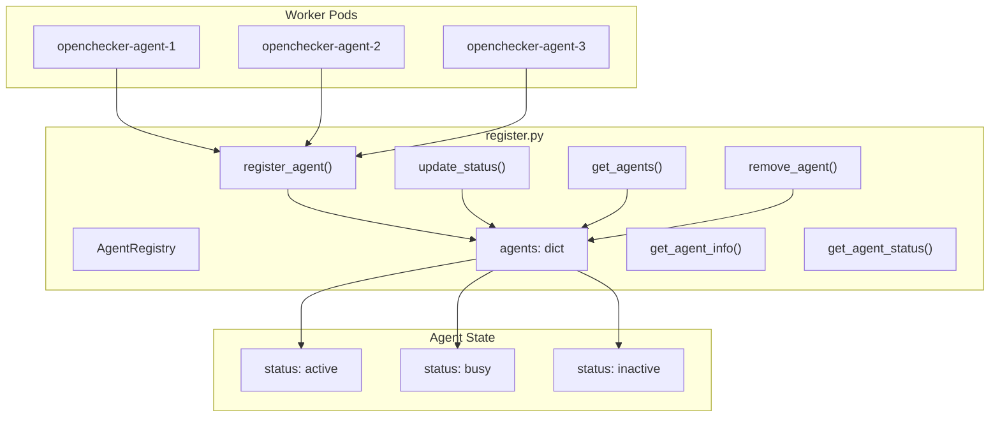
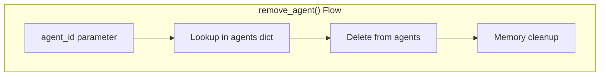
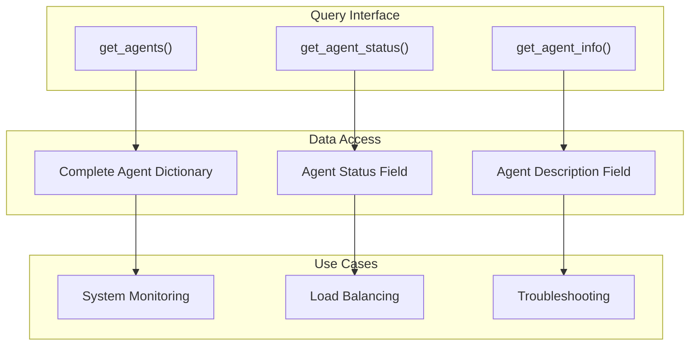
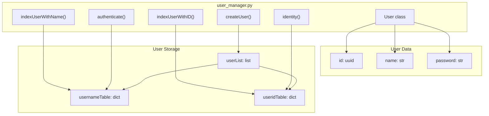
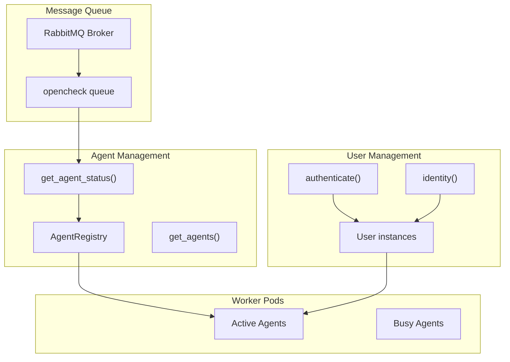

# Agent Registry and Management

> **Relevant source files**
> * [test/test_registry.py](https://github.com/Laniakea2012/openchecker/blob/1dbd85d0/test/test_registry.py)
> * [test/test_user_manager.py](https://github.com/Laniakea2012/openchecker/blob/1dbd85d0/test/test_user_manager.py)

## Purpose and Scope

This document covers the agent registry and user management systems within OpenChecker, which provide the foundational infrastructure for tracking worker agents and managing user access during development and testing. The `AgentRegistry` class maintains real-time status information about active agents, while the user management utilities handle authentication and authorization for development workflows.

For information about the core agent system and message processing capabilities, see [Agent System and Message Processing](/Laniakea2012/openchecker/2.1-agent-system-and-message-processing). For details about Kubernetes deployment of agent pods, see [Kubernetes Deployment](/Laniakea2012/openchecker/7.2-kubernetes-deployment). For production authentication systems, see [Authentication and User Management](/Laniakea2012/openchecker/3.2-authentication-and-user-management).

## Agent Registry Architecture

The agent registry system is implemented in the `AgentRegistry` class within `register.py`, providing centralized management of worker agent instances. The registry maintains an in-memory mapping of agent identities to their metadata and current operational status.

**Agent Registry System Architecture**



**Core Registry Operations**

| Method | Purpose | Return Type |
| --- | --- | --- |
| `register_agent(agent_id, info)` | Register new agent with metadata | `None` |
| `update_status(agent_id, status)` | Update agent operational status | `None` |
| `get_agents()` | Retrieve all registered agents | `dict` |
| `get_agent_info(agent_id)` | Get agent description | `str` |
| `get_agent_status(agent_id)` | Get current agent status | `str` |
| `remove_agent(agent_id)` | Deregister agent | `None` |

Sources: [test/test_registry.py L1-L45](https://github.com/Laniakea2012/openchecker/blob/1dbd85d0/test/test_registry.py#L1-L45)

## Agent Lifecycle Management

The agent lifecycle is managed through a series of registry operations that handle agent registration, status updates, and deregistration. Each agent maintains persistent state information throughout its operational lifetime.

### Agent Registration Process

The `register_agent()` method handles new agent registration by storing the agent identifier and descriptive information in the internal `agents` dictionary, with status initialized to "active".

**Agent Registration Flow**

```mermaid
sequenceDiagram
  participant openchecker-agent Pod
  participant AgentRegistry
  participant agents: dict

  openchecker-agent Pod->>AgentRegistry: "register_agent(agent_id, info)"
  AgentRegistry->>agents: dict: "Store {agent_id: {info, status='active'}}"
  AgentRegistry->>openchecker-agent Pod: "Registration complete"
  note over AgentRegistry,agents: dict: "Agent available for task assignment"
```

**Agent Metadata Structure**
Each registered agent maintains the following data in the `agents` dictionary:

* **Agent ID**: Unique identifier (string)
* **info**: Descriptive information about the agent
* **status**: Current operational state ("active", "busy", or "inactive")

Sources: [test/test_registry.py L10-L15](https://github.com/Laniakea2012/openchecker/blob/1dbd85d0/test/test_registry.py#L10-L15)

### Status Management

Agent status tracking enables the system to monitor operational state and make informed task distribution decisions. The registry supports dynamic status updates through the `update_status()` method.

**Agent Status Management**

The `update_status()` method enables dynamic status updates for registered agents. The system supports the following status transitions:

| Status | Description | Usage Context |
| --- | --- | --- |
| `active` | Agent available for new tasks | Default after `register_agent()` |
| `busy` | Agent processing current task | Set during task execution |
| `inactive` | Agent temporarily unavailable | Maintenance or error states |

Status updates are validated against the registered agent list and stored in the `agents` dictionary.

Sources: [test/test_registry.py L17-L21](https://github.com/Laniakea2012/openchecker/blob/1dbd85d0/test/test_registry.py#L17-L21)

### Agent Deregistration

The `remove_agent()` method provides clean agent removal from the registry by deleting the agent entry from the internal `agents` dictionary.

**Agent Removal Process**



The deregistration process removes all agent metadata and status information, preventing further task assignments to the removed agent.

Sources: [test/test_registry.py L38-L42](https://github.com/Laniakea2012/openchecker/blob/1dbd85d0/test/test_registry.py#L38-L42)

## Agent Query Interface

The registry provides comprehensive query capabilities for system monitoring and management operations through standardized accessor methods.

### Available Query Methods

| Method | Return Type | Purpose |
| --- | --- | --- |
| `get_agents()` | `dict` | Retrieve all registered agents with full metadata |
| `get_agent_info(agent_id)` | `str` | Get descriptive information for specific agent |
| `get_agent_status(agent_id)` | `str` | Get current operational status of agent |



Sources: [test/test_registry.py L23-L36](https://github.com/Laniakea2012/openchecker/blob/1dbd85d0/test/test_registry.py#L23-L36)

## User Management System

The user management utilities provide authentication and user administration capabilities for development environments. The system is implemented through the `User` class and associated functions in `user_manager.py`.

**User Management Architecture**



### User Class and Data Model

The `User` class represents individual user accounts with unique identifiers generated using UUID5 with DNS namespace. User instances contain identity, credentials, and access control information.

**User Account Structure**

* **ID**: UUID5 generated from username using DNS namespace
* **Name**: Username string for authentication
* **Password**: Stored password for credential verification
* **Access**: Access control permissions (configurable)

Sources: [test/test_user_manager.py L4-L15](https://github.com/Laniakea2012/openchecker/blob/1dbd85d0/test/test_user_manager.py#L4-L15)

### User Management Operations

The user management system provides comprehensive CRUD operations for user accounts and authentication workflows.

| Function | Purpose | Parameters | Return |
| --- | --- | --- | --- |
| `createUser(name, password, access)` | Create new user account | username, password, access list | `None` |
| `indexUserWithID(user_id)` | Lookup user by UUID | user ID string | `User` object |
| `indexUserWithName(name)` | Lookup user by username | username string | `User` object |
| `authenticate(username, password)` | Validate user credentials | username, password | `User` or `None` |
| `identity(payload)` | Extract user from JWT payload | JWT payload dict | `User` object |

### Authentication Workflow

The authentication system supports credential validation and JWT token-based identity resolution for secure user sessions.

**Authentication Process Flow**

```mermaid
sequenceDiagram
  participant Client
  participant authenticate()
  participant usernameTable
  participant compare_digest()

  Client->>authenticate(): "username, password"
  authenticate()->>usernameTable: "Lookup user by name"
  usernameTable->>authenticate(): "User object"
  authenticate()->>compare_digest(): "Verify password"
  compare_digest()->>authenticate(): "Boolean result"
  authenticate()->>Client: "User object or None"
```

### JWT Identity Resolution

The `identity()` function processes JWT payloads to resolve user identity from token claims, enabling stateless authentication for API requests.

Sources: [test/test_user_manager.py L17-L39](https://github.com/Laniakea2012/openchecker/blob/1dbd85d0/test/test_user_manager.py#L17-L39)

## Integration with Distributed System

Both the agent registry and user management systems integrate with OpenChecker's distributed architecture to provide coordination and access control capabilities.

### Registry-Message Queue Integration

The `AgentRegistry` coordinates with the RabbitMQ message system to ensure task distribution targets only available agents based on their current status.

**System Integration Architecture**



Sources: [test/test_registry.py L1-L45](https://github.com/Laniakea2012/openchecker/blob/1dbd85d0/test/test_registry.py#L1-L45)

 [test/test_user_manager.py L1-L42](https://github.com/Laniakea2012/openchecker/blob/1dbd85d0/test/test_user_manager.py#L1-L42)

## Testing and Validation

The agent registry system includes comprehensive unit tests that validate core functionality and ensure reliable operation under various scenarios.

### Test Coverage Areas

The test suite covers all primary registry operations and edge cases:

* **Agent Registration**: Validates successful agent registration and metadata storage
* **Status Updates**: Confirms proper status transitions and persistence
* **Query Operations**: Tests all accessor methods for correct data retrieval
* **Agent Removal**: Verifies clean deregistration and state cleanup

**Test Implementation Structure**

```
TestAgentRegistry
├── setUp() - Initialize registry instance
├── test_register_agent() - Validate registration process
├── test_update_status() - Confirm status management
├── test_get_agents() - Test complete agent retrieval
├── test_get_agent_info() - Validate info queries
├── test_get_agent_status() - Test status queries
└── test_remove_agent() - Verify deregistration
```

Sources: [test/test_registry.py L5-L44](https://github.com/Laniakea2012/openchecker/blob/1dbd85d0/test/test_registry.py#L5-L44)