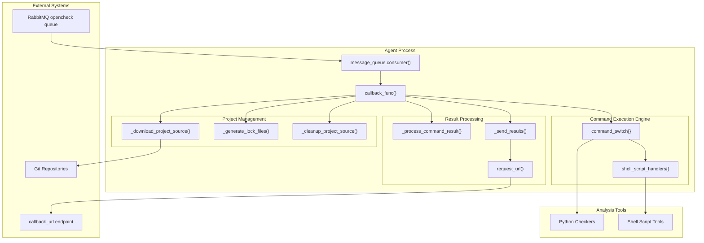
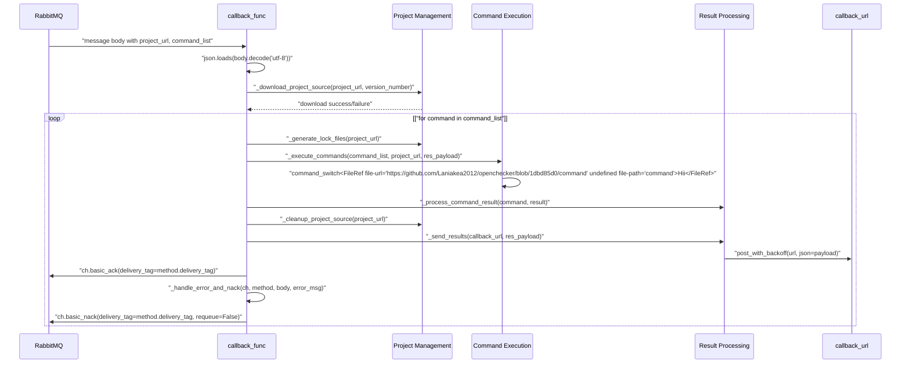
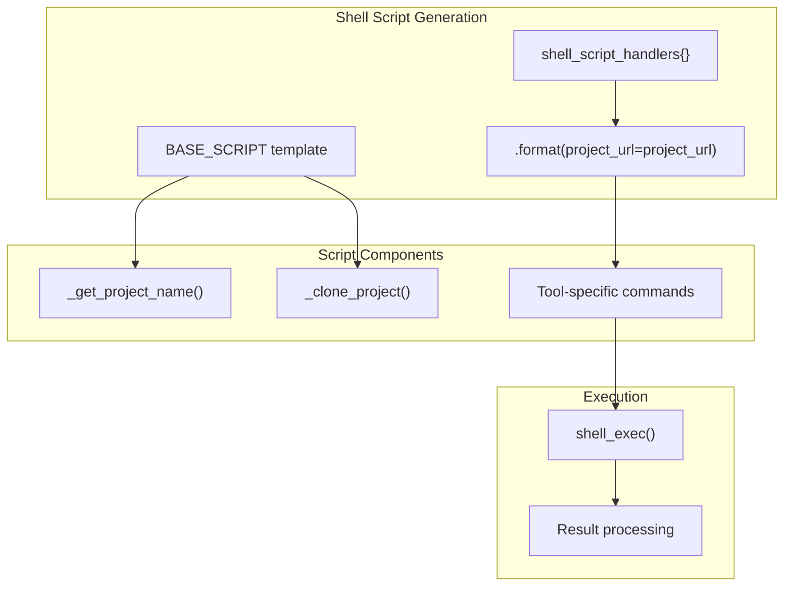
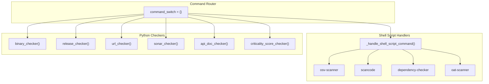
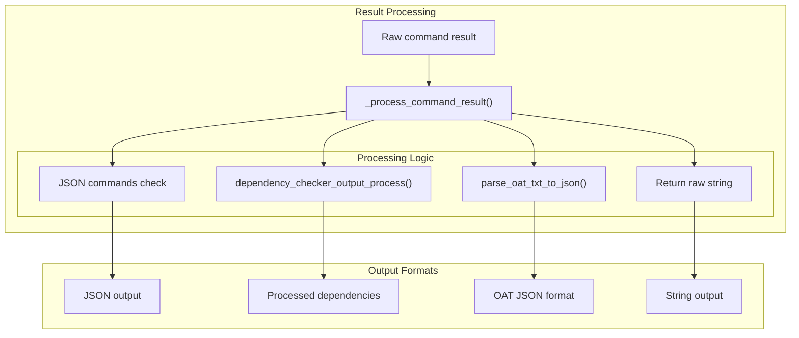

# Agent System and Message Processing

> **Relevant source files**
> * [openchecker/agent.py](https://github.com/Laniakea2012/openchecker/blob/1dbd85d0/openchecker/agent.py)
> * [openchecker/constans.py](https://github.com/Laniakea2012/openchecker/blob/1dbd85d0/openchecker/constans.py)
> * [scripts/binary_checker.sh](https://github.com/Laniakea2012/openchecker/blob/1dbd85d0/scripts/binary_checker.sh)

This document covers the core agent system that processes project analysis tasks through asynchronous message consumption. The agent system is responsible for receiving project check requests from the message queue, executing various analysis tools and checkers, and returning results via callbacks. This includes the message processing workflow, shell script execution framework, and project source management.

For information about the message queue infrastructure and RabbitMQ configuration, see [Message Queue Integration](/Laniakea2012/openchecker/2.2-message-queue-integration). For details on the REST API that publishes tasks to the queue, see [REST API Server](/Laniakea2012/openchecker/3.1-rest-api-server).

## Agent Architecture Overview

The agent system is built around a central callback function that processes messages from RabbitMQ and orchestrates the execution of various analysis tools.



Sources: [openchecker/agent.py L197-L581](https://github.com/Laniakea2012/openchecker/blob/1dbd85d0/openchecker/agent.py#L197-L581)

 [openchecker/agent.py L53](https://github.com/Laniakea2012/openchecker/blob/1dbd85d0/openchecker/agent.py#L53-L53)

 [openchecker/constans.py L126-L139](https://github.com/Laniakea2012/openchecker/blob/1dbd85d0/openchecker/constans.py#L126-L139)

## Message Processing Workflow

The `callback_func` serves as the main entry point for processing project analysis requests from the message queue.



Sources: [openchecker/agent.py L197-L299](https://github.com/Laniakea2012/openchecker/blob/1dbd85d0/openchecker/agent.py#L197-L299)

 [openchecker/agent.py L351-L411](https://github.com/Laniakea2012/openchecker/blob/1dbd85d0/openchecker/agent.py#L351-L411)

 [openchecker/agent.py L519-L531](https://github.com/Laniakea2012/openchecker/blob/1dbd85d0/openchecker/agent.py#L519-L531)

## Shell Script Handler System

The agent system uses a template-based shell script framework defined in `constans.py` to execute external analysis tools consistently.

| Handler Name | Purpose | Shell Script Template |
| --- | --- | --- |
| `download-checkout` | Download and checkout project source | `download_checkout_shell_script` |
| `generate-lock_files` | Generate package lock files | `generate_lock_files_shell_script` |
| `osv-scanner` | Vulnerability scanning | `osv_scanner_shell_script` |
| `scancode` | License analysis | `scancode_shell_script` |
| `dependency-checker` | Dependency analysis | `dependency_checker_shell_script` |
| `oat-scanner` | OpenHarmony audit | `oat_scanner_shell_script` |
| `remove-source-code` | Cleanup project files | `remove_source_code_shell_script` |

The shell script handlers use a base script template that includes project name extraction and git cloning:



Sources: [openchecker/constans.py L1-L139](https://github.com/Laniakea2012/openchecker/blob/1dbd85d0/openchecker/constans.py#L1-L139)

 [openchecker/agent.py L413-L446](https://github.com/Laniakea2012/openchecker/blob/1dbd85d0/openchecker/agent.py#L413-L446)

 [openchecker/agent.py L48](https://github.com/Laniakea2012/openchecker/blob/1dbd85d0/openchecker/agent.py#L48-L48)

## Command Execution Framework

The agent uses a command switch dictionary to map command names to their corresponding execution functions, supporting both Python-based checkers and shell script handlers.



The command execution loop processes each command in the `command_list` and handles exceptions gracefully:

```xml
for command in command_list:
    if command in command_switch:
        try:
            command_switch<FileRef file-url="https://github.com/Laniakea2012/openchecker/blob/1dbd85d0/command" undefined  file-path="command">Hii</FileRef>
        except Exception as e:
            logger.error(f"Error executing command {command}: {e}")
            res_payload["scan_results"][command] = {"error": str(e)}
    else:
        logger.warning(f"Unknown command: {command}")
```

Sources: [openchecker/agent.py L368-L411](https://github.com/Laniakea2012/openchecker/blob/1dbd85d0/openchecker/agent.py#L368-L411)

 [openchecker/agent.py L413-L446](https://github.com/Laniakea2012/openchecker/blob/1dbd85d0/openchecker/agent.py#L413-L446)

## Project Source Management

The agent manages project source code through a three-phase lifecycle: download, processing, and cleanup.

### Download Phase

The `_download_project_source` function uses the `download-checkout` shell script template to clone repositories and optionally checkout specific versions:

```
shell_script = shell_script_handlers["download-checkout"].format(
    project_url=project_url, 
    version_number=version_number
)
result, error = shell_exec(shell_script)
```

### Lock File Generation

The `_generate_lock_files` function creates package lock files for Node.js and OpenHarmony projects:

* Detects `package.json` and generates `package-lock.json` via `npm install`
* Detects `oh-package.json5` and generates `oh-package-lock.json5` via `ohpm install`

### Cleanup Phase

The `_cleanup_project_source` function removes project directories after analysis completion using the `remove-source-code` shell script template.

Sources: [openchecker/agent.py L301-L329](https://github.com/Laniakea2012/openchecker/blob/1dbd85d0/openchecker/agent.py#L301-L329)

 [openchecker/agent.py L331-L349](https://github.com/Laniakea2012/openchecker/blob/1dbd85d0/openchecker/agent.py#L331-L349)

 [openchecker/agent.py L480-L498](https://github.com/Laniakea2012/openchecker/blob/1dbd85d0/openchecker/agent.py#L480-L498)

 [openchecker/constans.py L12-L35](https://github.com/Laniakea2012/openchecker/blob/1dbd85d0/openchecker/constans.py#L12-L35)

## Result Processing and Callbacks

The agent processes command results based on the command type and sends formatted results to the callback URL.

### Result Processing Pipeline



### Callback Mechanism

Results are sent to the `callback_url` using exponential backoff retry logic:

```python
def _send_results(callback_url: str, res_payload: Dict[str, Any]) -> None:
    if callback_url:
        try:
            response, err = request_url(callback_url, res_payload)
            if err is None:
                logger.info("Results sent successfully")
            else:
                logger.error(f"Failed to send results: {err}")
```

The `request_url` function wraps `post_with_backoff` for reliable HTTP delivery.

Sources: [openchecker/agent.py L448-L478](https://github.com/Laniakea2012/openchecker/blob/1dbd85d0/openchecker/agent.py#L448-L478)

 [openchecker/agent.py L500-L517](https://github.com/Laniakea2012/openchecker/blob/1dbd85d0/openchecker/agent.py#L500-L517)

 [openchecker/agent.py L177-L194](https://github.com/Laniakea2012/openchecker/blob/1dbd85d0/openchecker/agent.py#L177-L194)

 [openchecker/agent.py L138-L175](https://github.com/Laniakea2012/openchecker/blob/1dbd85d0/openchecker/agent.py#L138-L175)