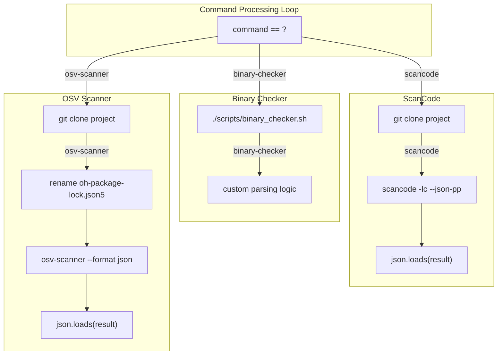
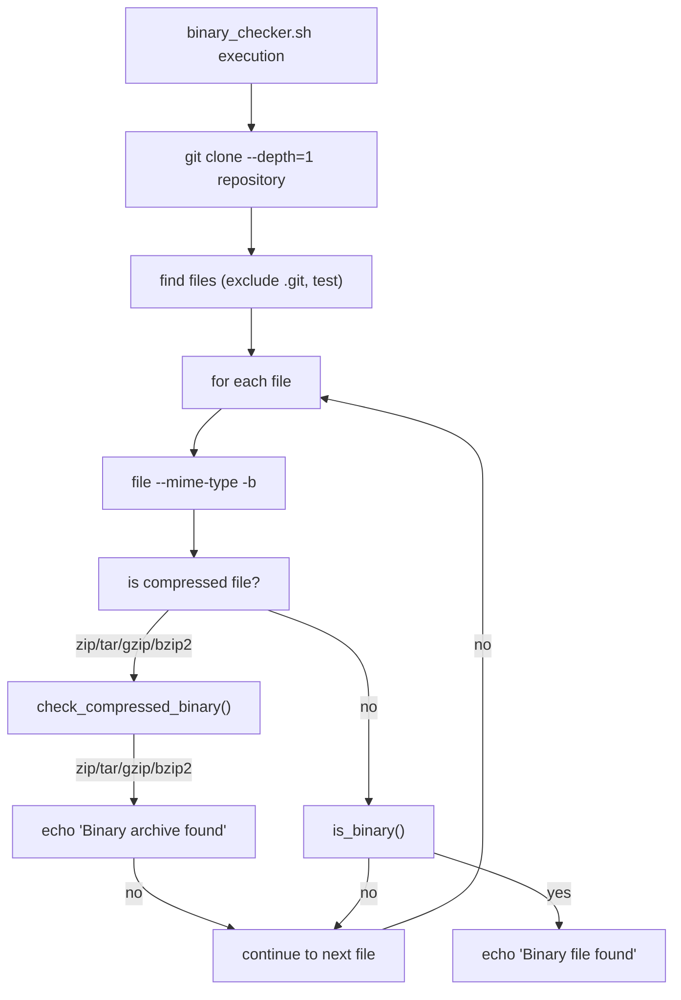
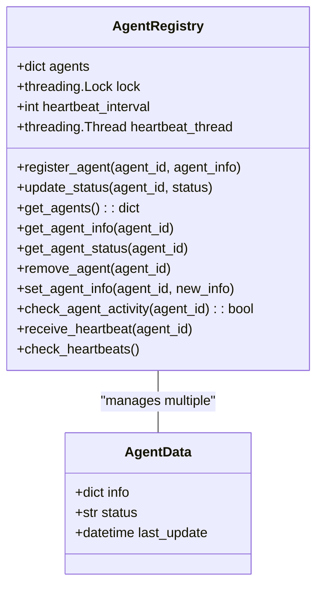
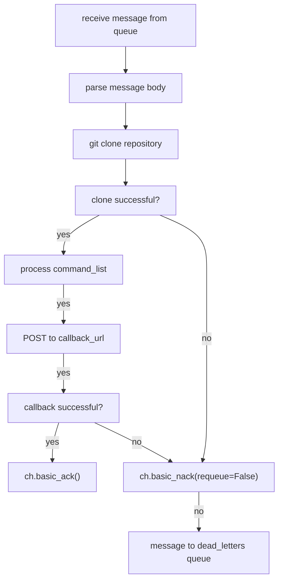

# Agent System

> **Relevant source files**
> * [openchecker/agent.py](https://github.com/Laniakea2012/openchecker/blob/00a9732e/openchecker/agent.py)
> * [openchecker/registry.py](https://github.com/Laniakea2012/openchecker/blob/00a9732e/openchecker/registry.py)
> * [scripts/binary_checker.sh](https://github.com/Laniakea2012/openchecker/blob/00a9732e/scripts/binary_checker.sh)
> * [test/test_registry.py](https://github.com/Laniakea2012/openchecker/blob/00a9732e/test/test_registry.py)

## Purpose and Scope

The Agent System is the core worker component of OpenChecker that executes security and compliance analysis tasks on software projects. This document covers the agent architecture, message processing workflow, analysis tool integration, and agent lifecycle management. For information about the message queue integration details, see [Message Queue Integration](/Laniakea2012/openchecker/2.2-message-queue-integration). For details about individual analysis tools and their configurations, see [Analysis Tools and Checkers](/Laniakea2012/openchecker/4-analysis-tools-and-checkers).

## Agent Architecture Overview

The agent system follows a distributed worker pattern where multiple agent instances consume analysis tasks from a shared message queue and execute various security and compliance checkers on target repositories.

```mermaid
flowchart TD

CallbackFunc["callback_func()"]
ShellExec["shell_exec()"]
RequestUrl["request_url()"]
CheckReadme["check_readme_opensource()"]
CheckDoc["check_doc_content()"]
CheckRelease["check_release_content()"]
DependencyProcess["dependency_checker_output_process()"]
RubyLicenses["ruby_licenses()"]
OSVScanner["osv-scanner command"]
ScanCode["scancode command"]
BinaryChecker["binary-checker script"]
SonarScanner["sonar-scanner command"]
ORTAnalyzer["ort analyze command"]
OATScanner["oat-scanner command"]
RabbitMQ["RabbitMQ Queue"]
CallbackURL["Callback URL"]
GitRepo["Git Repository"]
ConfigFile["config/config.ini"]

    RabbitMQ --> CallbackFunc
    ShellExec --> OSVScanner
    ShellExec --> ScanCode
    ShellExec --> BinaryChecker
    ShellExec --> SonarScanner
    ShellExec --> ORTAnalyzer
    ShellExec --> OATScanner
    CallbackFunc --> CheckReadme
    CallbackFunc --> CheckDoc
    CallbackFunc --> CheckRelease
    CallbackFunc --> DependencyProcess
    RequestUrl --> CallbackURL
    ConfigFile --> CallbackFunc
    GitRepo --> ShellExec
subgraph External_Dependencies ["External Dependencies"]
    RabbitMQ
    CallbackURL
    GitRepo
    ConfigFile
end

subgraph Agent_Worker_Process ["Agent Worker Process"]
    CallbackFunc
    ShellExec
    RequestUrl
    CallbackFunc --> ShellExec
    CallbackFunc --> RequestUrl
end

subgraph Tool_Integrations ["Tool Integrations"]
    OSVScanner
    ScanCode
    BinaryChecker
    SonarScanner
    ORTAnalyzer
    OATScanner
end

subgraph Analysis_Functions ["Analysis Functions"]
    CheckReadme
    CheckDoc
    CheckRelease
    DependencyProcess
    RubyLicenses
end
```



Sources: [openchecker/agent.py L1-L799](https://github.com/Laniakea2012/openchecker/blob/00a9732e/openchecker/agent.py#L1-L799)

## Message Processing Workflow

Each agent continuously consumes messages from the `opencheck` queue and processes them according to the following workflow:

[ERROR_PROCESSING_ELEMENT: PRE]

The message structure consumed by agents contains:

* `command_list`: Array of checker commands to execute
* `project_url`: Git repository URL to analyze
* `callback_url`: URL to POST results to
* `task_metadata`: Additional task information including `version_number`
* `commit_hash`: Optional commit hash for diff analysis

Sources: [openchecker/agent.py L272-L281](https://github.com/Laniakea2012/openchecker/blob/00a9732e/openchecker/agent.py#L272-L281)

 [openchecker/agent.py L285-L291](https://github.com/Laniakea2012/openchecker/blob/00a9732e/openchecker/agent.py#L285-L291)

## Analysis Tools Integration

The agent system integrates multiple analysis tools through shell command execution and specialized processing functions:

### Core Tool Commands

| Command | Tool | Output Processing | Purpose |
| --- | --- | --- | --- |
| `osv-scanner` | OSV Scanner | JSON parsing | Vulnerability detection |
| `scancode` | ScanCode v32.1.0 | JSON parsing | License analysis |
| `binary-checker` | Custom script | Custom parsing | Binary file detection |
| `sonar-scanner` | SonarQube CLI | API integration | Code quality analysis |
| `dependency-checker` | ORT v25.0.0 | `dependency_checker_output_process()` | Dependency analysis |
| `oat-scanner` | OAT Tool v2.0.0 | `parse_oat_txt_to_json()` | OpenHarmony audit |

### Tool Execution Pattern



Sources: [openchecker/agent.py L346-L426](https://github.com/Laniakea2012/openchecker/blob/00a9732e/openchecker/agent.py#L346-L426)

 [openchecker/agent.py L382-L403](https://github.com/Laniakea2012/openchecker/blob/00a9732e/openchecker/agent.py#L382-L403)

 [openchecker/agent.py L405-L426](https://github.com/Laniakea2012/openchecker/blob/00a9732e/openchecker/agent.py#L405-L426)

### Binary Checker Implementation

The binary checker uses a dedicated shell script that identifies binary files and archives within repositories:



Sources: [scripts/binary_checker.sh L1-L93](https://github.com/Laniakea2012/openchecker/blob/00a9732e/scripts/binary_checker.sh#L1-L93)

## Agent Registry and Management

The agent registry system provides centralized tracking and management of agent instances:

### Registry Class Structure



### Agent Lifecycle Management

```
#mermaid-3h56ujkqbd7{font-family:ui-sans-serif,-apple-system,system-ui,Segoe UI,Helvetica;font-size:16px;fill:#333;}@keyframes edge-animation-frame{from{stroke-dashoffset:0;}}@keyframes dash{to{stroke-dashoffset:0;}}#mermaid-3h56ujkqbd7 .edge-animation-slow{stroke-dasharray:9,5!important;stroke-dashoffset:900;animation:dash 50s linear infinite;stroke-linecap:round;}#mermaid-3h56ujkqbd7 .edge-animation-fast{stroke-dasharray:9,5!important;stroke-dashoffset:900;animation:dash 20s linear infinite;stroke-linecap:round;}#mermaid-3h56ujkqbd7 .error-icon{fill:#dddddd;}#mermaid-3h56ujkqbd7 .error-text{fill:#222222;stroke:#222222;}#mermaid-3h56ujkqbd7 .edge-thickness-normal{stroke-width:1px;}#mermaid-3h56ujkqbd7 .edge-thickness-thick{stroke-width:3.5px;}#mermaid-3h56ujkqbd7 .edge-pattern-solid{stroke-dasharray:0;}#mermaid-3h56ujkqbd7 .edge-thickness-invisible{stroke-width:0;fill:none;}#mermaid-3h56ujkqbd7 .edge-pattern-dashed{stroke-dasharray:3;}#mermaid-3h56ujkqbd7 .edge-pattern-dotted{stroke-dasharray:2;}#mermaid-3h56ujkqbd7 .marker{fill:#999;stroke:#999;}#mermaid-3h56ujkqbd7 .marker.cross{stroke:#999;}#mermaid-3h56ujkqbd7 svg{font-family:ui-sans-serif,-apple-system,system-ui,Segoe UI,Helvetica;font-size:16px;}#mermaid-3h56ujkqbd7 p{margin:0;}#mermaid-3h56ujkqbd7 defs #statediagram-barbEnd{fill:#999;stroke:#999;}#mermaid-3h56ujkqbd7 g.stateGroup text{fill:#dddddd;stroke:none;font-size:10px;}#mermaid-3h56ujkqbd7 g.stateGroup text{fill:#333;stroke:none;font-size:10px;}#mermaid-3h56ujkqbd7 g.stateGroup .state-title{font-weight:bolder;fill:#333;}#mermaid-3h56ujkqbd7 g.stateGroup rect{fill:#ffffff;stroke:#dddddd;}#mermaid-3h56ujkqbd7 g.stateGroup line{stroke:#999;stroke-width:1;}#mermaid-3h56ujkqbd7 .transition{stroke:#999;stroke-width:1;fill:none;}#mermaid-3h56ujkqbd7 .stateGroup .composit{fill:#f4f4f4;border-bottom:1px;}#mermaid-3h56ujkqbd7 .stateGroup .alt-composit{fill:#e0e0e0;border-bottom:1px;}#mermaid-3h56ujkqbd7 .state-note{stroke:#e6d280;fill:#fff5ad;}#mermaid-3h56ujkqbd7 .state-note text{fill:#333;stroke:none;font-size:10px;}#mermaid-3h56ujkqbd7 .stateLabel .box{stroke:none;stroke-width:0;fill:#ffffff;opacity:0.5;}#mermaid-3h56ujkqbd7 .edgeLabel .label rect{fill:#ffffff;opacity:0.5;}#mermaid-3h56ujkqbd7 .edgeLabel{background-color:#ffffff;text-align:center;}#mermaid-3h56ujkqbd7 .edgeLabel p{background-color:#ffffff;}#mermaid-3h56ujkqbd7 .edgeLabel rect{opacity:0.5;background-color:#ffffff;fill:#ffffff;}#mermaid-3h56ujkqbd7 .edgeLabel .label text{fill:#333;}#mermaid-3h56ujkqbd7 .label div .edgeLabel{color:#333;}#mermaid-3h56ujkqbd7 .stateLabel text{fill:#333;font-size:10px;font-weight:bold;}#mermaid-3h56ujkqbd7 .node circle.state-start{fill:#999;stroke:#999;}#mermaid-3h56ujkqbd7 .node .fork-join{fill:#999;stroke:#999;}#mermaid-3h56ujkqbd7 .node circle.state-end{fill:#dddddd;stroke:#f4f4f4;stroke-width:1.5;}#mermaid-3h56ujkqbd7 .end-state-inner{fill:#f4f4f4;stroke-width:1.5;}#mermaid-3h56ujkqbd7 .node rect{fill:#ffffff;stroke:#dddddd;stroke-width:1px;}#mermaid-3h56ujkqbd7 .node polygon{fill:#ffffff;stroke:#dddddd;stroke-width:1px;}#mermaid-3h56ujkqbd7 #statediagram-barbEnd{fill:#999;}#mermaid-3h56ujkqbd7 .statediagram-cluster rect{fill:#ffffff;stroke:#dddddd;stroke-width:1px;}#mermaid-3h56ujkqbd7 .cluster-label,#mermaid-3h56ujkqbd7 .nodeLabel{color:#333;}#mermaid-3h56ujkqbd7 .statediagram-cluster rect.outer{rx:5px;ry:5px;}#mermaid-3h56ujkqbd7 .statediagram-state .divider{stroke:#dddddd;}#mermaid-3h56ujkqbd7 .statediagram-state .title-state{rx:5px;ry:5px;}#mermaid-3h56ujkqbd7 .statediagram-cluster.statediagram-cluster .inner{fill:#f4f4f4;}#mermaid-3h56ujkqbd7 .statediagram-cluster.statediagram-cluster-alt .inner{fill:#f8f8f8;}#mermaid-3h56ujkqbd7 .statediagram-cluster .inner{rx:0;ry:0;}#mermaid-3h56ujkqbd7 .statediagram-state rect.basic{rx:5px;ry:5px;}#mermaid-3h56ujkqbd7 .statediagram-state rect.divider{stroke-dasharray:10,10;fill:#f8f8f8;}#mermaid-3h56ujkqbd7 .note-edge{stroke-dasharray:5;}#mermaid-3h56ujkqbd7 .statediagram-note rect{fill:#fff5ad;stroke:#e6d280;stroke-width:1px;rx:0;ry:0;}#mermaid-3h56ujkqbd7 .statediagram-note rect{fill:#fff5ad;stroke:#e6d280;stroke-width:1px;rx:0;ry:0;}#mermaid-3h56ujkqbd7 .statediagram-note text{fill:#333;}#mermaid-3h56ujkqbd7 .statediagram-note .nodeLabel{color:#333;}#mermaid-3h56ujkqbd7 .statediagram .edgeLabel{color:red;}#mermaid-3h56ujkqbd7 #dependencyStart,#mermaid-3h56ujkqbd7 #dependencyEnd{fill:#999;stroke:#999;stroke-width:1;}#mermaid-3h56ujkqbd7 .statediagramTitleText{text-anchor:middle;font-size:18px;fill:#333;}#mermaid-3h56ujkqbd7 :root{--mermaid-font-family:"trebuchet ms",verdana,arial,sans-serif;}register_agent()update_status("busy")missed heartbeatsupdate_status("active")missed heartbeatsreceive_heartbeat()remove_agent()remove_agent()UnregisteredActiveBusyInactive
```

The registry maintains agent state through:

* **Registration**: Agents register with unique ID and metadata
* **Heartbeat Monitoring**: Background thread checks for agent activity every 30 seconds
* **Status Tracking**: Active, busy, inactive states based on last update time
* **Thread Safety**: All operations protected by threading locks

Sources: [openchecker/registry.py L5-L94](https://github.com/Laniakea2012/openchecker/blob/00a9732e/openchecker/registry.py#L5-L94)

 [test/test_registry.py L1-L45](https://github.com/Laniakea2012/openchecker/blob/00a9732e/test/test_registry.py#L1-L45)

## Error Handling and Message Acknowledgment

The agent system implements robust error handling to ensure message reliability:

### Message Acknowledgment Flow



Key error handling patterns:

* **Repository Clone Failures**: Messages are negatively acknowledged and sent to dead letter queue
* **Callback Failures**: Failed callback requests trigger message requeuing to dead letters
* **Tool Execution Errors**: Individual tool failures are captured in result payload but don't fail entire job
* **Resource Cleanup**: Project directories are always removed after processing

Sources: [openchecker/agent.py L316-L324](https://github.com/Laniakea2012/openchecker/blob/00a9732e/openchecker/agent.py#L316-L324)

 [openchecker/agent.py L784-L795](https://github.com/Laniakea2012/openchecker/blob/00a9732e/openchecker/agent.py#L784-L795)

## Configuration and Deployment

Agents are configured through `config/config.ini` and deployed as Kubernetes pods consuming from the shared RabbitMQ instance. The main execution entry point initializes the consumer with the callback function:

```
if __name__ == "__main__":
    consumer(config["RabbitMQ"], "opencheck", callback_func)
```

This creates a persistent connection to RabbitMQ that continuously processes messages from the `opencheck` queue using the `callback_func` as the message handler.

Sources: [openchecker/agent.py L797-L799](https://github.com/Laniakea2012/openchecker/blob/00a9732e/openchecker/agent.py#L797-L799)

 [openchecker/agent.py

19](https://github.com/Laniakea2012/openchecker/blob/00a9732e/openchecker/agent.py#L19-L19)