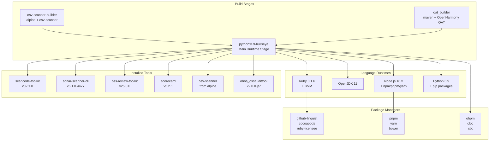
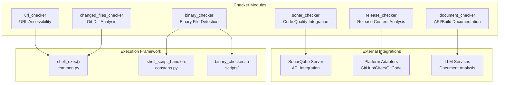
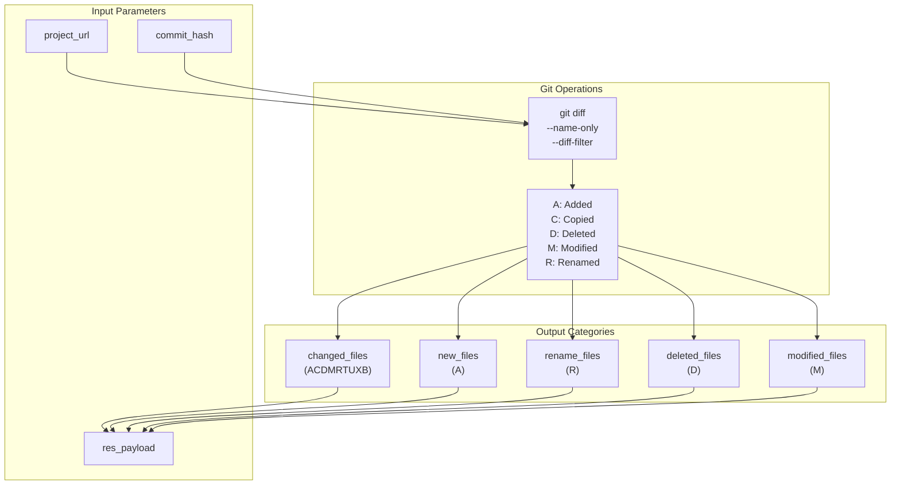
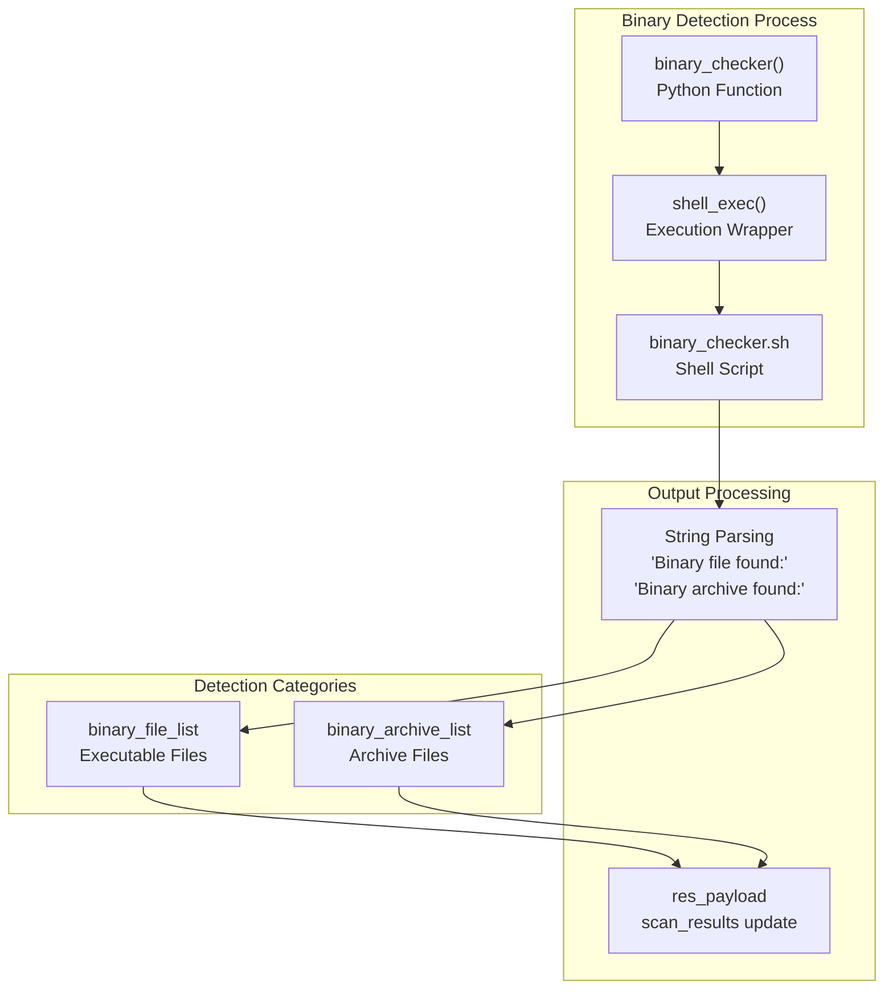
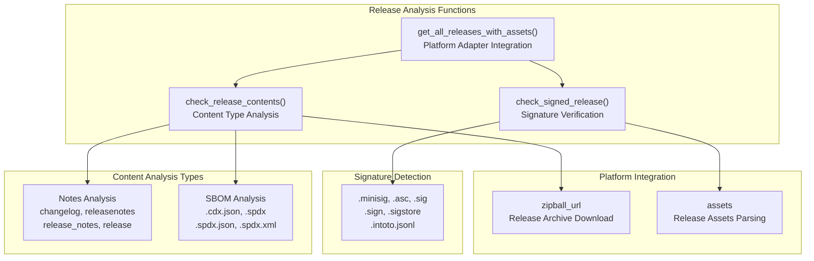
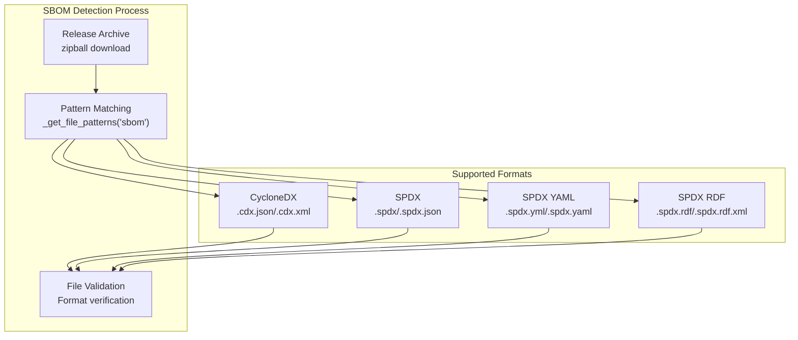

# Analysis Tools and Checkers

> **Relevant source files**
> * [Dockerfile](https://github.com/Laniakea2012/openchecker/blob/1dbd85d0/Dockerfile)
> * [config/ohpm_repo.json](https://github.com/Laniakea2012/openchecker/blob/1dbd85d0/config/ohpm_repo.json)
> * [openchecker/checkers/binary_checker.py](https://github.com/Laniakea2012/openchecker/blob/1dbd85d0/openchecker/checkers/binary_checker.py)
> * [openchecker/checkers/changed_files_checker.py](https://github.com/Laniakea2012/openchecker/blob/1dbd85d0/openchecker/checkers/changed_files_checker.py)
> * [openchecker/checkers/document_checker.py](https://github.com/Laniakea2012/openchecker/blob/1dbd85d0/openchecker/checkers/document_checker.py)
> * [openchecker/checkers/release_checker.py](https://github.com/Laniakea2012/openchecker/blob/1dbd85d0/openchecker/checkers/release_checker.py)
> * [openchecker/checkers/sonar_checker.py](https://github.com/Laniakea2012/openchecker/blob/1dbd85d0/openchecker/checkers/sonar_checker.py)
> * [openchecker/checkers/url_checker.py](https://github.com/Laniakea2012/openchecker/blob/1dbd85d0/openchecker/checkers/url_checker.py)
> * [openchecker/user_manager.py](https://github.com/Laniakea2012/openchecker/blob/1dbd85d0/openchecker/user_manager.py)
> * [scripts/entrypoint.sh](https://github.com/Laniakea2012/openchecker/blob/1dbd85d0/scripts/entrypoint.sh)
> * [test/test_server.py](https://github.com/Laniakea2012/openchecker/blob/1dbd85d0/test/test_server.py)

This document covers the comprehensive analysis tools ecosystem and checker framework within OpenChecker. The system provides automated analysis capabilities for software projects including vulnerability scanning, license detection, code quality assessment, and compliance checking through a containerized environment with integrated external tools.

For information about the core agent system that executes these tools, see [Core Architecture](/Laniakea2012/openchecker/2-core-architecture). For details about external service integration and platform adapters, see [Platform Integration and External Services](/Laniakea2012/openchecker/5-platform-integration-and-external-services).

## Container Environment and Tool Installation

OpenChecker operates within a comprehensive Docker-based environment that includes numerous analysis tools and package managers. The container setup provides a unified runtime for all analysis operations.

### Multi-Stage Build Architecture



The container environment includes specialized tools for different analysis domains:

* **Vulnerability Scanning**: `osv-scanner` for security vulnerability detection
* **License Analysis**: `scancode-toolkit` for comprehensive license scanning
* **Code Quality**: `sonar-scanner-cli` for static code analysis integration
* **Supply Chain**: `oss-review-toolkit` (ORT) for dependency analysis
* **Security Assessment**: `scorecard` for security posture evaluation
* **OpenHarmony Compliance**: `ohos_ossaudittool` for ecosystem-specific auditing

Sources: [Dockerfile L1-L91](https://github.com/Laniakea2012/openchecker/blob/1dbd85d0/Dockerfile#L1-L91)

### Language Runtime and Package Manager Support

The container provides comprehensive language support enabling analysis across diverse technology stacks:

| Language/Runtime | Tools Installed | Package Managers |
| --- | --- | --- |
| Ruby | RVM, Ruby 3.1.6, github-linguist, cocoapods, ruby-licensee | gem |
| Java | OpenJDK 11, sbt | maven, sbt |
| Node.js | Node.js 18.x | npm, pnpm, yarn, bower |
| Python | Python 3.9, criticality_score | pip |
| OpenHarmony | ohpm_cli_tool, pm-cli.js | ohpm |
| Generic | cloc (line counting) | - |

Sources: [Dockerfile L52-L87](https://github.com/Laniakea2012/openchecker/blob/1dbd85d0/Dockerfile#L52-L87)

## Checker Framework and Execution

The checker framework provides modular analysis capabilities through individual checker modules that can be invoked independently or as part of comprehensive project analysis workflows.

### Core Checker Architecture



### File Change Detection System

The `changed_files_detector` function provides Git-based analysis for tracking project modifications:



The system uses Git's `diff-filter` capabilities to categorize file changes, enabling targeted analysis of specific change types.

Sources: [openchecker/checkers/changed_files_checker.py L10-L77](https://github.com/Laniakea2012/openchecker/blob/1dbd85d0/openchecker/checkers/changed_files_checker.py#L10-L77)

### URL Accessibility Validation

The `url_checker` module provides basic connectivity validation for project URLs:

* **Function**: `url_checker(project_url, res_payload)`
* **Method**: HTTP GET request with 10-second timeout
* **Output**: Status code and accessibility boolean
* **Error Handling**: Exception capture with error message logging

Sources: [openchecker/checkers/url_checker.py L8-L25](https://github.com/Laniakea2012/openchecker/blob/1dbd85d0/openchecker/checkers/url_checker.py#L8-L25)

## Security and Compliance Analysis

The security analysis capabilities focus on vulnerability detection, binary file identification, and compliance verification through multiple specialized tools and custom implementations.

### Binary File Detection System



The binary checker identifies potentially problematic binary files within source repositories by delegating to a shell script and parsing structured output.

Sources: [openchecker/checkers/binary_checker.py L9-L42](https://github.com/Laniakea2012/openchecker/blob/1dbd85d0/openchecker/checkers/binary_checker.py#L9-L42)

### Document Compliance Analysis

The document checker system provides AI-powered analysis of documentation completeness and README.OpenSource file validation:

#### API and Build Documentation Analysis

* **Function**: `check_doc_content(project_url, doc_type)`
* **Document Types**: `"api-doc"` and `"build-doc"`
* **Analysis Method**: LLM-based content evaluation with chunked processing
* **File Discovery**: Recursive search in `project/`, `project/doc/`, `project/docs/`
* **LLM Integration**: Uses `completion_with_backoff()` for reliable AI analysis

#### README.OpenSource Validation

* **Function**: `check_readme_opensource(project_url)`
* **Format**: JSON structure validation
* **Required Fields**: Name, License, License File, Version Number, Owner, Upstream URL, Description
* **Validation**: JSON parsing and required key verification

Sources: [openchecker/checkers/document_checker.py L11-L200](https://github.com/Laniakea2012/openchecker/blob/1dbd85d0/openchecker/checkers/document_checker.py#L11-L200)

## Supply Chain and Quality Analysis

The supply chain analysis encompasses release content verification, signed release detection, and code quality integration through SonarQube.

### Release Content Analysis System



The release analysis system provides comprehensive validation of release artifacts including:

* **Release Notes**: Automated detection of changelog and release documentation
* **SBOM Files**: Software Bill of Materials validation in multiple formats
* **Digital Signatures**: Cryptographic signature verification across common formats
* **Platform Support**: GitHub, Gitee, and GitCode compatibility

Sources: [openchecker/checkers/release_checker.py L14-L282](https://github.com/Laniakea2012/openchecker/blob/1dbd85d0/openchecker/checkers/release_checker.py#L14-L282)

### SonarQube Integration Framework

The SonarQube integration provides automated code quality analysis with project lifecycle management:

#### Project Management Workflow

```mermaid
sequenceDiagram
  participant sonar_checker()
  participant platform_manager
  participant SonarQube Server
  participant shell_exec()

  sonar_checker()->>platform_manager: "parse_project_url()"
  platform_manager-->>sonar_checker(): "owner_name, repo_name"
  sonar_checker()->>SonarQube Server: "_check_sonar_project_exists()"
  SonarQube Server-->>sonar_checker(): "project_exists: boolean"
  loop [Project Does Not Exist]
    sonar_checker()->>SonarQube Server: "_create_sonar_project()"
    SonarQube Server-->>sonar_checker(): "project_created"
  end
  sonar_checker()->>shell_exec(): "shell_script_handlers['sonar-scanner']"
  shell_exec()-->>sonar_checker(): "scan_complete"
  sonar_checker()->>SonarQube Server: "_query_sonar_measures()"
  SonarQube Server-->>sonar_checker(): "analysis_results"
```

#### Metrics Collection

The system queries specific SonarQube metrics after analysis completion:

* **Coverage**: Test coverage percentage
* **Complexity**: Cyclomatic complexity measurement
* **Duplicated Lines Density**: Code duplication percentage
* **Lines**: Total lines of code

Sources: [openchecker/checkers/sonar_checker.py L14-L173](https://github.com/Laniakea2012/openchecker/blob/1dbd85d0/openchecker/checkers/sonar_checker.py#L14-L173)

## SBOM Analysis

Software Bill of Materials (SBOM) analysis is integrated into the release content analysis system, providing automated detection and validation of SBOM files within project releases.

### SBOM Format Support

The system supports multiple SBOM formats through pattern matching:

| Format | File Extensions | Pattern |
| --- | --- | --- |
| CycloneDX | `.cdx.json`, `.cdx.xml` | Case-insensitive regex |
| SPDX | `.spdx`, `.spdx.json`, `.spdx.xml` | Multiple format support |
| SPDX YAML | `.spdx.yml`, `.spdx.yaml` | YAML variants |
| SPDX RDF | `.spdx.rdf`, `.spdx.rdf.xml` | RDF serialization |

### SBOM Detection Workflow



The SBOM analysis is performed as part of the comprehensive release checker workflow, providing automated compliance verification for software supply chain transparency requirements.

Sources: [openchecker/checkers/release_checker.py L153-L171](https://github.com/Laniakea2012/openchecker/blob/1dbd85d0/openchecker/checkers/release_checker.py#L153-L171)