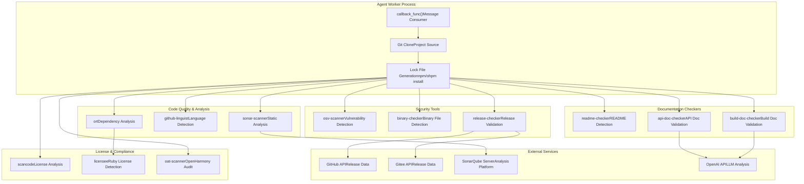
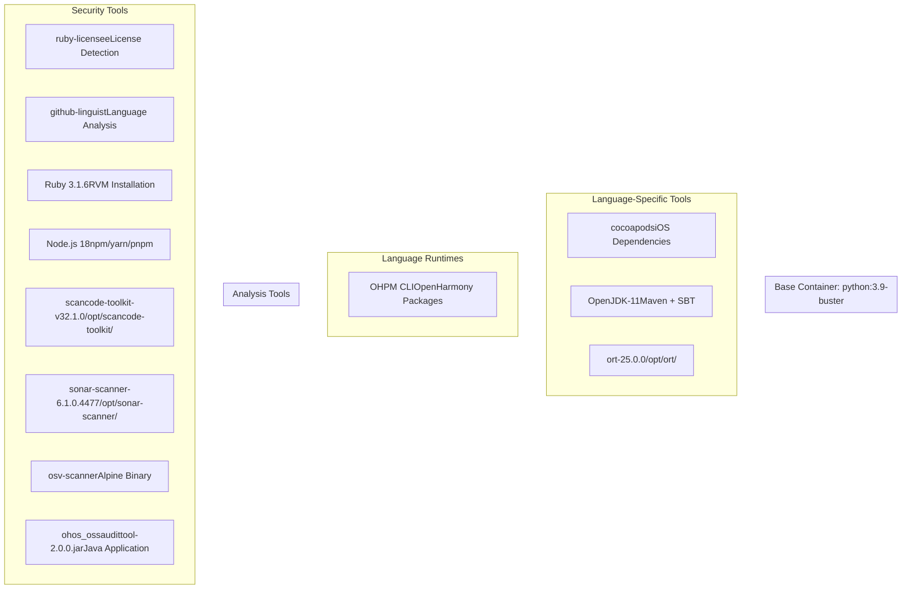
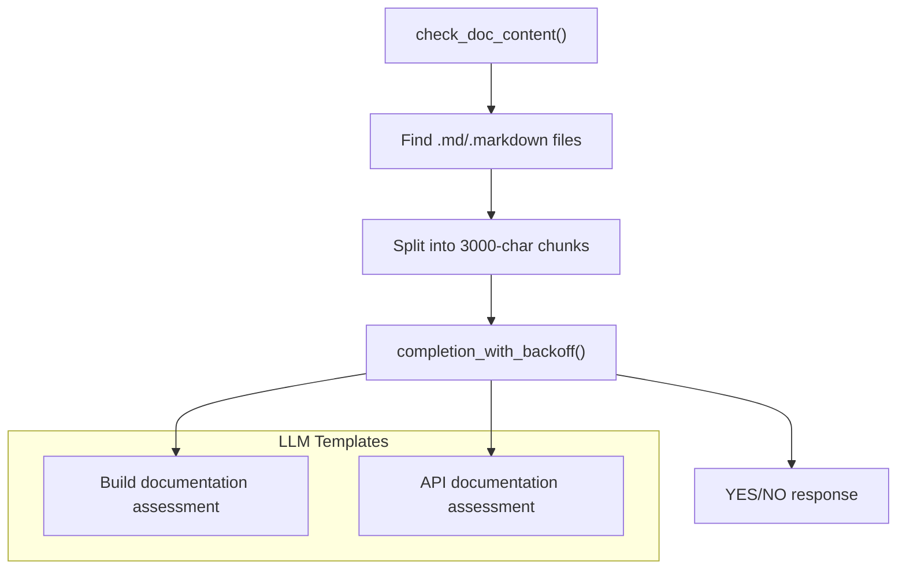
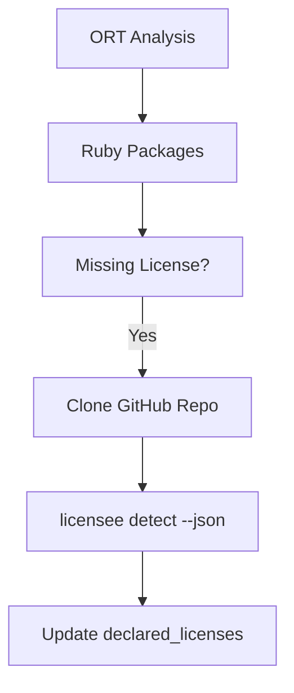

# Analysis Tools and Checkers

> **Relevant source files**
> * [Dockerfile](https://github.com/Laniakea2012/openchecker/blob/00a9732e/Dockerfile)
> * [openchecker/agent.py](https://github.com/Laniakea2012/openchecker/blob/00a9732e/openchecker/agent.py)
> * [scripts/binary_checker.sh](https://github.com/Laniakea2012/openchecker/blob/00a9732e/scripts/binary_checker.sh)
> * [scripts/entrypoint.sh](https://github.com/Laniakea2012/openchecker/blob/00a9732e/scripts/entrypoint.sh)

This document provides a comprehensive overview of the analysis tools and checkers integrated into the OpenChecker system. These tools perform security scanning, compliance checking, license analysis, code quality assessment, and various other automated checks on software projects.

For detailed information about the container environment setup and tool installation, see [Container Environment and Tool Installation](/Laniakea2012/openchecker/4.1-container-environment-and-tool-installation). For in-depth documentation of individual checker implementations, see [Security and Compliance Checkers](/Laniakea2012/openchecker/4.2-security-and-compliance-checkers).

## Overview

The OpenChecker system integrates multiple industry-standard analysis tools into a unified platform for comprehensive software project assessment. These tools are containerized and executed by agent workers that process analysis requests asynchronously through a message queue system.

The analysis tools fall into several categories:

| Category | Tools | Purpose |
| --- | --- | --- |
| **Security & Vulnerability** | OSV-Scanner, Binary Checker | Detect known vulnerabilities and binary files |
| **License & Compliance** | ScanCode, Licensee, OAT Scanner | Analyze license compliance and OpenHarmony audit |
| **Code Quality** | SonarQube Scanner | Static code analysis and quality metrics |
| **Dependency Analysis** | ORT, Ruby Licensee | Package dependency and license detection |
| **Documentation** | README/API/Build Doc Checkers | Validate project documentation completeness |
| **Project Analysis** | Language Detector, Release Checker | Project metadata and release validation |

Sources: [openchecker/agent.py L346-L766](https://github.com/Laniakea2012/openchecker/blob/00a9732e/openchecker/agent.py#L346-L766)

 [Dockerfile L1-L81](https://github.com/Laniakea2012/openchecker/blob/00a9732e/Dockerfile#L1-L81)

## Analysis Tools Architecture



Sources: [openchecker/agent.py L272-L795](https://github.com/Laniakea2012/openchecker/blob/00a9732e/openchecker/agent.py#L272-L795)

 [openchecker/agent.py L346-L766](https://github.com/Laniakea2012/openchecker/blob/00a9732e/openchecker/agent.py#L346-L766)

## Tool Integration Workflow

The analysis tools are executed through a command-based system where each tool corresponds to a specific command string. The agent worker processes these commands sequentially for each project analysis request.

### Command Processing Flow

[ERROR_PROCESSING_ELEMENT: PRE]

Sources: [openchecker/agent.py L272-L295](https://github.com/Laniakea2012/openchecker/blob/00a9732e/openchecker/agent.py#L272-L295)

 [openchecker/agent.py L784-L795](https://github.com/Laniakea2012/openchecker/blob/00a9732e/openchecker/agent.py#L784-L795)

### Supported Commands

The system supports the following analysis commands:

| Command | Tool | Function | Output Format |
| --- | --- | --- | --- |
| `osv-scanner` | OSV Scanner | Vulnerability detection | JSON with CVE data |
| `scancode` | ScanCode Toolkit | License analysis | JSON with license info |
| `binary-checker` | Custom script | Binary file detection | List of binary files/archives |
| `release-checker` | Custom function | Release validation | Release metadata and signatures |
| `sonar-scanner` | SonarQube CLI | Code quality analysis | SonarQube metrics |
| `dependency-checker` | ORT | Dependency analysis | Package URLs and licenses |
| `readme-checker` | Find command | README file detection | List of README files |
| `maintainers-checker` | Find command | Maintainer file detection | List of maintainer files |
| `readme-opensource-checker` | Custom function | OpenSource README validation | Validation status |
| `build-doc-checker` | LLM analysis | Build documentation validation | LLM assessment |
| `api-doc-checker` | LLM analysis | API documentation validation | LLM assessment |
| `languages-detector` | GitHub Linguist | Programming language detection | Language breakdown |
| `changed-files-since-commit-detector` | Git diff | File change analysis | Changed file lists |
| `oat-scanner` | OAT Tool | OpenHarmony audit | Audit report |
| `url-checker` | URL validation | URL accessibility check | Status validation |

Sources: [openchecker/agent.py L347-L766](https://github.com/Laniakea2012/openchecker/blob/00a9732e/openchecker/agent.py#L347-L766)

## Container Environment and Tool Installation

The analysis tools are installed in a multi-stage Docker container that provides all necessary runtime environments and dependencies.

### Container Tool Ecosystem



Sources: [Dockerfile L1-L81](https://github.com/Laniakea2012/openchecker/blob/00a9732e/Dockerfile#L1-L81)

 [Dockerfile L28-L51](https://github.com/Laniakea2012/openchecker/blob/00a9732e/Dockerfile#L28-L51)

 [Dockerfile L53-L68](https://github.com/Laniakea2012/openchecker/blob/00a9732e/Dockerfile#L53-L68)

## Output Format and Results Aggregation

All analysis results are aggregated into a standardized JSON payload structure that is sent to the callback URL upon completion.

### Result Payload Structure

The `res_payload` object contains:

```
{
  "command_list": ["osv-scanner", "scancode", "binary-checker"],
  "project_url": "https://github.com/example/project.git",
  "task_metadata": {
    "version_number": "v1.0.0"
  },
  "scan_results": {
    "osv-scanner": {},
    "scancode": {},
    "binary-checker": {
      "binary_file_list": [],
      "binary_archive_list": []
    }
  }
}
```

### Error Handling

When analysis tools encounter errors, the system captures error information and includes it in the results:

* Tool execution failures are logged with error messages
* Failed jobs include an `error` field in their scan results
* Network failures during callback delivery trigger message requeue to dead letter queue

Sources: [openchecker/agent.py L285-L291](https://github.com/Laniakea2012/openchecker/blob/00a9732e/openchecker/agent.py#L285-L291)

 [openchecker/agent.py L784-L795](https://github.com/Laniakea2012/openchecker/blob/00a9732e/openchecker/agent.py#L784-L795)

 [openchecker/agent.py L320-L324](https://github.com/Laniakea2012/openchecker/blob/00a9732e/openchecker/agent.py#L320-L324)

## Special Tool Implementations

### LLM-Enhanced Documentation Checkers

The `build-doc-checker` and `api-doc-checker` use Large Language Model integration to assess documentation quality:



Sources: [openchecker/agent.py L148-L221](https://github.com/Laniakea2012/openchecker/blob/00a9732e/openchecker/agent.py#L148-L221)

 [openchecker/agent.py L602-L618](https://github.com/Laniakea2012/openchecker/blob/00a9732e/openchecker/agent.py#L602-L618)

### Binary File Detection

The `binary-checker` uses a custom shell script that can detect binary files and analyze compressed archives:

* Supports ZIP, TAR, GZIP, and BZIP2 archives
* Uses `file --mime-type` for detection
* Recursively analyzes archive contents
* Excludes `.git` and `test` directories

Sources: [scripts/binary_checker.sh L1-L93](https://github.com/Laniakea2012/openchecker/blob/00a9732e/scripts/binary_checker.sh#L1-L93)

 [openchecker/agent.py L405-L426](https://github.com/Laniakea2012/openchecker/blob/00a9732e/openchecker/agent.py#L405-L426)

### Ruby License Enhancement

The `dependency-checker` includes special logic to enhance license detection for Ruby packages using the `licensee` tool when declared licenses are missing:



Sources: [openchecker/agent.py L29-L65](https://github.com/Laniakea2012/openchecker/blob/00a9732e/openchecker/agent.py#L29-L65)

 [openchecker/agent.py L67-L89](https://github.com/Laniakea2012/openchecker/blob/00a9732e/openchecker/agent.py#L67-L89)