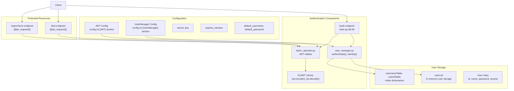
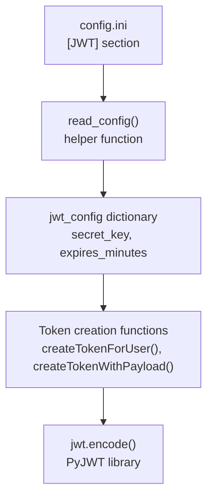
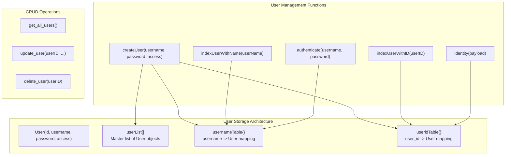
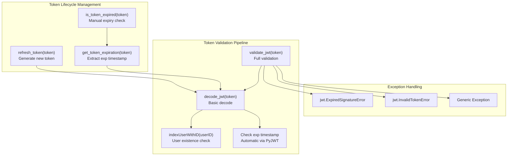
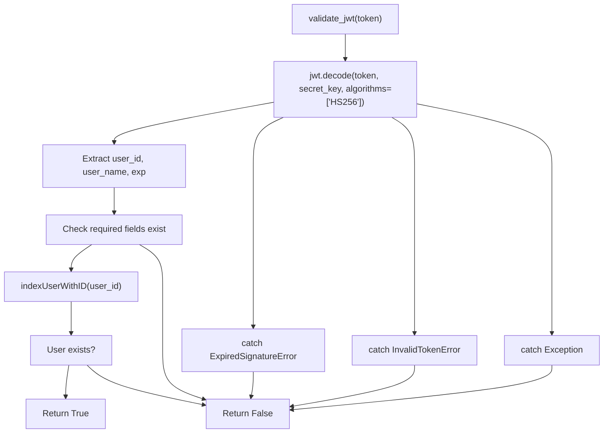
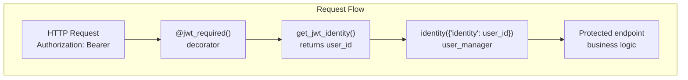

# Authentication and User Management

> **Relevant source files**
> * [Dockerfile](https://github.com/Laniakea2012/openchecker/blob/1dbd85d0/Dockerfile)
> * [config/ohpm_repo.json](https://github.com/Laniakea2012/openchecker/blob/1dbd85d0/config/ohpm_repo.json)
> * [openchecker/token_operator.py](https://github.com/Laniakea2012/openchecker/blob/1dbd85d0/openchecker/token_operator.py)
> * [openchecker/user_manager.py](https://github.com/Laniakea2012/openchecker/blob/1dbd85d0/openchecker/user_manager.py)
> * [scripts/entrypoint.sh](https://github.com/Laniakea2012/openchecker/blob/1dbd85d0/scripts/entrypoint.sh)
> * [test/test_server.py](https://github.com/Laniakea2012/openchecker/blob/1dbd85d0/test/test_server.py)
> * [test/test_token_operator.py](https://github.com/Laniakea2012/openchecker/blob/1dbd85d0/test/test_token_operator.py)

## Purpose and Scope

This document covers the JWT-based authentication system and user management components of OpenChecker. It details how users authenticate with the system, how JWT tokens are generated and validated, how the user management system stores and manages user accounts, and how protected API endpoints enforce authorization. For information about the REST API endpoints that utilize this authentication system, see [REST API Server](/Laniakea2012/openchecker/3.1-rest-api-server).

## Authentication System Overview

OpenChecker implements a JWT (JSON Web Token) based authentication system using the PyJWT library. The system provides stateless authentication where clients obtain JWT tokens by authenticating with credentials, then include these tokens in subsequent API requests.



**Sources:** [openchecker/main.py L24-L35](https://github.com/Laniakea2012/openchecker/blob/1dbd85d0/openchecker/main.py#L24-L35)

 [openchecker/main.py L37-L56](https://github.com/Laniakea2012/openchecker/blob/1dbd85d0/openchecker/main.py#L37-L56)

 [openchecker/token_operator.py L1-L10](https://github.com/Laniakea2012/openchecker/blob/1dbd85d0/openchecker/token_operator.py#L1-L10)

 [openchecker/user_manager.py L1-L18](https://github.com/Laniakea2012/openchecker/blob/1dbd85d0/openchecker/user_manager.py#L1-L18)

## JWT Configuration and Setup

The JWT system is configured through the `config.ini` file and used directly via the PyJWT library. Key configuration parameters include the secret key for token signing and token expiration time.

| Configuration Parameter | Default Value | Description |
| --- | --- | --- |
| `secret_key` | "your_secret_key" | Secret key for signing JWT tokens |
| `expires_minutes` | 30 | Token expiration time in minutes |

The token operator module reads JWT configuration during module initialization:



**Sources:** [openchecker/token_operator.py L6-L9](https://github.com/Laniakea2012/openchecker/blob/1dbd85d0/openchecker/token_operator.py#L6-L9)

## User Authentication Flow

The authentication process supports both HTTP Basic Authentication and JSON-based credential submission through the `/auth` endpoint.

```mermaid
sequenceDiagram
  participant Client
  participant /auth endpoint
  participant user_manager.authenticate()
  participant create_access_token()

  loop [Basic Auth]
    Client->>/auth endpoint: "POST /auth
    /auth endpoint->>/auth endpoint: Authorization: Basic <credentials>"
    Client->>/auth endpoint: "request.authorization"
    /auth endpoint->>/auth endpoint: "POST /auth
    /auth endpoint->>user_manager.authenticate(): {'username': ..., 'password': ...}"
    user_manager.authenticate()-->>/auth endpoint: "request.get_json()"
    /auth endpoint->>create_access_token(): "authenticate(username, password)"
    create_access_token()-->>/auth endpoint: "User object"
    /auth endpoint-->>Client: "create_access_token(identity=user.id)"
    user_manager.authenticate()-->>/auth endpoint: "JWT token"
    /auth endpoint-->>Client: "{'access_token': token, 'token_type': 'Bearer'}"
  end
```

**Sources:** [openchecker/main.py L38-L56](https://github.com/Laniakea2012/openchecker/blob/1dbd85d0/openchecker/main.py#L38-L56)

## User Management System

OpenChecker implements an in-memory user management system with support for user creation, authentication, and access control.

### User Class and Storage

The `User` class represents individual user accounts with the following attributes:

| Attribute | Type | Description |
| --- | --- | --- |
| `id` | string | UUID5 generated from username |
| `name` | string | Username for authentication |
| `password` | string | Plain text password (stored in memory) |
| `access` | list | Access permissions, defaults to `['request']` |

User storage utilizes three data structures:



**Sources:** [openchecker/user_manager.py L5-L18](https://github.com/Laniakea2012/openchecker/blob/1dbd85d0/openchecker/user_manager.py#L5-L18)

 [openchecker/user_manager.py L20-L63](https://github.com/Laniakea2012/openchecker/blob/1dbd85d0/openchecker/user_manager.py#L20-L63)

### User Authentication Process

The authentication system uses secure password comparison and UUID-based user identification:

```mermaid
sequenceDiagram
  participant Client
  participant authenticate()
  participant usernameTable
  participant compare_digest()

  Client->>authenticate(): "username, password"
  authenticate()->>usernameTable: "usernameTable.get(username)"
  loop [Password Match]
    usernameTable-->>authenticate(): "User object"
    authenticate()->>compare_digest(): "compare_digest(user.password, password)"
    compare_digest()-->>authenticate(): "True"
    authenticate()-->>Client: "User object"
    compare_digest()-->>authenticate(): "False"
    authenticate()-->>Client: "None"
    usernameTable-->>authenticate(): "None"
    authenticate()-->>Client: "None"
  end
```

**Sources:** [openchecker/user_manager.py L29-L33](https://github.com/Laniakea2012/openchecker/blob/1dbd85d0/openchecker/user_manager.py#L29-L33)

### Default User Configuration

The system creates a default user account on initialization using configuration from `config.ini`:

| Configuration Parameter | Section | Description |
| --- | --- | --- |
| `default_username` | `[UserManager]` | Default account username |
| `default_password` | `[UserManager]` | Default account password |

**Sources:** [openchecker/user_manager.py L15-L16](https://github.com/Laniakea2012/openchecker/blob/1dbd85d0/openchecker/user_manager.py#L15-L16)

## Token Operations and Validation

The `token_operator.py` module provides comprehensive JWT token management functionality using the PyJWT library directly.

### Token Creation Functions

| Function | Purpose | Parameters | Return Type |
| --- | --- | --- | --- |
| `createTokenForUser()` | Create token for existing user ID | `userID` | JWT string or None |
| `createTokenWithPayload()` | Create token with custom payload | `payload`, `expires_minutes` | JWT string |

### Token Validation and Utility Functions



**Sources:** [openchecker/token_operator.py L55-L86](https://github.com/Laniakea2012/openchecker/blob/1dbd85d0/openchecker/token_operator.py#L55-L86)

 [openchecker/token_operator.py L107-L160](https://github.com/Laniakea2012/openchecker/blob/1dbd85d0/openchecker/token_operator.py#L107-L160)

### Token Validation Process

The `validate_jwt()` function performs comprehensive token validation:

1. **JWT Decoding**: Attempts to decode token using secret key and HS256 algorithm
2. **Payload Validation**: Checks for required fields (`user_id`, `user_name`, `exp`)
3. **User Existence**: Verifies user still exists in system using `indexUserWithID()`
4. **Exception Handling**: Catches `ExpiredSignatureError`, `InvalidTokenError`, and generic exceptions



**Sources:** [openchecker/token_operator.py L55-L85](https://github.com/Laniakea2012/openchecker/blob/1dbd85d0/openchecker/token_operator.py#L55-L85)

## Protected Endpoint Integration

Protected API endpoints use the `@jwt_required()` decorator and retrieve user identity through `get_jwt_identity()`.



Example implementation in the Test endpoint:

* **Token Requirement**: `@jwt_required()` decorator enforces authentication
* **User Identification**: `get_jwt_identity()` extracts user ID from token
* **User Resolution**: `identity()` function resolves user details from ID

**Sources:** [openchecker/main.py L87-L107](https://github.com/Laniakea2012/openchecker/blob/1dbd85d0/openchecker/main.py#L87-L107)

 [openchecker/main.py L109-L143](https://github.com/Laniakea2012/openchecker/blob/1dbd85d0/openchecker/main.py#L109-L143)

## Error Handling and Security

The authentication system implements multiple layers of error handling and security measures:

### Authentication Error Responses

| Error Condition | HTTP Status | Response |
| --- | --- | --- |
| Missing credentials | 401 | `{"error": "Missing credentials"}` |
| Invalid credentials | 401 | `{"error": "Invalid credentials"}` |
| Expired token | 401 | Handled by Flask-JWT-Extended |
| Invalid token format | 401 | Handled by Flask-JWT-Extended |

### Request/Response Logging

The system includes comprehensive logging for authentication events through `@app.before_request` and `@app.after_request` decorators, capturing:

* Request method and path
* Remote address and user agent
* Response status codes
* User ID for authenticated requests

**Sources:** [openchecker/main.py L60-L85](https://github.com/Laniakea2012/openchecker/blob/1dbd85d0/openchecker/main.py#L60-L85)

 [openchecker/main.py L127-L133](https://github.com/Laniakea2012/openchecker/blob/1dbd85d0/openchecker/main.py#L127-L133)

## Testing Infrastructure

The authentication system includes comprehensive unit tests covering all token operations:

* **Token Creation**: Tests for `createTokenForUser()` and `createTokenWithPayload()`
* **Validation**: Tests for valid and invalid token validation scenarios
* **Lifecycle Management**: Tests for token refresh, expiration checking
* **Error Handling**: Tests for malformed and expired tokens

**Sources:** [test/test_token_operator.py L1-L117](https://github.com/Laniakea2012/openchecker/blob/1dbd85d0/test/test_token_operator.py#L1-L117)