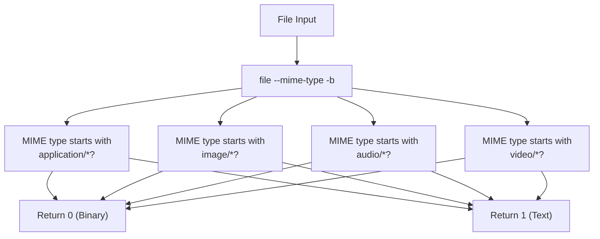
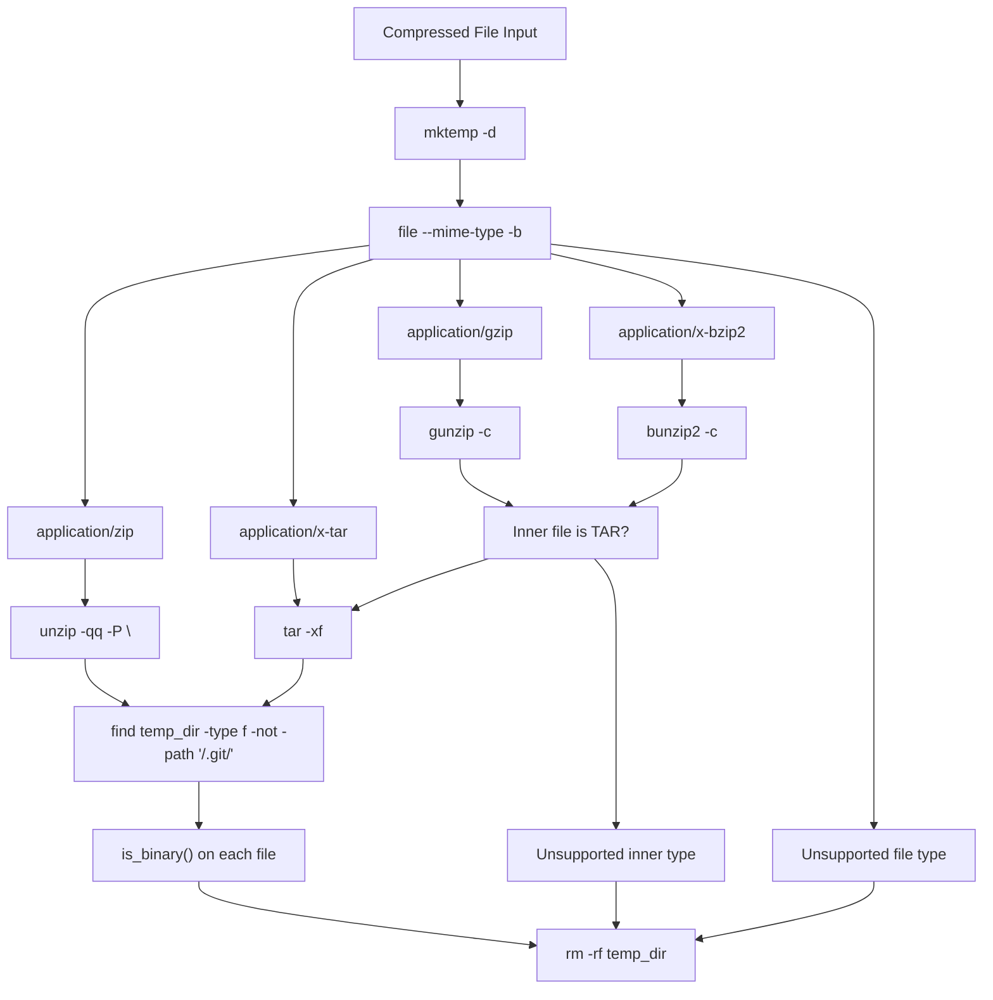
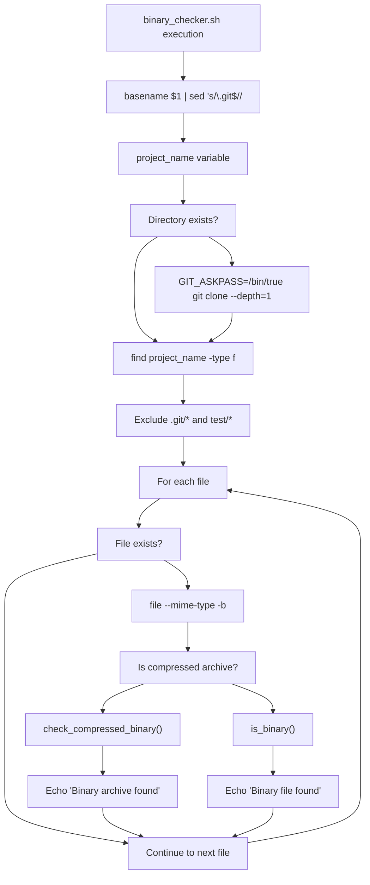
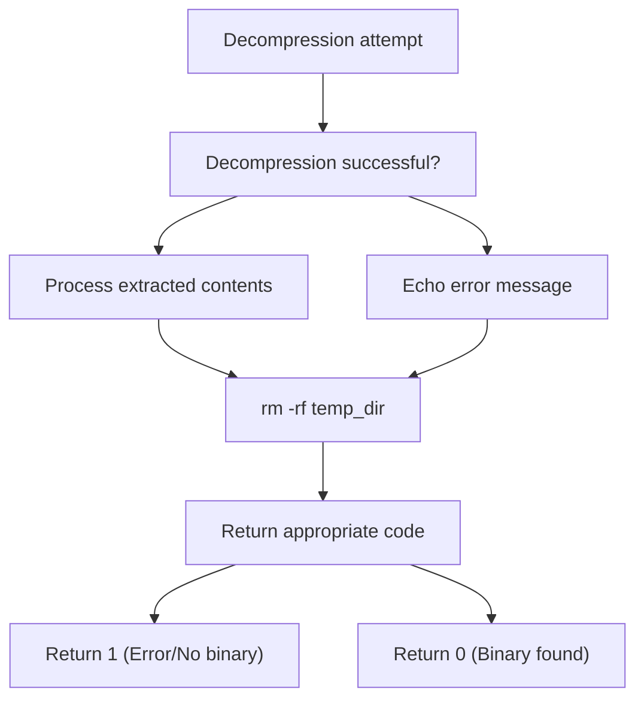

# Binary Analysis and Shell Script System

> **Relevant source files**
> * [scripts/binary_checker.sh](https://github.com/Laniakea2012/openchecker/blob/1dbd85d0/scripts/binary_checker.sh)

## Purpose and Scope

The Binary Analysis and Shell Script System provides automated detection of binary files within software projects and orchestrates shell script execution for various analysis tasks. This system is a core component of the OpenChecker analysis pipeline, responsible for identifying binary content that may indicate licensing, security, or compliance issues.

This document covers the binary file detection mechanisms and shell script execution framework. For information about the broader analysis tool orchestration, see [Checker Framework and Execution](/Laniakea2012/openchecker/4.2-checker-framework-and-execution). For details about the agent system that executes these scripts, see [Agent System and Message Processing](/Laniakea2012/openchecker/2.1-agent-system-and-message-processing).

## Binary Detection Framework

The binary detection system uses MIME type analysis to identify binary files and classify their content types. The core detection logic distinguishes between various binary formats including applications, images, audio, and video files.

### Binary File Classification

The `is_binary()` function in [scripts/binary_checker.sh L4-L10](https://github.com/Laniakea2012/openchecker/blob/1dbd85d0/scripts/binary_checker.sh#L4-L10)

 implements the primary binary detection logic:

**Sources:** [scripts/binary_checker.sh L4-L10](https://github.com/Laniakea2012/openchecker/blob/1dbd85d0/scripts/binary_checker.sh#L4-L10)

## Compressed File Analysis

The system provides deep analysis of compressed archives by extracting their contents and recursively scanning for binary files within them.

### Archive Format Support

The `check_compressed_binary()` function [scripts/binary_checker.sh L13-L69](https://github.com/Laniakea2012/openchecker/blob/1dbd85d0/scripts/binary_checker.sh#L13-L69)

 supports multiple compression formats:

| Format | MIME Type | Extraction Method | Nested Support |
| --- | --- | --- | --- |
| ZIP | `application/zip` | `unzip -qq -P ""` | No |
| TAR | `application/x-tar` | `tar -xf` | No |
| GZIP | `application/gzip` | `gunzip -c` | TAR detection |
| BZIP2 | `application/x-bzip2` | `bunzip2 -c` | TAR detection |

### Compression Processing Workflow

**Sources:** [scripts/binary_checker.sh L13-L69](https://github.com/Laniakea2012/openchecker/blob/1dbd85d0/scripts/binary_checker.sh#L13-L69)

## Shell Script Integration

The binary checker integrates with the broader OpenChecker system through shell script execution patterns that follow consistent interfaces for repository processing.

### Repository Processing Pipeline

The main script execution flow [scripts/binary_checker.sh L71-L93](https://github.com/Laniakea2012/openchecker/blob/1dbd85d0/scripts/binary_checker.sh#L71-L93)

 follows this pattern:

**Sources:** [scripts/binary_checker.sh L71-L93](https://github.com/Laniakea2012/openchecker/blob/1dbd85d0/scripts/binary_checker.sh#L71-L93)

### File System Filtering

The system implements selective file scanning with specific exclusion patterns:

* **Git exclusion**: `*/.git/*` paths are skipped to avoid repository metadata
* **Test exclusion**: `*/test/*` paths are excluded to focus on production code
* **File existence check**: Validates file existence before processing to handle symlinks and race conditions

## Error Handling and Cleanup

The binary analysis system implements robust error handling and temporary resource management:

### Temporary Directory Management

Each compressed file analysis creates isolated temporary directories using `mktemp -d` [scripts/binary_checker.sh L14](https://github.com/Laniakea2012/openchecker/blob/1dbd85d0/scripts/binary_checker.sh#L14-L14)

 and ensures cleanup through `rm -rf "$temp_dir"` [scripts/binary_checker.sh L67](https://github.com/Laniakea2012/openchecker/blob/1dbd85d0/scripts/binary_checker.sh#L67-L67)

 regardless of processing outcome.

### Error Recovery Patterns

**Sources:** [scripts/binary_checker.sh L28-L35](https://github.com/Laniakea2012/openchecker/blob/1dbd85d0/scripts/binary_checker.sh#L28-L35)

 [scripts/binary_checker.sh L44-L51](https://github.com/Laniakea2012/openchecker/blob/1dbd85d0/scripts/binary_checker.sh#L44-L51)