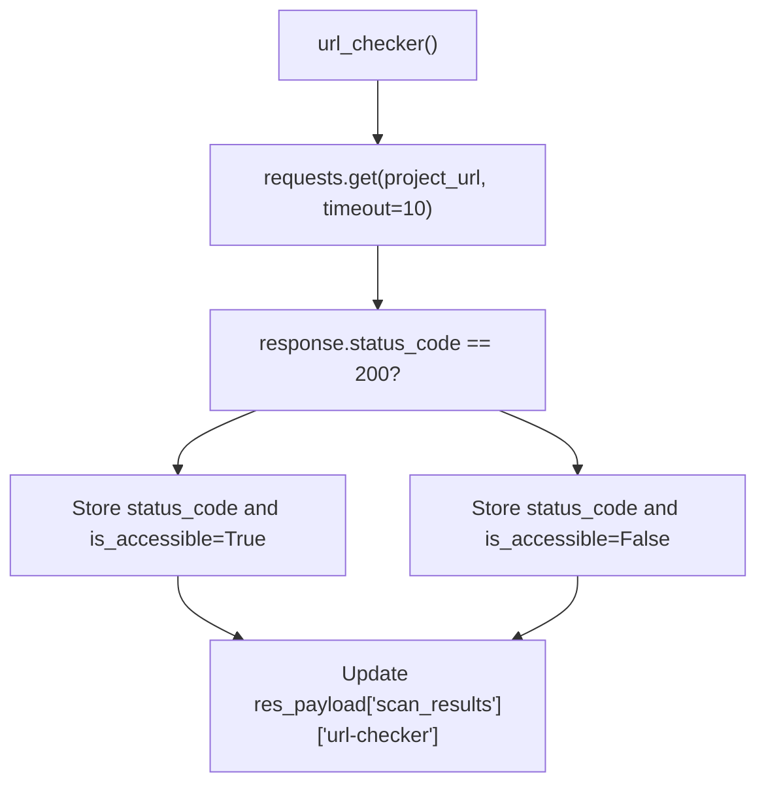
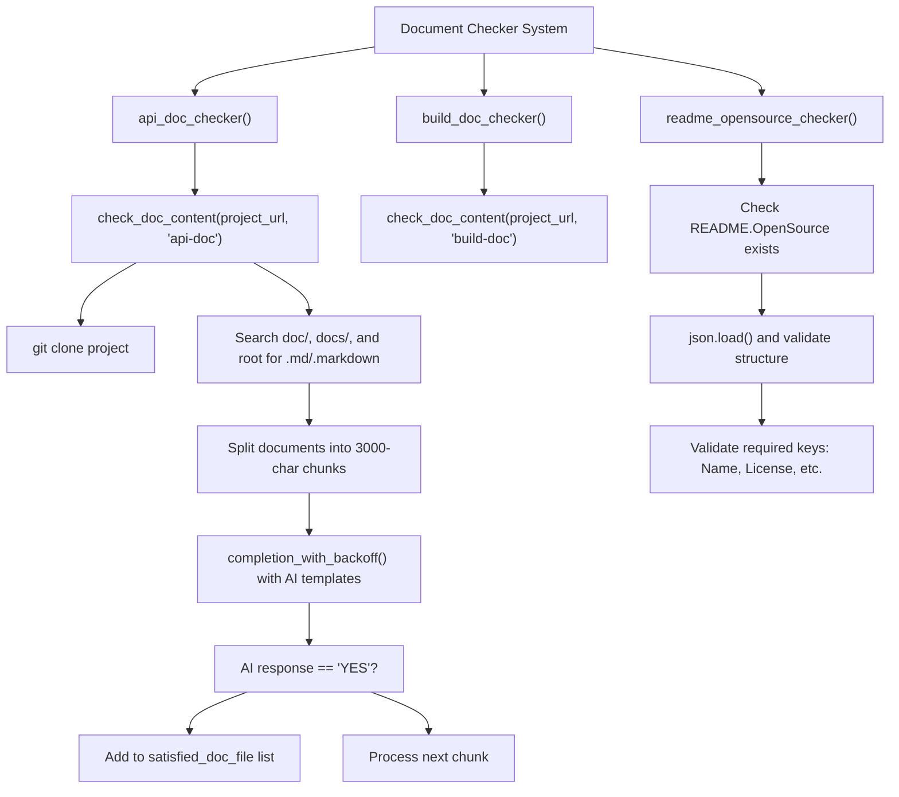
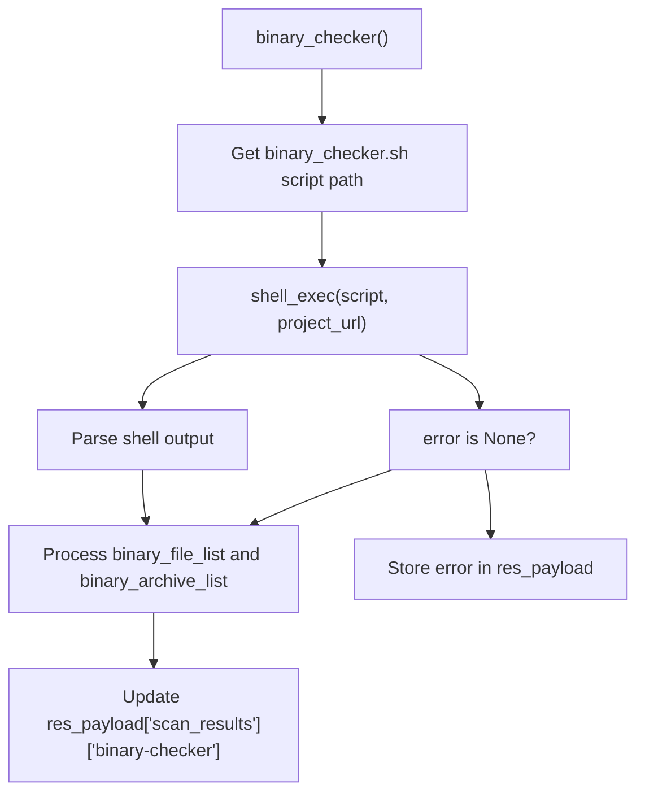
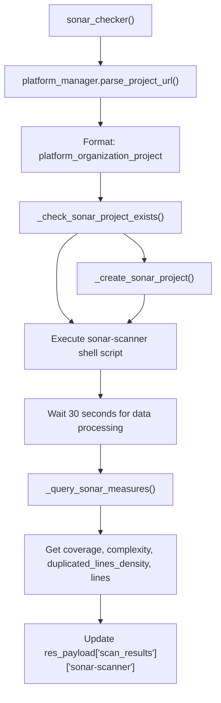
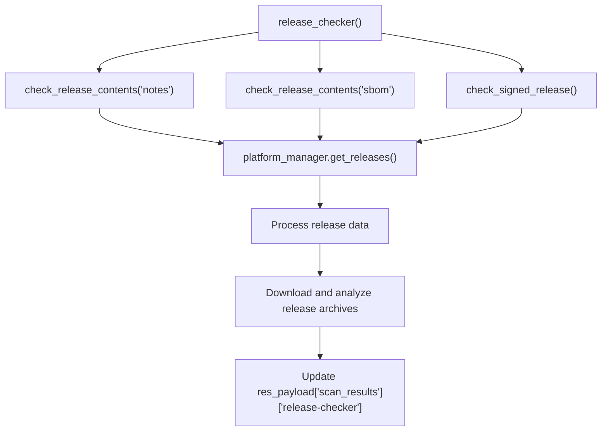
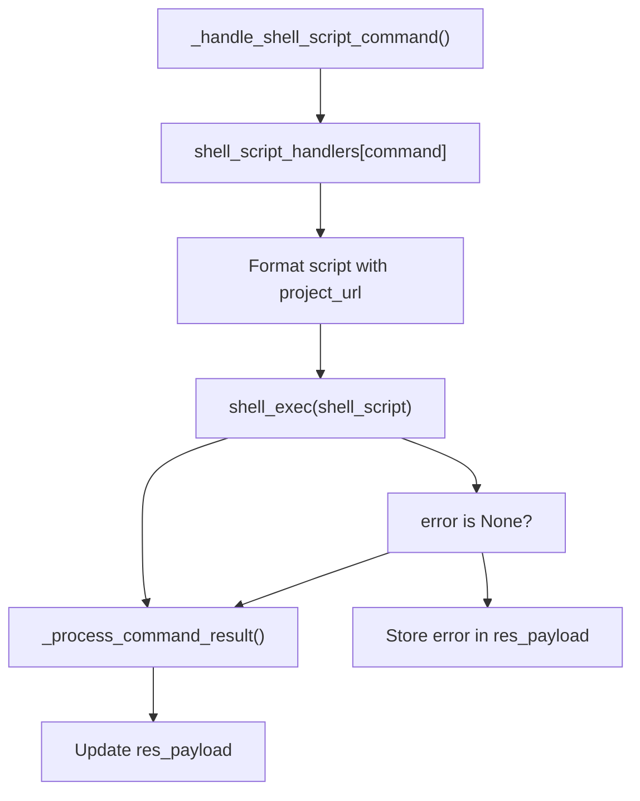
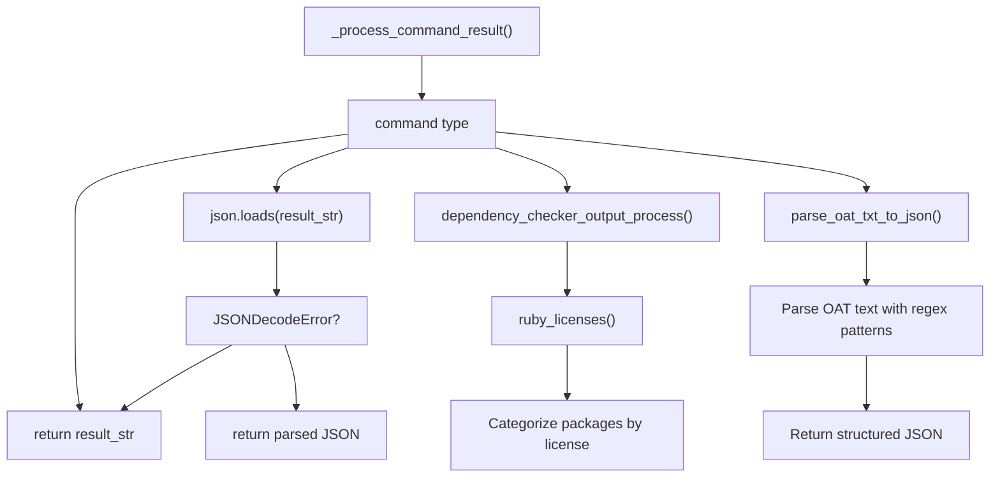
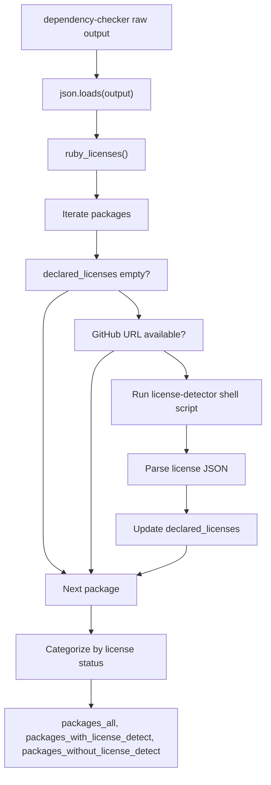
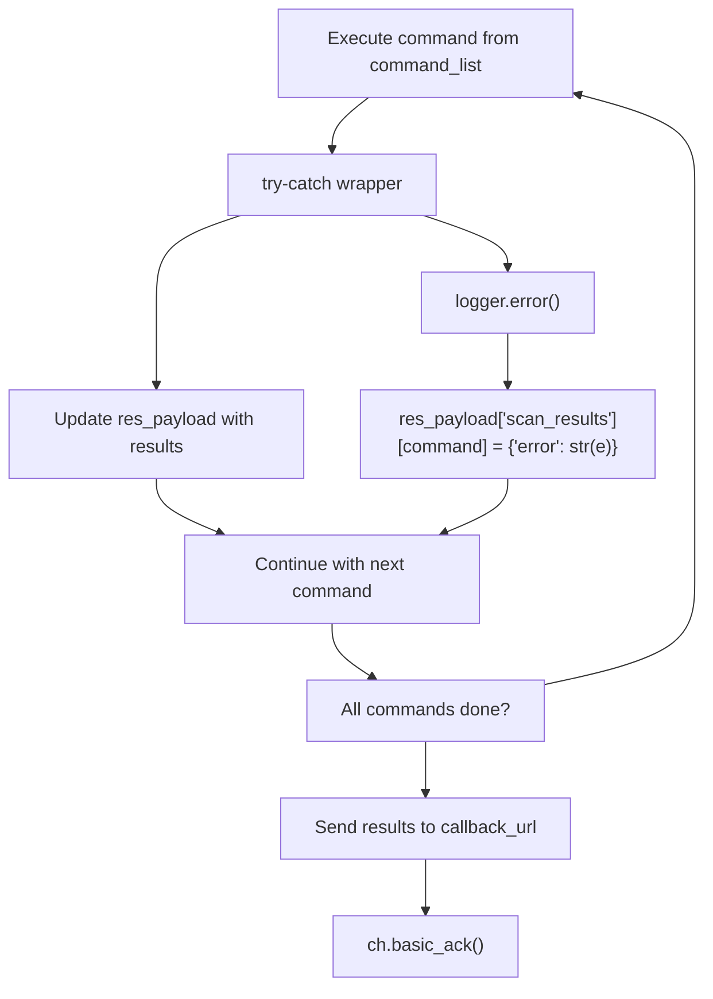

# Checker Framework and Execution

> **Relevant source files**
> * [openchecker/checkers/binary_checker.py](https://github.com/Laniakea2012/openchecker/blob/1dbd85d0/openchecker/checkers/binary_checker.py)
> * [openchecker/checkers/changed_files_checker.py](https://github.com/Laniakea2012/openchecker/blob/1dbd85d0/openchecker/checkers/changed_files_checker.py)
> * [openchecker/checkers/document_checker.py](https://github.com/Laniakea2012/openchecker/blob/1dbd85d0/openchecker/checkers/document_checker.py)
> * [openchecker/checkers/release_checker.py](https://github.com/Laniakea2012/openchecker/blob/1dbd85d0/openchecker/checkers/release_checker.py)
> * [openchecker/checkers/sonar_checker.py](https://github.com/Laniakea2012/openchecker/blob/1dbd85d0/openchecker/checkers/sonar_checker.py)
> * [openchecker/checkers/url_checker.py](https://github.com/Laniakea2012/openchecker/blob/1dbd85d0/openchecker/checkers/url_checker.py)

This document covers the checker execution framework that runs individual analysis tools and Python modules within the OpenChecker agent system. It explains how commands are dispatched, how different types of checkers are executed, and how results are processed and aggregated.

For information about the container environment and tool installation, see [Container Environment and Tool Installation](/Laniakea2012/openchecker/4.1-container-environment-and-tool-installation). For details about specific security and compliance checkers, see [Security and Compliance Analysis](/Laniakea2012/openchecker/4.3-security-and-compliance-analysis).

## Checker Execution Framework Overview

The checker framework operates as a command dispatcher within the agent's message processing workflow. When a message is received from the RabbitMQ queue, the agent extracts a `command_list` and executes each checker sequentially, aggregating results into a unified response payload.

```

```

Sources: [openchecker/agent.py L351-L411](https://github.com/Laniakea2012/openchecker/blob/1dbd85d0/openchecker/agent.py#L351-L411)

## Command Dispatch Mechanism

The core dispatcher uses a command switch dictionary that maps command names to their execution functions. This design allows for easy extension of new checkers while maintaining a consistent execution interface.

### Command Switch Dictionary

The `command_switch` dictionary in `_execute_commands` provides the mapping between command names and their execution functions:

| Command Type | Example Commands | Execution Method |
| --- | --- | --- |
| Python Functions | `binary-checker`, `release-checker`, `url-checker` | Direct function calls with lambda wrappers |
| Shell Scripts | `osv-scanner`, `scancode`, `dependency-checker` | `_handle_shell_script_command()` with command name |
| Specialized | `sonar-scanner`, `criticality-score` | Custom functions with configuration parameters |

```

```

Sources: [openchecker/agent.py L368-L400](https://github.com/Laniakea2012/openchecker/blob/1dbd85d0/openchecker/agent.py#L368-L400)

## Python-Based Checkers

Python-based checkers are implemented as individual modules under the `checkers/` directory. Each checker follows a consistent interface pattern and directly manipulates the response payload.

### Checker Interface Pattern

All Python checkers follow this interface:

* **Function signature**: `checker_name(project_url: str, res_payload: dict, *optional_params)`
* **Result storage**: Updates `res_payload["scan_results"][command_name]` directly
* **Error handling**: Stores error information in the same result structure

### File Change Detection Checker

The `changed_files_detector` analyzes git history to identify file modifications since a specific commit:

```

```

Sources: [openchecker/checkers/changed_files_checker.py L10-L52](https://github.com/Laniakea2012/openchecker/blob/1dbd85d0/openchecker/checkers/changed_files_checker.py#L10-L52)

### URL Accessibility Checker

The `url_checker` performs simple HTTP accessibility validation:



Sources: [openchecker/checkers/url_checker.py L8-L25](https://github.com/Laniakea2012/openchecker/blob/1dbd85d0/openchecker/checkers/url_checker.py#L8-L25)

### Document Analysis with AI Integration

The document checker system includes sophisticated AI-powered analysis for documentation quality:



Sources: [openchecker/checkers/document_checker.py L11-L200](https://github.com/Laniakea2012/openchecker/blob/1dbd85d0/openchecker/checkers/document_checker.py#L11-L200)

### Binary File Detection

The `binary_checker` identifies binary files and archives within projects:



Sources: [openchecker/checkers/binary_checker.py L9-L42](https://github.com/Laniakea2012/openchecker/blob/1dbd85d0/openchecker/checkers/binary_checker.py#L9-L42)

### SonarQube Integration

The `sonar_checker` provides comprehensive code quality analysis through SonarQube integration:



Sources: [openchecker/checkers/sonar_checker.py L14-L173](https://github.com/Laniakea2012/openchecker/blob/1dbd85d0/openchecker/checkers/sonar_checker.py#L14-L173)

### Release Content Analysis

The release checker demonstrates integration with platform adapters and complex result processing:



Sources: [openchecker/checkers/release_checker.py L255-L282](https://github.com/Laniakea2012/openchecker/blob/1dbd85d0/openchecker/checkers/release_checker.py#L255-L282)

## Shell Script Command Execution

External tools are executed via shell scripts defined in the `shell_script_handlers` dictionary. This approach provides flexibility for integrating diverse analysis tools with different command-line interfaces.

### Shell Script Handler Architecture



Sources: [openchecker/agent.py L413-L446](https://github.com/Laniakea2012/openchecker/blob/1dbd85d0/openchecker/agent.py#L413-L446)

### Shell Script Templates

The shell scripts in `constans.py` use template strings with placeholders for dynamic values:

| Tool | Script Template | Key Operations |
| --- | --- | --- |
| `osv-scanner` | `osv_scanner_shell_script` | Clone, rename lock files, run scanner, output JSON |
| `scancode` | `scancode_shell_script` | Clone, run scancode with license detection, output JSON |
| `dependency-checker` | `dependency_checker_shell_script` | Clone, run ORT analyzer, output JSON |
| `oat-scanner` | `oat_scanner_shell_script` | Clone, run OAT tool, parse text report |

Sources: [openchecker/constans.py L37-L139](https://github.com/Laniakea2012/openchecker/blob/1dbd85d0/openchecker/constans.py#L37-L139)

## Result Processing and Error Handling

Different command types require specialized result processing to handle various output formats and error conditions.

### Result Processing Flow



Sources: [openchecker/agent.py L448-L477](https://github.com/Laniakea2012/openchecker/blob/1dbd85d0/openchecker/agent.py#L448-L477)

### Specialized Processing: Dependency Checker

The dependency checker includes sophisticated post-processing for Ruby package licenses:



Sources: [openchecker/agent.py L93-L174](https://github.com/Laniakea2012/openchecker/blob/1dbd85d0/openchecker/agent.py#L93-L174)

## Error Handling and Resilience

The framework implements multiple layers of error handling to ensure robust operation even when individual checkers fail.

### Error Handling Layers

| Layer | Scope | Implementation | Recovery Action |
| --- | --- | --- | --- |
| Individual Checker | Single checker execution | Try-catch in `command_switch<FileRef file-url="https://github.com/Laniakea2012/openchecker/blob/1dbd85d0/command" undefined  file-path="command">Hii</FileRef>` | Store error in `res_payload`, continue with next checker |
| Shell Command | Shell script execution | Error checking in `_handle_shell_script_command` | Store shell error output, mark command as failed |
| Message Processing | Entire message | Try-catch in `callback_func` | Send NACK to RabbitMQ, route to dead letter queue |
| Result Processing | Command result parsing | Try-catch in `_process_command_result` | Return raw output or error structure |



Sources: [openchecker/agent.py L402-L411](https://github.com/Laniakea2012/openchecker/blob/1dbd85d0/openchecker/agent.py#L402-L411)

 [openchecker/agent.py L519-L531](https://github.com/Laniakea2012/openchecker/blob/1dbd85d0/openchecker/agent.py#L519-L531)