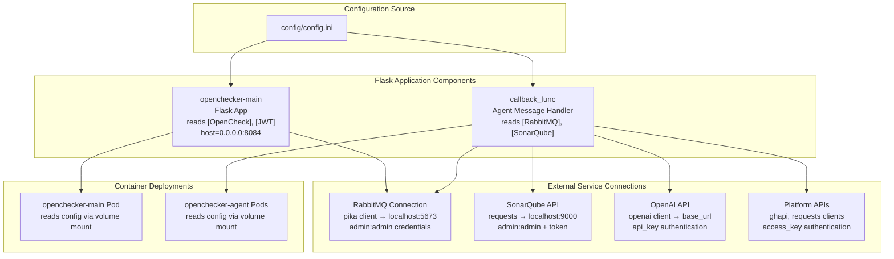

# Configuration Management

> **Relevant source files**
> * [.gitignore](https://github.com/Laniakea2012/openchecker/blob/1dbd85d0/.gitignore)
> * [config/config.ini](https://github.com/Laniakea2012/openchecker/blob/1dbd85d0/config/config.ini)
> * [requirements.txt](https://github.com/Laniakea2012/openchecker/blob/1dbd85d0/requirements.txt)

## Purpose and Scope

This document covers OpenChecker's configuration management system, including the centralized configuration file structure, environment setup, and dependency management. The configuration management system provides centralized settings for all OpenChecker components including the Flask API server, RabbitMQ message broker integration, external service connections, and authentication systems.

For Kubernetes-specific deployment configuration, see [Kubernetes Deployment](/Laniakea2012/openchecker/7.2-kubernetes-deployment). For external service integration details, see [External Service Configuration](/Laniakea2012/openchecker/5.2-external-service-configuration). For JWT authentication implementation, see [Authentication and User Management](/Laniakea2012/openchecker/3.2-authentication-and-user-management).

## Configuration File Structure

OpenChecker uses a centralized INI-format configuration file that defines settings for all system components. The configuration is organized into logical sections that correspond to different subsystems and external integrations.

### Configuration File Layout

```mermaid
flowchart TD

ConfigIniFile["config/config.ini"]
RabbitMQSection["[RabbitMQ]<br>host=localhost<br>port=5673<br>username=admin<br>password=admin<br>heartbeat_interval_s=60<br>blocked_connection_timeout_ms=300000"]
OpenCheckSection["[OpenCheck]<br>host=0.0.0.0<br>port=8084<br>ssl_crt_path=/path/to/certificate.crt<br>ssl_key_path=/path/to/private.key<br>repos_dir=/tmp/repos"]
SonarQubeSection["[SonarQube]<br>host=localhost<br>port=9000<br>username=admin<br>password=admin<br>token="]
ChatBotSection["[ChatBot]<br>base_url=<br>api_key=<br>model_name="]
GiteeSection["[Gitee]<br>access_key="]
GithubSection["[Github]<br>access_key="]
GitCodeSection["[GitCode]<br>access_key="]
UserManagerSection["[UserManager]<br>default_username=<br>default_password="]
JWTSection["[JWT]<br>secret_key=your_secure_secret_key_here<br>expires_minutes=30"]

ConfigIniFile --> RabbitMQSection
ConfigIniFile --> OpenCheckSection
ConfigIniFile --> SonarQubeSection
ConfigIniFile --> ChatBotSection
ConfigIniFile --> GiteeSection
ConfigIniFile --> GithubSection
ConfigIniFile --> GitCodeSection
ConfigIniFile --> UserManagerSection
ConfigIniFile --> JWTSection

subgraph subGraph4 ["Authentication Config"]
    UserManagerSection
    JWTSection
end

subgraph subGraph3 ["Platform API Config"]
    GiteeSection
    GithubSection
    GitCodeSection
end

subgraph subGraph2 ["External Services Config"]
    SonarQubeSection
    ChatBotSection
end

subgraph subGraph1 ["API Server Config"]
    OpenCheckSection
end

subgraph subGraph0 ["Message Infrastructure Config"]
    RabbitMQSection
end
```

Sources: [config/config.ini L1-L43](https://github.com/Laniakea2012/openchecker/blob/1dbd85d0/config/config.ini#L1-L43)

 [requirements.txt L1-L10](https://github.com/Laniakea2012/openchecker/blob/1dbd85d0/requirements.txt#L1-L10)

### Core Configuration Sections

| Section Name | Purpose | Key Parameters | Default Values |
| --- | --- | --- | --- |
| `RabbitMQ` | Message broker connection for `pika` client | `host`, `port`, `username`, `password`, `heartbeat_interval_s`, `blocked_connection_timeout_ms` | `localhost:5673`, `admin:admin`, `60s`, `300000ms` |
| `OpenCheck` | Flask API server binding and SSL | `host`, `port`, `ssl_crt_path`, `ssl_key_path`, `repos_dir` | `0.0.0.0:8084`, `/tmp/repos` |
| `SonarQube` | Code analysis service for `sonar-scanner` | `host`, `port`, `username`, `password`, `token` | `localhost:9000`, `admin:admin` |
| `ChatBot` | OpenAI API client configuration | `base_url`, `api_key`, `model_name` | Empty (requires setup) |
| `Gitee` | Gitee API access for platform integration | `access_key` | Empty (requires setup) |
| `Github` | GitHub API access via `ghapi` library | `access_key` | Empty (requires setup) |
| `GitCode` | GitCode platform API access | `access_key` | Empty (requires setup) |
| `UserManager` | Default user credentials for system | `default_username`, `default_password` | Empty (requires setup) |
| `JWT` | Token signing for `flask-jwt-extended` | `secret_key`, `expires_minutes` | `your_secure_secret_key_here`, `30` |

Sources: [config/config.ini L1-L43](https://github.com/Laniakea2012/openchecker/blob/1dbd85d0/config/config.ini#L1-L43)

## Configuration Usage Patterns

The configuration system follows a centralized pattern where all components read from the same `config.ini` file. This ensures consistent configuration across distributed agent instances and the main API server.

### Configuration Flow Through System Components

Sources: [config/config.ini L1-L43](https://github.com/Laniakea2012/openchecker/blob/1dbd85d0/config/config.ini#L1-L43)

## Dependency Management

OpenChecker's Python dependencies are managed through a centralized `requirements.txt` file that defines specific versions for all required packages.

### Core Dependencies by Category

| Category | Dependencies | Purpose |
| --- | --- | --- |
| **Web Framework** | `flask==2.2.3`, `flask_restful==0.3.9`, `Werkzeug==2.2.2` | REST API server implementation |
| **Authentication** | `flask-jwt-extended==4.5.3` | JWT token-based authentication |
| **Message Queue** | `pika==1.3.2` | RabbitMQ client for message processing |
| **HTTP Client** | `requests==2.26.0`, `httpx==0.27.2` | External API communication |
| **AI/ML Integration** | `openai==1.37.1` | LLM service integration |
| **Platform APIs** | `ghapi==1.0.5` | GitHub API client |
| **Data Processing** | `pyyaml==6.0.2` | YAML configuration parsing |

Sources: [requirements.txt L1-L10](https://github.com/Laniakea2012/openchecker/blob/1dbd85d0/requirements.txt#L1-L10)

### Dependency Version Strategy

OpenChecker uses pinned dependency versions to ensure consistent behavior across all deployment environments. This approach prevents unexpected breaks from automatic dependency updates while maintaining predictable system behavior.

```mermaid
flowchart TD

RequirementsTxtFile["requirements.txt<br>Pinned Package Versions"]
FlaskCore["flask==2.2.3<br>Core web framework"]
FlaskRESTful["flask_restful==0.3.9<br>REST API endpoints"]
FlaskJWT["flask-jwt-extended==4.5.3<br>JWT token handling"]
Werkzeug["Werkzeug==2.2.2<br>WSGI utilities"]
PikaClient["pika==1.3.2<br>RabbitMQ client library<br>used in callback_func"]
RequestsLib["requests==2.26.0<br>HTTP client for platform APIs"]
HttpxLib["httpx==0.27.2<br>Async HTTP client"]
GHAPILib["ghapi==1.0.5<br>GitHub API wrapper"]
OpenAILib["openai==1.37.1<br>OpenAI API client<br>ChatBot integration"]
PyYAMLLib["pyyaml==6.0.2<br>YAML configuration parsing"]

RequirementsTxtFile --> FlaskCore
RequirementsTxtFile --> FlaskRESTful
RequirementsTxtFile --> FlaskJWT
RequirementsTxtFile --> Werkzeug
RequirementsTxtFile --> PikaClient
RequirementsTxtFile --> RequestsLib
RequirementsTxtFile --> HttpxLib
RequirementsTxtFile --> GHAPILib
RequirementsTxtFile --> OpenAILib
RequirementsTxtFile --> PyYAMLLib

subgraph subGraph4 ["Data Processing"]
    PyYAMLLib
end

subgraph subGraph3 ["AI/ML Integration"]
    OpenAILib
end

subgraph subGraph2 ["HTTP Client Libraries"]
    RequestsLib
    HttpxLib
    GHAPILib
end

subgraph subGraph1 ["Message Queue Integration"]
    PikaClient
end

subgraph subGraph0 ["Flask Web Framework Stack"]
    FlaskCore
    FlaskRESTful
    FlaskJWT
    Werkzeug
end
```

Sources: [requirements.txt L1-L10](https://github.com/Laniakea2012/openchecker/blob/1dbd85d0/requirements.txt#L1-L10)

## Environment Configuration

### Default Configuration Values

The system provides default configuration values for development and testing environments:

* **RabbitMQ**: Default connection to `localhost:5673` with `admin/admin` credentials
* **OpenCheck API**: Binds to `0.0.0.0:8084` for external access
* **Repository Storage**: Uses `/tmp/repos` for temporary project downloads
* **JWT Expiration**: 30-minute token lifetime for security
* **Connection Timeouts**: 5-minute blocked connection timeout for RabbitMQ

Sources: [config/config.ini L1-L43](https://github.com/Laniakea2012/openchecker/blob/1dbd85d0/config/config.ini#L1-L43)

### Security Configuration

The configuration system includes several security-related settings:

* **JWT Secret Key**: Configurable secret key for token signing and verification
* **SSL Certificate Paths**: Support for HTTPS with custom certificate configuration
* **Access Keys**: Secure storage of platform-specific API access tokens
* **Default Credentials**: Configurable default user management credentials

Sources: [config/config.ini L19-L43](https://github.com/Laniakea2012/openchecker/blob/1dbd85d0/config/config.ini#L19-L43)

### Deployment Environment Considerations

The configuration system is designed to support multiple deployment environments through:

* **Container Volume Mounts**: Configuration files mounted as volumes in Kubernetes deployments
* **Environment-Specific Values**: Ability to override default values per deployment environment
* **External Service Discovery**: Configuration supports both localhost and external service endpoints
* **Credential Management**: Separate configuration of credentials for different environments

Sources: [config/config.ini L1-L43](https://github.com/Laniakea2012/openchecker/blob/1dbd85d0/config/config.ini#L1-L43)