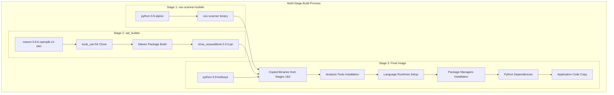
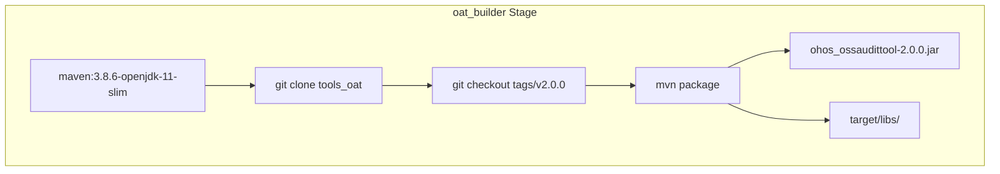
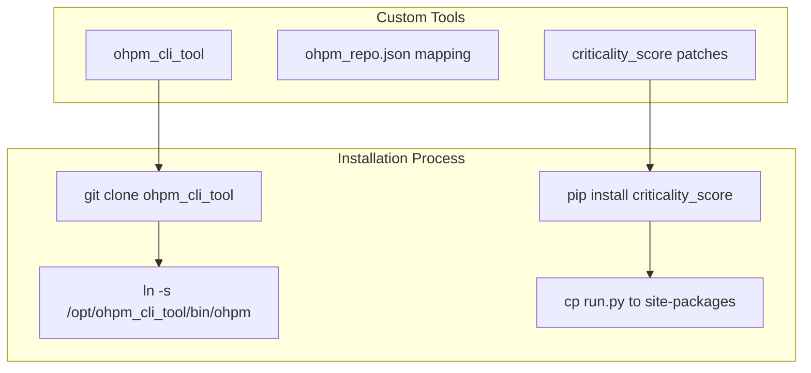
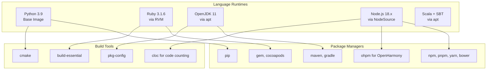
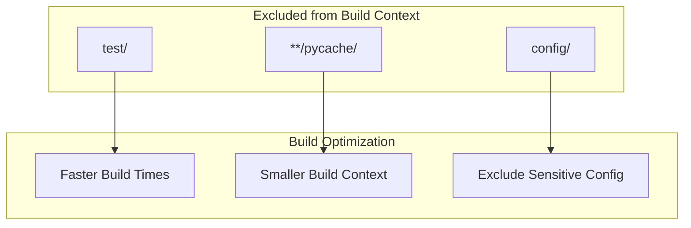
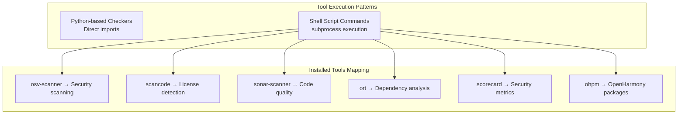

# Container Environment and Tool Installation

> **Relevant source files**
> * [.dockerignore](https://github.com/Laniakea2012/openchecker/blob/1dbd85d0/.dockerignore)
> * [Dockerfile](https://github.com/Laniakea2012/openchecker/blob/1dbd85d0/Dockerfile)
> * [config/ohpm_repo.json](https://github.com/Laniakea2012/openchecker/blob/1dbd85d0/config/ohpm_repo.json)
> * [openchecker/user_manager.py](https://github.com/Laniakea2012/openchecker/blob/1dbd85d0/openchecker/user_manager.py)
> * [scripts/entrypoint.sh](https://github.com/Laniakea2012/openchecker/blob/1dbd85d0/scripts/entrypoint.sh)
> * [test/test_server.py](https://github.com/Laniakea2012/openchecker/blob/1dbd85d0/test/test_server.py)

This document covers the Docker container environment that hosts OpenChecker's analysis tools and the installation process for all external analysis tools and language runtimes. This includes the multi-stage build process, tool dependencies, and runtime configuration.

For information about the analysis execution framework that uses these tools, see [Checker Framework and Execution](/Laniakea2012/openchecker/4.2-checker-framework-and-execution). For deployment configuration, see [Kubernetes Deployment](/Laniakea2012/openchecker/7.2-kubernetes-deployment).

## Container Architecture Overview

OpenChecker uses a comprehensive Docker container that packages over 30 different analysis tools, multiple programming language runtimes, and package managers into a single deployable unit. The container is built using a multi-stage approach to optimize both build time and final image size.



Sources: [Dockerfile L1-L26](https://github.com/Laniakea2012/openchecker/blob/1dbd85d0/Dockerfile#L1-L26)

 [Dockerfile L18-L19](https://github.com/Laniakea2012/openchecker/blob/1dbd85d0/Dockerfile#L18-L19)

## Multi-Stage Build Process

The container build follows a three-stage process to efficiently manage different tool requirements and minimize the final image size.

### Stage 1: OSV Scanner Builder

The first stage uses Alpine Linux to build the OSV scanner binary, which is a lightweight security vulnerability scanner.

```

```

Sources: [Dockerfile L1-L5](https://github.com/Laniakea2012/openchecker/blob/1dbd85d0/Dockerfile#L1-L5)

 [Dockerfile L22-L26](https://github.com/Laniakea2012/openchecker/blob/1dbd85d0/Dockerfile#L22-L26)

### Stage 2: OAT Tool Builder

The second stage builds the OpenHarmony OAT (Open Source Software Audit Tool) from source using Maven.



Sources: [Dockerfile L7-L12](https://github.com/Laniakea2012/openchecker/blob/1dbd85d0/Dockerfile#L7-L12)

 [Dockerfile L24-L25](https://github.com/Laniakea2012/openchecker/blob/1dbd85d0/Dockerfile#L24-L25)

## Analysis Tools Installation

The final stage installs a comprehensive suite of analysis tools, each serving specific analysis capabilities.

### Core Security and Code Analysis Tools

| Tool | Version | Purpose | Installation Method |
| --- | --- | --- | --- |
| `scancode-toolkit` | 32.1.0 | License and copyright detection | Binary download + configure |
| `sonar-scanner` | 6.1.0.4477 | Code quality analysis | Binary download |
| `ORT` | 25.0.0 | OSS Review Toolkit | Binary download |
| `scorecard` | 5.2.1 | OSSF security metrics | Binary download |
| `licensee` | - | License detection | Ruby gem |

```

```

Sources: [Dockerfile L28-L50](https://github.com/Laniakea2012/openchecker/blob/1dbd85d0/Dockerfile#L28-L50)

 [Dockerfile L74-L78](https://github.com/Laniakea2012/openchecker/blob/1dbd85d0/Dockerfile#L74-L78)

### Custom Tool Integration

The container includes custom-built tools specifically for OpenHarmony ecosystem analysis:



Sources: [Dockerfile L69-L72](https://github.com/Laniakea2012/openchecker/blob/1dbd85d0/Dockerfile#L69-L72)

 [Dockerfile L85-L86](https://github.com/Laniakea2012/openchecker/blob/1dbd85d0/Dockerfile#L85-L86)

 [config/ohpm_repo.json L1-L920](https://github.com/Laniakea2012/openchecker/blob/1dbd85d0/config/ohpm_repo.json#L1-L920)

## Language Runtimes and Package Managers

The container supports analysis of projects in multiple programming languages by installing their respective runtimes and package managers.

### Programming Language Support



Sources: [Dockerfile L52-L67](https://github.com/Laniakea2012/openchecker/blob/1dbd85d0/Dockerfile#L52-L67)

 [scripts/entrypoint.sh L1-L4](https://github.com/Laniakea2012/openchecker/blob/1dbd85d0/scripts/entrypoint.sh#L1-L4)

### Ruby Environment Setup

The Ruby environment uses RVM (Ruby Version Manager) for version management and includes GitHub Linguist for language detection:

| Component | Purpose | Installation |
| --- | --- | --- |
| `rvm` | Ruby version manager | curl install script |
| `ruby 3.1.6` | Ruby runtime | `rvm install 3.1.6` |
| `github-linguist` | Language detection | `gem install` |
| `cocoapods` | iOS dependency manager | `gem install` |

Sources: [Dockerfile L54-L59](https://github.com/Laniakea2012/openchecker/blob/1dbd85d0/Dockerfile#L54-L59)

 [scripts/entrypoint.sh L2](https://github.com/Laniakea2012/openchecker/blob/1dbd85d0/scripts/entrypoint.sh#L2-L2)

## Container Runtime Configuration

### Entry Point and Command Execution

The container uses a shell script entry point to properly initialize the Ruby environment before executing the main application:

```

```

Sources: [scripts/entrypoint.sh L1-L4](https://github.com/Laniakea2012/openchecker/blob/1dbd85d0/scripts/entrypoint.sh#L1-L4)

 [Dockerfile L89-L90](https://github.com/Laniakea2012/openchecker/blob/1dbd85d0/Dockerfile#L89-L90)

### Python Dependencies and Modifications

The container installs Python dependencies and applies custom patches to third-party libraries:

| Operation | Purpose | Location |
| --- | --- | --- |
| `pip install -r requirements.txt` | Install Python dependencies | Application requirements |
| `pip install criticality_score` | Install OSSF criticality scoring | PyPI package |
| Custom `run.py` patch | Override criticality score logic | [Dockerfile L86](https://github.com/Laniakea2012/openchecker/blob/1dbd85d0/Dockerfile#L86-L86) |

Sources: [Dockerfile L82-L86](https://github.com/Laniakea2012/openchecker/blob/1dbd85d0/Dockerfile#L82-L86)

### Build Context Exclusions

The Docker build process excludes certain directories and files to optimize build performance:



Sources: [.dockerignore L1-L3](https://github.com/Laniakea2012/openchecker/blob/1dbd85d0/.dockerignore#L1-L3)

## Tool Integration and Dependencies

The container is designed to support the analysis framework's command execution patterns, where tools are invoked both as Python modules and shell commands:



Sources: [Dockerfile L22-L78](https://github.com/Laniakea2012/openchecker/blob/1dbd85d0/Dockerfile#L22-L78)

 [config/ohpm_repo.json L1-L920](https://github.com/Laniakea2012/openchecker/blob/1dbd85d0/config/ohpm_repo.json#L1-L920)