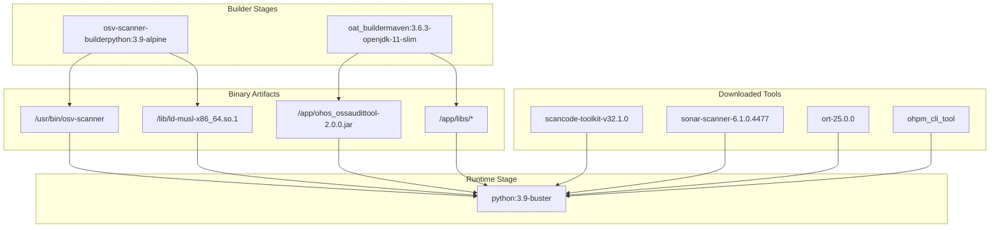
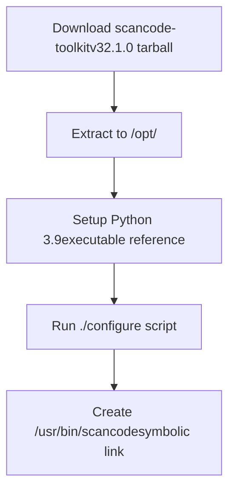
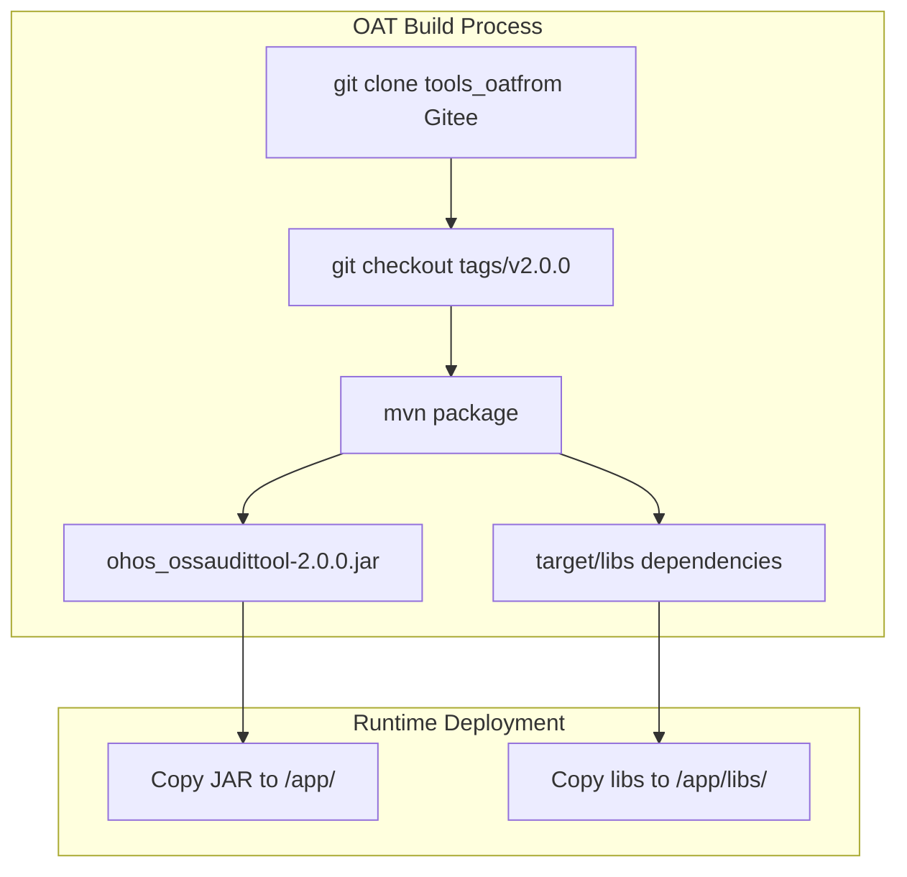
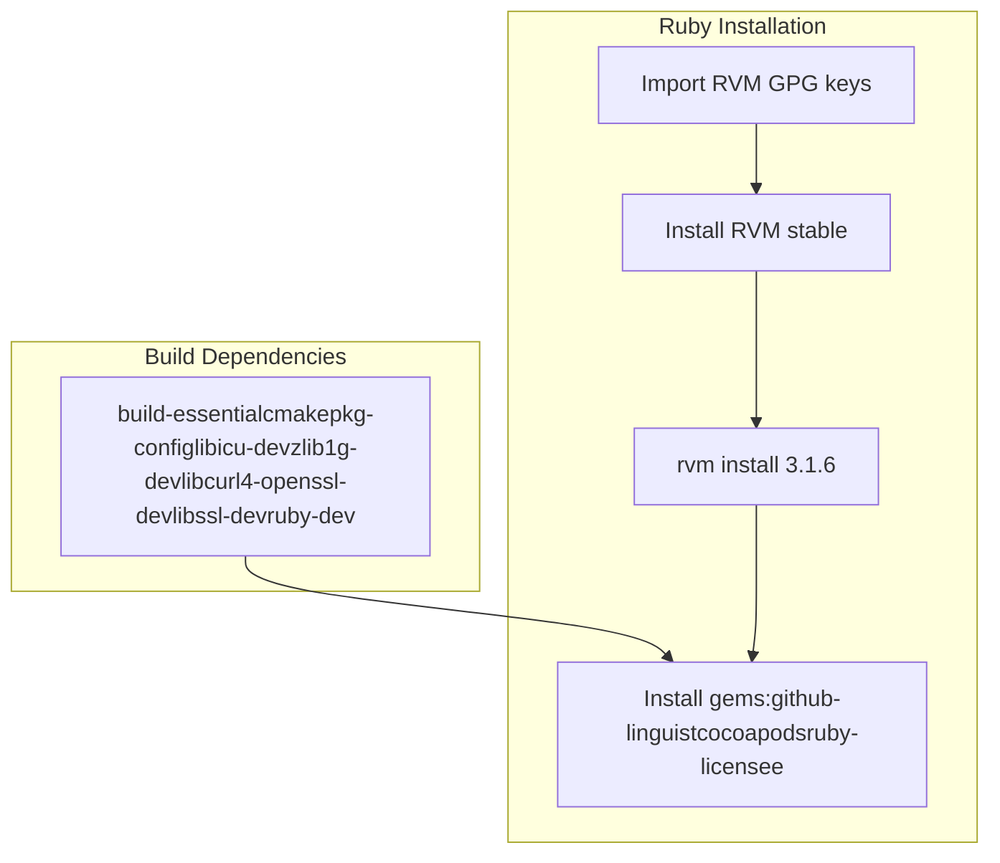
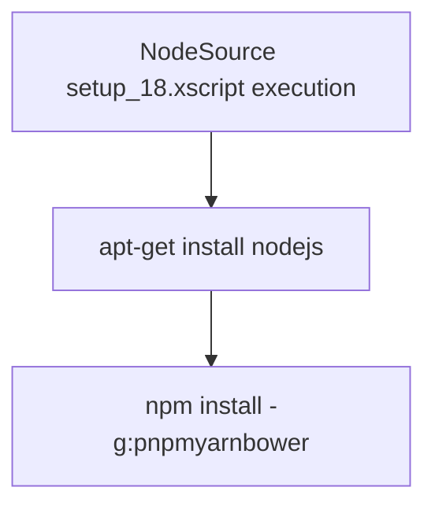
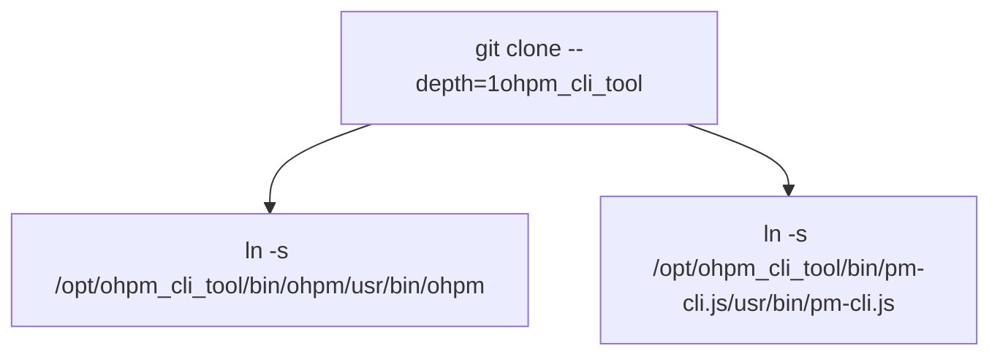
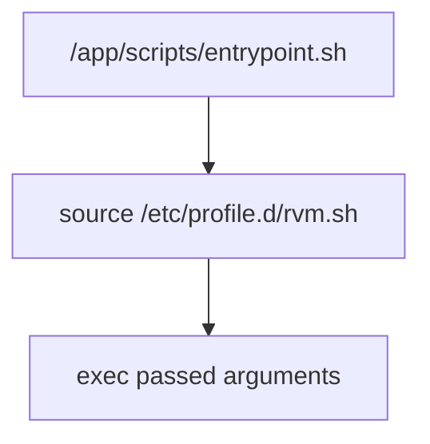

# Container Environment and Tool Installation

> **Relevant source files**
> * [.dockerignore](https://github.com/Laniakea2012/openchecker/blob/00a9732e/.dockerignore)
> * [Dockerfile](https://github.com/Laniakea2012/openchecker/blob/00a9732e/Dockerfile)
> * [scripts/entrypoint.sh](https://github.com/Laniakea2012/openchecker/blob/00a9732e/scripts/entrypoint.sh)

This document covers the Docker container environment setup and installation of security and compliance analysis tools within the OpenChecker system. The container provides a standardized execution environment that includes multiple analysis tools, programming language runtimes, and package managers required for comprehensive software analysis.

For information about how these tools are used in analysis workflows, see [Security and Compliance Checkers](/Laniakea2012/openchecker/4.2-security-and-compliance-checkers). For deployment-specific container configuration, see [Kubernetes Deployments](/Laniakea2012/openchecker/6.1-kubernetes-deployments).

## Multi-Stage Container Build Process

The OpenChecker container uses a multi-stage Docker build process to efficiently install and package analysis tools. The build process is defined in the main `Dockerfile` and consists of specialized builder stages followed by a final runtime image.

### Build Architecture

Sources: [Dockerfile L1-L26](https://github.com/Laniakea2012/openchecker/blob/00a9732e/Dockerfile#L1-L26)

The first builder stage `osv-scanner-builder` installs the OSV Scanner tool from Alpine packages [Dockerfile L1-L5](https://github.com/Laniakea2012/openchecker/blob/00a9732e/Dockerfile#L1-L5)

 The second builder stage `oat_builder` compiles the OpenHarmony Audit Tool from source using Maven [Dockerfile L7-L12](https://github.com/Laniakea2012/openchecker/blob/00a9732e/Dockerfile#L7-L12)

## Analysis Tools Installation

### Core Security and Compliance Tools

The container installs several key analysis tools through direct downloads and compilation:

| Tool | Version | Installation Method | Purpose |
| --- | --- | --- | --- |
| `osv-scanner` | Latest from Alpine | Binary copy from builder | Vulnerability scanning |
| `scancode` | v32.1.0 | Direct download + configure | License detection |
| `sonar-scanner` | 6.1.0.4477 | Direct download | Static code analysis |
| `ort` | v25.0.0 | Direct download | Dependency analysis |
| `ohos_ossaudittool` | v2.0.0 | Maven build from source | OpenHarmony audit |

#### ScanCode Installation Process

Sources: [Dockerfile L28-L39](https://github.com/Laniakea2012/openchecker/blob/00a9732e/Dockerfile#L28-L39)

The ScanCode installation includes dependency installation [Dockerfile

30](https://github.com/Laniakea2012/openchecker/blob/00a9732e/Dockerfile#L30-L30)

 and Python environment configuration [Dockerfile L35-L36](https://github.com/Laniakea2012/openchecker/blob/00a9732e/Dockerfile#L35-L36)

 to ensure proper execution within the container.

### OpenHarmony Audit Tool (OAT)

The OAT tool requires compilation from source using Maven:

Sources: [Dockerfile L7-L12](https://github.com/Laniakea2012/openchecker/blob/00a9732e/Dockerfile#L7-L12)

 [Dockerfile L24-L25](https://github.com/Laniakea2012/openchecker/blob/00a9732e/Dockerfile#L24-L25)

## Programming Language Environments

### Ruby Environment with RVM

The container installs Ruby 3.1.6 using RVM (Ruby Version Manager) and includes essential gems:

Sources: [Dockerfile L55-L60](https://github.com/Laniakea2012/openchecker/blob/00a9732e/Dockerfile#L55-L60)

 [Dockerfile

67](https://github.com/Laniakea2012/openchecker/blob/00a9732e/Dockerfile#L67-L67)

### Java and Scala Environment

Java development tools are installed including OpenJDK 11 and SBT (Scala Build Tool):

* `openjdk-11-jdk` for Java compilation and execution [Dockerfile 65](https://github.com/Laniakea2012/openchecker/blob/00a9732e/Dockerfile#L65-L65)
* SBT repository configuration and installation [Dockerfile L61-L64](https://github.com/Laniakea2012/openchecker/blob/00a9732e/Dockerfile#L61-L64)
* Maven is available from the base `maven:3.6.3-openjdk-11-slim` image used in the OAT builder stage

### Node.js and Package Managers

Node.js 18 is installed along with multiple package managers to support various JavaScript/TypeScript projects:

Sources: [Dockerfile L66-L68](https://github.com/Laniakea2012/openchecker/blob/00a9732e/Dockerfile#L66-L68)

## Custom Tools Integration

### OHPM CLI Tool

The OpenHarmony Package Manager CLI tool is installed from a custom Git repository:

Sources: [Dockerfile L71-L73](https://github.com/Laniakea2012/openchecker/blob/00a9732e/Dockerfile#L71-L73)

## Runtime Environment Configuration

### Container Entrypoint

The container uses a custom entrypoint script to initialize the runtime environment:

Sources: [scripts/entrypoint.sh L1-L4](https://github.com/Laniakea2012/openchecker/blob/00a9732e/scripts/entrypoint.sh#L1-L4)

 [Dockerfile

76](https://github.com/Laniakea2012/openchecker/blob/00a9732e/Dockerfile#L76-L76)

 [Dockerfile L80-L81](https://github.com/Laniakea2012/openchecker/blob/00a9732e/Dockerfile#L80-L81)

The entrypoint script ensures RVM is properly sourced [scripts/entrypoint.sh

2](https://github.com/Laniakea2012/openchecker/blob/00a9732e/scripts/entrypoint.sh#L2-L2)

 before executing the main application or agent commands.

### Tool Accessibility

All analysis tools are made available in the system PATH through symbolic links:

| Tool | Symbolic Link | Target Location |
| --- | --- | --- |
| `osv-scanner` | `/usr/bin/osv-scanner` | Binary from Alpine package |
| `scancode` | `/usr/bin/scancode` | `/opt/scancode-toolkit-v32.1.0/scancode` |
| `sonar-scanner` | `/usr/bin/sonar-scanner` | `/opt/sonar-scanner-6.1.0.4477-linux-x64/bin/sonar-scanner` |
| `ort` | `/usr/bin/ort` | `/opt/ort-25.0.0/bin/ort` |
| `ohpm` | `/usr/bin/ohpm` | `/opt/ohpm_cli_tool/bin/ohpm` |
| `pm-cli.js` | `/usr/bin/pm-cli.js` | `/opt/ohpm_cli_tool/bin/pm-cli.js` |

Sources: [Dockerfile

38](https://github.com/Laniakea2012/openchecker/blob/00a9732e/Dockerfile#L38-L38)

 [Dockerfile

44](https://github.com/Laniakea2012/openchecker/blob/00a9732e/Dockerfile#L44-L44)

 [Dockerfile

50](https://github.com/Laniakea2012/openchecker/blob/00a9732e/Dockerfile#L50-L50)

 [Dockerfile L72-L73](https://github.com/Laniakea2012/openchecker/blob/00a9732e/Dockerfile#L72-L73)

### Python Dependencies

The container installs Python dependencies required for the OpenChecker application and analysis tools [Dockerfile L77-L78](https://github.com/Laniakea2012/openchecker/blob/00a9732e/Dockerfile#L77-L78)

:

* Application requirements from `requirements.txt`
* urllib3 upgrade for compatibility
* pip upgrade to latest version

Sources: [Dockerfile L75-L78](https://github.com/Laniakea2012/openchecker/blob/00a9732e/Dockerfile#L75-L78)

 [scripts/entrypoint.sh L1-L4](https://github.com/Laniakea2012/openchecker/blob/00a9732e/scripts/entrypoint.sh#L1-L4)