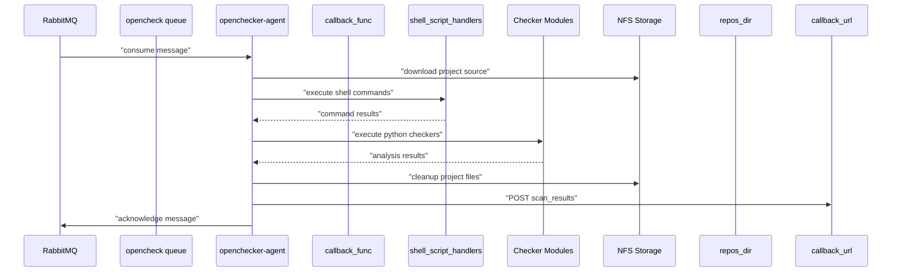
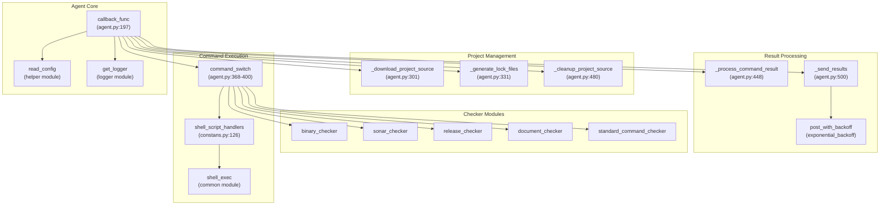
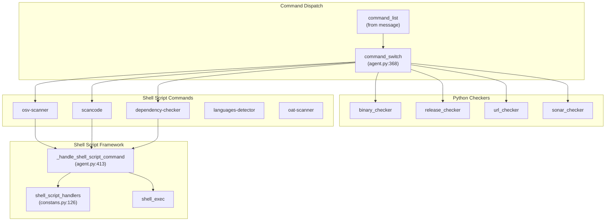
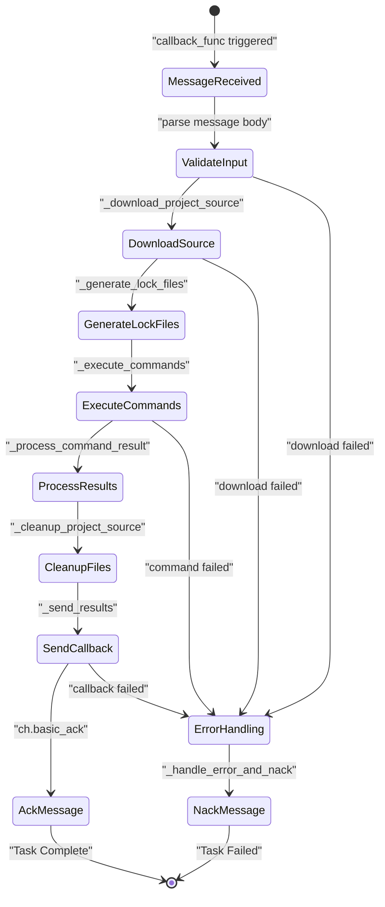

# Core Architecture

> **Relevant source files**
> * [openchecker/agent.py](https://github.com/Laniakea2012/openchecker/blob/1dbd85d0/openchecker/agent.py)
> * [openchecker/constans.py](https://github.com/Laniakea2012/openchecker/blob/1dbd85d0/openchecker/constans.py)

This document describes the fundamental architecture of the OpenChecker system, focusing on the agent-based processing model, message queue integration, and core workflow execution. The architecture centers around asynchronous task processing where agents consume project analysis requests from message queues and execute various security, compliance, and quality checkers.

For specific platform integrations and external service configurations, see [External Service Configuration](/Laniakea2012/openchecker/5.2-external-service-configuration). For details about specific analysis tools and checkers, see [Analysis Tools and Checkers](/Laniakea2012/openchecker/4-analysis-tools-and-checkers).

## System Overview

The OpenChecker core architecture implements a distributed agent-worker pattern where multiple `openchecker-agent` instances process project analysis tasks asynchronously. The system is designed around message-driven processing with robust error handling and automatic retry mechanisms.

### Core Processing Flow



Sources: [openchecker/agent.py L197-L298](https://github.com/Laniakea2012/openchecker/blob/1dbd85d0/openchecker/agent.py#L197-L298)

## Agent System Architecture

The agent system is built around the `callback_func` function which serves as the main message processor. Each agent instance can handle multiple project analysis tasks concurrently through the message queue system.

### Agent Component Interaction



Sources: [openchecker/agent.py L197-L298](https://github.com/Laniakea2012/openchecker/blob/1dbd85d0/openchecker/agent.py#L197-L298)

 [openchecker/agent.py L368-L400](https://github.com/Laniakea2012/openchecker/blob/1dbd85d0/openchecker/agent.py#L368-L400)

 [openchecker/constans.py L126-L139](https://github.com/Laniakea2012/openchecker/blob/1dbd85d0/openchecker/constans.py#L126-L139)

## Command Processing Framework

The system implements a flexible command routing mechanism that supports both shell script-based tools and Python-based checker modules. Commands are executed based on a dispatch table that maps command names to their respective handlers.

### Command Types and Handlers

| Command Category | Handler Type | Examples |
| --- | --- | --- |
| Shell Script Commands | `_handle_shell_script_command` | `osv-scanner`, `scancode`, `dependency-checker` |
| Python Checker Modules | Direct function calls | `binary-checker`, `release-checker`, `sonar-scanner` |
| Standard Commands | `standard_command_checker` | `criticality-score`, `scorecard-score`, `code-count` |



Sources: [openchecker/agent.py L368-L400](https://github.com/Laniakea2012/openchecker/blob/1dbd85d0/openchecker/agent.py#L368-L400)

 [openchecker/agent.py L413-L446](https://github.com/Laniakea2012/openchecker/blob/1dbd85d0/openchecker/agent.py#L413-L446)

 [openchecker/constans.py L126-L139](https://github.com/Laniakea2012/openchecker/blob/1dbd85d0/openchecker/constans.py#L126-L139)

## Project Lifecycle Management

Each project analysis follows a standardized lifecycle that ensures proper resource management and consistent processing across different project types.

### Project Processing Lifecycle



Sources: [openchecker/agent.py L197-L298](https://github.com/Laniakea2012/openchecker/blob/1dbd85d0/openchecker/agent.py#L197-L298)

 [openchecker/agent.py L301-L329](https://github.com/Laniakea2012/openchecker/blob/1dbd85d0/openchecker/agent.py#L301-L329)

 [openchecker/agent.py L331-L348](https://github.com/Laniakea2012/openchecker/blob/1dbd85d0/openchecker/agent.py#L331-L348)

## Shell Script Execution Framework

The system includes a comprehensive shell script framework for executing external analysis tools. Scripts are templated and dynamically populated with project-specific parameters.

### Shell Script Template System

The `shell_script_handlers` dictionary in `constans.py` provides templated shell scripts for various analysis tools. Each script follows a consistent pattern:

1. **Project Name Extraction**: `_get_project_name()` extracts the project name from the URL
2. **Repository Cloning**: `_clone_project()` handles git cloning with optional depth limiting
3. **Tool Execution**: Tool-specific commands with standardized output handling
4. **Cleanup**: Removal of temporary files and directories

Example shell script structure for OSV scanner:

```markdown
# Project name extraction
project_name=$(basename {project_url} | sed 's/\.git$//')

# Clone repository with depth=1
if [ ! -e "$project_name" ]; then
    GIT_ASKPASS=/bin/true git clone --depth=1 {project_url}
fi

# Execute OSV scanner
osv-scanner --format json -r $project_name > $project_name/result.json
cat $project_name/result.json
```

Sources: [openchecker/constans.py L1-L139](https://github.com/Laniakea2012/openchecker/blob/1dbd85d0/openchecker/constans.py#L1-L139)

## Error Handling and Reliability

The architecture incorporates multiple layers of error handling and reliability mechanisms:

### Error Handling Strategy

* **Message Acknowledgment**: Successful tasks are acknowledged (`ch.basic_ack`), failed tasks are negative acknowledged (`ch.basic_nack`)
* **Dead Letter Queue**: Failed messages are routed to dead letter queue for manual inspection
* **Exponential Backoff**: HTTP callbacks use exponential backoff retry mechanism via `post_with_backoff`
* **Working Directory Management**: Ensures proper cleanup and restoration of working directory state
* **Resource Cleanup**: Automatic cleanup of downloaded project files regardless of task outcome

For detailed information about specific reliability mechanisms, see [Reliability and Error Handling](/Laniakea2012/openchecker/2.4-reliability-and-error-handling). For message queue integration details, see [Message Queue Integration](/Laniakea2012/openchecker/2.2-message-queue-integration).

Sources: [openchecker/agent.py L519-L531](https://github.com/Laniakea2012/openchecker/blob/1dbd85d0/openchecker/agent.py#L519-L531)

 [openchecker/agent.py L177-L194](https://github.com/Laniakea2012/openchecker/blob/1dbd85d0/openchecker/agent.py#L177-L194)

 [openchecker/agent.py L289-L298](https://github.com/Laniakea2012/openchecker/blob/1dbd85d0/openchecker/agent.py#L289-L298)