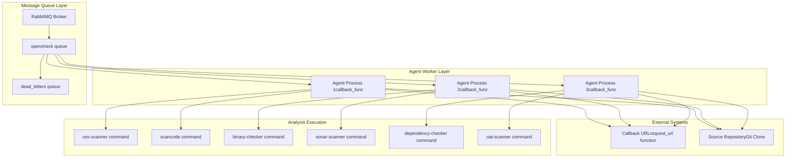
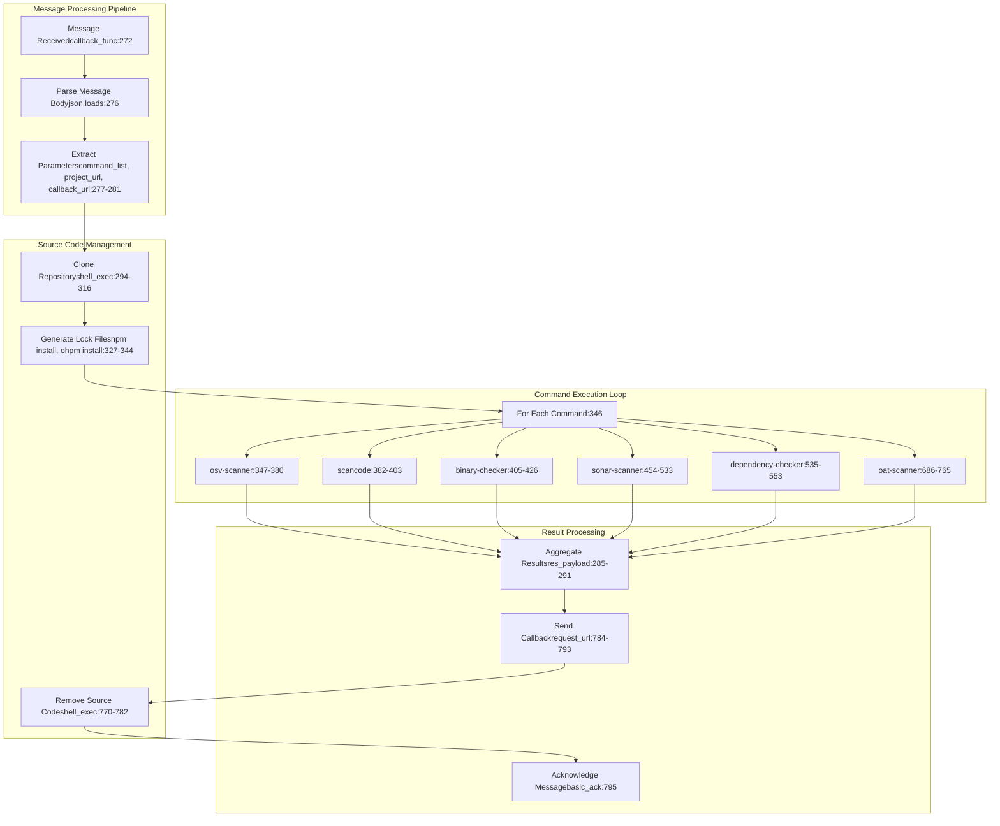
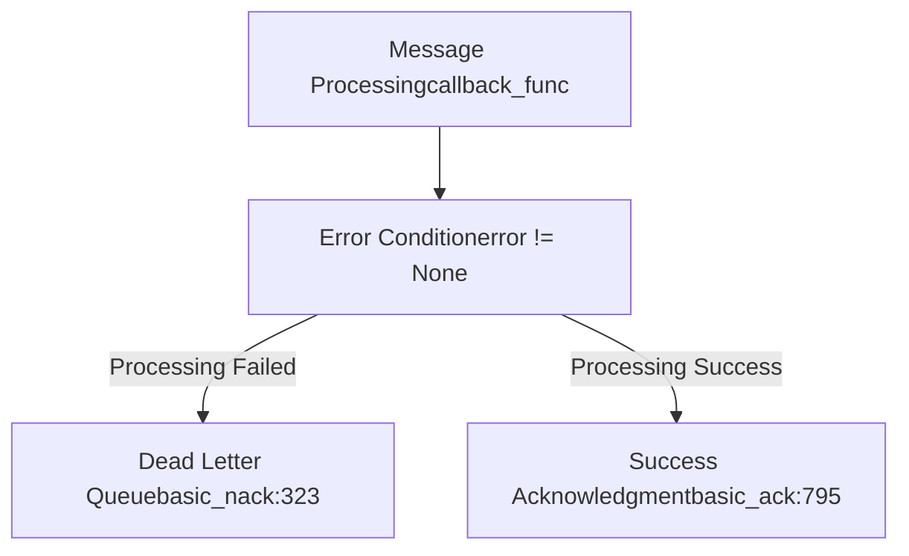
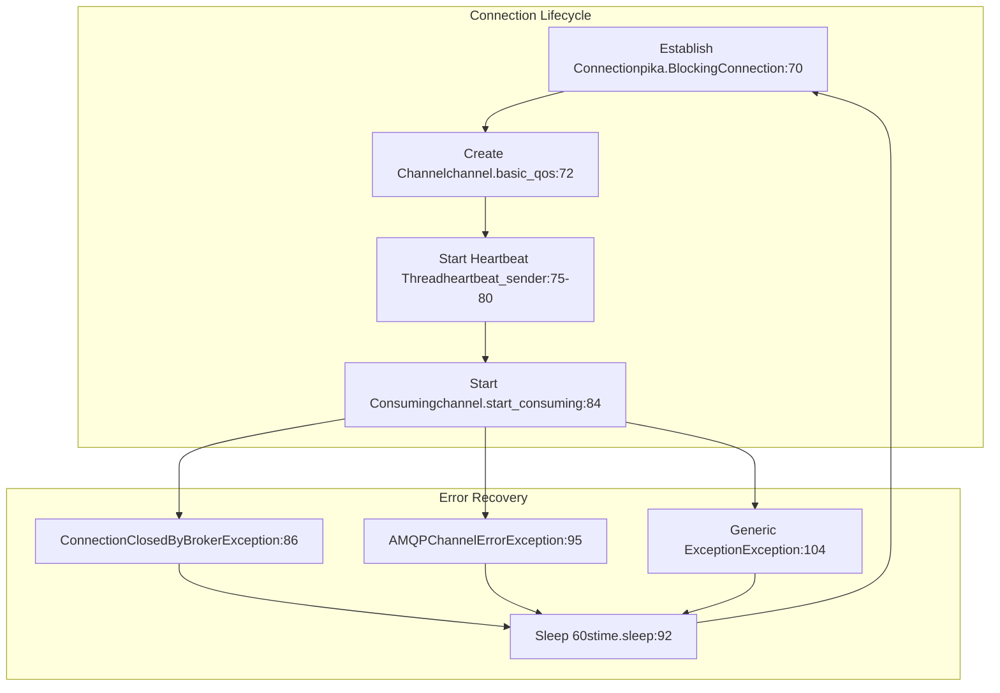

# Core Architecture

> **Relevant source files**
> * [openchecker/agent.py](https://github.com/Laniakea2012/openchecker/blob/00a9732e/openchecker/agent.py)
> * [openchecker/message_queue.py](https://github.com/Laniakea2012/openchecker/blob/00a9732e/openchecker/message_queue.py)
> * [scripts/binary_checker.sh](https://github.com/Laniakea2012/openchecker/blob/00a9732e/scripts/binary_checker.sh)

## Purpose and Scope

This document describes the fundamental architecture of the OpenChecker system, focusing on the message-driven design that enables distributed processing of software analysis and compliance checking tasks. The core architecture consists of agent workers that consume analysis requests from RabbitMQ queues and execute various security and compliance checkers on source code repositories.

For detailed information about specific analysis tools and checkers, see [Analysis Tools and Checkers](/Laniakea2012/openchecker/4-analysis-tools-and-checkers). For API endpoint documentation and authentication mechanisms, see [API and Authentication](/Laniakea2012/openchecker/3-api-and-authentication). For deployment infrastructure details, see [Deployment and Infrastructure](/Laniakea2012/openchecker/6-deployment-and-infrastructure).

## Message-Driven Architecture Overview

OpenChecker follows a message-driven architecture where analysis requests are processed asynchronously through RabbitMQ message queues. The system decouples request handling from task execution, enabling horizontal scaling and fault tolerance.



Sources: [openchecker/agent.py L1-L800](https://github.com/Laniakea2012/openchecker/blob/00a9732e/openchecker/agent.py#L1-L800)

 [openchecker/message_queue.py L1-L206](https://github.com/Laniakea2012/openchecker/blob/00a9732e/openchecker/message_queue.py#L1-L206)

## Agent Worker System

The agent worker system is implemented in the `callback_func` function which serves as the main message processor. Each agent worker operates independently and can process multiple types of analysis commands concurrently.



Sources: [openchecker/agent.py L272-L795](https://github.com/Laniakea2012/openchecker/blob/00a9732e/openchecker/agent.py#L272-L795)

## Message Processing Flow

Messages contain essential metadata for task execution and are structured with specific fields that drive the analysis workflow.

### Message Structure

Each message processed by the `callback_func` contains the following key components:

| Field | Description | Line Reference |
| --- | --- | --- |
| `command_list` | Array of analysis commands to execute | [openchecker/agent.py <br> 277](https://github.com/Laniakea2012/openchecker/blob/00a9732e/openchecker/agent.py#L277-L277) |
| `project_url` | Git repository URL for source code | [openchecker/agent.py <br> 278](https://github.com/Laniakea2012/openchecker/blob/00a9732e/openchecker/agent.py#L278-L278) |
| `commit_hash` | Specific commit for analysis (optional) | [openchecker/agent.py <br> 279](https://github.com/Laniakea2012/openchecker/blob/00a9732e/openchecker/agent.py#L279-L279) |
| `callback_url` | URL for result delivery | [openchecker/agent.py <br> 280](https://github.com/Laniakea2012/openchecker/blob/00a9732e/openchecker/agent.py#L280-L280) |
| `task_metadata` | Additional task context and parameters | [openchecker/agent.py <br> 281](https://github.com/Laniakea2012/openchecker/blob/00a9732e/openchecker/agent.py#L281-L281) |

### Error Handling and Dead Letter Processing

The system implements robust error handling with automatic message routing to dead letter queues when processing fails:



Sources: [openchecker/agent.py L318-L324](https://github.com/Laniakea2012/openchecker/blob/00a9732e/openchecker/agent.py#L318-L324)

 [openchecker/agent.py L790-L795](https://github.com/Laniakea2012/openchecker/blob/00a9732e/openchecker/agent.py#L790-L795)

## Queue Management System

The message queue management is handled by dedicated functions in the `message_queue.py` module, providing comprehensive queue operations.

### Core Queue Operations

| Function | Purpose | Parameters |
| --- | --- | --- |
| `create_queue` | Initialize queue with arguments | config, queue_name, arguments |
| `publish_message` | Send message to queue | config, queue_name, message_body |
| `consumer` | Start message consumption with callback | config, queue_name, callback_func |
| `check_queue_status` | Get message and consumer counts | config, queue_name |
| `purge_queue` | Clear all messages from queue | config, queue_name |
| `delete_queue` | Remove queue entirely | config, queue_name |

### Connection Management and Reliability

The consumer implementation includes sophisticated connection management with heartbeat handling and automatic reconnection:



Sources: [openchecker/message_queue.py L43-L120](https://github.com/Laniakea2012/openchecker/blob/00a9732e/openchecker/message_queue.py#L43-L120)

## Analysis Tool Integration

Each analysis command in the `callback_func` follows a consistent pattern for tool execution and result collection. Tools are integrated through shell script execution using the `shell_exec` helper function.

### Shell Execution Framework

The `shell_exec` function provides a standardized interface for executing analysis tools:

```
def shell_exec(shell_script, param=None):
    if param != None:
        process = subprocess.Popen(["/bin/bash", "-c", shell_script + " " + param], 
                                   stdout=subprocess.PIPE, stderr=subprocess.PIPE, shell=False)
    else:
        process = subprocess.Popen([shell_script], 
                                   stdout=subprocess.PIPE, stderr=subprocess.PIPE, shell=True)
```

Sources: [openchecker/agent.py L91-L101](https://github.com/Laniakea2012/openchecker/blob/00a9732e/openchecker/agent.py#L91-L101)

### Command Execution Pattern

Each analysis tool follows this standard execution pattern:

1. **Repository Preparation**: Clone source code if not present
2. **Tool Execution**: Run specific analysis command via shell script
3. **Result Processing**: Parse tool output and format for callback
4. **Error Handling**: Log errors and include in result payload

For example, the `binary-checker` command demonstrates this pattern:

* Executes `./scripts/binary_checker.sh` with project URL parameter
* Processes output to identify binary files and archives
* Formats results into structured data for callback

Sources: [openchecker/agent.py L405-L426](https://github.com/Laniakea2012/openchecker/blob/00a9732e/openchecker/agent.py#L405-L426)

 [scripts/binary_checker.sh L1-L93](https://github.com/Laniakea2012/openchecker/blob/00a9732e/scripts/binary_checker.sh#L1-L93)

### Result Aggregation

All analysis results are collected in the `res_payload` structure, which maintains a consistent format across all tools:

```
res_payload = {
    "command_list": command_list,
    "project_url": project_url,
    "task_metadata": task_metadata,
    "scan_results": {
        # Tool-specific results added here
    }
}
```

Sources: [openchecker/agent.py L285-L291](https://github.com/Laniakea2012/openchecker/blob/00a9732e/openchecker/agent.py#L285-L291)