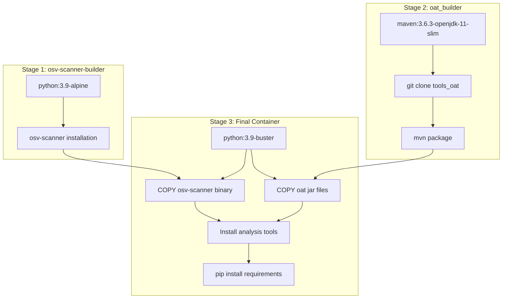
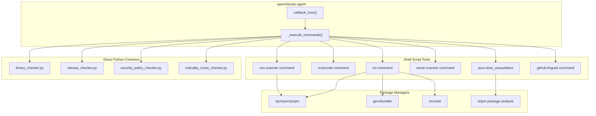
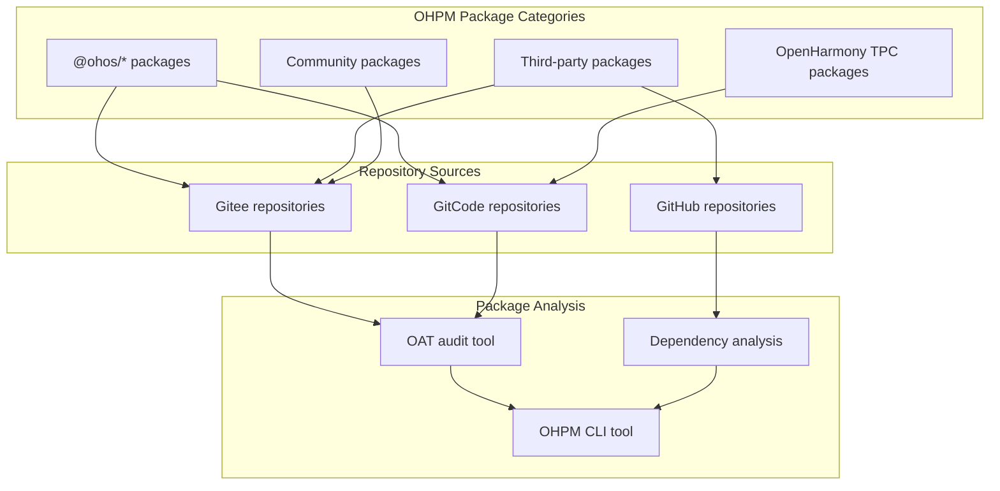
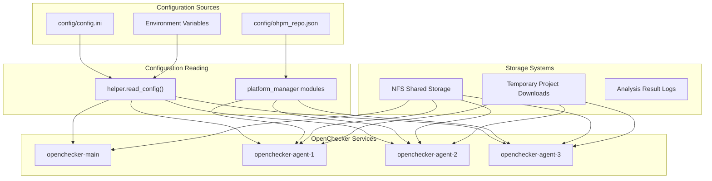

# Requirements and Dependencies

> **Relevant source files**
> * [openchecker/database/repo.py](https://github.com/Laniakea2012/openchecker/blob/1dbd85d0/openchecker/database/repo.py)

This document covers the Python dependencies, external tool requirements, and service integrations required for the OpenChecker distributed software analysis platform. This includes both the core API server dependencies and the analysis tool ecosystem used by the worker agents.

For deployment and infrastructure requirements, see [Kubernetes Deployments](/Laniakea2012/openchecker/7.2-kubernetes-deployment). For configuration of external services, see [External Service Configuration](/Laniakea2012/openchecker/7.3-storage-and-nfs-provisioning).

## Core Python Dependencies

The OpenChecker system relies on a carefully selected set of Python libraries that support its distributed architecture and API-first design. These dependencies are defined in the project's requirements specification.

### Web Framework and API Dependencies

The core API server components as defined in [requirements.txt L1-L4](https://github.com/Laniakea2012/openchecker/blob/1dbd85d0/requirements.txt#L1-L4)

:

| Package | Version | Purpose |
| --- | --- | --- |
| `flask` | 2.2.3 | Core web framework for `openchecker.main` API server |
| `flask_restful` | 0.3.9 | REST API extensions and resource routing |
| `flask_jwt` | 0.3.2 | JWT token authentication via `helper.auth` module |
| `Werkzeug` | 2.2.2 | WSGI toolkit and utilities |

### Message Queue and Communication

The distributed worker architecture dependencies from [requirements.txt L5-L9](https://github.com/Laniakea2012/openchecker/blob/1dbd85d0/requirements.txt#L5-L9)

:

| Package | Version | Purpose |
| --- | --- | --- |
| `pika` | 1.3.2 | RabbitMQ client for `openchecker.agent.callback_func` message processing |
| `requests` | 2.26.0 | HTTP client for platform adapters and external API calls |
| `httpx` | 0.27.2 | Async HTTP client for concurrent operations |

### External Service Integration

Integration with AI services and version control platforms from [requirements.txt L7-L10](https://github.com/Laniakea2012/openchecker/blob/1dbd85d0/requirements.txt#L7-L10)

:

| Package | Version | Purpose |
| --- | --- | --- |
| `openai` | 1.37.1 | OpenAI API client for LLM services in security checkers |
| `ghapi` | 1.0.5 | GitHub API client for `platform_manager.GitHubAdapter` |
| `pyyaml` | 6.0.2 | YAML configuration file parsing |

## Dependency Architecture

The following diagram illustrates how Python dependencies map to system components:

```mermaid
flowchart TD

FlaskAPI["Flask API Server"]
JWTAuth["JWT Authentication"]
RESTEndpoints["REST API Endpoints"]
RabbitMQClient["RabbitMQ Client"]
MessageProcessor["Message Processing"]
GitHubClient["GitHub API Client"]
OpenAIClient["OpenAI LLM Client"]
HTTPClients["HTTP/HTTPS Clients"]
YAMLParser["YAML Configuration Parser"]
Flask["flask==2.2.3"]
FlaskRESTful["flask_restful==0.3.9"]
FlaskJWT["flask_jwt==0.3.2"]
Werkzeug["Werkzeug==2.2.2"]
Pika["pika==1.3.2"]
Requests["requests==2.26.0"]
HTTPX["httpx==0.27.2"]
OpenAI["openai==1.37.1"]
GHAPI["ghapi==1.0.5"]
PyYAML["pyyaml==6.0.2"]

Flask --> FlaskAPI
FlaskRESTful --> RESTEndpoints
FlaskJWT --> JWTAuth
Werkzeug --> FlaskAPI
Pika --> RabbitMQClient
Pika --> MessageProcessor
Requests --> HTTPClients
HTTPX --> HTTPClients
OpenAI --> OpenAIClient
GHAPI --> GitHubClient
PyYAML --> YAMLParser

subgraph subGraph4 ["Python Dependencies"]
    Flask
    FlaskRESTful
    FlaskJWT
    Werkzeug
    Pika
    Requests
    HTTPX
    OpenAI
    GHAPI
    PyYAML
end

subgraph Configuration ["Configuration"]
    YAMLParser
end

subgraph subGraph2 ["External Integrations"]
    GitHubClient
    OpenAIClient
    HTTPClients
end

subgraph subGraph1 ["Message Queue Layer"]
    RabbitMQClient
    MessageProcessor
end

subgraph openchecker-main ["openchecker-main"]
    FlaskAPI
    JWTAuth
    RESTEndpoints
end
```

Sources: [requirements.txt L1-L10](https://github.com/Laniakea2012/openchecker/blob/1dbd85d0/requirements.txt#L1-L10)

## Container Build Dependencies and Analysis Tools

The OpenChecker system uses a multi-stage Docker build process that installs numerous external analysis tools. These tools are integrated through the `openchecker.agent` shell script execution framework.

### Multi-Stage Container Build Process

**Container Build Dependencies** from [Dockerfile L1-L93](https://github.com/Laniakea2012/openchecker/blob/1dbd85d0/Dockerfile#L1-L93)

:

### Installed Analysis Tools

**Security and Vulnerability Analysis Tools** from [Dockerfile L1-L89](https://github.com/Laniakea2012/openchecker/blob/1dbd85d0/Dockerfile#L1-L89)

:

| Tool | Installation Method | Purpose | Version/Source |
| --- | --- | --- | --- |
| `osv-scanner` | Alpine package | Vulnerability scanning | Latest from package manager |
| `ohos_ossaudittool` | Maven build | OpenHarmony audit tool | v2.0.0 from Gitee |
| `scorecard` | Binary download | OSSF Scorecard security scoring | v5.2.1 |

**Code Quality and License Analysis** from [Dockerfile L28-L51](https://github.com/Laniakea2012/openchecker/blob/1dbd85d0/Dockerfile#L28-L51)

:

| Tool | Installation Method | Purpose | Version |
| --- | --- | --- | --- |
| `scancode` | Archive download | License and copyright analysis | v32.1.0 |
| `sonar-scanner` | Binary download | SonarQube code quality analysis | v6.1.0.4477 |
| `ort` | Archive download | OSS Review Toolkit | v25.0.0 |

**Language Ecosystem Tools** from [Dockerfile L53-L73](https://github.com/Laniakea2012/openchecker/blob/1dbd85d0/Dockerfile#L53-L73)

:

| Tool | Installation Method | Purpose |
| --- | --- | --- |
| `github-linguist` | Ruby gem | Language detection |
| `cocoapods` | Ruby gem | iOS dependency analysis |
| `cloc` | System package | Code line counting |
| `licensee` | Ruby gem | License detection |
| `ohpm` | Git clone | OpenHarmony package manager |

### Analysis Tool Integration Architecture

### Runtime Environment Dependencies

**System Package Dependencies** from [Dockerfile L53-L68](https://github.com/Laniakea2012/openchecker/blob/1dbd85d0/Dockerfile#L53-L68)

:

| Component | Purpose | Installation |
| --- | --- | --- |
| Ruby 3.1.6 | Ruby-based analysis tools | RVM installation |
| Node.js 18.x | JavaScript package analysis | NodeSource repository |
| OpenJDK 11 | Java-based tools | System package |
| Build tools | Compilation requirements | `build-essential`, `cmake`, `pkg-config` |

Sources: [Dockerfile L1-L93](https://github.com/Laniakea2012/openchecker/blob/1dbd85d0/Dockerfile#L1-L93)

 [scripts/entrypoint.sh L1-L4](https://github.com/Laniakea2012/openchecker/blob/1dbd85d0/scripts/entrypoint.sh#L1-L4)

## System Architecture Dependencies

The OpenChecker system depends on several external services and infrastructure components for operation:

### Message Queue Infrastructure

| Component | Purpose | Configuration |
| --- | --- | --- |
| RabbitMQ | Message broker for distributed task processing | Configured via `config.ini` |
| `opencheck` queue | Primary task queue for analysis jobs | Default queue for worker consumption |
| `dead_letters` queue | Failed message handling | Error recovery and debugging |

### External Service Dependencies

| Service | Purpose | Integration Method |
| --- | --- | --- |
| GitHub API | Repository access and metadata | `ghapi` client library |
| Gitee API | Chinese Git platform integration | HTTP requests |
| GitCode API | GitCode platform integration | HTTP requests |
| SonarQube | Code quality analysis | Direct API calls |
| OpenAI API | LLM-powered analysis | `openai` client library |
| Package Registries | npm, OHPM package information | HTTP API calls |

## OpenHarmony Package Manager (OHPM) Dependencies

The system includes extensive OHPM package repository mappings for OpenHarmony ecosystem analysis.

### OHPM Repository Configuration

**OHPM Package Mappings** from [config/ohpm_repo.json L1-L800](https://github.com/Laniakea2012/openchecker/blob/1dbd85d0/config/ohpm_repo.json#L1-L800)

:

**Sample OHPM Package Mappings**:

| Package Name | Repository URL | Category |
| --- | --- | --- |
| `@ohos/hypium` | [https://gitee.com/openharmony/testfwk_arkxtest](https://gitee.com/openharmony/testfwk_arkxtest) | Official testing framework |
| `@ohos/axios` | [https://gitcode.com/openharmony-sig/ohos_axios](https://gitcode.com/openharmony-sig/ohos_axios) | HTTP client |
| `@ohos/crypto-js` | [https://gitee.com/openharmony-sig/crypto-js](https://gitee.com/openharmony-sig/crypto-js) | Cryptography |
| `dayjs` | [https://github.com/iamkun/dayjs](https://github.com/iamkun/dayjs) | Date utility |
| `rxjs` | [https://github.com/reactivex/rxjs](https://github.com/reactivex/rxjs) | Reactive programming |

### Storage and Configuration Dependencies

Sources: [config/ohpm_repo.json L1-L800](https://github.com/Laniakea2012/openchecker/blob/1dbd85d0/config/ohpm_repo.json#L1-L800)

 based on system configuration patterns

## Container and Runtime Dependencies

The OpenChecker system operates within containerized environments that require specific runtime dependencies:

### Base System Requirements

| Component | Purpose | Installation Method |
| --- | --- | --- |
| Python 3.x | Runtime environment | Base container image |
| Git | Version control operations | System package manager |
| Node.js | JavaScript package analysis | System package manager |
| Java | Java-based analysis tools | System package manager |
| Ruby | Ruby-based analysis tools | System package manager |

### Container Build Dependencies

The multi-stage container build process requires various build tools and package managers to install and configure the analysis tool ecosystem. These dependencies are managed through Docker build stages and are not reflected in the Python requirements file.

Sources: [requirements.txt L1-L10](https://github.com/Laniakea2012/openchecker/blob/1dbd85d0/requirements.txt#L1-L10)