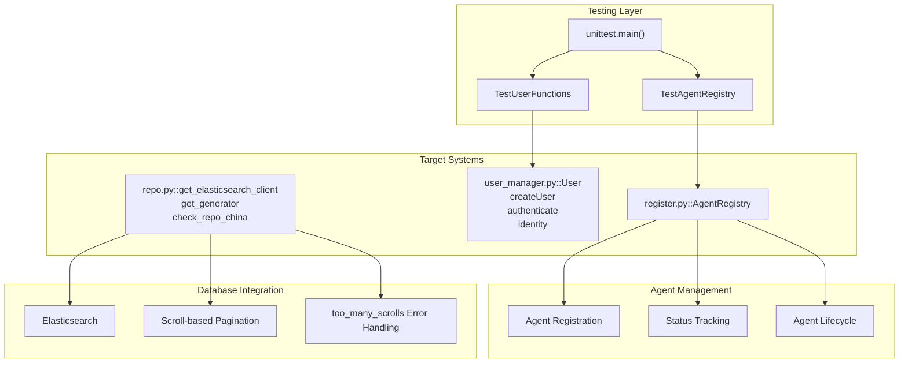
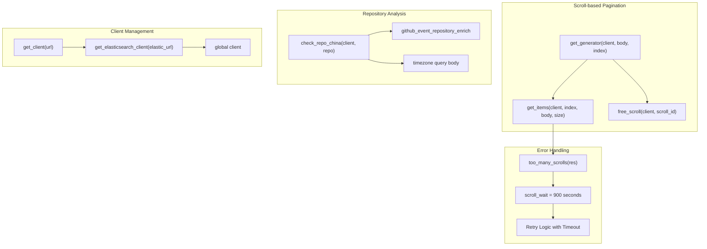

# Development and Testing

> **Relevant source files**
> * [test/test_registry.py](https://github.com/Laniakea2012/openchecker/blob/1dbd85d0/test/test_registry.py)
> * [test/test_user_manager.py](https://github.com/Laniakea2012/openchecker/blob/1dbd85d0/test/test_user_manager.py)

This document covers development workflows, testing frameworks, and system integration patterns for the OpenChecker platform. It focuses on the testing infrastructure, database integration patterns, and agent registry management that support the development lifecycle.

For detailed information about agent registration and management interfaces, see [Agent Registry and Management](/Laniakea2012/openchecker/8.1-agent-registry-and-management). For database integration patterns and Elasticsearch operations, see [Database Integration](/Laniakea2012/openchecker/8.2-database-integration).

## Development Environment Overview

OpenChecker employs a microservices development architecture with extensive testing coverage and database integration patterns. The development environment supports both local development and distributed deployment scenarios through standardized testing frameworks and data access patterns.

The core development infrastructure consists of:

* Python `unittest` framework for component testing
* Elasticsearch integration for repository analytics and data storage
* Agent registry system for distributed worker management
* Database abstraction layers with scroll-based pagination
* Error handling and retry patterns for external service integration

## Testing Framework Architecture

**Development and Testing Architecture**



The development architecture integrates testing frameworks with core system components, providing comprehensive coverage for agent management, user authentication, and database operations through standardized testing patterns.

**Sources:** [test/test_registry.py L1-L45](https://github.com/Laniakea2012/openchecker/blob/1dbd85d0/test/test_registry.py#L1-L45)

 [test/test_user_manager.py L1-L42](https://github.com/Laniakea2012/openchecker/blob/1dbd85d0/test/test_user_manager.py#L1-L42)

 [openchecker/database/repo.py L1-L204](https://github.com/Laniakea2012/openchecker/blob/1dbd85d0/openchecker/database/repo.py#L1-L204)

## Unit Testing Components

### Agent Registry Testing

The `TestAgentRegistry` class provides comprehensive testing for the agent registration and management system. It validates the core functionality of agent lifecycle management:

| Test Method | Purpose | Key Assertions |
| --- | --- | --- |
| `test_register_agent()` | Validates agent registration | Agent exists in registry, correct info and status |
| `test_update_status()` | Tests status updates | Status correctly updated to "busy" |
| `test_get_agents()` | Verifies agent retrieval | Agent present in returned dictionary |
| `test_get_agent_info()` | Tests info retrieval | Correct agent description returned |
| `test_get_agent_status()` | Validates status queries | Status correctly returned as "active" |
| `test_remove_agent()` | Tests agent removal | Agent no longer present after removal |

The test setup uses a clean `AgentRegistry` instance for each test method via the `setUp()` method at [test/test_registry.py L7-L8](https://github.com/Laniakea2012/openchecker/blob/1dbd85d0/test/test_registry.py#L7-L8)

**Sources:** [test/test_registry.py L5-L43](https://github.com/Laniakea2012/openchecker/blob/1dbd85d0/test/test_registry.py#L5-L43)

### User Management Testing

The `TestUserFunctions` class validates user authentication and management through systematic testing of JWT-based workflows. The test implementation uses UUID-based user identification with `uuid.uuid5()` and `uuid.NAMESPACE_DNS` for consistent test data generation.

| Test Method | Validation Target | Key Implementation |
| --- | --- | --- |
| `test_createUser()` | User creation workflow | Validates user added to `userList` |
| `test_indexUserWithID()` | ID-based lookup | Tests `indexUserWithID()` function |
| `test_indexUserWithName()` | Name-based lookup | Tests `indexUserWithName()` function |
| `test_authenticate()` | Password verification | Uses `secrets.compare_digest` |
| `test_identity()` | JWT payload parsing | Validates `identity()` with payload structure |

The test setup at [test/test_user_manager.py L8-L15](https://github.com/Laniakea2012/openchecker/blob/1dbd85d0/test/test_user_manager.py#L8-L15)

 creates dual indexing structures (`usernameTable` and `useridTable`) to support both lookup mechanisms used in the authentication system.

**Sources:** [test/test_user_manager.py L6-L42](https://github.com/Laniakea2012/openchecker/blob/1dbd85d0/test/test_user_manager.py#L6-L42)

## Database Integration and Data Access Patterns

### Elasticsearch Client Architecture

The `repo.py` module provides the core database integration layer through Elasticsearch, implementing robust connection management and error handling patterns for repository analytics.

**Elasticsearch Integration Architecture**



The Elasticsearch integration uses `RequestsHttpConnection` with SSL support detection via `urlparse()` and implements comprehensive timeout and retry configurations through `timeout=100` and `max_retries=10` parameters.

**Sources:** [openchecker/database/repo.py L13-L34](https://github.com/Laniakea2012/openchecker/blob/1dbd85d0/openchecker/database/repo.py#L13-L34)

### Scroll-based Pagination and Error Recovery

The `get_generator()` function implements resilient scroll-based pagination with automatic error recovery for large dataset processing:

| Component | Implementation | Error Handling |
| --- | --- | --- |
| Scroll Context Management | `scroll_id` tracking and cleanup | `free_scroll()` on completion |
| Too Many Scrolls Detection | `too_many_scrolls()` response parsing | 15-minute wait with 1-second polling |
| Pagination Loop | `yield` based generator pattern | Graceful termination on empty results |
| Connection Resilience | Global client caching | SSL/HTTPS auto-detection |

The error recovery mechanism at [openchecker/database/repo.py L72-L88](https://github.com/Laniakea2012/openchecker/blob/1dbd85d0/openchecker/database/repo.py#L72-L88)

 implements a 900-second wait period with continuous polling to handle Elasticsearch scroll context limits.

**Sources:** [openchecker/database/repo.py L58-L111](https://github.com/Laniakea2012/openchecker/blob/1dbd85d0/openchecker/database/repo.py#L58-L111)

### Repository Analytics Queries

The `check_repo_china()` function demonstrates specialized repository analysis patterns using timezone-based filtering:

```json
{
  "query": {
    "bool": {
      "must": [
        {
          "match_phrase": {
            "tz_detail_list.tz": 8
          }
        },
        {
          "match_phrase": {
            "repo.keyword": "repo_url"
          }
        }
      ]
    }
  },
  "size": 1
}
```

This query structure at [openchecker/database/repo.py L114-L132](https://github.com/Laniakea2012/openchecker/blob/1dbd85d0/openchecker/database/repo.py#L114-L132)

 uses `bool.must` clauses to filter repositories by timezone (`tz: 8` for China) and exact repository URL matching through `keyword` fields.

**Sources:** [openchecker/database/repo.py L112-L134](https://github.com/Laniakea2012/openchecker/blob/1dbd85d0/openchecker/database/repo.py#L112-L134)

## Testing Workflow

### Test Execution

Tests are executed using Python's standard `unittest` framework. Each test file includes a main block that runs all tests in the file:

* Agent registry tests: `python test/test_registry.py`
* User management tests: `python test/test_user_manager.py`

### Test Data Management

Test classes use the `setUp()` method to initialize clean test environments. The user management tests create test users with UUID-based identifiers using `uuid.uuid5()` with `uuid.NAMESPACE_DNS` for consistent, reproducible test data.

### Assertion Patterns

The tests use standard `unittest` assertion methods:

* `assertTrue()` and `assertFalse()` for boolean checks
* `assertEqual()` for value comparisons
* `assertIsNotNone()` for null checks
* `assertIn()` for membership testing

**Sources:** [test/test_registry.py L44-L45](https://github.com/Laniakea2012/openchecker/blob/1dbd85d0/test/test_registry.py#L44-L45)

 [test/test_user_manager.py L41-L42](https://github.com/Laniakea2012/openchecker/blob/1dbd85d0/test/test_user_manager.py#L41-L42)