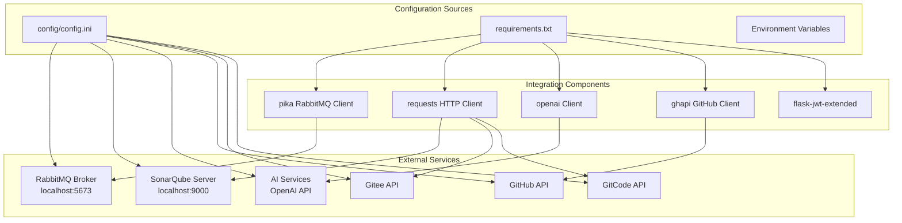
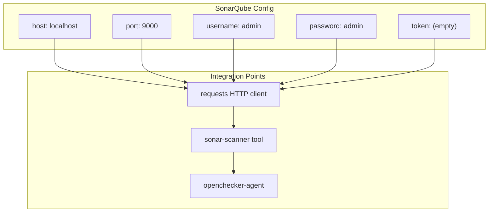
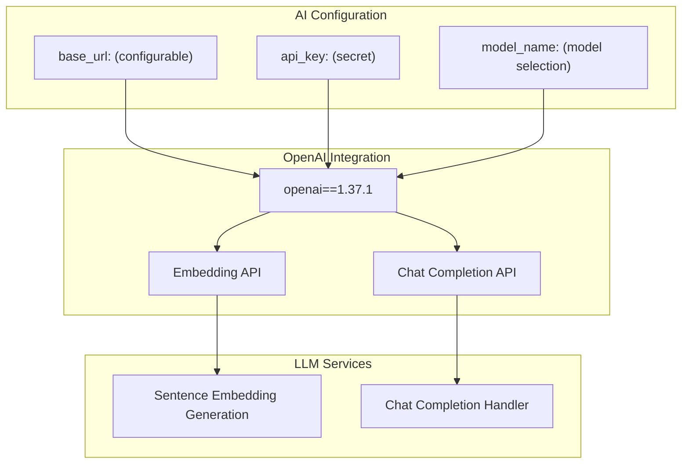
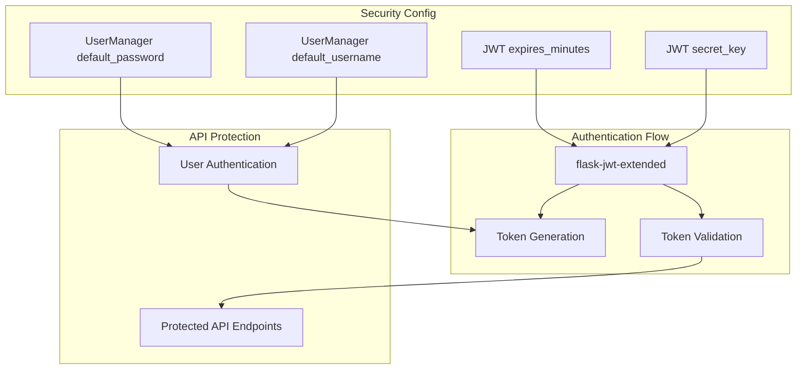
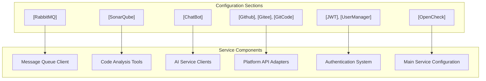

# External Service Configuration

> **Relevant source files**
> * [config/config.ini](https://github.com/Laniakea2012/openchecker/blob/1dbd85d0/config/config.ini)
> * [requirements.txt](https://github.com/Laniakea2012/openchecker/blob/1dbd85d0/requirements.txt)

This document covers the configuration management for external services integrated with the OpenChecker platform. It details how the system connects to and configures RabbitMQ message brokers, SonarQube servers, AI services, version control platforms, and authentication systems through centralized configuration files.

For information about version control platform adapters and their API implementations, see [Version Control Platform Adapters](/Laniakea2012/openchecker/5.1-version-control-platform-adapters). For details about Kubernetes external service proxying, see [External Service Proxying](/Laniakea2012/openchecker/5.3-external-service-proxying).

## Configuration Architecture

The OpenChecker system uses a centralized configuration approach through the `config.ini` file, which defines connection parameters, authentication credentials, and service-specific settings for all external integrations.



**Sources:** [config/config.ini L1-L43](https://github.com/Laniakea2012/openchecker/blob/1dbd85d0/config/config.ini#L1-L43)

 [requirements.txt L1-L10](https://github.com/Laniakea2012/openchecker/blob/1dbd85d0/requirements.txt#L1-L10)

## Message Queue Configuration

The RabbitMQ configuration section defines connection parameters for the message broker that handles asynchronous task distribution between the main service and agent workers.

### RabbitMQ Settings

| Parameter | Value | Purpose |
| --- | --- | --- |
| `host` | `localhost` | RabbitMQ broker hostname |
| `port` | `5673` | Connection port |
| `username` | `admin` | Authentication username |
| `password` | `admin` | Authentication password |
| `heartbeat_interval_s` | `60` | Keep-alive heartbeat interval |
| `blocked_connection_timeout_ms` | `300000` | Connection timeout (5 minutes) |

The `pika` library from [requirements.txt L5](https://github.com/Laniakea2012/openchecker/blob/1dbd85d0/requirements.txt#L5-L5)

 provides the Python client implementation for RabbitMQ connectivity.

**Sources:** [config/config.ini L1-L7](https://github.com/Laniakea2012/openchecker/blob/1dbd85d0/config/config.ini#L1-L7)

 [requirements.txt L5](https://github.com/Laniakea2012/openchecker/blob/1dbd85d0/requirements.txt#L5-L5)

## Code Quality Integration

SonarQube integration enables code quality analysis and metrics collection for projects processed by OpenChecker agents.

### SonarQube Configuration



The configuration supports both username/password authentication and token-based authentication. The `requests` library handles HTTP communication with the SonarQube REST API.

**Sources:** [config/config.ini L9-L14](https://github.com/Laniakea2012/openchecker/blob/1dbd85d0/config/config.ini#L9-L14)

 [requirements.txt L6](https://github.com/Laniakea2012/openchecker/blob/1dbd85d0/requirements.txt#L6-L6)

## AI Service Configuration

The ChatBot section configures integration with AI services, primarily OpenAI APIs for language model capabilities.

### AI Service Parameters

| Parameter | Description | Usage |
| --- | --- | --- |
| `base_url` | API endpoint URL | Custom API endpoint override |
| `api_key` | Authentication key | API access credential |
| `model_name` | Model identifier | Specific model selection |

The `openai` client library from [requirements.txt L7](https://github.com/Laniakea2012/openchecker/blob/1dbd85d0/requirements.txt#L7-L7)

 provides the integration layer for AI service communication.



**Sources:** [config/config.ini L23-L26](https://github.com/Laniakea2012/openchecker/blob/1dbd85d0/config/config.ini#L23-L26)

 [requirements.txt L7](https://github.com/Laniakea2012/openchecker/blob/1dbd85d0/requirements.txt#L7-L7)

## Version Control Platform Configuration

The system integrates with multiple version control platforms through API access tokens configured in dedicated sections.

### Platform Access Configuration

| Platform | Configuration Section | API Integration |
| --- | --- | --- |
| GitHub | `[Github]` | `ghapi` library |
| Gitee | `[Gitee]` | `requests` HTTP client |
| GitCode | `[GitCode]` | `requests` HTTP client |

Each platform section contains an `access_key` parameter for API authentication:

```
[Github]
access_key = 

[Gitee]
access_key = 

[GitCode]
access_key =
```

The GitHub integration uses the specialized `ghapi` library, while Gitee and GitCode use standard HTTP requests.

**Sources:** [config/config.ini L28-L35](https://github.com/Laniakea2012/openchecker/blob/1dbd85d0/config/config.ini#L28-L35)

 [requirements.txt L6](https://github.com/Laniakea2012/openchecker/blob/1dbd85d0/requirements.txt#L6-L6)

 [requirements.txt L8](https://github.com/Laniakea2012/openchecker/blob/1dbd85d0/requirements.txt#L8-L8)

## Authentication and Security Configuration

### JWT Configuration

The JWT section configures JSON Web Token authentication for API access control:

| Parameter | Value | Purpose |
| --- | --- | --- |
| `secret_key` | `your_secure_secret_key_here` | Token signing key |
| `expires_minutes` | `30` | Token expiration time |

### User Management

The UserManager section defines default administrative credentials:

```
[UserManager]
default_username = 
default_password =
```

The `flask-jwt-extended` library provides JWT implementation support.



**Sources:** [config/config.ini L37-L43](https://github.com/Laniakea2012/openchecker/blob/1dbd85d0/config/config.ini#L37-L43)

 [requirements.txt L3](https://github.com/Laniakea2012/openchecker/blob/1dbd85d0/requirements.txt#L3-L3)

## Service Dependencies

The external service integrations rely on specific Python libraries defined in the requirements file:

### Core Integration Libraries

| Library | Version | Purpose |
| --- | --- | --- |
| `pika` | `1.3.2` | RabbitMQ AMQP client |
| `requests` | `2.26.0` | HTTP client for REST APIs |
| `openai` | `1.37.1` | OpenAI API client |
| `ghapi` | `1.0.5` | GitHub API wrapper |
| `httpx` | `0.27.2` | Async HTTP client |
| `pyyaml` | `6.0.2` | YAML configuration parsing |

### Flask Framework Dependencies

| Library | Version | Purpose |
| --- | --- | --- |
| `flask` | `2.2.3` | Web framework |
| `flask_restful` | `0.3.9` | REST API extensions |
| `flask-jwt-extended` | `4.5.3` | JWT authentication |
| `Werkzeug` | `2.2.2` | WSGI utilities |

**Sources:** [requirements.txt L1-L10](https://github.com/Laniakea2012/openchecker/blob/1dbd85d0/requirements.txt#L1-L10)

## Configuration Loading Patterns

The configuration system follows a centralized pattern where all external service settings are loaded from the single `config.ini` file, enabling consistent configuration management across the entire OpenChecker platform.



**Sources:** [config/config.ini L1-L43](https://github.com/Laniakea2012/openchecker/blob/1dbd85d0/config/config.ini#L1-L43)