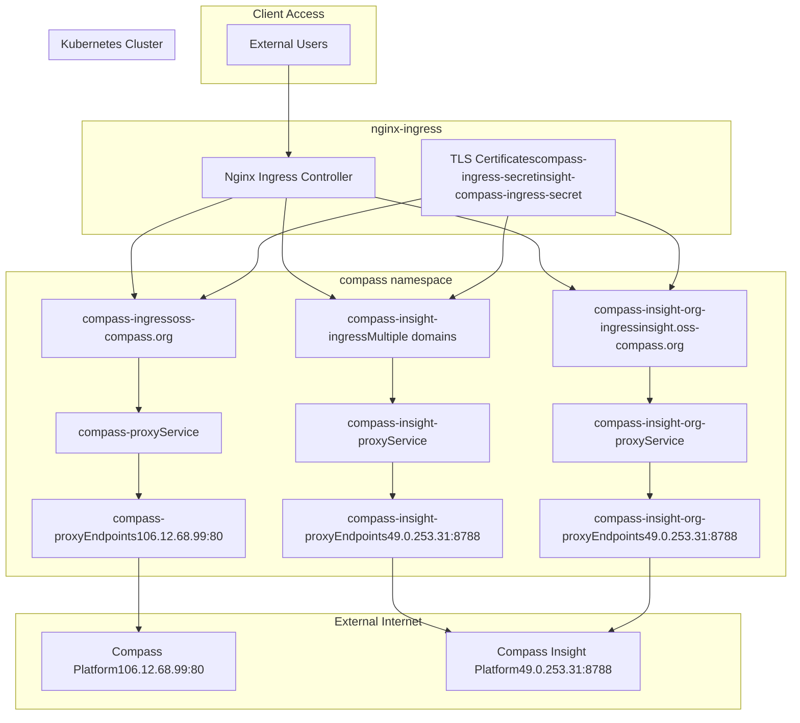
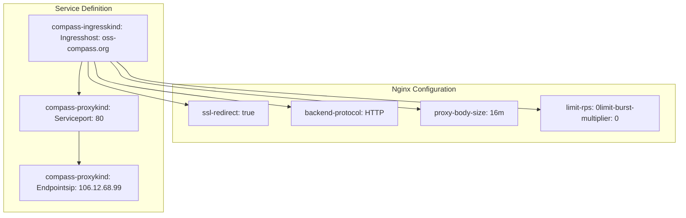
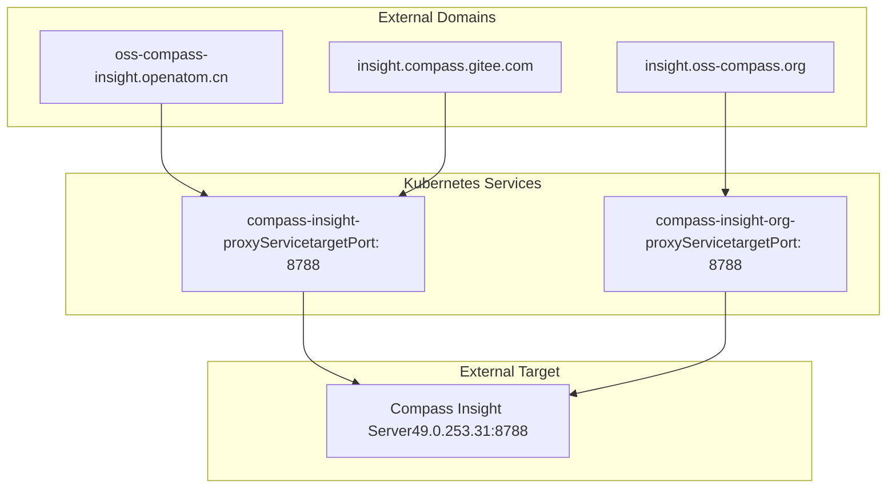
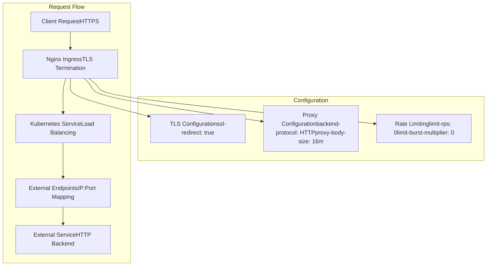

# External Service Integration

> **Relevant source files**
> * [kubernetes/external/compass-insight-org-service.yaml](https://github.com/Laniakea2012/openchecker/blob/00a9732e/kubernetes/external/compass-insight-org-service.yaml)
> * [kubernetes/external/compass-insight-service.yaml](https://github.com/Laniakea2012/openchecker/blob/00a9732e/kubernetes/external/compass-insight-service.yaml)
> * [kubernetes/external/compass-service.yaml](https://github.com/Laniakea2012/openchecker/blob/00a9732e/kubernetes/external/compass-service.yaml)

This document covers the integration of OpenChecker with external analysis platforms and services. The system provides proxy-based access to external open source software analysis platforms through Kubernetes ingress controllers, enabling unified access to distributed analysis capabilities.

For information about the core deployment infrastructure, see [Kubernetes Deployments](/Laniakea2012/openchecker/6.1-kubernetes-deployments). For details about storage and configuration management, see [Storage and Configuration Management](/Laniakea2012/openchecker/6.3-storage-and-configuration-management).

## Integration Architecture

OpenChecker integrates with external services using a proxy pattern implemented through Kubernetes Services with external Endpoints. This approach allows the system to expose external analysis platforms through its own domain structure while maintaining consistent access patterns and security policies.

### External Service Proxy Architecture

**Sources:** [kubernetes/external/compass-service.yaml L1-L57](https://github.com/Laniakea2012/openchecker/blob/00a9732e/kubernetes/external/compass-service.yaml#L1-L57)

 [kubernetes/external/compass-insight-service.yaml L1-L70](https://github.com/Laniakea2012/openchecker/blob/00a9732e/kubernetes/external/compass-insight-service.yaml#L1-L70)

 [kubernetes/external/compass-insight-org-service.yaml L1-L57](https://github.com/Laniakea2012/openchecker/blob/00a9732e/kubernetes/external/compass-insight-org-service.yaml#L1-L57)

## Compass Platform Integration

The Compass platform integration provides access to the main OSS Compass analysis service through the `oss-compass.org` domain. This service acts as a reverse proxy to the external Compass platform hosted at IP address `106.12.68.99`.

### Compass Service Configuration

| Component | Configuration | Value |
| --- | --- | --- |
| Service Name | `compass-proxy` | ClusterIP service in `compass` namespace |
| External Endpoint | IP Address | `106.12.68.99:80` |
| Internal Port | Target Port | `80` |
| Domain | Public Access | `oss-compass.org` |
| TLS Certificate | Secret Name | `compass-ingress-secret` |

The service configuration uses a Kubernetes Service with external Endpoints pattern:

**Sources:** [kubernetes/external/compass-service.yaml L1-L28](https://github.com/Laniakea2012/openchecker/blob/00a9732e/kubernetes/external/compass-service.yaml#L1-L28)

 [kubernetes/external/compass-service.yaml L30-L57](https://github.com/Laniakea2012/openchecker/blob/00a9732e/kubernetes/external/compass-service.yaml#L30-L57)

## Compass Insight Platform Integration

The Compass Insight platform provides additional analysis capabilities and is accessible through multiple domain endpoints. All Insight services proxy to the same external server at `49.0.253.31:8788` but through different ingress configurations.

### Insight Service Endpoints

| Service | Domain | Target IP | Target Port | TLS Secret |
| --- | --- | --- | --- | --- |
| `compass-insight-proxy` | `oss-compass-insight.openatom.cn` | `49.0.253.31` | `8788` | `insight-compass-ingress-secret` |
| `compass-insight-proxy` | `insight.compass.gitee.com` | `49.0.253.31` | `8788` | `insight-compass-gitee-com-ingress-secret` |
| `compass-insight-org-proxy` | `insight.oss-compass.org` | `49.0.253.31` | `8788` | `compass-ingress-secret` |

### Multi-Domain Insight Access

**Sources:** [kubernetes/external/compass-insight-service.yaml L14-L27](https://github.com/Laniakea2012/openchecker/blob/00a9732e/kubernetes/external/compass-insight-service.yaml#L14-L27)

 [kubernetes/external/compass-insight-org-service.yaml L14-L27](https://github.com/Laniakea2012/openchecker/blob/00a9732e/kubernetes/external/compass-insight-org-service.yaml#L14-L27)

## Network Configuration and Proxy Setup

All external service integrations use consistent Nginx ingress controller configurations with standardized proxy settings, security policies, and performance optimizations.

### Ingress Controller Configuration

The proxy services implement the following standardized configurations:

| Setting | Value | Purpose |
| --- | --- | --- |
| `kubernetes.io/ingress.class` | `nginx` | Specifies Nginx ingress controller |
| `nginx.ingress.kubernetes.io/ssl-redirect` | `"true"` | Forces HTTPS redirect |
| `nginx.ingress.kubernetes.io/backend-protocol` | `HTTP` | Backend communication protocol |
| `nginx.ingress.kubernetes.io/proxy-body-size` | `"16m"` | Maximum request body size |
| `nginx.ingress.kubernetes.io/limit-rps` | `"0"` | Unlimited requests per second |
| `nginx.ingress.kubernetes.io/limit-burst-multiplier` | `"0"` | Unlimited burst multiplier |

### Service Discovery and Routing

**Sources:** [kubernetes/external/compass-service.yaml L33-L39](https://github.com/Laniakea2012/openchecker/blob/00a9732e/kubernetes/external/compass-service.yaml#L33-L39)

 [kubernetes/external/compass-insight-service.yaml L33-L39](https://github.com/Laniakea2012/openchecker/blob/00a9732e/kubernetes/external/compass-insight-service.yaml#L33-L39)

 [kubernetes/external/compass-insight-org-service.yaml L33-L39](https://github.com/Laniakea2012/openchecker/blob/00a9732e/kubernetes/external/compass-insight-org-service.yaml#L33-L39)

## TLS and Security Configuration

All external service integrations enforce HTTPS with automatic SSL redirect and use dedicated TLS certificates for secure communication. The certificates are managed through Kubernetes secrets referenced in the ingress configurations.

### Certificate Management

| Domain | Certificate Secret | Ingress Resource |
| --- | --- | --- |
| `oss-compass.org` | `compass-ingress-secret` | `compass-ingress` |
| `oss-compass-insight.openatom.cn` | `insight-compass-ingress-secret` | `compass-insight-ingress` |
| `insight.compass.gitee.com` | `insight-compass-gitee-com-ingress-secret` | `compass-insight-ingress` |
| `insight.oss-compass.org` | `compass-ingress-secret` | `compass-insight-org-ingress` |

The security configuration ensures encrypted communication between clients and the proxy services while maintaining HTTP communication to the backend external services for optimal performance.

**Sources:** [kubernetes/external/compass-service.yaml L43-L46](https://github.com/Laniakea2012/openchecker/blob/00a9732e/kubernetes/external/compass-service.yaml#L43-L46)

 [kubernetes/external/compass-insight-service.yaml L43-L49](https://github.com/Laniakea2012/openchecker/blob/00a9732e/kubernetes/external/compass-insight-service.yaml#L43-L49)

 [kubernetes/external/compass-insight-org-service.yaml L43-L46](https://github.com/Laniakea2012/openchecker/blob/00a9732e/kubernetes/external/compass-insight-org-service.yaml#L43-L46)