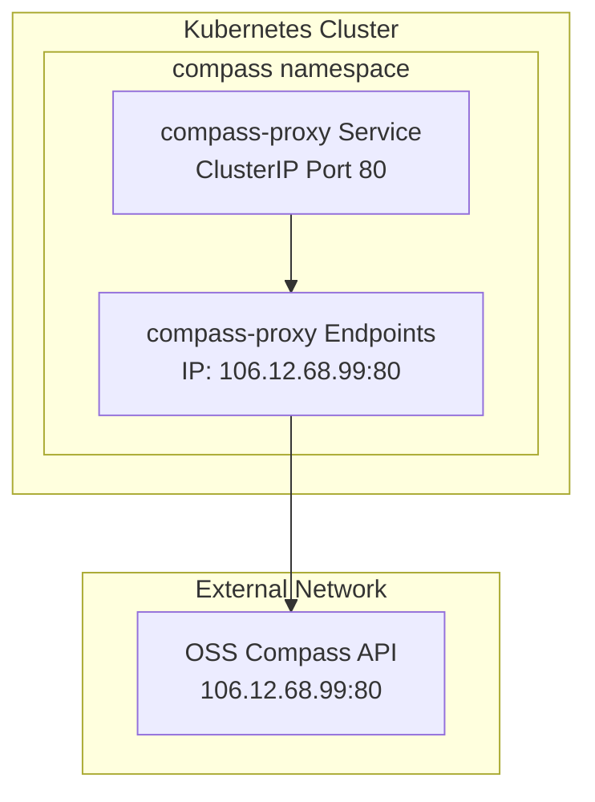
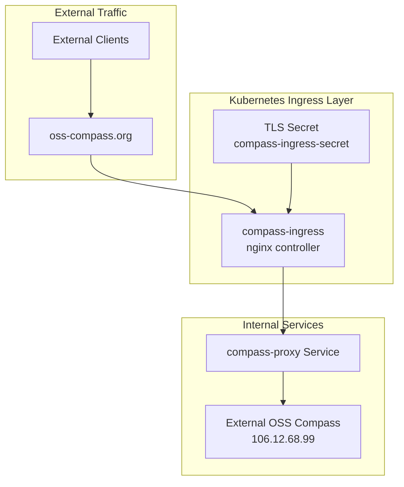
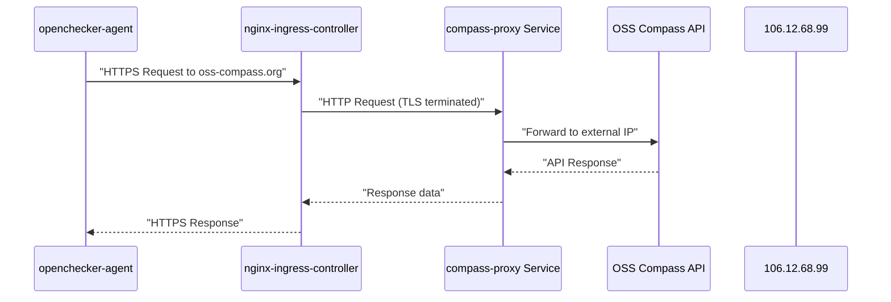
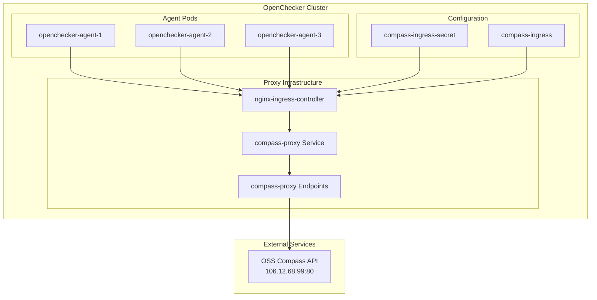

# External Service Proxying

> **Relevant source files**
> * [kubernetes/external/compass-service.yaml](https://github.com/Laniakea2012/openchecker/blob/1dbd85d0/kubernetes/external/compass-service.yaml)

This document covers the Kubernetes-based external service proxying configuration in the OpenChecker system. It focuses specifically on the proxying setup for external services like OSS Compass that need to be accessed through the cluster's ingress controller rather than directly.

For information about direct platform integrations with GitHub, Gitee, and GitCode APIs, see [Version Control Platform Adapters](/Laniakea2012/openchecker/5.1-version-control-platform-adapters). For configuration of other external services like SonarQube and RabbitMQ, see [External Service Configuration](/Laniakea2012/openchecker/5.2-external-service-configuration).

## Compass Service Proxy Configuration

The system implements a Kubernetes-based proxy for the OSS Compass service, which provides project analytics and insights. This proxy is configured in the `compass` namespace and uses a combination of Service, Endpoints, and Ingress resources to route traffic to the external OSS Compass API.

### Service and Endpoints Setup

The proxy configuration defines a `ClusterIP` service named `compass-proxy` that routes traffic to the external OSS Compass service at IP address `106.12.68.99`. The service operates on port 80 using the HTTP protocol.

**Proxy Service Configuration**
The `compass-proxy` service [kubernetes/external/compass-service.yaml L1-L12](https://github.com/Laniakea2012/openchecker/blob/1dbd85d0/kubernetes/external/compass-service.yaml#L1-L12)

 acts as an internal cluster endpoint that forwards requests to the external OSS Compass service. The service uses a `ClusterIP` type, making it accessible only within the cluster.

**External Endpoints Mapping**
The Endpoints resource [kubernetes/external/compass-service.yaml L14-L27](https://github.com/Laniakea2012/openchecker/blob/1dbd85d0/kubernetes/external/compass-service.yaml#L14-L27)

 manually maps the service to the external IP address `106.12.68.99`, effectively creating a bridge between the cluster's internal networking and the external service.

Sources: [kubernetes/external/compass-service.yaml L1-L27](https://github.com/Laniakea2012/openchecker/blob/1dbd85d0/kubernetes/external/compass-service.yaml#L1-L27)

### Ingress and TLS Configuration

The system exposes the compass proxy through an nginx ingress controller with TLS termination, making it accessible at the `oss-compass.org` domain. This configuration includes specific nginx annotations for HTTP backend protocol and request size limits.

**Ingress Resource Configuration**
The `compass-ingress` [kubernetes/external/compass-service.yaml L30-L57](https://github.com/Laniakea2012/openchecker/blob/1dbd85d0/kubernetes/external/compass-service.yaml#L30-L57)

 resource configures the nginx ingress controller with several key settings:

| Configuration | Value | Purpose |
| --- | --- | --- |
| `nginx.ingress.kubernetes.io/ssl-redirect` | `"true"` | Forces HTTPS redirects |
| `nginx.ingress.kubernetes.io/backend-protocol` | `HTTP` | Specifies backend protocol |
| `nginx.ingress.kubernetes.io/proxy-body-size` | `"16m"` | Sets request size limit |
| `nginx.ingress.kubernetes.io/limit-rps` | `"0"` | Disables rate limiting |

**TLS Termination**
The ingress terminates TLS connections using the `compass-ingress-secret` [kubernetes/external/compass-service.yaml L44-L46](https://github.com/Laniakea2012/openchecker/blob/1dbd85d0/kubernetes/external/compass-service.yaml#L44-L46)

 for the `oss-compass.org` host, providing secure access to the proxied service.

Sources: [kubernetes/external/compass-service.yaml L30-L57](https://github.com/Laniakea2012/openchecker/blob/1dbd85d0/kubernetes/external/compass-service.yaml#L30-L57)

## Integration with OpenChecker Agents

The compass proxy integrates with the broader OpenChecker system by providing agents with access to OSS Compass analytics through the cluster's internal networking. This eliminates the need for agents to make direct external API calls and centralizes external service access.

**Agent Access Pattern**
OpenChecker agents can access OSS Compass analytics by making requests to `oss-compass.org` through the cluster's ingress controller. The proxy handles the routing to the external service while maintaining the benefits of cluster-based networking and monitoring.

**Network Security Benefits**
This proxy configuration provides several advantages:

* Centralized access control through Kubernetes RBAC
* TLS termination at the ingress layer
* Request size and rate limiting capabilities
* Internal cluster networking for agent communications

Sources: [kubernetes/external/compass-service.yaml L1-L57](https://github.com/Laniakea2012/openchecker/blob/1dbd85d0/kubernetes/external/compass-service.yaml#L1-L57)

## Proxy Architecture Overview

The external service proxying system creates a bridge between the internal Kubernetes cluster networking and external services, allowing OpenChecker components to access external APIs through standardized cluster networking patterns.

This architecture enables the OpenChecker system to maintain consistent networking patterns while accessing external services, providing better observability, security, and control over external service interactions.

Sources: [kubernetes/external/compass-service.yaml L1-L57](https://github.com/Laniakea2012/openchecker/blob/1dbd85d0/kubernetes/external/compass-service.yaml#L1-L57)