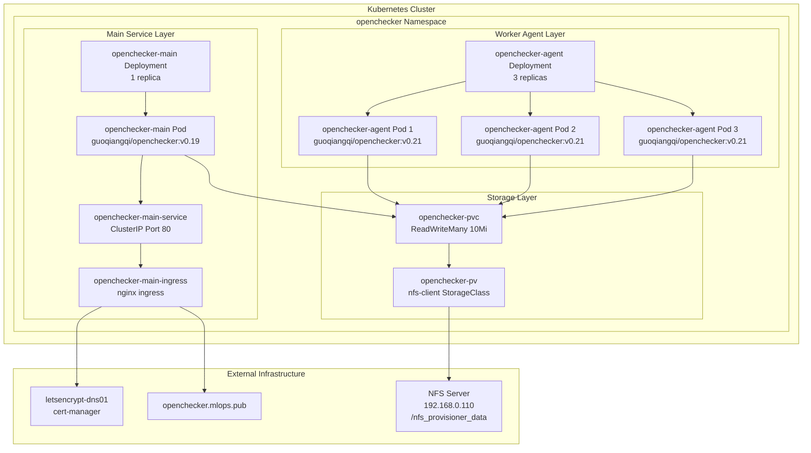
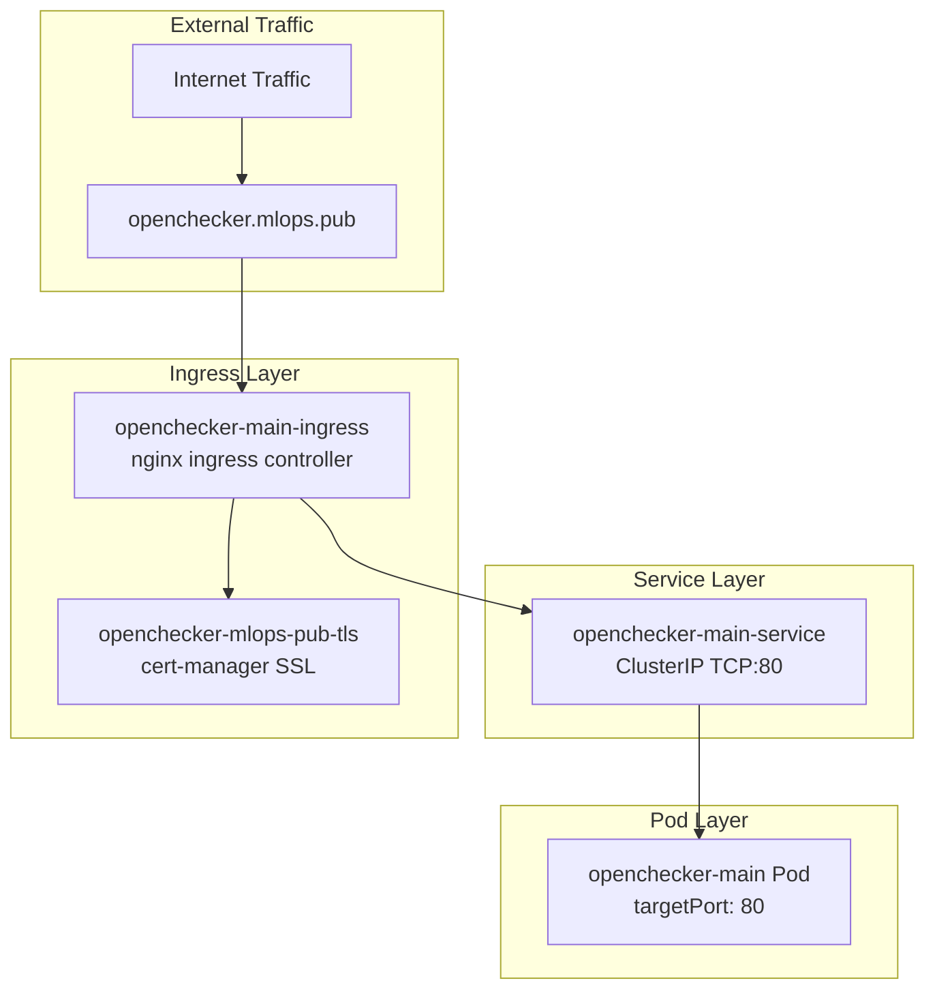
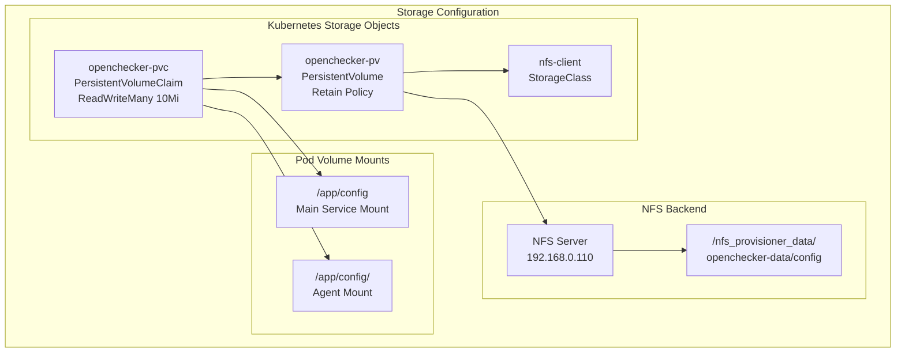

# Infrastructure and Deployment

> **Relevant source files**
> * [kubernetes/openchecker-agent/deployment.yaml](https://github.com/Laniakea2012/openchecker/blob/1dbd85d0/kubernetes/openchecker-agent/deployment.yaml)
> * [kubernetes/openchecker-main/deployment.yaml](https://github.com/Laniakea2012/openchecker/blob/1dbd85d0/kubernetes/openchecker-main/deployment.yaml)
> * [kubernetes/openchecker-main/service.yaml](https://github.com/Laniakea2012/openchecker/blob/1dbd85d0/kubernetes/openchecker-main/service.yaml)
> * [kubernetes/openchecker-main/volumes.yaml](https://github.com/Laniakea2012/openchecker/blob/1dbd85d0/kubernetes/openchecker-main/volumes.yaml)

This page documents the Kubernetes-based infrastructure and deployment configuration for the OpenChecker platform. It covers the containerized deployment architecture, persistent storage provisioning, service networking, and operational infrastructure components that support the distributed analysis system.

For configuration file management details, see [Configuration Management](/Laniakea2012/openchecker/7.1-configuration-management). For logging and monitoring infrastructure, see [Logging and Monitoring](/Laniakea2012/openchecker/7.4-logging-and-monitoring).

## Kubernetes Deployment Architecture

The OpenChecker platform runs on a Kubernetes cluster with a distributed architecture consisting of a main API service and multiple worker agents. The deployment utilizes containerized applications with shared storage and external service integration.

### Kubernetes Deployment Architecture

**Sources:** [kubernetes/openchecker-main/deployment.yaml L1-L32](https://github.com/Laniakea2012/openchecker/blob/1dbd85d0/kubernetes/openchecker-main/deployment.yaml#L1-L32)

 [kubernetes/openchecker-agent/deployment.yaml L1-L30](https://github.com/Laniakea2012/openchecker/blob/1dbd85d0/kubernetes/openchecker-agent/deployment.yaml#L1-L30)

 [kubernetes/openchecker-main/service.yaml L1-L40](https://github.com/Laniakea2012/openchecker/blob/1dbd85d0/kubernetes/openchecker-main/service.yaml#L1-L40)

 [kubernetes/openchecker-main/volumes.yaml L1-L31](https://github.com/Laniakea2012/openchecker/blob/1dbd85d0/kubernetes/openchecker-main/volumes.yaml#L1-L31)

## Service Deployments

### Main API Service Deployment

The `openchecker-main` deployment runs a single replica of the Flask API server that handles external requests and task distribution.

| Component | Configuration |
| --- | --- |
| **Deployment Name** | `openchecker-main` |
| **Namespace** | `openchecker` |
| **Replicas** | 1 |
| **Container Image** | `guoqiangqi/openchecker:v0.19` |
| **Command** | `python -u openchecker/main.py` |
| **Container Port** | 80 |
| **Image Pull Policy** | `Always` |

The main service includes volume mounts for shared configuration access and integrates with the cluster networking through a `ClusterIP` service.

### Worker Agent Deployment

The `openchecker-agent` deployment provides distributed task processing with horizontal scaling capabilities.

| Component | Configuration |
| --- | --- |
| **Deployment Name** | `openchecker-agent` |
| **Namespace** | `openchecker` |
| **Replicas** | 3 |
| **Container Image** | `guoqiangqi/openchecker:v0.21` |
| **Command** | `python -u openchecker/agent.py` |
| **Image Pull Policy** | `Always` |

Each agent pod shares the same persistent volume for configuration access and task coordination, enabling stateless horizontal scaling.

**Sources:** [kubernetes/openchecker-main/deployment.yaml L18-L32](https://github.com/Laniakea2012/openchecker/blob/1dbd85d0/kubernetes/openchecker-main/deployment.yaml#L18-L32)

 [kubernetes/openchecker-agent/deployment.yaml L18-L30](https://github.com/Laniakea2012/openchecker/blob/1dbd85d0/kubernetes/openchecker-agent/deployment.yaml#L18-L30)

## Network Configuration and External Access

### Service and Ingress Configuration

The networking configuration provides secure HTTPS access through:

* **Service Type**: `ClusterIP` for internal cluster communication
* **Protocol**: TCP on port 80
* **Ingress Class**: `nginx` with SSL redirect enabled
* **TLS Termination**: Automated certificate management via `cert-manager.io/cluster-issuer: letsencrypt-dns01`
* **External Domain**: `openchecker.mlops.pub`

**Sources:** [kubernetes/openchecker-main/service.yaml L6-L13](https://github.com/Laniakea2012/openchecker/blob/1dbd85d0/kubernetes/openchecker-main/service.yaml#L6-L13)

 [kubernetes/openchecker-main/service.yaml L16-L40](https://github.com/Laniakea2012/openchecker/blob/1dbd85d0/kubernetes/openchecker-main/service.yaml#L16-L40)

## Persistent Storage Configuration

### NFS-Based Storage Architecture

The OpenChecker platform uses Network File System (NFS) for shared persistent storage across all components.

### Storage Specifications

| Storage Component | Configuration |
| --- | --- |
| **PersistentVolume** | `openchecker-pv` |
| **Capacity** | 10Mi |
| **Access Mode** | `ReadWriteMany` |
| **Reclaim Policy** | `Retain` |
| **Storage Class** | `nfs-client` |
| **NFS Server** | `192.168.0.110` |
| **NFS Path** | `/nfs_provisioner_data/openchecker-data/config` |

The `ReadWriteMany` access mode enables multiple pods to simultaneously access shared configuration files and temporary data storage, essential for the distributed agent architecture.

**Sources:** [kubernetes/openchecker-main/volumes.yaml L2-L17](https://github.com/Laniakea2012/openchecker/blob/1dbd85d0/kubernetes/openchecker-main/volumes.yaml#L2-L17)

 [kubernetes/openchecker-main/volumes.yaml L18-L31](https://github.com/Laniakea2012/openchecker/blob/1dbd85d0/kubernetes/openchecker-main/volumes.yaml#L18-L31)

 [kubernetes/openchecker-main/deployment.yaml L26-L32](https://github.com/Laniakea2012/openchecker/blob/1dbd85d0/kubernetes/openchecker-main/deployment.yaml#L26-L32)

 [kubernetes/openchecker-agent/deployment.yaml L24-L30](https://github.com/Laniakea2012/openchecker/blob/1dbd85d0/kubernetes/openchecker-agent/deployment.yaml#L24-L30)

## Container Image Management

The deployment uses versioned container images with different versions for main service and agent components:

* **Main Service**: `guoqiangqi/openchecker:v0.19` - Runs the Flask API server
* **Agent Workers**: `guoqiangqi/openchecker:v0.21` - Runs the message queue consumers

Both deployments use `imagePullPolicy: Always` to ensure the latest image versions are retrieved during pod restarts, supporting continuous deployment workflows.

**Sources:** [kubernetes/openchecker-main/deployment.yaml L20-L22](https://github.com/Laniakea2012/openchecker/blob/1dbd85d0/kubernetes/openchecker-main/deployment.yaml#L20-L22)

 [kubernetes/openchecker-agent/deployment.yaml L20-L22](https://github.com/Laniakea2012/openchecker/blob/1dbd85d0/kubernetes/openchecker-agent/deployment.yaml#L20-L22)