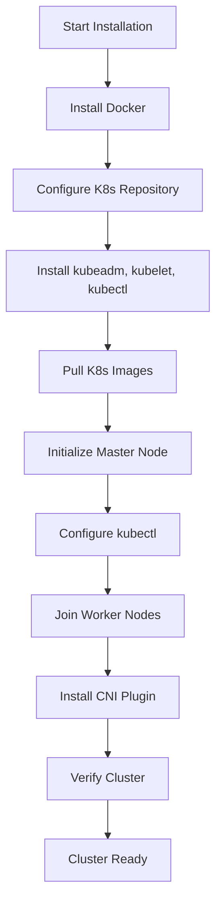
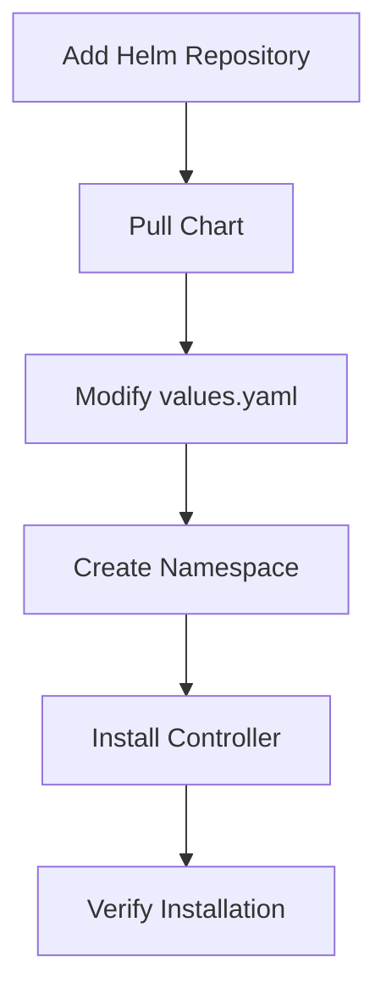
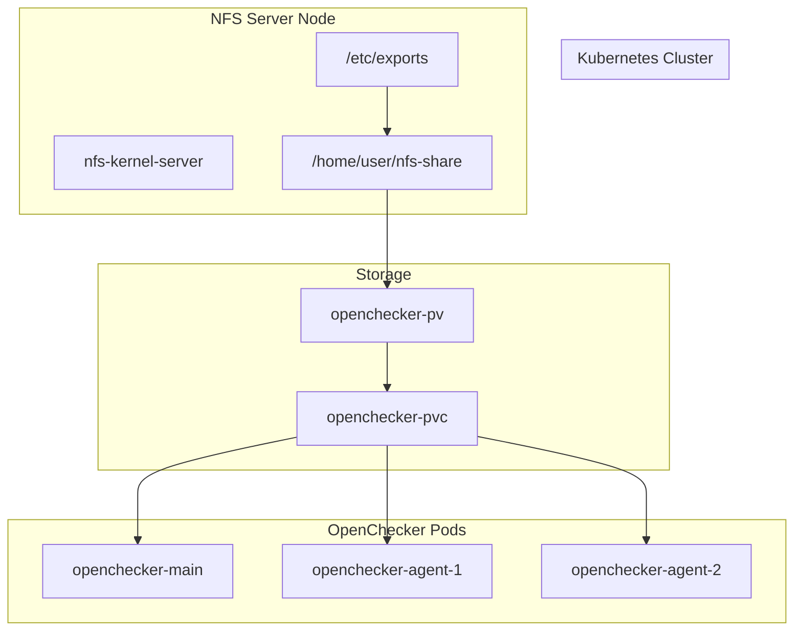

# Installation and Setup Guide

> **Relevant source files**
> * [kubernetes/kubernetes-installation.md](https://github.com/Laniakea2012/openchecker/blob/00a9732e/kubernetes/kubernetes-installation.md)

This document provides a comprehensive step-by-step guide for setting up the foundational infrastructure required to deploy OpenChecker. It covers Kubernetes cluster installation, essential cluster components, and network configuration necessary for running the OpenChecker system.

For information about deploying the actual OpenChecker applications and services, see [Kubernetes Deployments](/Laniakea2012/openchecker/6.1-kubernetes-deployments). For supporting services like PostgreSQL and RabbitMQ, see [Supporting Services](/Laniakea2012/openchecker/6.2-supporting-services). For storage and configuration management, see [Storage and Configuration Management](/Laniakea2012/openchecker/6.3-storage-and-configuration-management).

## Prerequisites and Environment Requirements

The OpenChecker system requires a Kubernetes cluster with specific versions and supporting infrastructure. The following table outlines the minimum requirements:

| Component | Version | Purpose |
| --- | --- | --- |
| Ubuntu | 18.04+ | Base operating system |
| Docker | 20.0+ | Container runtime |
| Kubernetes | 1.21.3 | Container orchestration |
| kubectl | 1.21.3 | Kubernetes command-line tool |
| kubeadm | 1.21.3 | Cluster initialization tool |
| kubelet | 1.21.3 | Node agent |

### Hardware Requirements

* **Master Node**: Minimum 2 CPU cores, 4GB RAM, 20GB disk space
* **Worker Nodes**: Minimum 2 CPU cores, 4GB RAM per node
* **Network**: All nodes must be able to communicate with each other
* **Internet Access**: Required for downloading container images and packages

Sources: [kubernetes/kubernetes-installation.md L1-L5](https://github.com/Laniakea2012/openchecker/blob/00a9732e/kubernetes/kubernetes-installation.md#L1-L5)

## System Preparation

Before installing Kubernetes, several system-level configurations must be applied to all nodes (both master and worker nodes).

### Hostname Configuration

Set unique hostnames for each node in the cluster:

```
# Set hostname on master node
hostnamectl set-hostname k8s-master

# Set hostname on worker nodes
hostnamectl set-hostname k8s-node1
hostnamectl set-hostname k8s-node2
```

### System Service Configuration

Disable conflicting system services and configure network settings:

```
# Disable firewall
ufw disable

# Disable SELinux
sudo apt install selinux-utils
setenforce 0

# Disable swap partition
swapoff -a
sudo gedit /etc/fstab  # Comment out the swap line
```

### Network Bridge Configuration

Configure iptables for Kubernetes networking:

```
cat > /etc/sysctl.d/k8s.conf <<EOF
net.bridge.bridge-nf-call-ip6tables = 1
net.bridge.bridge-nf-call-iptables = 1
net.ipv4.ip_forward = 1
vm.swappiness = 0
EOF
sysctl --system
```

Sources: [kubernetes/kubernetes-installation.md L14-L39](https://github.com/Laniakea2012/openchecker/blob/00a9732e/kubernetes/kubernetes-installation.md#L14-L39)

## Kubernetes Cluster Installation

### Installation Flow Overview



Sources: [kubernetes/kubernetes-installation.md L41-L155](https://github.com/Laniakea2012/openchecker/blob/00a9732e/kubernetes/kubernetes-installation.md#L41-L155)

### Docker Installation

Install Docker container runtime on all nodes:

```
apt install docker.io -y
```

### Kubernetes Package Installation

Configure the Kubernetes repository and install required packages:

```
# Add Kubernetes repository
curl -s https://mirrors.aliyun.com/kubernetes/apt/doc/apt-key.gpg | sudo apt-key add -
echo "deb https://mirrors.aliyun.com/kubernetes/apt/ kubernetes-xenial main" > /etc/apt/sources.list.d/kubernetes.list
apt-get update

# Install Kubernetes tools
apt install -y kubelet=1.21.3-00 kubeadm=1.21.3-00 kubectl=1.21.3-00

# Enable and start kubelet
systemctl enable kubelet && systemctl start kubelet
```

### Master Node Initialization

#### Pre-pull Required Images

Create and execute the image pre-pull script on the master node:

```
#!/bin/bash
images=(
kube-apiserver:v1.21.3
kube-controller-manager:v1.21.3
kube-scheduler:v1.21.3
kube-proxy:v1.21.3
pause:3.2
etcd:3.4.13-0
)
for imageName in ${images[@]} ; do
docker pull registry.cn-hangzhou.aliyuncs.com/google_containers/${imageName}
docker tag registry.cn-hangzhou.aliyuncs.com/google_containers/${imageName} k8s.gcr.io/${imageName}
docker rmi registry.cn-hangzhou.aliyuncs.com/google_containers/${imageName}
done
docker pull coredns/coredns:1.8.0
docker tag coredns/coredns:1.8.0 registry.aliyuncs.com/google_containers/coredns:v1.8.0
docker rmi coredns/coredns:1.8.0
```

#### Initialize the Cluster

```
kubeadm init --image-repository=registry.aliyuncs.com/google_containers \
  --pod-network-cidr=10.244.0.0/16 \
  --service-cidr=10.96.0.0/12
```

#### Configure kubectl Access

```
mkdir -p $HOME/.kube
sudo cp -i /etc/kubernetes/admin.conf $HOME/.kube/config
sudo chown $(id -u):$(id -g) $HOME/.kube/config
```

### Worker Node Configuration

On each worker node, execute the join command provided by the master node initialization:

```
kubeadm join 172.16.206.13:6443 --token 9pslv8.6tbrux0ksur0wgav \
  --discovery-token-ca-cert-hash sha256:3709a3ce5a0ec81
```

If the join token is lost, generate a new one on the master node:

```
kubeadm token create --print-join-command
```

Sources: [kubernetes/kubernetes-installation.md L62-L104](https://github.com/Laniakea2012/openchecker/blob/00a9732e/kubernetes/kubernetes-installation.md#L62-L104)

## Essential Cluster Components

### CNI Network Plugin Installation

Install Flannel CNI plugin for pod networking:

```
kubectl apply -f https://github.com/flannel-io/flannel/releases/latest/download/kube-flannel.yml
```

Verify node status after CNI installation:

```
kubectl get nodes
```

All nodes should show `Ready` status.

### Component Health Status Fix

If `kubectl get cs` shows unhealthy components, fix by commenting out port configurations:

```
# Edit kube-controller-manager.yaml
sudo nano /etc/kubernetes/manifests/kube-controller-manager.yaml
# Comment out: - --port=0

# Edit kube-scheduler.yaml  
sudo nano /etc/kubernetes/manifests/kube-scheduler.yaml
# Comment out: - --port=0

# Restart kubelet
systemctl restart kubelet.service
```

Sources: [kubernetes/kubernetes-installation.md L106-L155](https://github.com/Laniakea2012/openchecker/blob/00a9732e/kubernetes/kubernetes-installation.md#L106-L155)

## Optional Infrastructure Components

### Ingress Nginx Controller

The Ingress controller enables external HTTP/HTTPS access to cluster services.

#### Installation Process



#### Installation Commands

```
# Add repository
helm repo add ingress-nginx https://kubernetes.github.io/ingress-nginx
helm repo update

# Pull chart
helm pull ingress-nginx/ingress-nginx --version 4.10.0

# Create namespace and install
kubectl create ns ingress-nginx
helm install ingress-nginx -n ingress-nginx .
```

#### Configuration Options

Key modifications to `values.yaml`:

```
# Service type configuration
type: NodePort
nodePorts:
  http: "80"
  https: "443"

# Host network (optional)
hostNetwork: true
dnsPolicy: ClusterFirstWithHostNet

# Deployment mode
kind: Deployment  # or DaemonSet
```

Sources: [kubernetes/kubernetes-installation.md L156-L201](https://github.com/Laniakea2012/openchecker/blob/00a9732e/kubernetes/kubernetes-installation.md#L156-L201)

### Cert-Manager for TLS Certificates

Cert-manager automates TLS certificate management using Let's Encrypt.

#### Installation

```
kubectl apply -f https://github.com/jetstack/cert-manager/releases/download/v1.4.0/cert-manager.yaml
```

#### ClusterIssuer Configuration

```
apiVersion: cert-manager.io/v1
kind: ClusterIssuer
metadata:
  name: letsencrypt-dns01
spec:
  acme:
    server: https://acme-v02.api.letsencrypt.org/directory
    privateKeySecretRef:
      name: letsencrypt-dns01
    solvers:
    - dns01:
        cloudflare:
          email: admin@example.com
          apiTokenSecretRef:
            name: cloudflare-api-token-secret
            key: api-token
```

Sources: [kubernetes/kubernetes-installation.md L202-L275](https://github.com/Laniakea2012/openchecker/blob/00a9732e/kubernetes/kubernetes-installation.md#L202-L275)

### NFS Shared Storage

NFS provides shared storage for OpenChecker configuration and data persistence.

#### NFS Component Architecture



#### NFS Server Installation

```
# Install NFS server and client packages
apt install nfs-kernel-server nfs-common

# Create shared directory
mkdir nfs-share

# Configure exports
sudo vim /etc/exports
# Add: /home/user/nfs-share *(rw,sync,no_root_squash,no_subtree_check)

# Export and restart service
sudo exportfs -a
sudo service nfs-kernel-server restart
```

#### Client Mount Configuration

```
# Mount NFS share
sudo mount nfs-server-ip:/home/user/nfs-share /mnt
```

Sources: [kubernetes/kubernetes-installation.md L276-L317](https://github.com/Laniakea2012/openchecker/blob/00a9732e/kubernetes/kubernetes-installation.md#L276-L317)

## Cluster Verification

### Basic Cluster Health Check

Verify that all cluster components are functioning correctly:

```
# Check node status
kubectl get nodes

# Check component status
kubectl get cs

# Check pod status in system namespaces
kubectl get pods -n kube-system
kubectl get pods -n ingress-nginx
kubectl get pods -n cert-manager
```

### Network Connectivity Test

Create a test deployment to verify networking:

```
# Deploy test pod
kubectl create deployment nginx-test --image=nginx

# Expose as service
kubectl expose deployment nginx-test --port=80 --type=ClusterIP

# Test internal connectivity
kubectl run test-pod --image=busybox --rm -it -- wget -qO- nginx-test
```

### Storage Verification

Test NFS mount functionality:

```
# Create test file on NFS server
echo "NFS test" > /home/user/nfs-share/test.txt

# Verify from client mount point
cat /mnt/test.txt
```

Sources: [kubernetes/kubernetes-installation.md L107-L122](https://github.com/Laniakea2012/openchecker/blob/00a9732e/kubernetes/kubernetes-installation.md#L107-L122)

## Next Steps

After completing the Kubernetes cluster installation and essential components setup, proceed with the following:

1. **Deploy OpenChecker Applications**: Follow [Kubernetes Deployments](/Laniakea2012/openchecker/6.1-kubernetes-deployments) to deploy the main OpenChecker API and agent workers
2. **Setup Supporting Services**: Install PostgreSQL, RabbitMQ, and SonarQube as described in [Supporting Services](/Laniakea2012/openchecker/6.2-supporting-services)
3. **Configure Persistent Storage**: Set up NFS persistent volumes as detailed in [Storage and Configuration Management](/Laniakea2012/openchecker/6.3-storage-and-configuration-management)
4. **External Service Integration**: Configure connections to external platforms as covered in [External Service Integration](/Laniakea2012/openchecker/6.4-external-service-integration)

The cluster is now ready to host the OpenChecker system with all necessary infrastructure components installed and configured.

Sources: [kubernetes/kubernetes-installation.md L1-L317](https://github.com/Laniakea2012/openchecker/blob/00a9732e/kubernetes/kubernetes-installation.md#L1-L317)