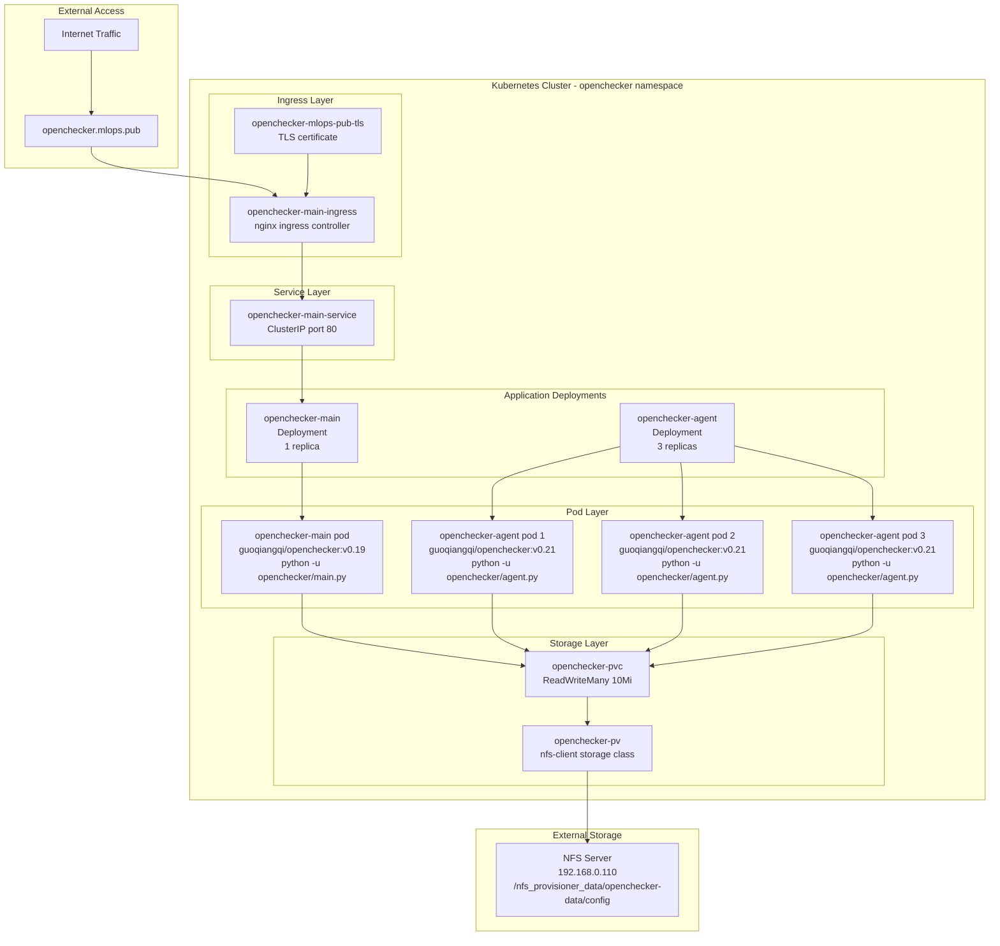
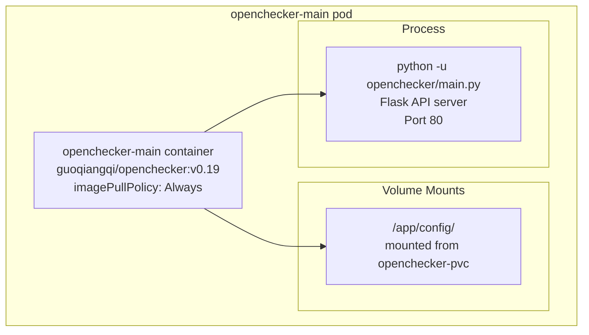
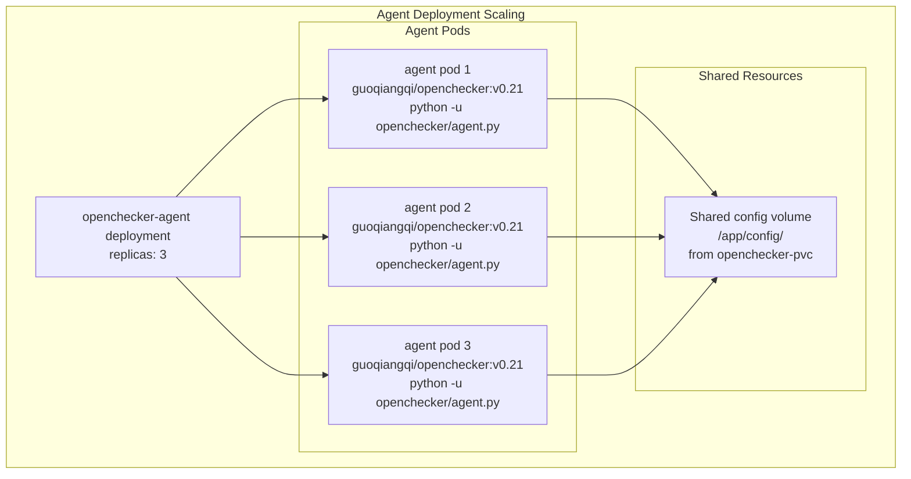
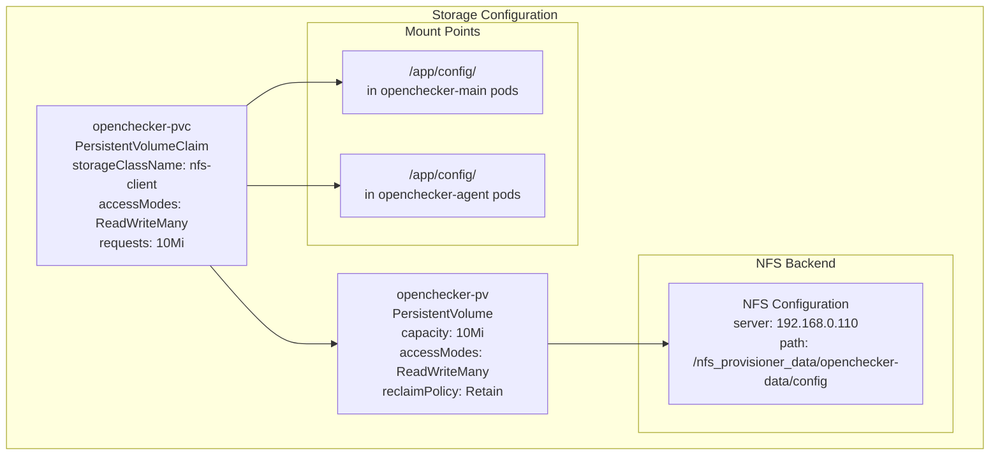
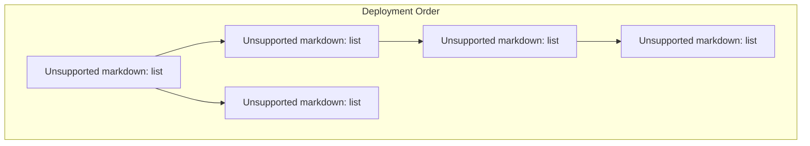

# Kubernetes Deployment

> **Relevant source files**
> * [kubernetes/openchecker-agent/deployment.yaml](https://github.com/Laniakea2012/openchecker/blob/1dbd85d0/kubernetes/openchecker-agent/deployment.yaml)
> * [kubernetes/openchecker-main/deployment.yaml](https://github.com/Laniakea2012/openchecker/blob/1dbd85d0/kubernetes/openchecker-main/deployment.yaml)
> * [kubernetes/openchecker-main/service.yaml](https://github.com/Laniakea2012/openchecker/blob/1dbd85d0/kubernetes/openchecker-main/service.yaml)
> * [kubernetes/openchecker-main/volumes.yaml](https://github.com/Laniakea2012/openchecker/blob/1dbd85d0/kubernetes/openchecker-main/volumes.yaml)

## Purpose and Scope

This document details the Kubernetes deployment configuration for the OpenChecker platform, covering both the main Flask API service and the worker agent deployments. The deployment architecture enables scalable processing of project analysis tasks through containerized services with shared storage.

For configuration management details, see [Configuration Management](/Laniakea2012/openchecker/7.1-configuration-management). For storage provisioning specifics, see [Storage and NFS Provisioning](/Laniakea2012/openchecker/7.3-storage-and-nfs-provisioning).

## Deployment Architecture Overview

The OpenChecker platform is deployed as a multi-component Kubernetes application consisting of a main API service and multiple worker agents that share configuration through NFS-backed persistent volumes.

### Overall Kubernetes Resource Structure

**Sources:** [kubernetes/openchecker-main/deployment.yaml L1-L32](https://github.com/Laniakea2012/openchecker/blob/1dbd85d0/kubernetes/openchecker-main/deployment.yaml#L1-L32)

 [kubernetes/openchecker-agent/deployment.yaml L1-L30](https://github.com/Laniakea2012/openchecker/blob/1dbd85d0/kubernetes/openchecker-agent/deployment.yaml#L1-L30)

 [kubernetes/openchecker-main/service.yaml L1-L40](https://github.com/Laniakea2012/openchecker/blob/1dbd85d0/kubernetes/openchecker-main/service.yaml#L1-L40)

 [kubernetes/openchecker-main/volumes.yaml L1-L31](https://github.com/Laniakea2012/openchecker/blob/1dbd85d0/kubernetes/openchecker-main/volumes.yaml#L1-L31)

## Main Service Deployment

The `openchecker-main` deployment runs the Flask API server that handles external requests and publishes tasks to the message queue.

### Main Service Configuration

| Parameter | Value | Purpose |
| --- | --- | --- |
| **Deployment Name** | `openchecker-main` | Kubernetes deployment identifier |
| **Namespace** | `openchecker` | Logical grouping of resources |
| **Replicas** | 1 | Single instance of API server |
| **Container Image** | `guoqiangqi/openchecker:v0.19` | Main service container |
| **Entry Point** | `python -u openchecker/main.py` | Flask application startup |
| **Container Port** | 80 | HTTP service port |

The deployment mounts the shared configuration volume at `/app/config` to access the centralized `config.ini` file and other configuration resources.

**Sources:** [kubernetes/openchecker-main/deployment.yaml L1-L32](https://github.com/Laniakea2012/openchecker/blob/1dbd85d0/kubernetes/openchecker-main/deployment.yaml#L1-L32)

### Container Specifications

**Sources:** [kubernetes/openchecker-main/deployment.yaml L18-L32](https://github.com/Laniakea2012/openchecker/blob/1dbd85d0/kubernetes/openchecker-main/deployment.yaml#L18-L32)

## Agent Worker Deployment

The `openchecker-agent` deployment runs multiple worker instances that consume tasks from the RabbitMQ queue and execute analysis tools.

### Agent Configuration

| Parameter | Value | Purpose |
| --- | --- | --- |
| **Deployment Name** | `openchecker-agent` | Worker deployment identifier |
| **Namespace** | `openchecker` | Same namespace as main service |
| **Replicas** | 3 | Multiple workers for parallel processing |
| **Container Image** | `guoqiangqi/openchecker:v0.21` | Agent container (newer version) |
| **Entry Point** | `python -u openchecker/agent.py` | Agent worker startup |

Each agent pod mounts the same shared configuration volume to access queue settings, platform credentials, and other shared configuration.

**Sources:** [kubernetes/openchecker-agent/deployment.yaml L1-L30](https://github.com/Laniakea2012/openchecker/blob/1dbd85d0/kubernetes/openchecker-agent/deployment.yaml#L1-L30)

### Agent Scaling and Processing

**Sources:** [kubernetes/openchecker-agent/deployment.yaml L8-L30](https://github.com/Laniakea2012/openchecker/blob/1dbd85d0/kubernetes/openchecker-agent/deployment.yaml#L8-L30)

## Service and Ingress Configuration

The main service is exposed through a `ClusterIP` service and nginx ingress controller with TLS termination.

### Service Configuration

The `openchecker-main-service` provides internal cluster access to the main API deployment:

| Parameter | Value | Description |
| --- | --- | --- |
| **Service Name** | `openchecker-main-service` | Internal service identifier |
| **Type** | `ClusterIP` | Internal cluster access only |
| **Port** | 80 | Service port mapping |
| **Target Port** | 80 | Container port mapping |
| **Selector** | `app: openchecker-main` | Routes to main deployment pods |

**Sources:** [kubernetes/openchecker-main/service.yaml L1-L13](https://github.com/Laniakea2012/openchecker/blob/1dbd85d0/kubernetes/openchecker-main/service.yaml#L1-L13)

### Ingress Configuration

The `openchecker-main-ingress` provides external HTTPS access:

| Parameter | Value | Description |
| --- | --- | --- |
| **Ingress Class** | `nginx` | nginx ingress controller |
| **Host** | `openchecker.mlops.pub` | External domain |
| **TLS Secret** | `openchecker-mlops-pub-tls` | Let's Encrypt certificate |
| **SSL Redirect** | `true` | Force HTTPS |
| **Cert Issuer** | `letsencrypt-dns01` | Automatic certificate management |

**Sources:** [kubernetes/openchecker-main/service.yaml L15-L40](https://github.com/Laniakea2012/openchecker/blob/1dbd85d0/kubernetes/openchecker-main/service.yaml#L15-L40)

## Persistent Storage Configuration

Both deployments share configuration data through NFS-backed persistent volumes.

### Storage Hierarchy

### Volume Specifications

| Resource | Configuration | Purpose |
| --- | --- | --- |
| **PersistentVolume** | `openchecker-pv` | Defines NFS storage backend |
| **Storage Capacity** | `10Mi` | Small size for configuration files |
| **Access Mode** | `ReadWriteMany` | Shared access across multiple pods |
| **Storage Class** | `nfs-client` | NFS provisioner integration |
| **NFS Server** | `192.168.0.110` | External NFS server address |
| **NFS Path** | `/nfs_provisioner_data/openchecker-data/config` | Configuration directory |

**Sources:** [kubernetes/openchecker-main/volumes.yaml L1-L31](https://github.com/Laniakea2012/openchecker/blob/1dbd85d0/kubernetes/openchecker-main/volumes.yaml#L1-L31)

## Deployment Workflow

The typical deployment process follows this sequence:

1. **Storage Setup**: Create PV and PVC for shared configuration
2. **Main Deployment**: Deploy Flask API service with single replica
3. **Service Exposure**: Create ClusterIP service for internal access
4. **Ingress Setup**: Configure nginx ingress with TLS for external access
5. **Agent Deployment**: Deploy worker agents with multiple replicas
6. **Verification**: Confirm all pods can access shared configuration

### Resource Dependencies

**Sources:** [kubernetes/openchecker-main/volumes.yaml L1-L31](https://github.com/Laniakea2012/openchecker/blob/1dbd85d0/kubernetes/openchecker-main/volumes.yaml#L1-L31)

 [kubernetes/openchecker-main/deployment.yaml L1-L32](https://github.com/Laniakea2012/openchecker/blob/1dbd85d0/kubernetes/openchecker-main/deployment.yaml#L1-L32)

 [kubernetes/openchecker-main/service.yaml L1-L40](https://github.com/Laniakea2012/openchecker/blob/1dbd85d0/kubernetes/openchecker-main/service.yaml#L1-L40)

 [kubernetes/openchecker-agent/deployment.yaml L1-L30](https://github.com/Laniakea2012/openchecker/blob/1dbd85d0/kubernetes/openchecker-agent/deployment.yaml#L1-L30)