# LLM Integration and Text Processing

> **Relevant source files**
> * [openchecker/llm.py](https://github.com/Laniakea2012/openchecker/blob/1dbd85d0/openchecker/llm.py)

This document covers the Large Language Model (LLM) integration components and text processing capabilities within the OpenChecker system. The module provides sentence embedding generation for semantic analysis and chat completion handlers for AI-powered project analysis.

This page focuses specifically on the low-level LLM integration utilities. For information about project classification and clustering that uses these utilities, see [Project Classification and Clustering](/Laniakea2012/openchecker/6.2-project-classification-and-clustering). For broader AI service configuration, see [External Service Configuration](/Laniakea2012/openchecker/5.2-external-service-configuration).

## Overview

The LLM integration system consists of two primary components:

| Component | Class | Purpose |
| --- | --- | --- |
| Text Embeddings | `SentenceEmbeddingGenerator` | Generate semantic embeddings for text analysis |
| Chat Completions | `ChatCompletionHandler` | Handle AI chat interactions for project analysis |
| Reliability | `retry_with_exponential_backoff` | Ensure robust API interactions |

## System Architecture

### LLM Integration Flow


Sources: [openchecker/llm.py L1-L150](https://github.com/Laniakea2012/openchecker/blob/1dbd85d0/openchecker/llm.py#L1-L150)

### Error Handling and Reliability


Sources: [openchecker/llm.py L7-L49](https://github.com/Laniakea2012/openchecker/blob/1dbd85d0/openchecker/llm.py#L7-L49)

## Sentence Embedding Generation

The `SentenceEmbeddingGenerator` class provides semantic text embedding capabilities using transformer models.

### Class Structure and Methods

| Method | Purpose | Input | Output |
| --- | --- | --- | --- |
| `__init__(model_path)` | Initialize tokenizer and model | Model path string | None |
| `generate_embeddings(sentences)` | Generate normalized embeddings | List of sentences | torch.Tensor |

### Implementation Details

The embedding generation process follows these steps:

1. **Model Loading**: Uses `AutoTokenizer` and `AutoModel` from transformers library [openchecker/llm.py L59-L61](https://github.com/Laniakea2012/openchecker/blob/1dbd85d0/openchecker/llm.py#L59-L61)
2. **Text Tokenization**: Applies padding and truncation with `return_tensors='pt'` [openchecker/llm.py L73](https://github.com/Laniakea2012/openchecker/blob/1dbd85d0/openchecker/llm.py#L73-L73)
3. **Forward Pass**: Extracts embeddings from the first token `[0][:, 0]` [openchecker/llm.py L77](https://github.com/Laniakea2012/openchecker/blob/1dbd85d0/openchecker/llm.py#L77-L77)
4. **Normalization**: Applies L2 normalization with `torch.nn.functional.normalize` [openchecker/llm.py L79](https://github.com/Laniakea2012/openchecker/blob/1dbd85d0/openchecker/llm.py#L79-L79)

```mermaid
flowchart TD

ModelPath["model_path<br>/home/guoqiang/models/bge-large-en-v1.5"]
Tokenizer["AutoTokenizer<br>self.tokenizer"]
Model["AutoModel<br>self.model"]
InputSentences["sentences<br>List[str]"]
EncodedInput["encoded_input<br>padding=True, truncation=True"]
ModelOutput["model_output<br>self.model(**encoded_input)"]
RawEmbeddings["sentence_embeddings<br>model_output[0][:, 0]"]
NormalizedEmbed["normalized embeddings<br>F.normalize(p=2, dim=1)"]

Tokenizer --> EncodedInput
Model --> ModelOutput

subgraph subGraph1 ["Processing Pipeline"]
    InputSentences
    EncodedInput
    ModelOutput
    RawEmbeddings
    NormalizedEmbed
    InputSentences --> EncodedInput
    EncodedInput --> ModelOutput
    ModelOutput --> RawEmbeddings
    RawEmbeddings --> NormalizedEmbed
end

subgraph SentenceEmbeddingGenerator ["SentenceEmbeddingGenerator"]
    ModelPath
    Tokenizer
    Model
    ModelPath --> Tokenizer
    ModelPath --> Model
end
```



Sources: [openchecker/llm.py L51-L81](https://github.com/Laniakea2012/openchecker/blob/1dbd85d0/openchecker/llm.py#L51-L81)

## Chat Completion Handling

The `ChatCompletionHandler` class manages AI chat interactions with support for multiple API providers and both streaming and non-streaming modes.

### Configuration and Initialization

The handler supports multiple API providers based on the base URL:

| Provider | Base URL Pattern | API Key Environment Variable |
| --- | --- | --- |
| OpenAI | `openai.com` | `OPENAI_API_KEY` |
| Ark (Volces) | `ark.cn` | `ARK_API_KEY` |
| Other | Custom | None |

### API Methods


Sources: [openchecker/llm.py L83-L119](https://github.com/Laniakea2012/openchecker/blob/1dbd85d0/openchecker/llm.py#L83-L119)

### Message Format and Usage

Both chat methods accept OpenAI-compatible message formats:

```
messages = [
    {"role": "system", "content": "You are a helpful assistant."},
    {"role": "user", "content": "What's your name?"}
]
```

The non-streaming method returns the complete response string, while the streaming method returns a generator for real-time processing [openchecker/llm.py L133-L149](https://github.com/Laniakea2012/openchecker/blob/1dbd85d0/openchecker/llm.py#L133-L149)

## Integration with OpenChecker Analysis

### Environment Configuration

The LLM components integrate with the broader OpenChecker system through environment variables and configuration:

| Configuration | Purpose | Source |
| --- | --- | --- |
| `OPENAI_API_KEY` | OpenAI API authentication | Environment variable |
| `ARK_API_KEY` | Ark API authentication | Environment variable |
| Model paths | Local transformer models | File system paths |

### Usage in Analysis Pipeline

The LLM components are designed to be imported and used by other OpenChecker modules for:

* **Text Similarity Analysis**: Using sentence embeddings to compare project descriptions
* **Automated Documentation Analysis**: Using chat completions to analyze README files
* **Project Classification**: Using embeddings for clustering similar projects
* **Quality Assessment**: Using LLM capabilities for automated code and documentation review

Sources: [openchecker/llm.py L121-L149](https://github.com/Laniakea2012/openchecker/blob/1dbd85d0/openchecker/llm.py#L121-L149)