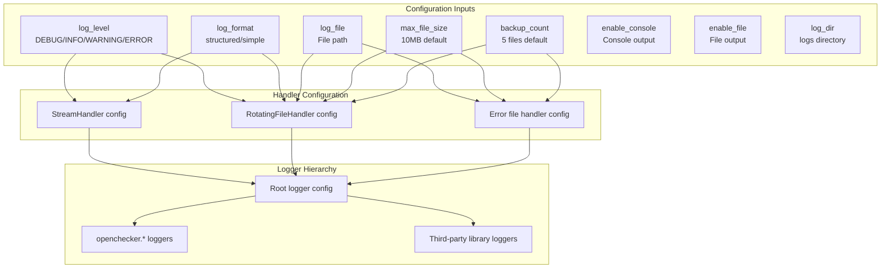
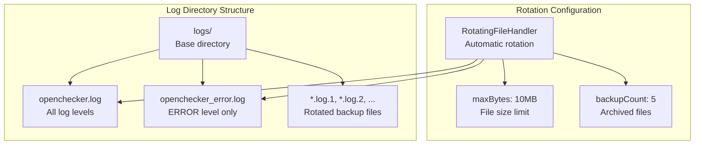
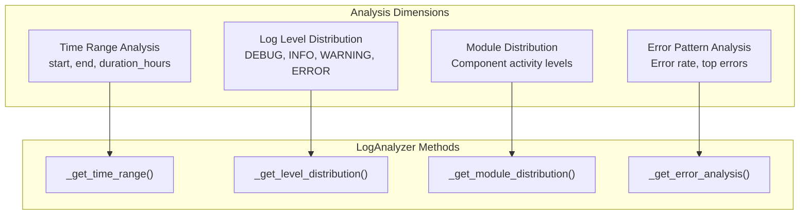
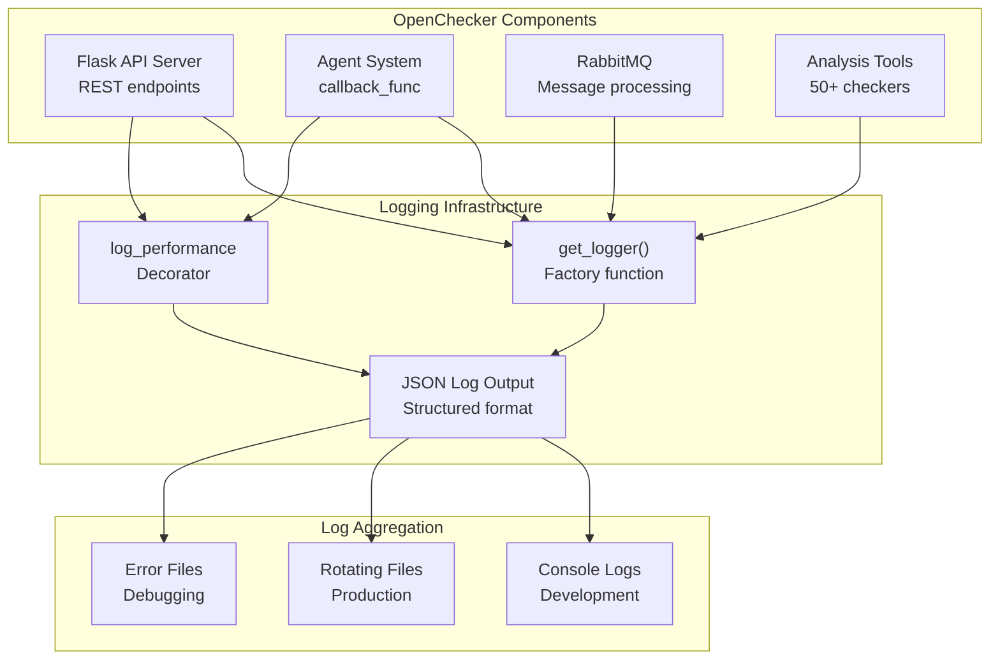

# Logging and Monitoring

> **Relevant source files**
> * [openchecker/logger.py](https://github.com/Laniakea2012/openchecker/blob/1dbd85d0/openchecker/logger.py)
> * [test/log_analyzer.py](https://github.com/Laniakea2012/openchecker/blob/1dbd85d0/test/log_analyzer.py)

This document covers the comprehensive logging and monitoring infrastructure within OpenChecker, including structured logging, performance monitoring, and operational observability. The system provides centralized log management with JSON-structured output, performance tracking decorators, and configurable log levels across all components.

For general system configuration management, see [Configuration Management](/Laniakea2012/openchecker/7.1-configuration-management). For infrastructure deployment aspects, see [Kubernetes Deployment](/Laniakea2012/openchecker/7.2-kubernetes-deployment).

## Structured Logging Architecture

OpenChecker implements a sophisticated structured logging system through the `StructuredFormatter` class and centralized logger configuration. The system generates JSON-formatted logs with consistent metadata across all components.

### Core Logging Components

```

```

**Sources:** [openchecker/logger.py L11-L42](https://github.com/Laniakea2012/openchecker/blob/1dbd85d0/openchecker/logger.py#L11-L42)

 [openchecker/logger.py L70-L216](https://github.com/Laniakea2012/openchecker/blob/1dbd85d0/openchecker/logger.py#L70-L216)

The `StructuredFormatter` class creates JSON-structured log entries with standardized fields including timestamp, log level, logger name, module, function, and line number. Exception information is automatically captured and formatted when present.

### Log Format and Structure

The structured logging system generates logs in the following JSON format:

| Field | Description | Source |
| --- | --- | --- |
| `timestamp` | ISO format timestamp | [openchecker/logger.py L20](https://github.com/Laniakea2012/openchecker/blob/1dbd85d0/openchecker/logger.py#L20-L20) |
| `level` | Log level (DEBUG, INFO, WARNING, ERROR, CRITICAL) | [openchecker/logger.py L21](https://github.com/Laniakea2012/openchecker/blob/1dbd85d0/openchecker/logger.py#L21-L21) |
| `logger` | Logger name (e.g., openchecker.agent) | [openchecker/logger.py L22](https://github.com/Laniakea2012/openchecker/blob/1dbd85d0/openchecker/logger.py#L22-L22) |
| `module` | Python module name | [openchecker/logger.py L23](https://github.com/Laniakea2012/openchecker/blob/1dbd85d0/openchecker/logger.py#L23-L23) |
| `function` | Function name where log was generated | [openchecker/logger.py L24](https://github.com/Laniakea2012/openchecker/blob/1dbd85d0/openchecker/logger.py#L24-L24) |
| `line` | Line number in source code | [openchecker/logger.py L25](https://github.com/Laniakea2012/openchecker/blob/1dbd85d0/openchecker/logger.py#L25-L25) |
| `message` | Actual log message content | [openchecker/logger.py L36](https://github.com/Laniakea2012/openchecker/blob/1dbd85d0/openchecker/logger.py#L36-L36) |
| `exception` | Exception details (type, message, traceback) | [openchecker/logger.py L28-L33](https://github.com/Laniakea2012/openchecker/blob/1dbd85d0/openchecker/logger.py#L28-L33) |
| `extra_fields` | Additional context data | [openchecker/logger.py L39-L40](https://github.com/Laniakea2012/openchecker/blob/1dbd85d0/openchecker/logger.py#L39-L40) |

**Sources:** [openchecker/logger.py L14-L42](https://github.com/Laniakea2012/openchecker/blob/1dbd85d0/openchecker/logger.py#L14-L42)

## Performance Monitoring System

OpenChecker includes a comprehensive performance monitoring system through the `log_performance` decorator, which automatically tracks execution times and errors for decorated functions.

### Performance Decorator Implementation

```mermaid
sequenceDiagram
  participant Function Caller
  participant log_performance
  participant decorator
  participant get_logger()
  participant Target Function

  Function Caller->>log_performance: "Call decorated function"
  log_performance->>get_logger(): "Get logger instance"
  log_performance->>log_performance: "Record start_time"
  log_performance->>Target Function: "Execute function"
  loop ["Success Path"]
    Target Function-->>log_performance: "Return result"
    log_performance->>log_performance: "Calculate execution_time"
    log_performance->>get_logger(): "logger.info(completion, time)"
    log_performance-->>Function Caller: "Return result"
    Target Function-->>log_performance: "Raise exception"
    log_performance->>log_performance: "Calculate execution_time"
    log_performance->>get_logger(): "logger.error(failure, time, exc_info)"
    log_performance-->>Function Caller: "Re-raise exception"
  end
```

**Sources:** [openchecker/logger.py L50-L68](https://github.com/Laniakea2012/openchecker/blob/1dbd85d0/openchecker/logger.py#L50-L68)

The `log_performance` decorator wraps functions to automatically log execution times in milliseconds. Both successful completions and failures are logged with timing information, providing comprehensive performance visibility across the system.

### Performance Monitoring Integration

The decorator can be applied to any function and supports custom logger names:

```python
@log_performance('openchecker.agent')
def process_analysis_task():
    # Function implementation
    pass
```

**Sources:** [openchecker/logger.py L50-L68](https://github.com/Laniakea2012/openchecker/blob/1dbd85d0/openchecker/logger.py#L50-L68)

## Log Configuration and Management

The `setup_logging` function provides comprehensive log configuration with support for multiple output formats, log rotation, and environment-specific settings.

### Configuration Parameters



**Sources:** [openchecker/logger.py L70-L216](https://github.com/Laniakea2012/openchecker/blob/1dbd85d0/openchecker/logger.py#L70-L216)

### Environment-Based Configuration

The system supports environment variable override for log levels through the `LOG_LEVEL` environment variable, allowing runtime configuration without code changes.

**Sources:** [openchecker/logger.py L103-L104](https://github.com/Laniakea2012/openchecker/blob/1dbd85d0/openchecker/logger.py#L103-L104)

## OpenChecker Component Integration

The logging system is deeply integrated with all OpenChecker components through dedicated logger hierarchies and standardized naming conventions.

### Component Logger Hierarchy

| Logger Name | Component | Purpose |
| --- | --- | --- |
| `openchecker` | Main application | Root application logger |
| `openchecker.agent` | Agent system | Analysis task execution |
| `openchecker.platform` | Platform adapters | External service integration |
| `openchecker.queue` | Message queue | RabbitMQ operations |

**Sources:** [openchecker/logger.py L164-L183](https://github.com/Laniakea2012/openchecker/blob/1dbd85d0/openchecker/logger.py#L164-L183)

### Third-Party Library Management

The system configures reduced log levels for third-party libraries to prevent log noise:

| Library | Log Level | Purpose |
| --- | --- | --- |
| `pika` | WARNING | RabbitMQ client library |
| `werkzeug` | WARNING | Flask WSGI toolkit |
| `urllib3` | WARNING | HTTP client library |
| `requests` | WARNING | HTTP request library |
| `flask` | WARNING | Web framework |
| `flask_restful` | WARNING | Flask REST API extension |
| `flask_jwt` | WARNING | JWT authentication |

**Sources:** [openchecker/logger.py L185-L212](https://github.com/Laniakea2012/openchecker/blob/1dbd85d0/openchecker/logger.py#L185-L212)

## Log File Management and Rotation

The system implements automatic log rotation with separate files for different log levels, ensuring efficient disk usage and organized log management.

### File Organization Structure



**Sources:** [openchecker/logger.py L94-L96](https://github.com/Laniakea2012/openchecker/blob/1dbd85d0/openchecker/logger.py#L94-L96)

 [openchecker/logger.py L131-L150](https://github.com/Laniakea2012/openchecker/blob/1dbd85d0/openchecker/logger.py#L131-L150)

The system automatically creates log directories if they don't exist and manages file rotation when logs exceed the configured size limits. Error-level logs are written to both the main log file and a dedicated error log file for easier troubleshooting.

## Log Analysis Utilities

OpenChecker includes a comprehensive log analysis tool through the `LogAnalyzer` class, which provides statistical analysis and reporting capabilities for both structured JSON logs and simple text format logs.

### LogAnalyzer Architecture

```mermaid
flowchart TD

LoadLogs["load_logs()<br>File parsing"]
ParseSimpleLog["_parse_simple_log()<br>Text format parser"]
AnalyzeLogs["analyze_logs()<br>Statistical analysis"]
GenerateReport["generate_report()<br>Report generation"]
GetTimeRange["_get_time_range()<br>Temporal analysis"]
GetLevelDist["_get_level_distribution()<br>Log level stats"]
GetModuleDist["_get_module_distribution()<br>Component stats"]
GetErrorAnalysis["_get_error_analysis()<br>Error pattern analysis"]
JSONLogs["JSON structured logs<br>StructuredFormatter output"]
SimpleLogs["Simple text logs<br>Pattern: timestamp [LEVEL] module:line: message"]
ConsoleReport["Console output<br>Formatted statistics"]
FileReport["Text file report<br>Complete analysis"]

LoadLogs --> JSONLogs
LoadLogs --> SimpleLogs
AnalyzeLogs --> GetTimeRange
AnalyzeLogs --> GetLevelDist
AnalyzeLogs --> GetModuleDist
AnalyzeLogs --> GetErrorAnalysis
GenerateReport --> ConsoleReport
GenerateReport --> FileReport

subgraph subGraph3 ["Output Reports"]
    ConsoleReport
    FileReport
end

subgraph subGraph2 ["Input Formats"]
    JSONLogs
    SimpleLogs
end

subgraph subGraph1 ["Analysis Functions"]
    GetTimeRange
    GetLevelDist
    GetModuleDist
    GetErrorAnalysis
end

subgraph subGraph0 ["LogAnalyzer Class Components"]
    LoadLogs
    ParseSimpleLog
    AnalyzeLogs
    GenerateReport
    LoadLogs --> ParseSimpleLog
end
```



**Sources:** [test/log_analyzer.py L16-L23](https://github.com/Laniakea2012/openchecker/blob/1dbd85d0/test/log_analyzer.py#L16-L23)

 [test/log_analyzer.py L24-L44](https://github.com/Laniakea2012/openchecker/blob/1dbd85d0/test/log_analyzer.py#L24-L44)

 [test/log_analyzer.py L63-L78](https://github.com/Laniakea2012/openchecker/blob/1dbd85d0/test/log_analyzer.py#L63-L78)

### Log Format Support

The `LogAnalyzer` supports multiple log formats through intelligent parsing:

| Format Type | Pattern | Parser Function |
| --- | --- | --- |
| JSON Structured | `{"timestamp": "...", "level": "...", ...}` | `json.loads()` |
| Simple Text | `YYYY-MM-DD HH:MM:SS [LEVEL] module:line: message` | `_parse_simple_log()` |

**Sources:** [test/log_analyzer.py L36-L44](https://github.com/Laniakea2012/openchecker/blob/1dbd85d0/test/log_analyzer.py#L36-L44)

 [test/log_analyzer.py L46-L61](https://github.com/Laniakea2012/openchecker/blob/1dbd85d0/test/log_analyzer.py#L46-L61)

### Statistical Analysis Capabilities



**Sources:** [test/log_analyzer.py L80-L102](https://github.com/Laniakea2012/openchecker/blob/1dbd85d0/test/log_analyzer.py#L80-L102)

 [test/log_analyzer.py L104-L107](https://github.com/Laniakea2012/openchecker/blob/1dbd85d0/test/log_analyzer.py#L104-L107)

 [test/log_analyzer.py L109-L112](https://github.com/Laniakea2012/openchecker/blob/1dbd85d0/test/log_analyzer.py#L109-L112)

 [test/log_analyzer.py L114-L130](https://github.com/Laniakea2012/openchecker/blob/1dbd85d0/test/log_analyzer.py#L114-L130)

### Report Generation and Output

The analysis tool generates comprehensive reports including:

* **Basic Statistics**: Total log count, time range, duration
* **Level Distribution**: Breakdown by log level with percentages
* **Module Distribution**: Activity by OpenChecker component
* **Error Analysis**: Error rate, common error patterns, exception tracking

**Sources:** [test/log_analyzer.py L132-L186](https://github.com/Laniakea2012/openchecker/blob/1dbd85d0/test/log_analyzer.py#L132-L186)

### Command Line Interface

The log analyzer provides a standalone CLI tool accessible through:

```
python test/log_analyzer.py <log_file> [--output report.txt]
```

**Sources:** [test/log_analyzer.py L188-L206](https://github.com/Laniakea2012/openchecker/blob/1dbd85d0/test/log_analyzer.py#L188-L206)

The CLI tool automatically detects log format, performs complete analysis, and outputs detailed reports to console or file.

## Operational Monitoring and Observability

The logging system provides comprehensive operational visibility through structured data, performance metrics, and exception tracking across all OpenChecker components.

### Integration with System Architecture



**Sources:** [openchecker/logger.py L44-L48](https://github.com/Laniakea2012/openchecker/blob/1dbd85d0/openchecker/logger.py#L44-L48)

 [openchecker/logger.py L50-L68](https://github.com/Laniakea2012/openchecker/blob/1dbd85d0/openchecker/logger.py#L50-L68)

 [openchecker/logger.py L219-L227](https://github.com/Laniakea2012/openchecker/blob/1dbd85d0/openchecker/logger.py#L219-L227)

The logging system automatically captures initialization information including configuration parameters, providing audit trails for system startup and configuration changes. Performance monitoring is integrated throughout the system to track execution times and identify bottlenecks in analysis workflows.