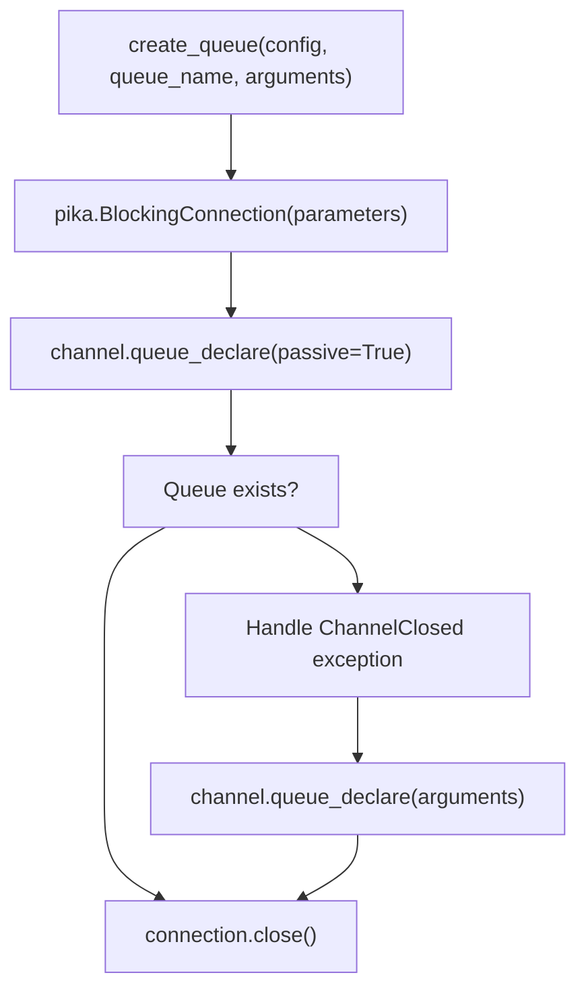
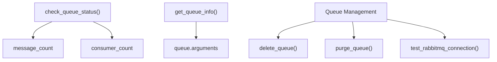

# Message Queue Integration

> **Relevant source files**
> * [openchecker/message_queue.py](https://github.com/Laniakea2012/openchecker/blob/1dbd85d0/openchecker/message_queue.py)

## Purpose and Scope

This document covers the RabbitMQ-based message queue integration system that enables asynchronous task distribution between the Flask API server and agent workers in OpenChecker. The system provides reliable message publishing, consumption with heartbeat management, and queue administration utilities. For details about the agent system that consumes these messages, see [Agent System and Message Processing](/Laniakea2012/openchecker/2.1-agent-system-and-message-processing). For reliability mechanisms including retry patterns, see [Reliability and Error Handling](/Laniakea2012/openchecker/2.4-reliability-and-error-handling).

## Core Message Queue Operations

The message queue integration is implemented in [openchecker/message_queue.py L1-L210](https://github.com/Laniakea2012/openchecker/blob/1dbd85d0/openchecker/message_queue.py#L1-L210)

 and provides fundamental operations for queue creation, message publishing, and consumption using the pika library for RabbitMQ connectivity.

### Queue Creation and Management

The `create_queue()` function handles queue creation with automatic existence checking:



The function first attempts a passive declaration to check if the queue exists [openchecker/message_queue.py L18-L19](https://github.com/Laniakea2012/openchecker/blob/1dbd85d0/openchecker/message_queue.py#L18-L19)

 If the queue doesn't exist (triggering a `ChannelClosed` exception), it creates a new connection and declares the queue with the specified arguments [openchecker/message_queue.py L21-L25](https://github.com/Laniakea2012/openchecker/blob/1dbd85d0/openchecker/message_queue.py#L21-L25)

### Message Publishing

The `publish_message()` function provides synchronous message publishing with error handling:

| Operation | Implementation | Error Handling |
| --- | --- | --- |
| Connection | `pika.BlockingConnection(parameters)` | Exception logged and returned |
| Publishing | `channel.basic_publish(routing_key=queue_name, body=message_body)` | Connection closed on success |
| Cleanup | `connection.close()` | Automatic cleanup on failure |

**Sources:** [openchecker/message_queue.py L32-L45](https://github.com/Laniakea2012/openchecker/blob/1dbd85d0/openchecker/message_queue.py#L32-L45)

## Consumer Pattern with Heartbeat Management

The `consumer()` function implements a robust message consumption pattern with integrated heartbeat management and automatic reconnection logic.

### Consumer Architecture

```mermaid
sequenceDiagram
  participant consumer() main thread
  participant heartbeat_sender() thread
  participant RabbitMQ Server
  participant callback_func

  consumer() main thread->>RabbitMQ Server: pika.BlockingConnection()
  consumer() main thread->>consumer() main thread: channel.basic_qos(prefetch_count=1)
  consumer() main thread->>heartbeat_sender() thread: Start daemon thread
  loop [Heartbeat Loop]
    heartbeat_sender() thread->>RabbitMQ Server: connection.process_data_events()
    heartbeat_sender() thread->>heartbeat_sender() thread: sleep(heartbeat_interval_s // 2)
    consumer() main thread->>RabbitMQ Server: channel.basic_consume(callback_func, auto_ack=False)
    consumer() main thread->>RabbitMQ Server: channel.start_consuming()
    RabbitMQ Server->>callback_func: Message delivery
    callback_func->>callback_func: Process message
    callback_func->>RabbitMQ Server: Acknowledge message
  end
  note over consumer() main thread: On error or connection loss
  consumer() main thread->>heartbeat_sender() thread: heartbeat_running = False
  consumer() main thread->>consumer() main thread: Retry after 60 seconds
```

### Heartbeat Management

The consumer implements a dedicated heartbeat mechanism to maintain long-running connections:

* **Heartbeat Thread**: A daemon thread runs `heartbeat_sender()` [openchecker/message_queue.py L54-L68](https://github.com/Laniakea2012/openchecker/blob/1dbd85d0/openchecker/message_queue.py#L54-L68)  to periodically send heartbeats
* **Heartbeat Interval**: Configurable via `config['heartbeat_interval_s']`, with heartbeats sent at half-interval [openchecker/message_queue.py L66](https://github.com/Laniakea2012/openchecker/blob/1dbd85d0/openchecker/message_queue.py#L66-L66)
* **Connection Monitoring**: The heartbeat thread checks `connection.is_open` before sending events [openchecker/message_queue.py L62](https://github.com/Laniakea2012/openchecker/blob/1dbd85d0/openchecker/message_queue.py#L62-L62)

### Error Handling and Reconnection

The consumer implements comprehensive error handling with automatic reconnection:

| Exception Type | Handling Strategy | Retry Behavior |
| --- | --- | --- |
| `ConnectionClosedByBroker` | Log error, stop heartbeat, retry | 60-second delay [openchecker/message_queue.py L90-L97](https://github.com/Laniakea2012/openchecker/blob/1dbd85d0/openchecker/message_queue.py#L90-L97) |
| `AMQPChannelError` | Log error, stop heartbeat, retry | 60-second delay [openchecker/message_queue.py L99-L106](https://github.com/Laniakea2012/openchecker/blob/1dbd85d0/openchecker/message_queue.py#L99-L106) |
| General Exception | Log error, cleanup, return error | No retry, exit function [openchecker/message_queue.py L108-L115](https://github.com/Laniakea2012/openchecker/blob/1dbd85d0/openchecker/message_queue.py#L108-L115) |

**Sources:** [openchecker/message_queue.py L47-L124](https://github.com/Laniakea2012/openchecker/blob/1dbd85d0/openchecker/message_queue.py#L47-L124)

## Queue Management and Monitoring

The system provides comprehensive queue management utilities for monitoring and administration.

### Queue Status Operations



### Status and Information Functions

| Function | Purpose | Return Values |
| --- | --- | --- |
| `check_queue_status()` | Get queue metrics | `(message_count, consumer_count)` |
| `get_queue_info()` | Get queue configuration | Queue arguments dictionary |
| `view_queue_logs()` | Filter queue-related logs | List of log entries containing "Queue" |

### Administrative Operations

* **Queue Deletion**: `delete_queue()` permanently removes a queue [openchecker/message_queue.py L170-L181](https://github.com/Laniakea2012/openchecker/blob/1dbd85d0/openchecker/message_queue.py#L170-L181)
* **Queue Purging**: `purge_queue()` removes all messages from a queue [openchecker/message_queue.py L183-L194](https://github.com/Laniakea2012/openchecker/blob/1dbd85d0/openchecker/message_queue.py#L183-L194)
* **Connection Testing**: `test_rabbitmq_connection()` validates RabbitMQ connectivity [openchecker/message_queue.py L196-L205](https://github.com/Laniakea2012/openchecker/blob/1dbd85d0/openchecker/message_queue.py#L196-L205)

**Sources:** [openchecker/message_queue.py L125-L206](https://github.com/Laniakea2012/openchecker/blob/1dbd85d0/openchecker/message_queue.py#L125-L206)

## Configuration Integration

The message queue system integrates with the centralized configuration management through the `read_config()` helper function.

### Required Configuration Parameters

| Parameter | Purpose | Usage |
| --- | --- | --- |
| `host` | RabbitMQ server address | Connection parameter |
| `port` | RabbitMQ server port | Connection parameter |
| `username` | Authentication username | Credentials setup |
| `password` | Authentication password | Credentials setup |
| `heartbeat_interval_s` | Heartbeat frequency | Consumer heartbeat timing |
| `blocked_connection_timeout_ms` | Connection timeout | Connection parameters |

### Configuration Loading

The configuration is loaded from the "RabbitMQ" section of `config/config.ini` [openchecker/message_queue.py L208](https://github.com/Laniakea2012/openchecker/blob/1dbd85d0/openchecker/message_queue.py#L208-L208)

 using the `read_config()` helper function. Connection parameters are constructed using `pika.PlainCredentials` and `pika.ConnectionParameters` [openchecker/message_queue.py L11-L12](https://github.com/Laniakea2012/openchecker/blob/1dbd85d0/openchecker/message_queue.py#L11-L12)

**Sources:** [openchecker/message_queue.py L1-L208](https://github.com/Laniakea2012/openchecker/blob/1dbd85d0/openchecker/message_queue.py#L1-L208)

## Integration with OpenChecker Components

The message queue system serves as the central communication backbone between the Flask API server and agent workers:

* **Message Publishing**: The Flask API publishes task messages using `publish_message()` when `/opencheck` endpoints are called
* **Message Consumption**: Agent workers use `consumer()` with callback functions to process incoming analysis tasks
* **Queue Management**: Administrative tools use the management functions for monitoring and maintenance

**Sources:** [openchecker/message_queue.py L1-L210](https://github.com/Laniakea2012/openchecker/blob/1dbd85d0/openchecker/message_queue.py#L1-L210)