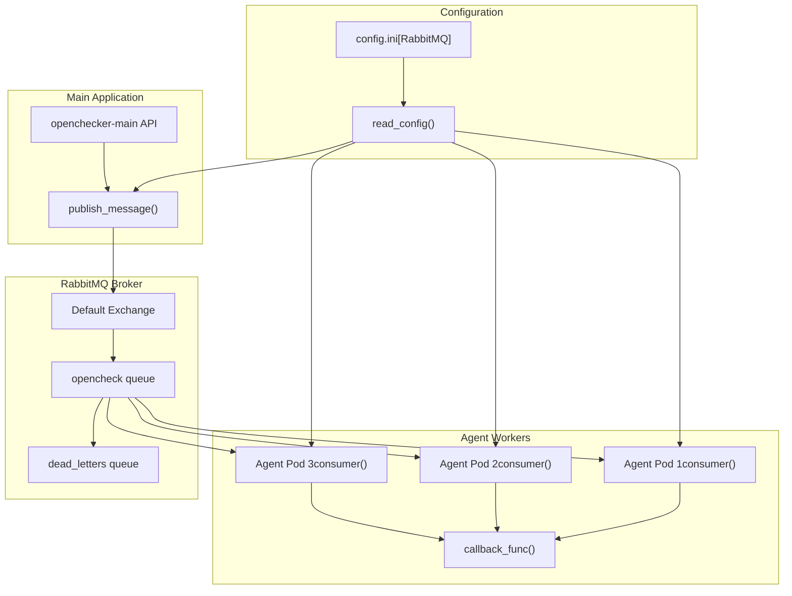
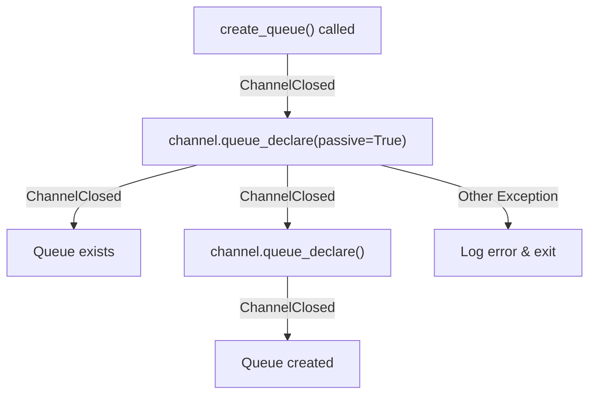
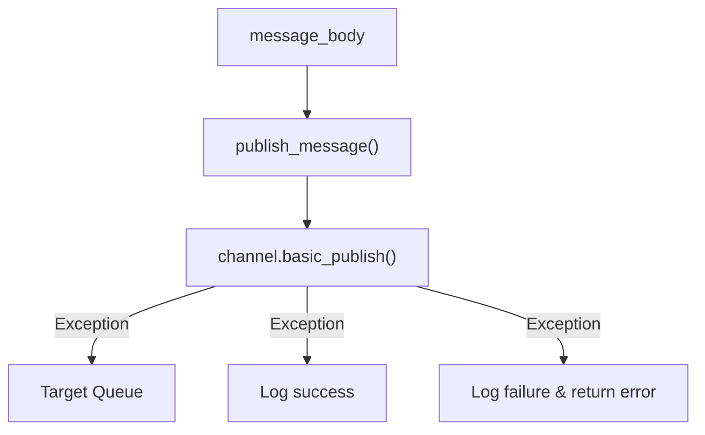
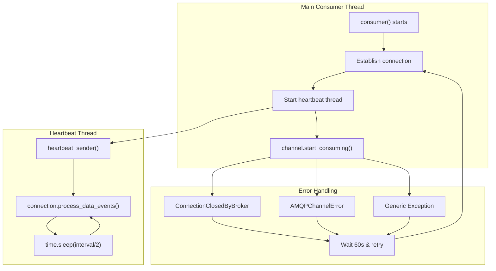
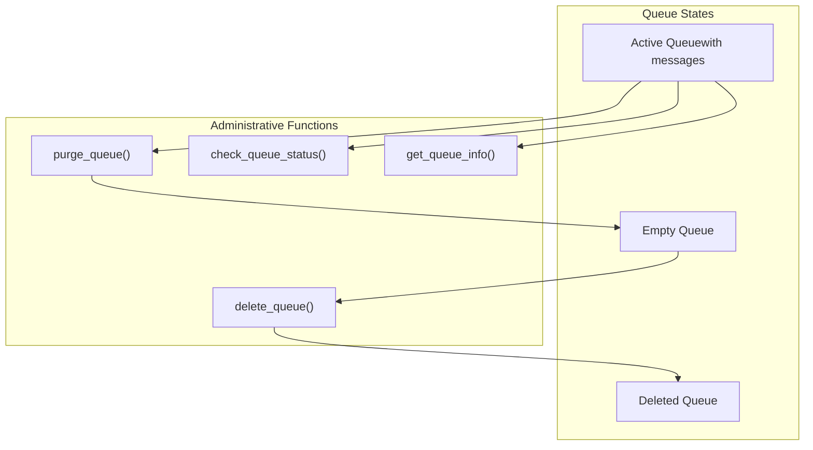
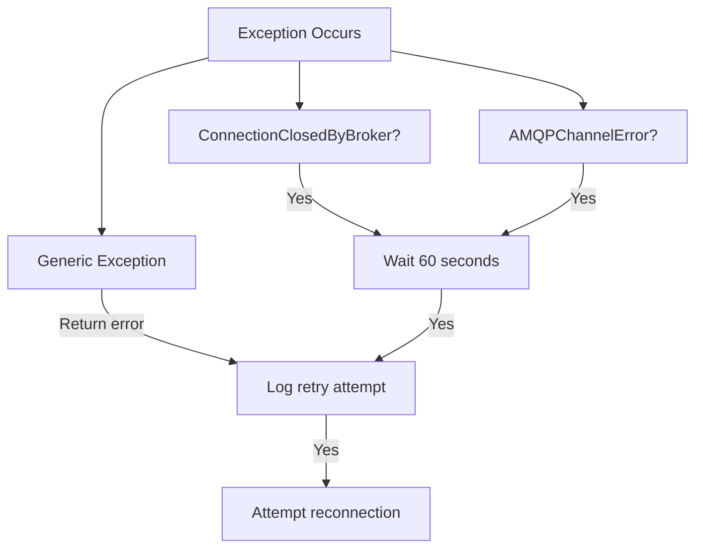

# Message Queue Integration

> **Relevant source files**
> * [openchecker/exponential_backoff.py](https://github.com/Laniakea2012/openchecker/blob/00a9732e/openchecker/exponential_backoff.py)
> * [openchecker/message_queue.py](https://github.com/Laniakea2012/openchecker/blob/00a9732e/openchecker/message_queue.py)

## Purpose and Scope

This document covers the RabbitMQ message queue integration that serves as the core communication backbone of the OpenChecker system. The message queue enables asynchronous processing of analysis requests by decoupling the main API from worker agents that execute security and compliance checks.

The message queue system handles task distribution, load balancing across multiple agent workers, and provides reliability features including connection management, heartbeat monitoring, and error recovery. For information about the agent workers that consume these messages, see [Agent System](/Laniakea2012/openchecker/2.1-agent-system). For details about the API endpoints that publish messages, see [REST API Endpoints](/Laniakea2012/openchecker/3.1-rest-api-endpoints).

## System Architecture

The message queue integration follows a producer-consumer pattern where the main OpenChecker API publishes analysis requests to RabbitMQ queues, and distributed agent workers consume these messages to execute analysis tasks.

### Message Flow Architecture

**Sources:** [openchecker/message_queue.py L1-L206](https://github.com/Laniakea2012/openchecker/blob/00a9732e/openchecker/message_queue.py#L1-L206)

### Core Queue Operations

```mermaid
flowchart TD

CreateQueue["create_queue()"]
DeleteQueue["delete_queue()"]
PurgeQueue["purge_queue()"]
PublishMessage["publish_message()"]
Consumer["consumer()"]
BasicConsume["channel.basic_consume()"]
CheckStatus["check_queue_status()"]
GetQueueInfo["get_queue_info()"]
ViewLogs["view_queue_logs()"]
TestConnection["test_rabbitmq_connection()"]
PikaConnection["pika.BlockingConnection"]
Credentials["pika.PlainCredentials"]

    CreateQueue --> PikaConnection
    PublishMessage --> PikaConnection
    CheckStatus --> PikaConnection
subgraph Connection ["Connection"]
    TestConnection
    PikaConnection
    Credentials
    TestConnection --> Credentials
end

subgraph Monitoring ["Monitoring"]
    CheckStatus
    GetQueueInfo
    ViewLogs
end

subgraph Message_Operations ["Message Operations"]
    PublishMessage
    Consumer
    BasicConsume
    Consumer --> BasicConsume
end

subgraph Queue_Management ["Queue Management"]
    CreateQueue
    DeleteQueue
    PurgeQueue
end
```

**Sources:** [openchecker/message_queue.py L6-L202](https://github.com/Laniakea2012/openchecker/blob/00a9732e/openchecker/message_queue.py#L6-L202)

## Configuration and Connection Management

The message queue system uses a centralized configuration approach through the `config.ini` file. Connection parameters are loaded using the `read_config()` helper function from the `[RabbitMQ]` section.

### Connection Parameters

| Parameter | Purpose | Code Reference |
| --- | --- | --- |
| `host` | RabbitMQ server hostname | [openchecker/message_queue.py   8](https://github.com/Laniakea2012/openchecker/blob/00a9732e/openchecker/message_queue.py#L8-L8) |
| `port` | RabbitMQ server port | [openchecker/message_queue.py   8](https://github.com/Laniakea2012/openchecker/blob/00a9732e/openchecker/message_queue.py#L8-L8) |
| `username` | Authentication username | [openchecker/message_queue.py   7](https://github.com/Laniakea2012/openchecker/blob/00a9732e/openchecker/message_queue.py#L7-L7) |
| `password` | Authentication password | [openchecker/message_queue.py   7](https://github.com/Laniakea2012/openchecker/blob/00a9732e/openchecker/message_queue.py#L7-L7) |
| `heartbeat_interval_s` | Heartbeat interval in seconds | [openchecker/message_queue.py   45](https://github.com/Laniakea2012/openchecker/blob/00a9732e/openchecker/message_queue.py#L45-L45) |
| `blocked_connection_timeout_ms` | Connection timeout in milliseconds | [openchecker/message_queue.py   45](https://github.com/Laniakea2012/openchecker/blob/00a9732e/openchecker/message_queue.py#L45-L45) |

### Connection Establishment

The system establishes RabbitMQ connections using the `pika` library with credentials and connection parameters. Each operation creates a new connection that is properly closed after use to prevent resource leaks.

[ERROR_PROCESSING_ELEMENT: PRE]

**Sources:** [openchecker/message_queue.py L7-L8](https://github.com/Laniakea2012/openchecker/blob/00a9732e/openchecker/message_queue.py#L7-L8)

 [openchecker/message_queue.py L44-L45](https://github.com/Laniakea2012/openchecker/blob/00a9732e/openchecker/message_queue.py#L44-L45)

## Queue Operations

### Queue Creation and Management

The `create_queue()` function implements robust queue creation with existence checking. It first attempts to declare the queue passively to check if it exists, and only creates it if the operation fails with a `ChannelClosed` exception.

Key features:

* **Passive Declaration**: Uses `passive=True` to check queue existence without creating it
* **Graceful Creation**: Creates queue only if it doesn't exist
* **Argument Support**: Accepts queue arguments for advanced configuration

**Sources:** [openchecker/message_queue.py L6-L27](https://github.com/Laniakea2012/openchecker/blob/00a9732e/openchecker/message_queue.py#L6-L27)

### Message Publishing

The `publish_message()` function handles message publication with error handling and logging. Messages are published to the default exchange with the queue name as the routing key.

**Sources:** [openchecker/message_queue.py L28-L42](https://github.com/Laniakea2012/openchecker/blob/00a9732e/openchecker/message_queue.py#L28-L42)

## Consumer Implementation

### Robust Consumer Design

The `consumer()` function implements a sophisticated message consumption pattern with heartbeat management, automatic reconnection, and comprehensive error handling.

### Heartbeat Management

The consumer implements a separate heartbeat thread to maintain connection health during long-running message processing:

**Sources:** [openchecker/message_queue.py L43-L120](https://github.com/Laniakea2012/openchecker/blob/00a9732e/openchecker/message_queue.py#L43-L120)

### Quality of Service Configuration

The consumer sets `prefetch_count=1` to ensure fair distribution of messages across multiple workers:

* **Load Balancing**: Each consumer processes one message at a time
* **Manual Acknowledgment**: Uses `auto_ack=False` for reliable message processing
* **Fair Dispatch**: Prevents worker overload by limiting unacknowledged messages

**Sources:** [openchecker/message_queue.py

72](https://github.com/Laniakea2012/openchecker/blob/00a9732e/openchecker/message_queue.py#L72-L72)

 [openchecker/message_queue.py

82](https://github.com/Laniakea2012/openchecker/blob/00a9732e/openchecker/message_queue.py#L82-L82)

## Monitoring and Management

### Queue Status Monitoring

The system provides comprehensive queue monitoring capabilities through dedicated functions:

| Function | Purpose | Return Values |
| --- | --- | --- |
| `check_queue_status()` | Get message and consumer counts | `(message_count, consumer_count)` |
| `get_queue_info()` | Retrieve queue configuration | `queue_arguments` |
| `view_queue_logs()` | Filter queue-related log entries | `queue_logs[]` |

### Administrative Operations

**Sources:** [openchecker/message_queue.py L121-L191](https://github.com/Laniakea2012/openchecker/blob/00a9732e/openchecker/message_queue.py#L121-L191)

## Error Handling and Reliability

### Connection Resilience

The message queue integration implements multiple layers of error handling:

1. **Connection-Level Errors**: Handles broker disconnections with automatic retry
2. **Channel-Level Errors**: Manages AMQP channel errors with reconnection
3. **Heartbeat Management**: Maintains connection health during processing
4. **Graceful Degradation**: Logs errors and continues operation where possible

### Retry Strategy

The consumer uses a simple retry strategy with fixed 60-second delays between reconnection attempts. For external HTTP calls, the system uses exponential backoff through the `retry_with_exponential_backoff` decorator.

**Sources:** [openchecker/message_queue.py L86-L111](https://github.com/Laniakea2012/openchecker/blob/00a9732e/openchecker/message_queue.py#L86-L111)

 [openchecker/exponential_backoff.py L8-L53](https://github.com/Laniakea2012/openchecker/blob/00a9732e/openchecker/exponential_backoff.py#L8-L53)

## Integration Points

### Configuration Integration

The message queue system integrates with the centralized configuration management:

* **Configuration File**: `config/config.ini` with `[RabbitMQ]` section
* **Helper Function**: Uses `read_config()` for parameter loading
* **Environment Flexibility**: Supports different deployment configurations

### API Integration

The main OpenChecker API uses the `publish_message()` function to enqueue analysis requests. The agents use the `consumer()` function to process these requests asynchronously.

**Sources:** [openchecker/message_queue.py

204](https://github.com/Laniakea2012/openchecker/blob/00a9732e/openchecker/message_queue.py#L204-L204)

 [openchecker/message_queue.py L28-L42](https://github.com/Laniakea2012/openchecker/blob/00a9732e/openchecker/message_queue.py#L28-L42)

 [openchecker/message_queue.py L43-L120](https://github.com/Laniakea2012/openchecker/blob/00a9732e/openchecker/message_queue.py#L43-L120)