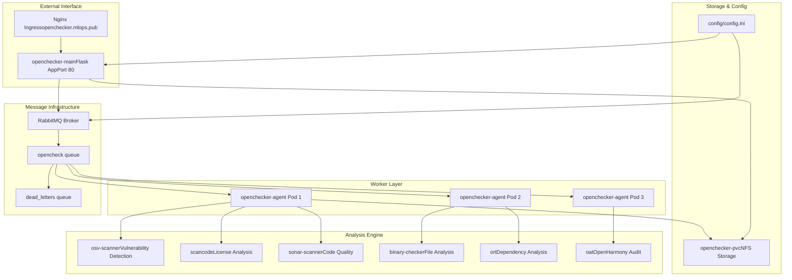
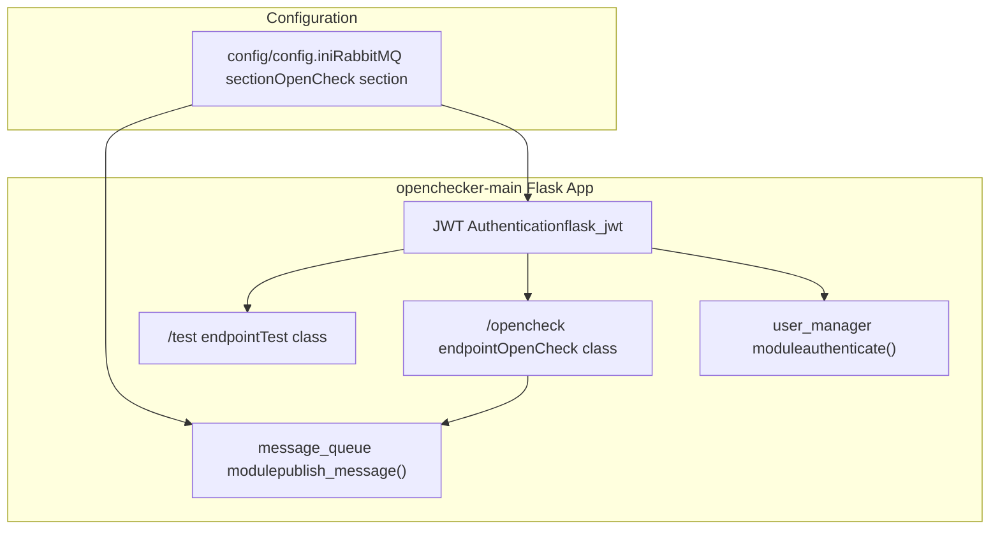
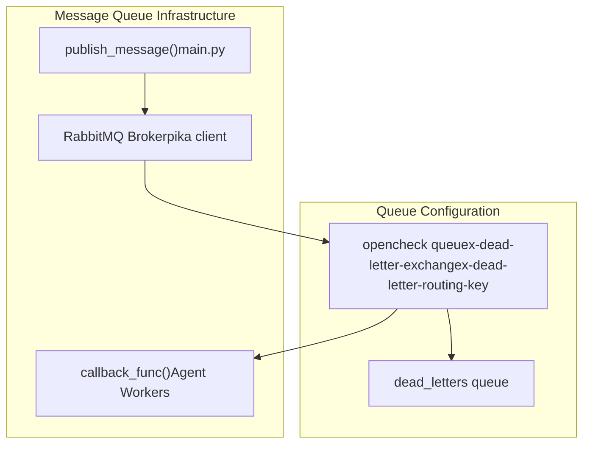
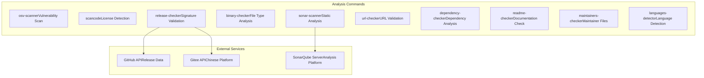
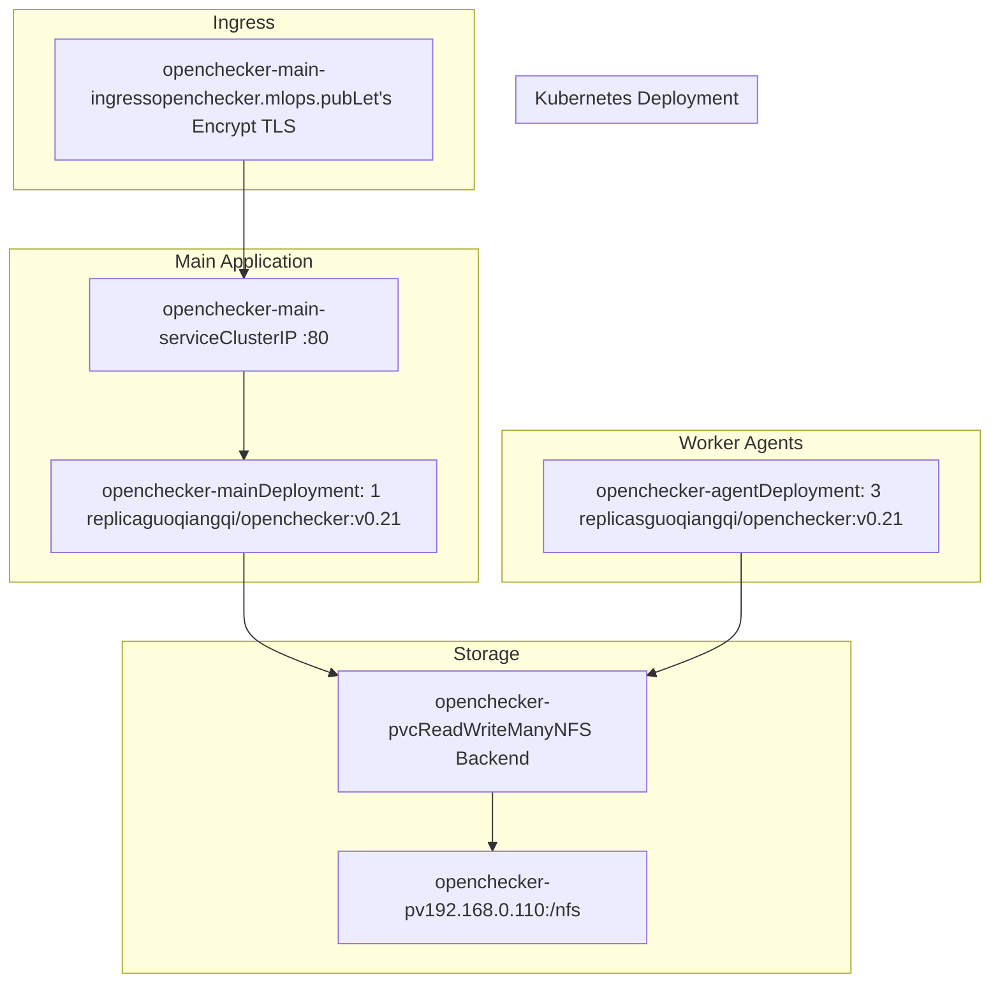

# Overview

> **Relevant source files**
> * [README.md](https://github.com/Laniakea2012/openchecker/blob/00a9732e/README.md)
> * [docs/architecture.png](https://github.com/Laniakea2012/openchecker/blob/00a9732e/docs/architecture.png)
> * [openchecker/main.py](https://github.com/Laniakea2012/openchecker/blob/00a9732e/openchecker/main.py)
> * [requirements.txt](https://github.com/Laniakea2012/openchecker/blob/00a9732e/requirements.txt)

## Purpose and Scope

OpenChecker is a comprehensive software analysis and compliance checking platform that performs automated security, license, and quality assessments on source code repositories. The system operates as a distributed, message-driven architecture that can execute multiple analysis tools concurrently on software projects and return detailed compliance reports.

This document provides a high-level overview of the OpenChecker system architecture, core components, and operational flow. For detailed information about specific subsystems, see:

* API implementation and authentication: [REST API Endpoints](/Laniakea2012/openchecker/3.1-rest-api-endpoints) and [User Management and Authentication](/Laniakea2012/openchecker/3.2-user-management-and-authentication)
* Analysis tool configurations: [Analysis Tools and Checkers](/Laniakea2012/openchecker/4-analysis-tools-and-checkers)
* Kubernetes deployment details: [Deployment and Infrastructure](/Laniakea2012/openchecker/6-deployment-and-infrastructure)
* AI/ML classification features: [AI and Machine Learning Components](/Laniakea2012/openchecker/5-ai-and-machine-learning-components)

## System Architecture Overview

OpenChecker implements a microservices architecture with asynchronous message processing, designed for scalability and reliability in analyzing software repositories.



Sources: [README.md L1-L50](https://github.com/Laniakea2012/openchecker/blob/00a9732e/README.md#L1-L50)

 [openchecker/main.py L1-L75](https://github.com/Laniakea2012/openchecker/blob/00a9732e/openchecker/main.py#L1-L75)

 [requirements.txt L1-L9](https://github.com/Laniakea2012/openchecker/blob/00a9732e/requirements.txt#L1-L9)

## Core Components

### Flask API Application

The main application entry point is a Flask REST API with JWT authentication that accepts analysis requests and publishes them to message queues.



**Key API Endpoints:**

* `GET/POST /test` - Authentication testing endpoint implemented by `Test` class
* `POST /opencheck` - Main analysis request endpoint implemented by `OpenCheck` class

**Authentication Flow:**

* JWT tokens with 30-day expiration configured via `JWT_EXPIRATION_DELTA`
* User authentication handled by `authenticate()` and `identity()` functions from `user_manager` module

Sources: [openchecker/main.py L1-L75](https://github.com/Laniakea2012/openchecker/blob/00a9732e/openchecker/main.py#L1-L75)

 [requirements.txt L1-L4](https://github.com/Laniakea2012/openchecker/blob/00a9732e/requirements.txt#L1-L4)

### Message Processing System

OpenChecker uses RabbitMQ for asynchronous job processing with dead letter queue support for failed messages.



**Message Structure:**

```
{
    "command_list": ["osv-scanner", "scancode", "binary-checker"],
    "project_url": "https://github.com/user/repo",
    "commit_hash": "abc123def456",
    "callback_url": "https://api.example.com/results",
    "task_metadata": {...}
}
```

**Queue Initialization:**

* `create_queue()` function establishes both `opencheck` and `dead_letters` queues
* Dead letter routing configured with `x-dead-letter-exchange` and `x-dead-letter-routing-key` arguments
* Connection testing via `test_rabbitmq_connection()` function

Sources: [openchecker/main.py L35-L63](https://github.com/Laniakea2012/openchecker/blob/00a9732e/openchecker/main.py#L35-L63)

 [requirements.txt

5](https://github.com/Laniakea2012/openchecker/blob/00a9732e/requirements.txt#L5-L5)

## Analysis Tools Integration

The system integrates multiple open-source and proprietary analysis tools through a containerized environment.



**Supported Analysis Commands:**

* `osv-scanner` - Performs vulnerability scanning using Google's OSV database
* `scancode` - Detects licenses and copyright information in source code
* `sonar-scanner` - Executes SonarQube static code analysis
* `binary-checker` - Identifies binary files and archives
* `release-checker` - Validates release signatures and content
* `dependency-checker` - Analyzes project dependencies using ORT
* `readme-checker`, `maintainers-checker` - Documentation compliance checks
* `languages-detector` - Programming language identification

Sources: [README.md L15-L29](https://github.com/Laniakea2012/openchecker/blob/00a9732e/README.md#L15-L29)

## Deployment Architecture

OpenChecker runs on Kubernetes with horizontal scaling capabilities and persistent storage.



**Container Configuration:**

* Base image: `guoqiangqi/openchecker:v0.21`
* Main application runs on port 80 with single replica
* Agent workers scale horizontally with 3 default replicas
* Shared NFS storage at `/nfs` mount point for configuration and temporary files

**Network Configuration:**

* External access via `openchecker.mlops.pub` domain
* SSL/TLS termination with Let's Encrypt certificates
* Internal service communication on port 80

Sources: [README.md L38-L40](https://github.com/Laniakea2012/openchecker/blob/00a9732e/README.md#L38-L40)

 [openchecker/main.py L67-L74](https://github.com/Laniakea2012/openchecker/blob/00a9732e/openchecker/main.py#L67-L74)

## Message Processing Flow

The system follows an asynchronous request-response pattern with callback-based result delivery.

[ERROR_PROCESSING_ELEMENT: PRE]

**Request Processing:**

1. Client submits analysis request with JWT authentication
2. API validates token and publishes message to `opencheck` queue
3. Available agent worker consumes message and clones repository
4. Agent executes requested analysis commands sequentially
5. Results are aggregated and posted to provided callback URL
6. Message acknowledgment completes the processing cycle

**Error Handling:**

* Failed messages automatically route to `dead_letters` queue
* SSL support configurable via `use_ssl` flag and certificate paths
* Connection testing via `test_rabbitmq_connection()` ensures message broker availability

Sources: [openchecker/main.py L35-L63](https://github.com/Laniakea2012/openchecker/blob/00a9732e/openchecker/main.py#L35-L63)

 [README.md L30-L37](https://github.com/Laniakea2012/openchecker/blob/00a9732e/README.md#L30-L37)