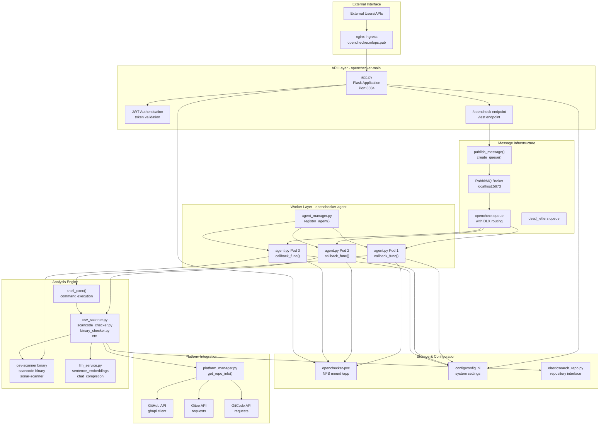
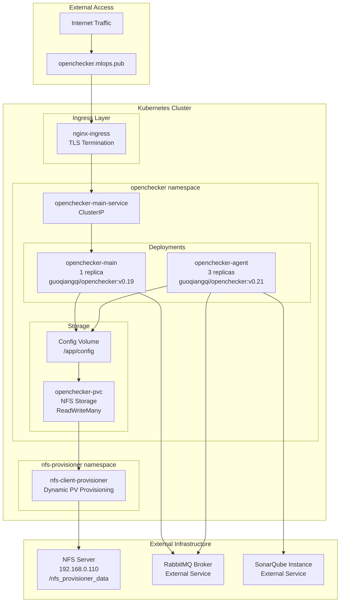

# Overview

> **Relevant source files**
> * [README.md](https://github.com/Laniakea2012/openchecker/blob/1dbd85d0/README.md)
> * [docs/architecture.png](https://github.com/Laniakea2012/openchecker/blob/1dbd85d0/docs/architecture.png)

## Purpose and Scope

OpenChecker is a comprehensive software analysis and compliance checking platform that performs automated security, license, and quality assessments on source code repositories. The system operates as a distributed, message-driven architecture that can execute multiple analysis tools concurrently on software projects and return detailed compliance reports.

The platform integrates 30+ analysis tools including OSV Scanner, ScanCode, SonarQube, and various custom checkers through a unified command execution framework managed by `agent.py:callback_func()`. It supports multiple version control platforms including GitHub, Gitee, and GitCode through `platform_manager.py`, and provides both synchronous API responses and asynchronous callback mechanisms for result delivery.

The system architecture separates concerns into distinct layers: the Flask API layer (`app.py`), message queue infrastructure (`message_queue.py`), worker agents (`agent.py`), and analysis tools execution (`shell_exec()` and individual checker modules). Configuration management is centralized through `config/config.ini` and deployment is orchestrated via Kubernetes manifests.

This document provides a high-level overview of the OpenChecker system architecture, core components, and processing workflow. For detailed information about specific subsystems, refer to the subsequent sections on Core Architecture, API and Web Interface, Analysis Tools and Checkers, and Infrastructure and Deployment.

Sources: [README.md L1-L6](https://github.com/Laniakea2012/openchecker/blob/1dbd85d0/README.md#L1-L6)

 [README.md L113-L127](https://github.com/Laniakea2012/openchecker/blob/1dbd85d0/README.md#L113-L127)

 [openchecker/agent.py L1-L50](https://github.com/Laniakea2012/openchecker/blob/1dbd85d0/openchecker/agent.py#L1-L50)

 [openchecker/platform_manager.py L1-L30](https://github.com/Laniakea2012/openchecker/blob/1dbd85d0/openchecker/platform_manager.py#L1-L30)

 [config/config.ini L1-L30](https://github.com/Laniakea2012/openchecker/blob/1dbd85d0/config/config.ini#L1-L30)

## System Architecture Overview

OpenChecker implements a message-driven architecture where a Flask API service receives analysis requests and distributes them to worker agents via RabbitMQ message queues. The system is designed to handle concurrent analysis of multiple software repositories using various specialized checking tools.

### High-Level System Architecture



Sources: [README.md L6-L79](https://github.com/Laniakea2012/openchecker/blob/1dbd85d0/README.md#L6-L79)

 [openchecker/agent.py L20-L46](https://github.com/Laniakea2012/openchecker/blob/1dbd85d0/openchecker/agent.py#L20-L46)

 [openchecker/constans.py L1-L50](https://github.com/Laniakea2012/openchecker/blob/1dbd85d0/openchecker/constans.py#L1-L50)

 [kubernetes/openchecker-main/deployment.yaml L1-L32](https://github.com/Laniakea2012/openchecker/blob/1dbd85d0/kubernetes/openchecker-main/deployment.yaml#L1-L32)

 [kubernetes/openchecker-agent/deployment.yaml L1-L30](https://github.com/Laniakea2012/openchecker/blob/1dbd85d0/kubernetes/openchecker-agent/deployment.yaml#L1-L30)

## Core Components and Processing Flow

The system operates through several key components that handle different aspects of the analysis workflow:

### Message Processing and Task Execution Flow

```mermaid
sequenceDiagram
  participant app.py
  participant Flask API
  participant message_queue.py
  participant RabbitMQ
  participant agent.py
  participant callback_func()
  participant shell_exec()
  participant command runner
  participant callback_url
  participant external service

  app.py->>message_queue.py: "publish_message('opencheck', task_data)"
  note over message_queue.py,RabbitMQ: "opencheck queue
  message_queue.py->>agent.py: "callback_func(ch, method, properties, body)"
  agent.py->>agent.py: "_download_project_source(project_url)"
  agent.py->>agent.py: "_generate_lock_files(project_path)"
  loop ["Python Function Call"]
    agent.py->>agent.py: "command in PYTHON_CHECKERS?"
    agent.py->>agent.py: "exec python checker function"
    note over agent.py,callback_func(): "e.g. osv_scanner(), binary_checker()"
    agent.py->>shell_exec(): "shell_exec(command, project_path)"
    shell_exec()-->>agent.py: "stdout, stderr, returncode"
    agent.py->>agent.py: "res_payload[command] = result"
    agent.py->>agent.py: "_cleanup_project_source(project_path)"
    agent.py->>callback_url: "requests.post(callback_url, json=res_payload)"
    agent.py->>message_queue.py: "ch.basic_ack(delivery_tag)"
    agent.py->>agent.py: "logging.error(traceback)"
    agent.py->>message_queue.py: "ch.basic_nack(delivery_tag, requeue=False)"
    message_queue.py->>message_queue.py: "Route to dead_letters queue"
  end
```

Sources: [README.md L12-L79](https://github.com/Laniakea2012/openchecker/blob/1dbd85d0/README.md#L12-L79)

 [openchecker/agent.py L1-L50](https://github.com/Laniakea2012/openchecker/blob/1dbd85d0/openchecker/agent.py#L1-L50)

 [openchecker/message_queue.py L1-L50](https://github.com/Laniakea2012/openchecker/blob/1dbd85d0/openchecker/message_queue.py#L1-L50)

### Command Execution Framework

The `agent.py:callback_func()` processes messages from the RabbitMQ queue and executes analysis commands through a hybrid execution model. Commands are categorized into Python function calls (defined in `PYTHON_CHECKERS` constant) and shell script executions (handled by `shell_exec()`). The system supports multiple categories of analysis tools as documented in the README:

#### Supported Analysis Commands

| Command | Purpose |
| --- | --- |
| `osv-scanner` | Vulnerability scan with JSON output |
| `scancode` | License and code information scanning |
| `binary-checker` | Binary files and archives detection |
| `release-checker` | Release content and signature analysis |
| `url-checker` | Project URL validation |
| `sonar-scanner` | Code analysis using SonarQube |
| `dependency-checker` | Project dependencies analysis |
| `readme-checker` | README files validation |
| `maintainers-checker` | Maintainer-related files check |
| `readme-opensource-checker` | README.OpenSource format validation |
| `build-doc-checker` | Build documentation assessment |
| `api-doc-checker` | API documentation assessment |
| `languages-detector` | Programming languages detection |

Sources: [README.md L114-L127](https://github.com/Laniakea2012/openchecker/blob/1dbd85d0/README.md#L114-L127)

 [openchecker/agent.py L196-L298](https://github.com/Laniakea2012/openchecker/blob/1dbd85d0/openchecker/agent.py#L196-L298)

 [openchecker/constans.py L30-L50](https://github.com/Laniakea2012/openchecker/blob/1dbd85d0/openchecker/constans.py#L30-L50)

 [openchecker/shell_exec.py L1-L30](https://github.com/Laniakea2012/openchecker/blob/1dbd85d0/openchecker/shell_exec.py#L1-L30)

## API Endpoints and Integration

OpenChecker provides REST API endpoints for external interaction:

### API Endpoints

| Endpoint | Method | Authentication | Purpose |
| --- | --- | --- | --- |
| `/test` | GET | JWT required | Returns current authenticated user |
| `/test` | POST | JWT required | Echo test with message field |
| `/opencheck` | POST | JWT required | Submit analysis task with commands, project_url, callback_url, and task_metadata |

### RabbitMQ Integration

The `message_queue.py` module provides core RabbitMQ operations:

* `test_rabbitmq_connection()` - Verify RabbitMQ connectivity and log connection status
* `create_queue(queue_name, arguments)` - Create queues with dead letter exchange configurations
* `publish_message(queue_name, message)` - Publish JSON messages to specified queue with retry logic

The system creates two primary queues with specific routing configurations:

* **`opencheck`** - Main task processing queue with dead letter exchange routing to `dead_letters`
* **`dead_letters`** - Failed message handling queue for manual inspection and retry

The agent workers consume from the `opencheck` queue using `ch.basic_consume()` with the `callback_func()` as the message handler, implementing acknowledgment patterns for reliable message processing.

Sources: [README.md L128-L135](https://github.com/Laniakea2012/openchecker/blob/1dbd85d0/README.md#L128-L135)

 [openchecker/message_queue.py L1-L50](https://github.com/Laniakea2012/openchecker/blob/1dbd85d0/openchecker/message_queue.py#L1-L50)

 [openchecker/agent.py L578-L580](https://github.com/Laniakea2012/openchecker/blob/1dbd85d0/openchecker/agent.py#L578-L580)

## Kubernetes Deployment Architecture

The system is deployed on Kubernetes with the following configuration:

### Kubernetes Deployment Architecture



Sources: [README.md L12-L79](https://github.com/Laniakea2012/openchecker/blob/1dbd85d0/README.md#L12-L79)

## Message Queue Integration

OpenChecker uses RabbitMQ for asynchronous message processing with two primary queues:

* **`opencheck` queue**: Receives analysis task messages from the API
* **`dead_letters` queue**: Handles failed messages for retry or investigation

The agent's `callback_func` function serves as the primary message consumer, processing tasks and executing the configured command list for each project analysis request.

Sources: [openchecker/agent.py L578-L580](https://github.com/Laniakea2012/openchecker/blob/1dbd85d0/openchecker/agent.py#L578-L580)

 [openchecker/agent.py L196-L298](https://github.com/Laniakea2012/openchecker/blob/1dbd85d0/openchecker/agent.py#L196-L298)

 [README.md L132-L134](https://github.com/Laniakea2012/openchecker/blob/1dbd85d0/README.md#L132-L134)