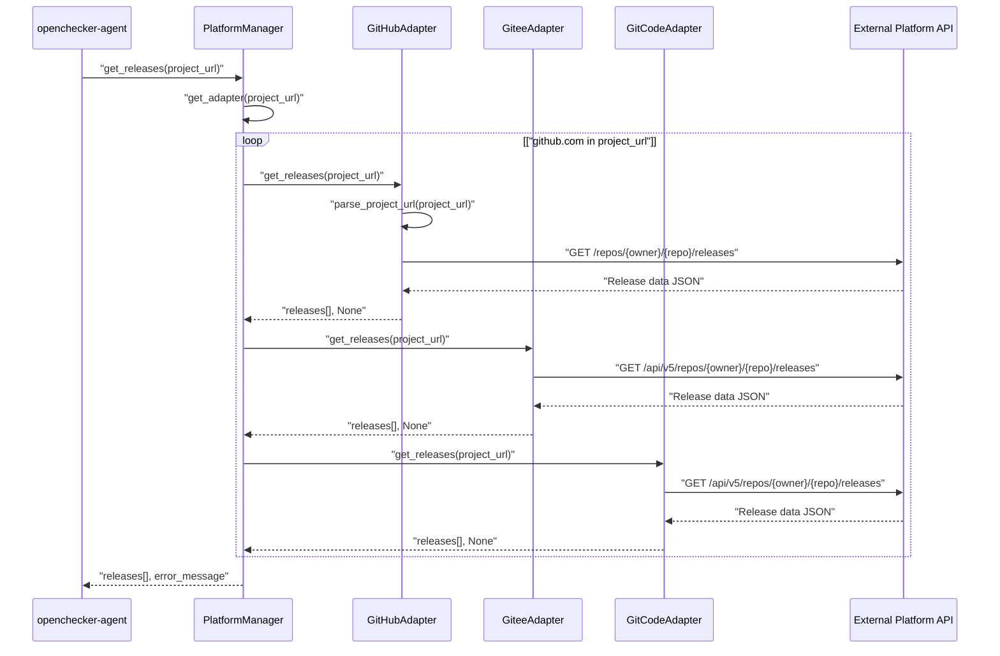
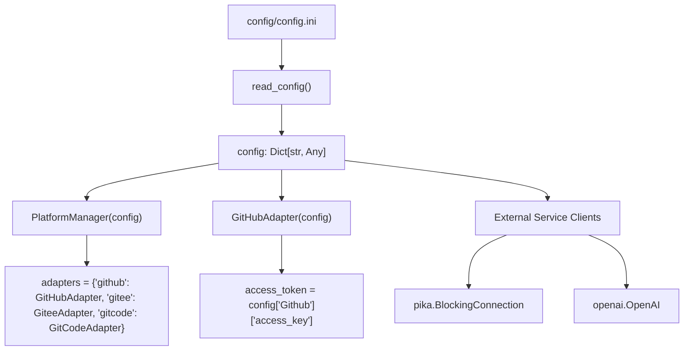

# Platform Integration and External Services

> **Relevant source files**
> * [config/config.ini](https://github.com/Laniakea2012/openchecker/blob/1dbd85d0/config/config.ini)
> * [docs/platform-adapter.md](https://github.com/Laniakea2012/openchecker/blob/1dbd85d0/docs/platform-adapter.md)
> * [openchecker/platform_adapter.py](https://github.com/Laniakea2012/openchecker/blob/1dbd85d0/openchecker/platform_adapter.py)
> * [requirements.txt](https://github.com/Laniakea2012/openchecker/blob/1dbd85d0/requirements.txt)
> * [test/test_platform_adapter.py](https://github.com/Laniakea2012/openchecker/blob/1dbd85d0/test/test_platform_adapter.py)

This document covers the OpenChecker system's integration with external platforms and services, including version control platforms (GitHub, Gitee, GitCode), messaging infrastructure (RabbitMQ), code analysis services (SonarQube), and AI services. The system provides unified adapters and configuration management for these external dependencies.

For information about the internal API server and authentication, see [API and Web Interface](/Laniakea2012/openchecker/3-api-and-web-interface). For deployment and infrastructure configuration, see [Infrastructure and Deployment](/Laniakea2012/openchecker/7-infrastructure-and-deployment).

## Platform Adapter Architecture

The OpenChecker system implements a unified platform adapter pattern to interact with multiple version control platforms through the `PlatformAdapter` base class and its concrete implementations.

### Platform Adapter Class Hierarchy

```

```

Sources: [openchecker/platform_adapter.py L27-L97](https://github.com/Laniakea2012/openchecker/blob/1dbd85d0/openchecker/platform_adapter.py#L27-L97)

 [openchecker/platform_adapter.py L99-L174](https://github.com/Laniakea2012/openchecker/blob/1dbd85d0/openchecker/platform_adapter.py#L99-L174)

 [openchecker/platform_adapter.py L176-L250](https://github.com/Laniakea2012/openchecker/blob/1dbd85d0/openchecker/platform_adapter.py#L176-L250)

 [openchecker/platform_adapter.py L252-L351](https://github.com/Laniakea2012/openchecker/blob/1dbd85d0/openchecker/platform_adapter.py#L252-L351)

 [openchecker/platform_adapter.py L353-L463](https://github.com/Laniakea2012/openchecker/blob/1dbd85d0/openchecker/platform_adapter.py#L353-L463)

The `PlatformManager` class serves as the central entry point, automatically routing requests to the appropriate platform adapter based on URL patterns. The global instance `platform_manager` is created at module level for system-wide access.

### Platform URL Parsing and Recognition

Each adapter implements URL parsing for its respective platform with regex patterns:

| Platform | URL Pattern | Example |
| --- | --- | --- |
| GitHub | `https://(?:www\.)?github\.com/([^/]+)/([^/]+?)(?:\.git)?$` | `https://github.com/owner/repo.git` |
| Gitee | `https://(?:www\.)?gitee\.com/([^/]+)/([^/]+?)(?:\.git)?$` | `https://gitee.com/owner/repo.git` |
| GitCode | `https://(?:www\.)?gitcode\.com/([^/]+)/([^/]+?)(?:\.git)?$` | `https://gitcode.com/owner/repo.git` |

Sources: [openchecker/platform_adapter.py L109-L121](https://github.com/Laniakea2012/openchecker/blob/1dbd85d0/openchecker/platform_adapter.py#L109-L121)

 [openchecker/platform_adapter.py L186-L198](https://github.com/Laniakea2012/openchecker/blob/1dbd85d0/openchecker/platform_adapter.py#L186-L198)

 [openchecker/platform_adapter.py L262-L274](https://github.com/Laniakea2012/openchecker/blob/1dbd85d0/openchecker/platform_adapter.py#L262-L274)

## Version Control Platform Integration

### GitHub Integration

The `GitHubAdapter` uses the `ghapi` library for authenticated API access and implements the GitHub REST API v4 specifications.

**Key Features:**

* Repository information retrieval via `/repos/{owner}/{repo}` endpoint
* Release listing with pagination support using `paged()` function
* Zipball URL generation for tag-based source downloads
* Bearer token authentication for API rate limit increases

**API Endpoints Used:**

* `https://api.github.com/repos/{owner}/{repo}` - Repository metadata
* `https://github.com/{owner}/{repo}/archive/refs/tags/{tag}.zip` - Source download

Sources: [openchecker/platform_adapter.py L99-L174](https://github.com/Laniakea2012/openchecker/blob/1dbd85d0/openchecker/platform_adapter.py#L99-L174)

 [requirements.txt L8](https://github.com/Laniakea2012/openchecker/blob/1dbd85d0/requirements.txt#L8-L8)

### Gitee Integration

The `GiteeAdapter` implements Gitee's REST API v5 for Chinese market code hosting integration.

**Key Features:**

* Repository information via `/api/v5/repos/{owner}/{repo}` endpoint
* Release data retrieval with JSON response parsing
* Access token parameter-based authentication
* Homepage and description metadata extraction

**API Endpoints Used:**

* `https://gitee.com/api/v5/repos/{owner}/{repo}/releases` - Release listing
* `https://gitee.com/api/v5/repos/{owner}/{repo}?access_token={token}` - Repository info
* `https://gitee.com/{owner}/{repo}/repository/archive/{tag}.zip` - Source archive

Sources: [openchecker/platform_adapter.py L176-L250](https://github.com/Laniakea2012/openchecker/blob/1dbd85d0/openchecker/platform_adapter.py#L176-L250)

### GitCode Integration

The `GitCodeAdapter` provides integration with Huawei Cloud's GitCode platform, extending Gitee-compatible API patterns.

**Key Features:**

* Download statistics retrieval via `/download_statistics` endpoint
* Release management through `/releases` API
* Raw file access through `https://raw.gitcode.com` domain
* Statistical aggregation for download counting

**Unique Capabilities:**

* Download statistics with period tracking
* Today download count aggregation from `today_dl_cnt` fields
* Date range calculation from `pdate` fields

Sources: [openchecker/platform_adapter.py L252-L351](https://github.com/Laniakea2012/openchecker/blob/1dbd85d0/openchecker/platform_adapter.py#L252-L351)

## External Service Configuration

### Configuration File Structure

The system centralizes external service configuration in [config/config.ini L1-L43](https://github.com/Laniakea2012/openchecker/blob/1dbd85d0/config/config.ini#L1-L43)

 with the following service sections:

```mermaid
flowchart TD

ConfigINI["config.ini"]
RabbitMQSection["[RabbitMQ]"]
SonarQubeSection["[SonarQube]"]
OpenCheckSection["[OpenCheck]"]
ChatBotSection["[ChatBot]"]
GiteeSection["[Gitee]"]
GithubSection["[Github]"]
GitCodeSection["[GitCode]"]
UserManagerSection["[UserManager]"]
JWTSection["[JWT]"]
RabbitMQHost["host = localhost"]
RabbitMQPort["port = 5673"]
RabbitMQAuth["username/password = admin"]
SonarHost["host = localhost"]
SonarPort["port = 9000"]
SonarToken["token ="]
ChatBotURL["base_url ="]
ChatBotKey["api_key ="]
ChatBotModel["model_name ="]
GiteeKey["access_key ="]
GithubKey["access_key ="]
GitCodeKey["access_key ="]

ConfigINI --> RabbitMQSection
ConfigINI --> SonarQubeSection
ConfigINI --> OpenCheckSection
ConfigINI --> ChatBotSection
ConfigINI --> GiteeSection
ConfigINI --> GithubSection
ConfigINI --> GitCodeSection
ConfigINI --> UserManagerSection
ConfigINI --> JWTSection
RabbitMQSection --> RabbitMQHost
RabbitMQSection --> RabbitMQPort
RabbitMQSection --> RabbitMQAuth
SonarQubeSection --> SonarHost
SonarQubeSection --> SonarPort
SonarQubeSection --> SonarToken
ChatBotSection --> ChatBotURL
ChatBotSection --> ChatBotKey
ChatBotSection --> ChatBotModel
GiteeSection --> GiteeKey
GithubSection --> GithubKey
GitCodeSection --> GitCodeKey
```



Sources: [config/config.ini L1-L43](https://github.com/Laniakea2012/openchecker/blob/1dbd85d0/config/config.ini#L1-L43)

### Service Configuration Details

| Service | Configuration Keys | Purpose |
| --- | --- | --- |
| RabbitMQ | `host`, `port`, `username`, `password`, `heartbeat_interval_s`, `blocked_connection_timeout_ms` | Message queue broker for async task distribution |
| SonarQube | `host`, `port`, `username`, `password`, `token` | Code quality analysis integration |
| ChatBot | `base_url`, `api_key`, `model_name` | AI/LLM service integration |
| GitHub/Gitee/GitCode | `access_key` | Platform API authentication tokens |
| JWT | `secret_key`, `expires_minutes` | Authentication token configuration |
| OpenCheck | `host`, `port`, `ssl_crt_path`, `ssl_key_path`, `repos_dir` | Main service endpoint configuration |

### External Service Dependencies

The system's external dependencies are managed through [requirements.txt L1-L10](https://github.com/Laniakea2012/openchecker/blob/1dbd85d0/requirements.txt#L1-L10)

:

**Message Queue:**

* `pika==1.3.2` - RabbitMQ client library

**HTTP Clients:**

* `requests==2.26.0` - General HTTP client
* `httpx==0.27.2` - Async HTTP client

**Platform APIs:**

* `ghapi==1.0.5` - GitHub API client
* `openai==1.37.1` - OpenAI API integration

**Web Framework:**

* `flask==2.2.3`, `flask_restful==0.3.9`, `flask-jwt-extended==4.5.3` - REST API server

## External Service Integration Flow

### Platform Adapter Request Flow



Sources: [openchecker/platform_adapter.py L364-L382](https://github.com/Laniakea2012/openchecker/blob/1dbd85d0/openchecker/platform_adapter.py#L364-L382)

 [openchecker/platform_adapter.py L399-L413](https://github.com/Laniakea2012/openchecker/blob/1dbd85d0/openchecker/platform_adapter.py#L399-L413)

### Configuration Loading and Service Initialization

The platform adapters and external services are initialized through the configuration loading mechanism:



Sources: [openchecker/platform_adapter.py L20-L25](https://github.com/Laniakea2012/openchecker/blob/1dbd85d0/openchecker/platform_adapter.py#L20-L25)

 [openchecker/platform_adapter.py L356-L362](https://github.com/Laniakea2012/openchecker/blob/1dbd85d0/openchecker/platform_adapter.py#L356-L362)

 [openchecker/platform_adapter.py L102-L104](https://github.com/Laniakea2012/openchecker/blob/1dbd85d0/openchecker/platform_adapter.py#L102-L104)

## API Authentication and Rate Limiting

### Token-Based Authentication

Each platform adapter implements token-based authentication with different patterns:

**GitHub:** Bearer token in Authorization header

```
Headers: {'Authorization': f'Bearer {self.access_token}', 'Accept': 'application/vnd.github+json'}
```

**Gitee/GitCode:** Access token as URL parameter

```
URL: https://gitee.com/api/v5/repos/{owner}/{repo}?access_token={self.access_token}
```

Sources: [openchecker/platform_adapter.py L151-L154](https://github.com/Laniakea2012/openchecker/blob/1dbd85d0/openchecker/platform_adapter.py#L151-L154)

 [openchecker/platform_adapter.py L230](https://github.com/Laniakea2012/openchecker/blob/1dbd85d0/openchecker/platform_adapter.py#L230-L230)

 [openchecker/platform_adapter.py L306](https://github.com/Laniakea2012/openchecker/blob/1dbd85d0/openchecker/platform_adapter.py#L306-L306)

### Error Handling and Rate Limiting

The adapters implement consistent error handling for common API failure scenarios:

| HTTP Status | Error Message | Platform Coverage |
| --- | --- | --- |
| 403 | "Token limit exceeded" | GitHub, Gitee, GitCode |
| 404 | "Repository not found" | All platforms |
| Network errors | Exception message string | All platforms |

Sources: [openchecker/platform_adapter.py L163-L169](https://github.com/Laniakea2012/openchecker/blob/1dbd85d0/openchecker/platform_adapter.py#L163-L169)

 [openchecker/platform_adapter.py L239-L245](https://github.com/Laniakea2012/openchecker/blob/1dbd85d0/openchecker/platform_adapter.py#L239-L245)

 [openchecker/platform_adapter.py L315-L321](https://github.com/Laniakea2012/openchecker/blob/1dbd85d0/openchecker/platform_adapter.py#L315-L321)