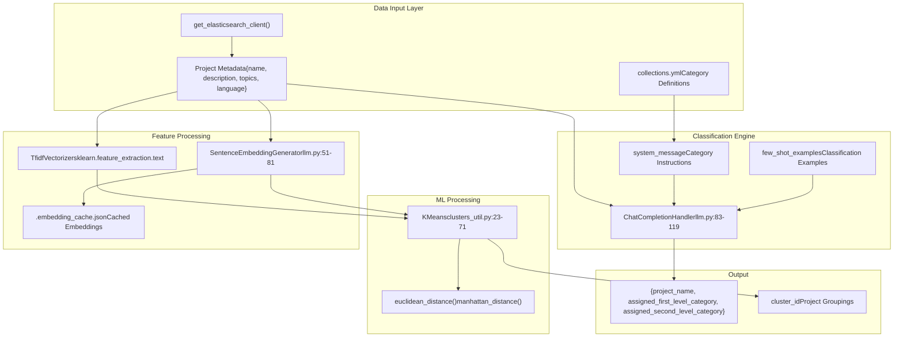
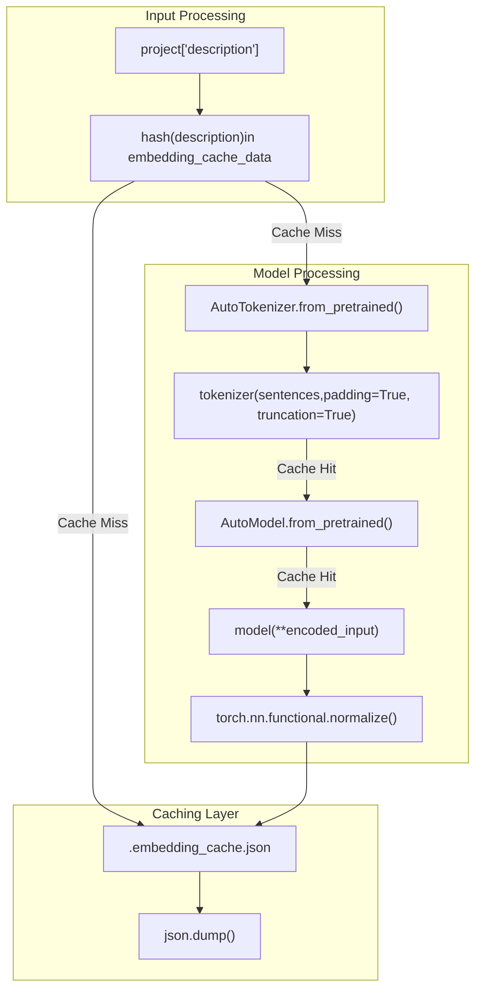
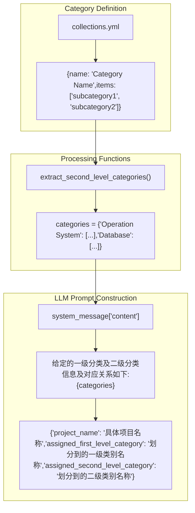
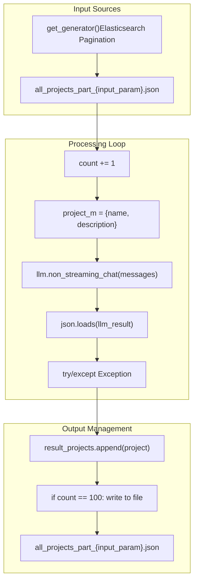
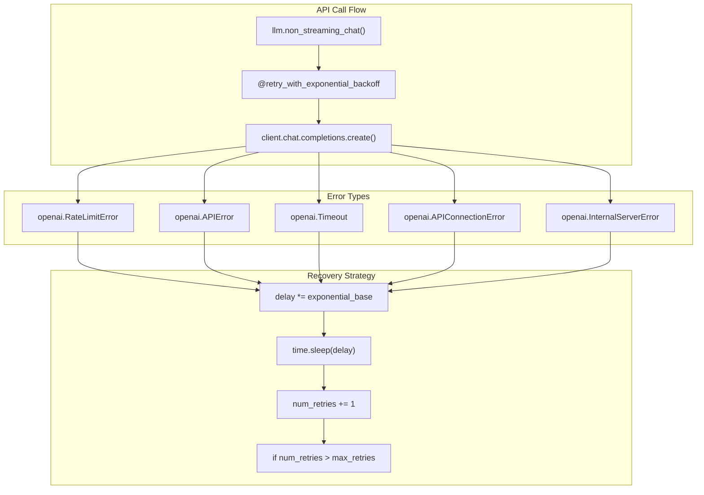

# Project Classification System

> **Relevant source files**
> * [openchecker/classify.py](https://github.com/Laniakea2012/openchecker/blob/00a9732e/openchecker/classify.py)
> * [openchecker/clusters_util.py](https://github.com/Laniakea2012/openchecker/blob/00a9732e/openchecker/clusters_util.py)
> * [openchecker/llm.py](https://github.com/Laniakea2012/openchecker/blob/00a9732e/openchecker/llm.py)
> * [openchecker/repo.py](https://github.com/Laniakea2012/openchecker/blob/00a9732e/openchecker/repo.py)

## Purpose and Scope

The Project Classification System automatically categorizes software projects into predefined technology categories using Large Language Model (LLM) integration and machine learning techniques. This system processes project metadata including names, descriptions, topics, and languages to assign both first-level and second-level category classifications.

For information about project clustering and similarity analysis, see [Clustering and Embeddings](/Laniakea2012/openchecker/5.2-clustering-and-embeddings). For overall AI/ML system architecture, see [AI and Machine Learning Components](/Laniakea2012/openchecker/5-ai-and-machine-learning-components).

## Classification Architecture

The classification system operates through a pipeline that combines traditional NLP features with modern LLM-based categorization and embedding-based similarity analysis.

### System Components Overview



**Sources:** [openchecker/classify.py L1-L112](https://github.com/Laniakea2012/openchecker/blob/00a9732e/openchecker/classify.py#L1-L112)

 [openchecker/llm.py L1-L150](https://github.com/Laniakea2012/openchecker/blob/00a9732e/openchecker/llm.py#L1-L150)

 [openchecker/clusters_util.py L1-L187](https://github.com/Laniakea2012/openchecker/blob/00a9732e/openchecker/clusters_util.py#L1-L187)

## LLM-Based Classification Workflow

The classification process uses structured prompts and few-shot learning to assign categories through LLM APIs.

### Classification Process Flow

[ERROR_PROCESSING_ELEMENT: PRE]

**Sources:** [openchecker/classify.py L23-L112](https://github.com/Laniakea2012/openchecker/blob/00a9732e/openchecker/classify.py#L23-L112)

 [openchecker/llm.py L98-L104](https://github.com/Laniakea2012/openchecker/blob/00a9732e/openchecker/llm.py#L98-L104)

### LLM Integration Components

| Component | Class/Function | Purpose |
| --- | --- | --- |
| Chat Handler | `ChatCompletionHandler` | Manages LLM API communication |
| Model Configuration | `model_name`, `base_url` | Configures Volcengine or OpenAI endpoints |
| Retry Logic | `@retry_with_exponential_backoff` | Handles API rate limits and failures |
| Response Parsing | `replace_single_quotes_with_regex()` | Sanitizes LLM JSON responses |

**Sources:** [openchecker/llm.py L83-L119](https://github.com/Laniakea2012/openchecker/blob/00a9732e/openchecker/llm.py#L83-L119)

 [openchecker/classify.py L8-L10](https://github.com/Laniakea2012/openchecker/blob/00a9732e/openchecker/classify.py#L8-L10)

## Embedding-Based Feature Extraction

The system generates semantic embeddings for project descriptions to enable similarity-based clustering and classification.

### Embedding Generation Pipeline



**Sources:** [openchecker/llm.py L51-L81](https://github.com/Laniakea2012/openchecker/blob/00a9732e/openchecker/llm.py#L51-L81)

 [openchecker/clusters_util.py L130-L152](https://github.com/Laniakea2012/openchecker/blob/00a9732e/openchecker/clusters_util.py#L130-L152)

### SentenceEmbeddingGenerator Implementation

The `SentenceEmbeddingGenerator` class provides the core embedding functionality:

```
# Key methods from llm.py:51-81
def __init__(self, model_path):
    self.tokenizer = AutoTokenizer.from_pretrained(model_path)
    self.model = AutoModel.from_pretrained(model_path)

def generate_embeddings(self, sentences):
    encoded_input = self.tokenizer(sentences, padding=True, truncation=True, return_tensors='pt')
    with torch.no_grad():
        model_output = self.model(**encoded_input)
        sentence_embeddings = model_output[0][:, 0]
    return torch.nn.functional.normalize(sentence_embeddings, p=2, dim=1)
```

**Sources:** [openchecker/llm.py L51-L81](https://github.com/Laniakea2012/openchecker/blob/00a9732e/openchecker/llm.py#L51-L81)

## Category Management System

Categories are defined in YAML configuration files and parsed into structured dictionaries for LLM prompt construction.

### Category Structure and Processing



**Sources:** [openchecker/classify.py L11-L21](https://github.com/Laniakea2012/openchecker/blob/00a9732e/openchecker/classify.py#L11-L21)

 [openchecker/classify.py L59-L67](https://github.com/Laniakea2012/openchecker/blob/00a9732e/openchecker/classify.py#L59-L67)

### Example Classification Response Format

The system expects LLM responses in a specific JSON schema:

| Field | Description | Example |
| --- | --- | --- |
| `project_name` | Exact project name | "PostgreSQL" |
| `assigned_first_level_category` | Primary category | "Database" |
| `assigned_second_level_category` | Subcategory | "sql-database" |

**Sources:** [openchecker/classify.py L40-L51](https://github.com/Laniakea2012/openchecker/blob/00a9732e/openchecker/classify.py#L40-L51)

 [openchecker/classify.py L53-L57](https://github.com/Laniakea2012/openchecker/blob/00a9732e/openchecker/classify.py#L53-L57)

## Data Flow and Storage

The classification system processes projects in batches and maintains results in JSON files with intermediate checkpointing.

### Batch Processing Architecture



**Sources:** [openchecker/classify.py L69-L112](https://github.com/Laniakea2012/openchecker/blob/00a9732e/openchecker/classify.py#L69-L112)

 [openchecker/repo.py L74-L114](https://github.com/Laniakea2012/openchecker/blob/00a9732e/openchecker/repo.py#L74-L114)

### Configuration and Environment Variables

The system requires specific environment configuration for LLM API access:

| Environment Variable | Purpose | API Provider |
| --- | --- | --- |
| `OPENAI_API_KEY` | OpenAI API authentication | openai.com |
| `ARK_API_KEY` | Volcengine API authentication | ark.cn-beijing.volces.com |

**Sources:** [openchecker/llm.py L84-L95](https://github.com/Laniakea2012/openchecker/blob/00a9732e/openchecker/llm.py#L84-L95)

## Error Handling and Reliability

The classification system implements robust error handling and retry mechanisms to ensure reliable operation with external LLM APIs.

### Retry and Recovery Mechanisms



**Sources:** [openchecker/llm.py L7-L49](https://github.com/Laniakea2012/openchecker/blob/00a9732e/openchecker/llm.py#L7-L49)

 [openchecker/classify.py L92-L99](https://github.com/Laniakea2012/openchecker/blob/00a9732e/openchecker/classify.py#L92-L99)