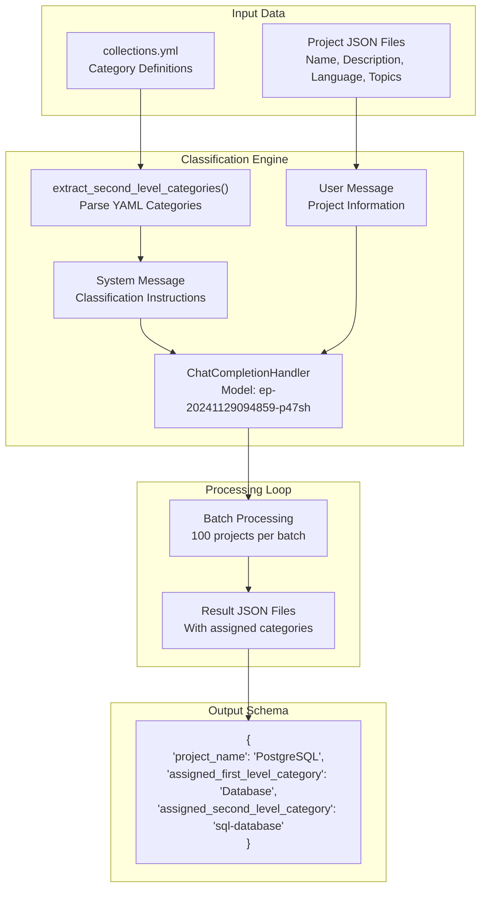
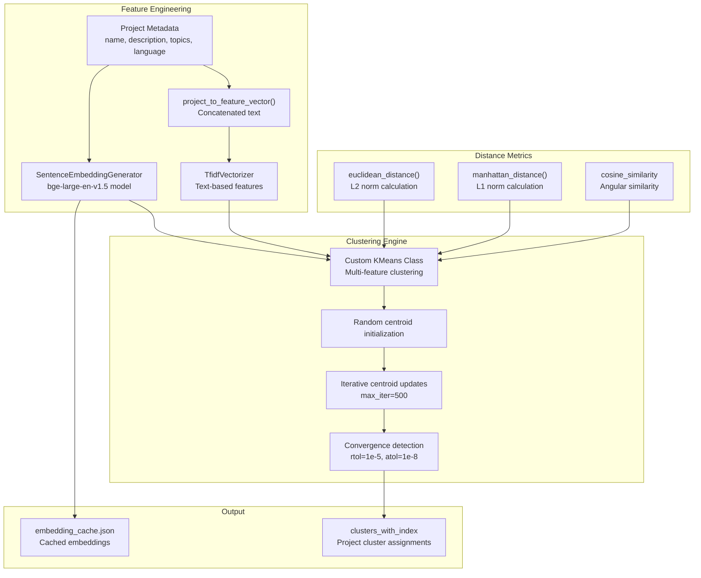
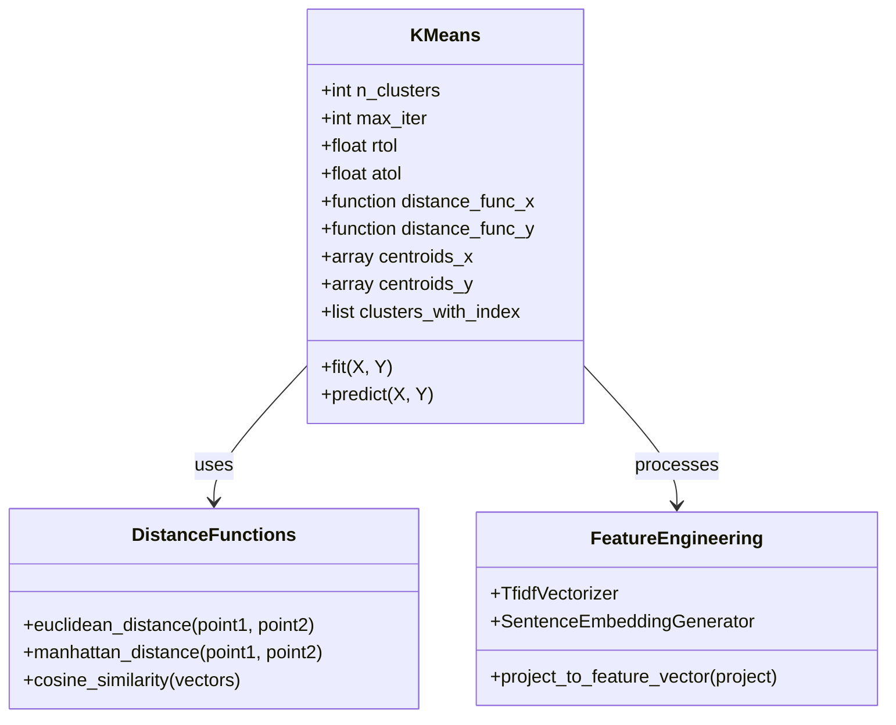
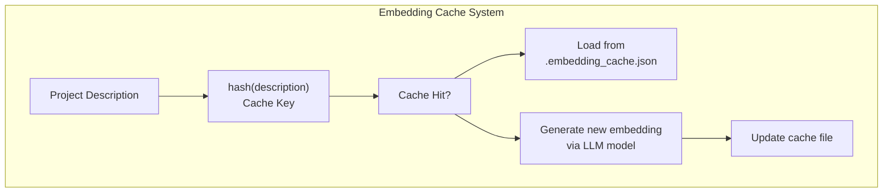

# Project Classification and Clustering

> **Relevant source files**
> * [openchecker/agents/__init__.py](https://github.com/Laniakea2012/openchecker/blob/1dbd85d0/openchecker/agents/__init__.py)
> * [openchecker/agents/registry.py](https://github.com/Laniakea2012/openchecker/blob/1dbd85d0/openchecker/agents/registry.py)
> * [openchecker/classifier/__init__.py](https://github.com/Laniakea2012/openchecker/blob/1dbd85d0/openchecker/classifier/__init__.py)
> * [openchecker/classifier/classify.py](https://github.com/Laniakea2012/openchecker/blob/1dbd85d0/openchecker/classifier/classify.py)
> * [openchecker/classifier/clusters_util.py](https://github.com/Laniakea2012/openchecker/blob/1dbd85d0/openchecker/classifier/clusters_util.py)
> * [openchecker/database/__init__.py](https://github.com/Laniakea2012/openchecker/blob/1dbd85d0/openchecker/database/__init__.py)

This document covers the machine learning components that automatically categorize and cluster software projects based on their characteristics. The system combines LLM-based classification with traditional clustering algorithms to organize projects into meaningful categories and discover similar projects.

For LLM integration and text processing capabilities, see [LLM Integration and Text Processing](/Laniakea2012/openchecker/6.1-llm-integration-and-text-processing).

## Purpose and Scope

The project classification and clustering system provides two main capabilities:

1. **Supervised Classification**: Uses Large Language Models to categorize projects into predefined hierarchical categories based on project metadata
2. **Unsupervised Clustering**: Groups similar projects together using K-means clustering with multiple feature representations

This system enables automated project organization, discovery of similar projects, and analysis of the software ecosystem landscape.

## Classification Architecture

The classification system uses LLM-powered analysis to assign projects to predefined categories with a hierarchical structure of first-level and second-level categories.

### Classification Workflow

Sources: [openchecker/classifier/classify.py L11-L21](https://github.com/Laniakea2012/openchecker/blob/1dbd85d0/openchecker/classifier/classify.py#L11-L21)

 [openchecker/classifier/classify.py L59-L67](https://github.com/Laniakea2012/openchecker/blob/1dbd85d0/openchecker/classifier/classify.py#L59-L67)

 [openchecker/classifier/classify.py L92-L99](https://github.com/Laniakea2012/openchecker/blob/1dbd85d0/openchecker/classifier/classify.py#L92-L99)

### Classification Implementation Details

The `classify.py` module implements the core classification logic:

| Component | Function | Description |
| --- | --- | --- |
| `extract_second_level_categories()` | Category parsing | Extracts hierarchical categories from YAML configuration |
| `replace_single_quotes_with_regex()` | JSON preprocessing | Sanitizes LLM output for JSON parsing |
| `ChatCompletionHandler` | LLM interface | Handles communication with the language model |
| Batch processing loop | Scalability | Processes projects in batches of 100 to manage memory |

The system uses a structured prompt with few-shot examples to guide the LLM's classification decisions. Projects are classified based on their name, description, language, and topics.

Sources: [openchecker/classifier/classify.py L8-L10](https://github.com/Laniakea2012/openchecker/blob/1dbd85d0/openchecker/classifier/classify.py#L8-L10)

 [openchecker/classifier/classify.py L40-L51](https://github.com/Laniakea2012/openchecker/blob/1dbd85d0/openchecker/classifier/classify.py#L40-L51)

 [openchecker/classifier/classify.py L76-L112](https://github.com/Laniakea2012/openchecker/blob/1dbd85d0/openchecker/classifier/classify.py#L76-L112)

## Clustering Architecture

The clustering system groups similar projects using a custom K-means implementation that combines multiple feature representations for improved clustering quality.

### Clustering Workflow

Sources: [openchecker/classifier/clusters_util.py L109-L116](https://github.com/Laniakea2012/openchecker/blob/1dbd85d0/openchecker/classifier/clusters_util.py#L109-L116)

 [openchecker/classifier/clusters_util.py L127-L151](https://github.com/Laniakea2012/openchecker/blob/1dbd85d0/openchecker/classifier/clusters_util.py#L127-L151)

 [openchecker/classifier/clusters_util.py L23-L63](https://github.com/Laniakea2012/openchecker/blob/1dbd85d0/openchecker/classifier/clusters_util.py#L23-L63)

### Custom K-Means Implementation

The `KMeans` class in `clusters_util.py` provides a specialized clustering implementation that handles multiple feature types:

The clustering algorithm supports:

* **Dual feature spaces**: TF-IDF vectors (X) and embedding vectors (Y)
* **Multiple distance metrics**: Euclidean, Manhattan, and cosine similarity
* **Embedding caching**: Persistent storage of computed embeddings to avoid recomputation
* **Convergence detection**: Automatic stopping when centroids stabilize

Sources: [openchecker/classifier/clusters_util.py L23-L33](https://github.com/Laniakea2012/openchecker/blob/1dbd85d0/openchecker/classifier/clusters_util.py#L23-L33)

 [openchecker/classifier/clusters_util.py L10-L21](https://github.com/Laniakea2012/openchecker/blob/1dbd85d0/openchecker/classifier/clusters_util.py#L10-L21)

 [openchecker/classifier/clusters_util.py L35-L63](https://github.com/Laniakea2012/openchecker/blob/1dbd85d0/openchecker/classifier/clusters_util.py#L35-L63)

## Feature Engineering Pipeline

The system employs multiple feature engineering approaches to capture different aspects of project similarity:

### Text-Based Features (TF-IDF)

The `project_to_feature_vector()` function creates a unified text representation by concatenating:

* Project name
* Description text
* Programming language
* Topic tags

This text is then vectorized using scikit-learn's `TfidfVectorizer` to create sparse feature vectors.

### Semantic Features (Embeddings)

The system uses the `SentenceEmbeddingGenerator` with the `bge-large-en-v1.5` model to create dense semantic embeddings of project descriptions. These embeddings capture deeper semantic relationships between projects.

### Caching Strategy

The caching system uses content hashing to avoid regenerating embeddings for identical project descriptions, significantly improving performance for repeated runs.

Sources: [openchecker/classifier/clusters_util.py L130-L151](https://github.com/Laniakea2012/openchecker/blob/1dbd85d0/openchecker/classifier/clusters_util.py#L130-L151)

 [openchecker/classifier/clusters_util.py L109-L116](https://github.com/Laniakea2012/openchecker/blob/1dbd85d0/openchecker/classifier/clusters_util.py#L109-L116)

 [openchecker/classifier/clusters_util.py L137-L148](https://github.com/Laniakea2012/openchecker/blob/1dbd85d0/openchecker/classifier/clusters_util.py#L137-L148)

## Data Processing Integration

The classification and clustering systems integrate with the broader OpenChecker platform through standardized data formats and processing pipelines:

| Data Format | Purpose | File Pattern |
| --- | --- | --- |
| Input JSON | Source project data | `all_projects_part_{input_param}.json` |
| Result JSON | Classified projects | `all_projects_part_{input_param}.json` |
| YAML Config | Category definitions | `collections.yml` |
| Cache JSON | Embedding storage | `.embedding_cache.json` |

The systems support batch processing for scalability and include error handling for robust operation in production environments.

Sources: [openchecker/classifier/classify.py L37-L38](https://github.com/Laniakea2012/openchecker/blob/1dbd85d0/openchecker/classifier/classify.py#L37-L38)

 [openchecker/classifier/classify.py L94-L111](https://github.com/Laniakea2012/openchecker/blob/1dbd85d0/openchecker/classifier/classify.py#L94-L111)

 [openchecker/classifier/clusters_util.py L94-L105](https://github.com/Laniakea2012/openchecker/blob/1dbd85d0/openchecker/classifier/clusters_util.py#L94-L105)