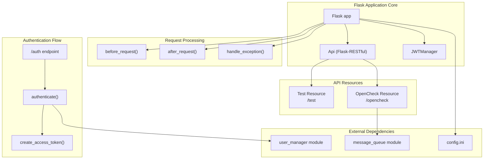
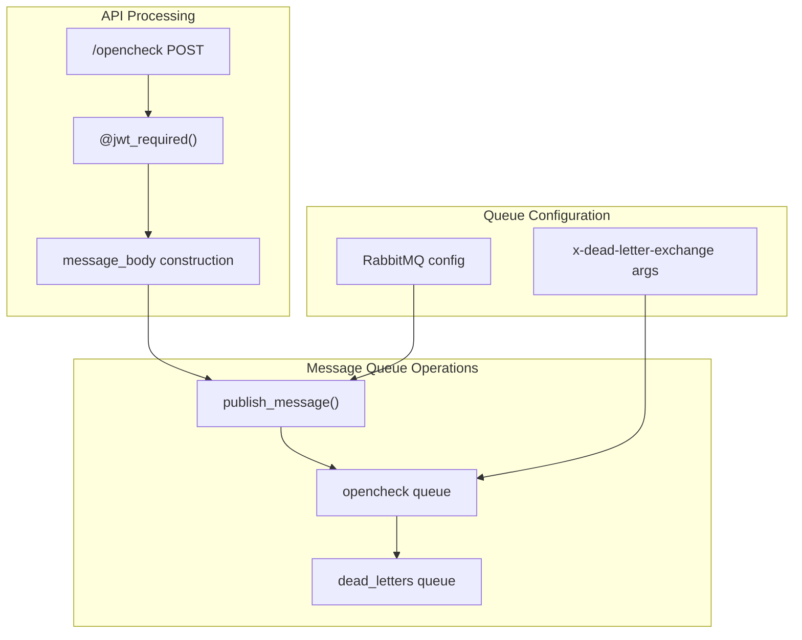
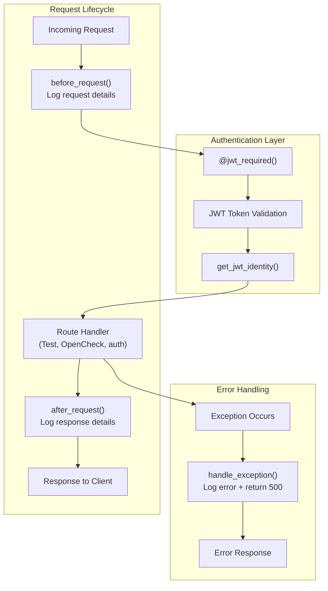
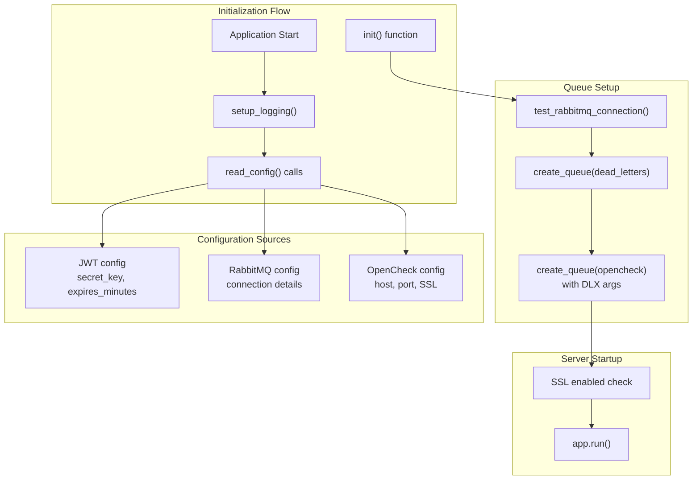

# REST API Server

> **Relevant source files**
> * [openchecker/main.py](https://github.com/Laniakea2012/openchecker/blob/1dbd85d0/openchecker/main.py)

## Purpose and Scope

The REST API Server is the primary entry point for external clients to interact with the OpenChecker system. It provides a Flask-based HTTP API that handles authentication, request validation, and task distribution to the agent processing system. This component is responsible for receiving project analysis requests, validating user credentials, and publishing tasks to the message queue for asynchronous processing.

For information about the agent system that processes these tasks, see [Agent System and Message Processing](/Laniakea2012/openchecker/2.1-agent-system-and-message-processing). For details about user management and JWT implementation, see [Authentication and User Management](/Laniakea2012/openchecker/3.2-authentication-and-user-management).

## Application Architecture

The REST API server is implemented as a Flask application with Flask-RESTful extensions for clean endpoint organization. The core application structure centers around three main components: authentication, API resources, and message queue integration.



*Sources: [openchecker/main.py L1-L35](https://github.com/Laniakea2012/openchecker/blob/1dbd85d0/openchecker/main.py#L1-L35)*

## Authentication System

The API implements JWT-based authentication with support for both Basic Auth and JSON credential formats. The authentication endpoint at `/auth` accepts credentials and returns JWT access tokens for subsequent API calls.

```mermaid
sequenceDiagram
  participant External Client
  participant /auth endpoint
  participant authenticate()
  participant create_access_token()

  External Client->>/auth endpoint: "POST /auth
  /auth endpoint->>authenticate(): {username, password}"
  authenticate()-->>/auth endpoint: "authenticate(username, password)"
  loop ["Valid credentials"]
    /auth endpoint->>create_access_token(): "User object or None"
    create_access_token()-->>/auth endpoint: "create_access_token(identity=user.id)"
    /auth endpoint-->>External Client: "JWT token"
    /auth endpoint-->>External Client: "{access_token, token_type: Bearer}"
  end
```

The authentication system supports two credential formats:

* **Basic Authentication**: Uses HTTP Authorization header
* **JSON Body**: Accepts `username` and `password` in request body

JWT tokens are configured with configurable expiration times via the `config.ini` file under the `[JWT]` section.

*Sources: [openchecker/main.py L37-L56](https://github.com/Laniakea2012/openchecker/blob/1dbd85d0/openchecker/main.py#L37-L56)

 [openchecker/main.py L24-L31](https://github.com/Laniakea2012/openchecker/blob/1dbd85d0/openchecker/main.py#L24-L31)*

## API Endpoints

### Test Endpoint

The `/test` endpoint provides functionality for testing authentication and basic API connectivity. It requires JWT authentication and returns user information.

| Method | Endpoint | Authentication | Purpose |
| --- | --- | --- | --- |
| GET | `/test` | JWT Required | Returns authenticated user information |
| POST | `/test` | JWT Required | Echoes message for connectivity testing |

### OpenCheck Endpoint

The `/opencheck` endpoint is the primary interface for initiating project analysis tasks. It accepts analysis requests and publishes them to the message queue for asynchronous processing.

**Request Structure:**

```json
{
  "commands": ["array", "of", "checker", "commands"],
  "project_url": "git_repository_url",
  "commit_hash": "optional_commit_hash",
  "access_token": "optional_platform_token",
  "callback_url": "results_webhook_url",
  "task_metadata": {"key": "value"}
}
```

The endpoint constructs a message body and publishes it to the `opencheck` queue via `publish_message()`.

*Sources: [openchecker/main.py L87-L107](https://github.com/Laniakea2012/openchecker/blob/1dbd85d0/openchecker/main.py#L87-L107)

 [openchecker/main.py L109-L143](https://github.com/Laniakea2012/openchecker/blob/1dbd85d0/openchecker/main.py#L109-L143)*

## Message Queue Integration

The API server integrates with RabbitMQ for asynchronous task distribution. When a valid OpenCheck request is received, the server constructs a message and publishes it to the `opencheck` queue.



The message body includes all necessary information for the agent system to process the request:

* `command_list`: Array of analysis commands to execute
* `project_url`: Git repository URL to analyze
* `commit_hash`: Optional specific commit to analyze
* `access_token`: Optional platform-specific access token
* `callback_url`: URL to POST results when analysis completes
* `task_metadata`: Additional metadata for the task

*Sources: [openchecker/main.py L117-L143](https://github.com/Laniakea2012/openchecker/blob/1dbd85d0/openchecker/main.py#L117-L143)

 [openchecker/main.py L135](https://github.com/Laniakea2012/openchecker/blob/1dbd85d0/openchecker/main.py#L135-L135)*

## Request Processing Flow

The Flask application implements comprehensive request and response processing with logging and error handling.



**Request Processing Features:**

* **Pre-request logging**: Captures method, path, remote address, and user agent
* **Post-request logging**: Records status code and content length
* **Global exception handling**: Catches unhandled exceptions and returns structured error responses
* **Performance logging**: Available via `@log_performance` decorator

*Sources: [openchecker/main.py L60-L85](https://github.com/Laniakea2012/openchecker/blob/1dbd85d0/openchecker/main.py#L60-L85)

 [openchecker/main.py L111](https://github.com/Laniakea2012/openchecker/blob/1dbd85d0/openchecker/main.py#L111-L111)*

## Configuration and Initialization

The application initialization process sets up all required components and validates external dependencies.



**Configuration Sections:**

* **JWT**: `secret_key`, `expires_minutes`
* **RabbitMQ**: Connection and queue configuration
* **OpenCheck**: Server host, port, and SSL certificate paths

**Queue Initialization:**

1. Tests RabbitMQ connectivity
2. Creates `dead_letters` queue for failed messages
3. Creates `opencheck` queue with dead letter exchange configuration

*Sources: [openchecker/main.py L24-L31](https://github.com/Laniakea2012/openchecker/blob/1dbd85d0/openchecker/main.py#L24-L31)

 [openchecker/main.py L150-L169](https://github.com/Laniakea2012/openchecker/blob/1dbd85d0/openchecker/main.py#L150-L169)

 [openchecker/main.py L170-L192](https://github.com/Laniakea2012/openchecker/blob/1dbd85d0/openchecker/main.py#L170-L192)*

## Error Handling and Logging

The API server implements structured logging and comprehensive error handling to ensure reliable operation and debugging capabilities.

**Logging Configuration:**

* Configurable log level via `LOG_LEVEL` environment variable
* Structured logging format with extra fields for context
* Request/response lifecycle logging
* Performance monitoring support

**Error Handling Strategies:**

* Global exception handler for unhandled errors
* JWT authentication error responses
* RabbitMQ connection failure handling during initialization
* Graceful degradation with appropriate HTTP status codes

The logging system captures detailed context for each request including user identity, request parameters, and timing information to support operations and debugging.

*Sources: [openchecker/main.py L13-L22](https://github.com/Laniakea2012/openchecker/blob/1dbd85d0/openchecker/main.py#L13-L22)

 [openchecker/main.py L81-L85](https://github.com/Laniakea2012/openchecker/blob/1dbd85d0/openchecker/main.py#L81-L85)

 [openchecker/main.py L127-L141](https://github.com/Laniakea2012/openchecker/blob/1dbd85d0/openchecker/main.py#L127-L141)*