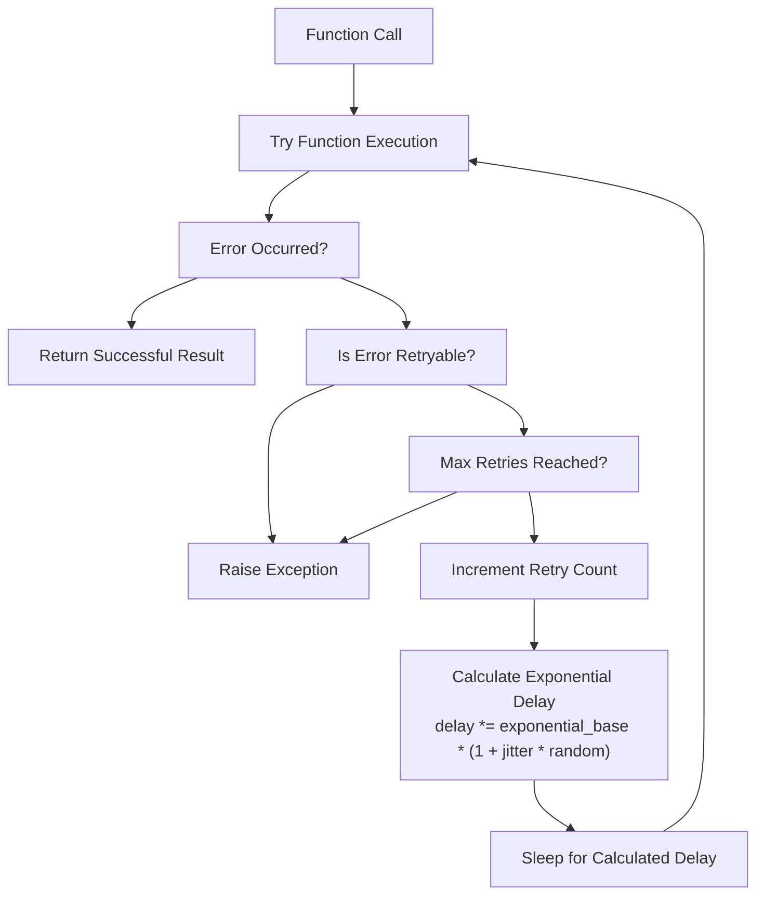
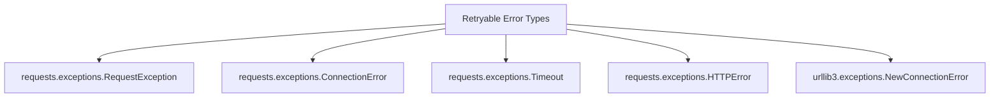
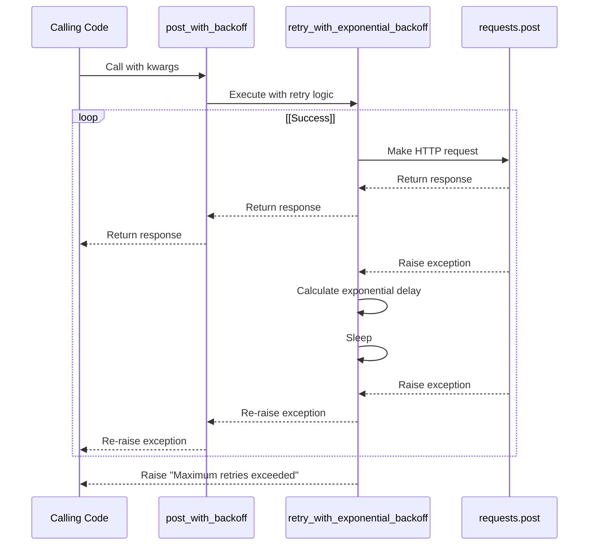
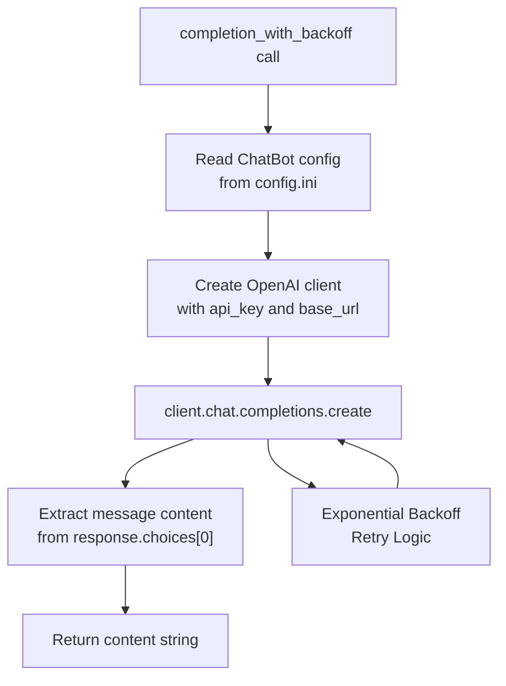
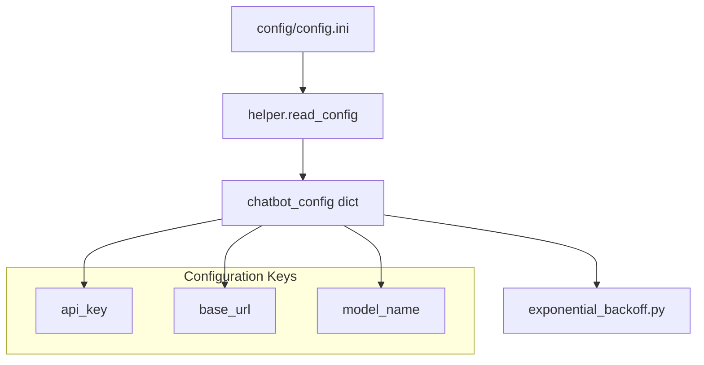
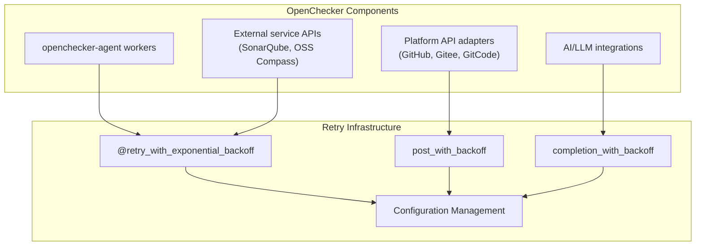

# Reliability and Error Handling

> **Relevant source files**
> * [openchecker/__init__.py](https://github.com/Laniakea2012/openchecker/blob/1dbd85d0/openchecker/__init__.py)
> * [openchecker/exponential_backoff.py](https://github.com/Laniakea2012/openchecker/blob/1dbd85d0/openchecker/exponential_backoff.py)
> * [openchecker/helper.py](https://github.com/Laniakea2012/openchecker/blob/1dbd85d0/openchecker/helper.py)

## Purpose and Scope

This document covers the reliability and error handling mechanisms implemented throughout the OpenChecker system. The primary focus is on the exponential backoff retry system that ensures robust handling of external API calls and network failures. This includes retry strategies for HTTP requests to version control platforms, AI service integrations, and other external dependencies.

For information about the core agent system and message processing, see [2.1](/Laniakea2012/openchecker/2.1-agent-system-and-message-processing). For details about external service configurations, see [5.2](/Laniakea2012/openchecker/5.2-external-service-configuration).

## Exponential Backoff Retry Mechanism

The OpenChecker system implements a comprehensive exponential backoff retry mechanism to handle transient failures when communicating with external services. This system is centralized in the `retry_with_exponential_backoff` decorator function.

### Retry Decorator Implementation

The core retry functionality is implemented as a decorator that wraps functions making external calls:

**Sources:** [openchecker/exponential_backoff.py L14-L59](https://github.com/Laniakea2012/openchecker/blob/1dbd85d0/openchecker/exponential_backoff.py#L14-L59)

### Configurable Parameters

The retry mechanism supports several configurable parameters that can be tuned based on the specific requirements of different external services:

| Parameter | Default Value | Description |
| --- | --- | --- |
| `initial_delay` | 1.0 seconds | Starting delay before first retry |
| `exponential_base` | 2.0 | Multiplication factor for delay growth |
| `jitter` | True | Adds randomness to prevent thundering herd |
| `max_retries` | 3 | Maximum number of retry attempts |
| `errors` | Request exceptions tuple | Specific exceptions that trigger retries |

**Sources:** [openchecker/exponential_backoff.py L14-L25](https://github.com/Laniakea2012/openchecker/blob/1dbd85d0/openchecker/exponential_backoff.py#L14-L25)

### Retryable Error Types

The system identifies specific error types that warrant retry attempts, focusing on transient network and connection issues:

**Sources:** [openchecker/exponential_backoff.py L20-L24](https://github.com/Laniakea2012/openchecker/blob/1dbd85d0/openchecker/exponential_backoff.py#L20-L24)

## Error Handling Strategies

### HTTP Request Error Handling

The system provides a specialized wrapper for HTTP POST requests with built-in retry logic:

**Sources:** [openchecker/exponential_backoff.py L61-L63](https://github.com/Laniakea2012/openchecker/blob/1dbd85d0/openchecker/exponential_backoff.py#L61-L63)

### AI Service Error Handling

The system implements specialized error handling for OpenAI API calls, integrating configuration management with retry logic:

**Sources:** [openchecker/exponential_backoff.py L65-L77](https://github.com/Laniakea2012/openchecker/blob/1dbd85d0/openchecker/exponential_backoff.py#L65-L77)

## Configuration Integration

### Configuration File Management

The error handling system integrates with the central configuration management through the `helper.py` module:

**Sources:** [openchecker/exponential_backoff.py L8-L11](https://github.com/Laniakea2012/openchecker/blob/1dbd85d0/openchecker/exponential_backoff.py#L8-L11)

 [openchecker/helper.py L3-L9](https://github.com/Laniakea2012/openchecker/blob/1dbd85d0/openchecker/helper.py#L3-L9)

### Dynamic Configuration Loading

The configuration system supports dynamic loading of module-specific settings:

| Function | Purpose | Return Type |
| --- | --- | --- |
| `read_config(filename, modulename)` | Load specific module config | Dictionary of key-value pairs |
| `read_config(filename, None)` | Load all configurations | Nested dictionary by module |

**Sources:** [openchecker/helper.py L3-L13](https://github.com/Laniakea2012/openchecker/blob/1dbd85d0/openchecker/helper.py#L3-L13)

## Integration Points

### System-Wide Reliability Pattern

The exponential backoff mechanism is designed to be used across different components of the OpenChecker system:

**Sources:** [openchecker/exponential_backoff.py L14-L77](https://github.com/Laniakea2012/openchecker/blob/1dbd85d0/openchecker/exponential_backoff.py#L14-L77)

 [openchecker/helper.py L3-L13](https://github.com/Laniakea2012/openchecker/blob/1dbd85d0/openchecker/helper.py#L3-L13)

This reliability infrastructure ensures that temporary network issues, service overload, or brief outages do not cause complete failure of analysis tasks, maintaining system robustness across all external integrations.