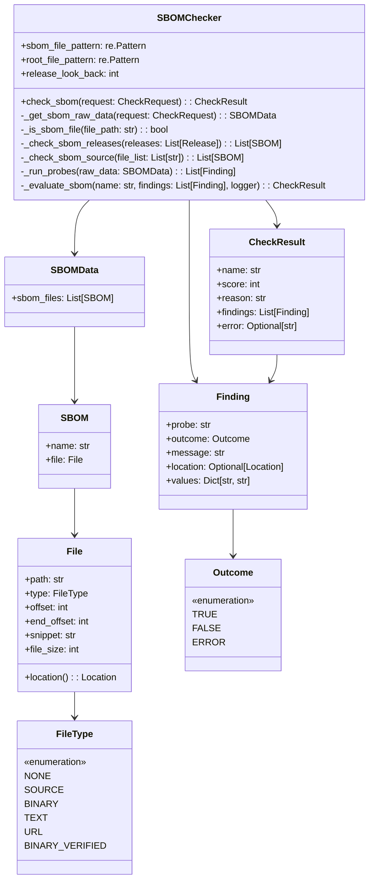
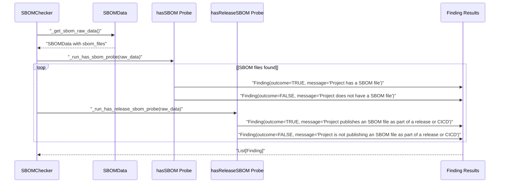
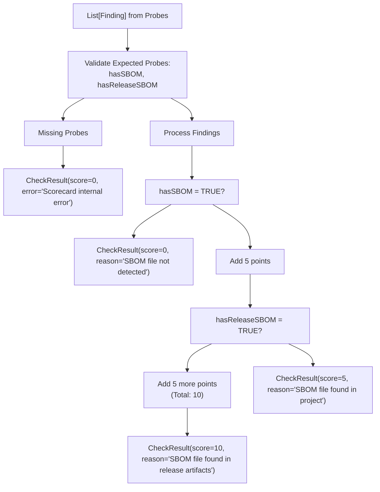
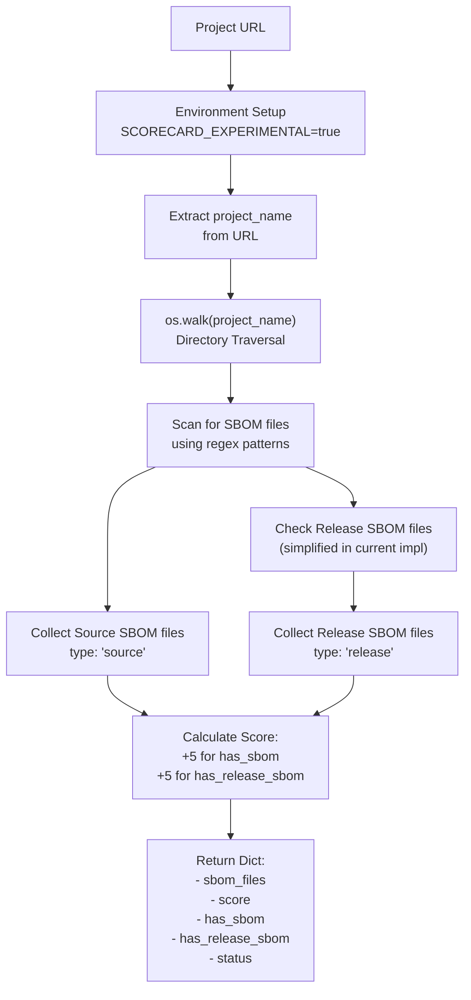
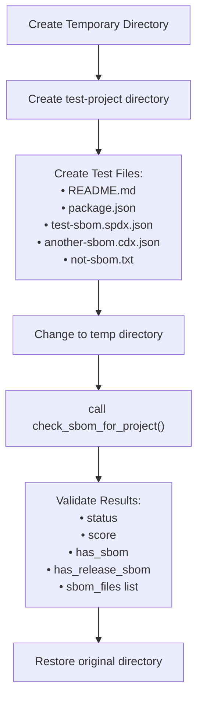

# SBOM Analysis

> **Relevant source files**
> * [openchecker/sbom/__init__.py](https://github.com/Laniakea2012/openchecker/blob/1dbd85d0/openchecker/sbom/__init__.py)
> * [openchecker/sbom/sbom_checker.py](https://github.com/Laniakea2012/openchecker/blob/1dbd85d0/openchecker/sbom/sbom_checker.py)
> * [openchecker/sbom/test_sbom_checker.py](https://github.com/Laniakea2012/openchecker/blob/1dbd85d0/openchecker/sbom/test_sbom_checker.py)

## Purpose and Scope

The SBOM Analysis module provides Software Bill of Materials (SBOM) detection and compliance checking capabilities within OpenChecker's analysis framework. This system identifies SBOM files in both project source code and release artifacts, evaluating projects based on their SBOM availability and distribution practices according to OpenSSF Scorecard criteria.

For broader analysis tool integration, see [Checker Framework and Execution](/Laniakea2012/openchecker/4.2-checker-framework-and-execution). For supply chain security analysis, see [Supply Chain and Quality Analysis](/Laniakea2012/openchecker/4.4-supply-chain-and-quality-analysis).

## SBOM Detection Framework

The SBOM analysis system is built around a structured data model that represents SBOM files, their locations, and analysis results. The core framework defines several key data classes that work together to provide comprehensive SBOM detection and evaluation.



Sources: [openchecker/sbom/sbom_checker.py L17-L110](https://github.com/Laniakea2012/openchecker/blob/1dbd85d0/openchecker/sbom/sbom_checker.py#L17-L110)

The `SBOMChecker` class serves as the main entry point, coordinating the detection process through its `check_sbom` method. The system uses `FileType` enumeration to distinguish between source files, release artifacts (URLs), and other file types, enabling different handling strategies for each category.

## File Pattern Recognition

SBOM file detection relies on regular expression patterns that identify standard SBOM file formats and naming conventions. The system recognizes multiple SBOM standards including CycloneDX and SPDX formats.

```

```

Sources: [openchecker/sbom/sbom_checker.py L115-L122](https://github.com/Laniakea2012/openchecker/blob/1dbd85d0/openchecker/sbom/sbom_checker.py#L115-L122)

 [openchecker/sbom/sbom_checker.py L179-L182](https://github.com/Laniakea2012/openchecker/blob/1dbd85d0/openchecker/sbom/sbom_checker.py#L179-L182)

The `_is_sbom_file` method combines both pattern checks to ensure files meet SBOM naming conventions and are located appropriately within the project structure. The case-insensitive matching supports various capitalization patterns commonly found in real projects.

## Analysis Probes

The SBOM analysis employs two primary probes that evaluate different aspects of SBOM availability and distribution. These probes follow the OpenSSF Scorecard methodology for systematic evaluation.



Sources: [openchecker/sbom/sbom_checker.py L224-L283](https://github.com/Laniakea2012/openchecker/blob/1dbd85d0/openchecker/sbom/sbom_checker.py#L224-L283)

The `hasSBOM` probe evaluates whether any SBOM files exist in the project, while `hasReleaseSBOM` specifically checks for SBOM files distributed through release mechanisms. Each probe generates `Finding` objects with specific outcomes and descriptive messages.

## Scoring and Evaluation

The scoring system assigns points based on SBOM availability and distribution quality, with higher scores for projects that provide SBOM files in release artifacts compared to source-only distribution.



Sources: [openchecker/sbom/sbom_checker.py L285-L338](https://github.com/Laniakea2012/openchecker/blob/1dbd85d0/openchecker/sbom/sbom_checker.py#L285-L338)

The `_evaluate_sbom` method implements a tiered scoring system where projects receive 5 points for having any SBOM file and an additional 5 points for distributing SBOM files through releases, achieving a maximum score of 10 points.

## Integration with Main System

The SBOM checker integrates with OpenChecker's broader analysis framework through the `check_sbom_for_project` function, which provides a simplified interface for project-level SBOM analysis.



Sources: [openchecker/sbom/sbom_checker.py L356-L426](https://github.com/Laniakea2012/openchecker/blob/1dbd85d0/openchecker/sbom/sbom_checker.py#L356-L426)

The standalone function performs filesystem-based SBOM detection and returns a dictionary result format suitable for integration with OpenChecker's message-driven architecture. The system requires the `SCORECARD_EXPERIMENTAL` environment variable to enable SBOM checking functionality.

## Testing Infrastructure

The SBOM checker includes a comprehensive testing framework that validates detection capabilities across different file types and project structures.



Sources: [openchecker/sbom/test_sbom_checker.py L13-L59](https://github.com/Laniakea2012/openchecker/blob/1dbd85d0/openchecker/sbom/test_sbom_checker.py#L13-L59)

The test infrastructure creates realistic project structures with both valid SBOM files and non-SBOM files to verify proper pattern matching and scoring behavior. The `MockRepoClient` class enables testing without requiring actual repository connections.